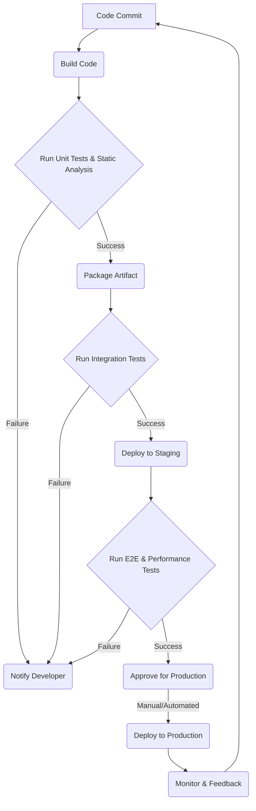

# cicd-6.1-ac1.md

# CI/CD Fundamentals & Best Practices for Test Automation

## Overview
Continuous Integration (CI), Continuous Delivery (CD), and Continuous Deployment (CD) form the backbone of modern software development, enabling teams to deliver high-quality software rapidly and reliably. For test automation engineers, understanding CI/CD is not just beneficial—it's essential. CI/CD pipelines automate the process of building, testing, and deploying applications, with automated tests acting as critical quality gates that ensure every change meets predefined quality standards before moving forward. This document will delve into these concepts, highlighting their importance, particularly in the realm of test automation.

## Detailed Explanation

### Continuous Integration (CI)
Continuous Integration is a development practice where developers frequently merge their code changes into a central repository, typically multiple times a day. Each integration is then verified by an automated build and automated tests to detect integration errors as quickly as possible.

**Key aspects:**
- **Frequent Commits:** Developers commit small, incremental changes.
- **Automated Builds:** Every commit triggers an automated build process.
- **Automated Tests:** Unit tests, and sometimes integration tests, are run automatically with each build.
- **Fast Feedback:** Developers receive immediate feedback on the health of their changes.

**Benefits for Test Automation:**
- **Early Bug Detection:** Identifies integration issues and broken functionality almost immediately.
- **Reduced Integration Problems:** Avoids "integration hell" by catching conflicts early.
- **Improved Code Quality:** Encourages smaller, more focused changes, leading to better code.

### Continuous Delivery (CD)
Continuous Delivery is an extension of Continuous Integration. It ensures that software can be released to production at any time, once changes have passed automated tests. This means that every change, whether it's a new feature, a bug fix, or a configuration change, is ready for deployment to a production environment after the CI stage. The deployment to production, however, is a manual step.

**Key aspects:**
- **Deployable Artifacts:** Builds produce deployable artifacts (e.g., JARs, Docker images).
- **Automated Testing (Broader Scope):** Includes a wider range of automated tests like system, acceptance, and performance tests in pre-production environments.
- **Ready for Release:** Software is always in a state where it can be released to end-users.

**Benefits for Test Automation:**
- **Reduced Release Risk:** Deployments are routine and less prone to errors due to thorough automation.
- **Faster Time to Market:** New features and fixes can be released to users quickly.
- **Consistent Environments:** Ensures that development, testing, and production environments are consistent.

### Continuous Deployment (CD)
Continuous Deployment takes Continuous Delivery a step further. With Continuous Deployment, every change that passes all stages of the CI/CD pipeline (including all automated tests) is automatically deployed to production without human intervention. This practice requires an extremely high level of confidence in the automated testing suite and the entire pipeline.

**Key aspects:**
- **Full Automation:** No manual gate for deployment to production.
- **High Trust in Tests:** Relies heavily on comprehensive and reliable automated tests.
- **Immediate Releases:** Changes are live almost instantly after development.

**Benefits for Test Automation:**
- **True Agility:** Enables continuous flow of value to users.
- **Maximum Efficiency:** Eliminates manual bottlenecks in the release process.
- **Rapid Iteration:** Allows for quick experimentation and response to user feedback.

### Automated Tests as Quality Gates
Automated tests are the guardians of quality within a CI/CD pipeline. Each stage of the pipeline can incorporate different levels and types of automated tests, effectively acting as "quality gates." If any test fails, the pipeline typically stops, preventing the faulty code from progressing further.

**How they function as quality gates:**
- **Unit Tests (CI Stage):** Verify individual components or functions in isolation. A failing unit test immediately halts the build.
- **Integration Tests (CI/CD Stage):** Verify the interaction between different components or services.
- **End-to-End (E2E) Tests (CD Stage):** Simulate real user scenarios to ensure the entire application flows correctly.
- **Performance Tests (CD Stage):** Assess application responsiveness, scalability, and stability under load.
- **Security Tests (CD Stage):** Identify vulnerabilities in the code or infrastructure.
- **Static Code Analysis (CI Stage):** Checks code quality, style, and potential bugs without executing the code.

By strategically placing these quality gates throughout the pipeline, teams can ensure that only high-quality, stable code reaches production.

### Typical CI/CD Pipeline Diagram

A typical CI/CD pipeline involves several stages, often visualized sequentially:



**Stages Explained:**
1.  **Code Commit:** Developers push code to a version control system (e.g., Git).
2.  **Build Code:** The code is compiled, and dependencies are resolved.
3.  **Run Unit Tests & Static Analysis:** Automated unit tests are executed, and code quality tools analyze the code. (First Quality Gate)
4.  **Package Artifact:** If tests pass, a deployable artifact (e.g., Docker image, WAR file) is created.
5.  **Run Integration Tests:** Automated tests verify interactions between different modules or services. (Second Quality Gate)
6.  **Deploy to Staging:** The artifact is deployed to a staging or UAT environment.
7.  **Run E2E & Performance Tests:** Comprehensive tests are run against the deployed application in a realistic environment. (Third Quality Gate)
8.  **Approve for Production:** (Manual for CD, Automated for Continuous Deployment)
9.  **Deploy to Production:** The application is released to live users.
10. **Monitor & Feedback:** Performance and errors are monitored, and feedback is collected to inform future development.

## Code Implementation

While CI/CD pipelines are configured using various tools (Jenkins, GitLab CI, GitHub Actions, Azure DevOps, etc.), the core concept of integrating tests remains similar. Here's a conceptual example using GitHub Actions to illustrate how automated tests (e.g., Playwright E2E tests) might be integrated into a CI pipeline.

```yaml
# .github/workflows/ci.yml
name: CI/CD Pipeline

on:
  push:
    branches:
      - main
  pull_request:
    branches:
      - main

jobs:
  build_and_test:
    runs-on: ubuntu-latest

    steps:
    - name: Checkout code
      uses: actions/checkout@v4

    - name: Set up Node.js
      uses: actions/setup-node@v4
      with:
        node-version: '20'

    - name: Install dependencies
      run: npm ci

    - name: Run Unit Tests
      run: npm test -- --run-tests-by-path src/unit-tests/*.test.js
      # Assuming you have a script to run only unit tests

    - name: Install Playwright browsers
      run: npx playwright install --with-deps

    - name: Run Playwright E2E Tests
      run: npx playwright test
      # This step acts as a critical quality gate. If E2E tests fail, the workflow stops.

    - name: Build Application (if applicable)
      # This step would build your frontend/backend application
      run: npm run build

    - name: Upload production artifact
      uses: actions/upload-artifact@v4
      with:
        name: production-build
        path: ./build # Or wherever your build artifacts are located
      # This artifact can then be used in a subsequent deployment job (for CD/CD)
```

**Explanation:**
- The workflow is triggered on `push` and `pull_request` to the `main` branch.
- It checks out the code, sets up Node.js, and installs dependencies.
- **`Run Unit Tests`**: An early quality gate using `npm test`.
- **`Run Playwright E2E Tests`**: A more comprehensive quality gate. If these UI tests fail, the pipeline will stop, preventing further progression.
- **`Build Application`**: Creates the deployable artifact.
- **`Upload production artifact`**: Makes the built application available for subsequent deployment steps.

## Best Practices
-   **Automate Everything:** From building and testing to deployment and monitoring, automate as many steps as possible to reduce manual errors and increase speed.
-   **Version Control Your Pipeline:** Store your CI/CD pipeline configurations (e.g., Jenkinsfile, `.github/workflows/ci.yml`) in your version control system alongside your code. This ensures traceability and allows for collaborative development of the pipeline itself.
-   **Fast Feedback Loops:** Design your pipeline to provide quick feedback. Long-running builds or test suites delay defect detection and slow down development. Prioritize fast-executing tests early in the pipeline.
-   **Shift-Left Testing:** Integrate testing activities as early as possible in the development lifecycle. Unit and integration tests should be part of CI, with broader tests further down the pipeline.
-   **Reliable and Comprehensive Tests:** Invest in writing robust, non-flaky automated tests that cover critical functionalities. The pipeline is only as good as the tests it runs.
-   **Small, Frequent Commits:** Encourage developers to commit small, well-defined changes frequently. This reduces the blast radius of potential issues and makes debugging easier.
-   **Monitor Your Pipeline:** Implement monitoring for your CI/CD pipeline to track build statuses, test results, and deployment successes/failures. Use alerts to notify teams of issues promptly.
-   **Idempotent Deployments:** Ensure your deployment processes are idempotent, meaning that applying the same deployment repeatedly produces the same result and is safe to rerun.

## Common Pitfalls
-   **Flaky Tests:** Tests that intermittently pass or fail without any code change erode trust in the automation and lead to wasted time investigating false positives. Prioritize fixing flaky tests immediately.
-   **Long-Running Builds/Tests:** Pipelines that take a long time to complete (e.g., hours) negate the benefits of CI/CD by delaying feedback. Optimize build processes and parallelize tests.
-   **Ignoring Failed Builds:** Allowing failed builds or tests to be ignored or manually overridden without proper resolution undermines the quality gates and the purpose of CI/CD.
-   **Lack of Environment Consistency:** Inconsistencies between development, test, and production environments can lead to "works on my machine" syndrome and unexpected issues in later stages. Use containerization (e.g., Docker) or configuration management tools to maintain consistency.
-   **Manual Interventions in the Pipeline:** Too many manual steps or approvals slow down the pipeline and introduce human error. Automate as much as possible, only retaining manual gates for critical, high-risk deployments if absolutely necessary.
-   **Insufficient Test Coverage:** If automated tests don't adequately cover critical paths, bugs can slip through the pipeline, even if all tests pass. Strive for meaningful test coverage, focusing on risk areas.

## Interview Questions & Answers

1.  **Q: What is the primary difference between Continuous Delivery and Continuous Deployment?**
    **A:** The main difference lies in the final step of releasing to production. In **Continuous Delivery**, the software is always in a deployable state, and every change is validated by automated tests, making it ready for a *manual* release to production at any time. In **Continuous Deployment**, every change that passes all automated tests and quality gates is *automatically* released to production without human intervention. Continuous Deployment requires a higher level of trust in automation and tests.

2.  **Q: How do automated tests serve as quality gates in a CI/CD pipeline? Provide examples.**
    **A:** Automated tests act as quality gates by automatically verifying code quality and functionality at different stages of the pipeline, preventing defects from progressing. If tests at any gate fail, the pipeline typically stops, providing immediate feedback.
    *   **Examples:**
        *   **Unit Tests (CI stage):** Verify individual code components. If a unit test fails, the build breaks, indicating a developer error.
        *   **Static Code Analysis (CI stage):** Tools like SonarQube or ESLint check for code smells, security vulnerabilities, or style violations. A failed check can block the build.
        *   **Integration Tests (CD stage):** Verify interactions between services. If a new API endpoint breaks existing integrations, these tests fail.
        *   **End-to-End Tests (CD stage):** Simulate user flows. A failure here indicates a critical user experience issue in the deployed application.
        *   **Performance Tests (CD stage):** Ensure the application meets performance benchmarks. A performance regression can halt deployment.

3.  **Q: Why is frequent merging (Continuous Integration) important for test automation?**
    **A:** Frequent merging is crucial for test automation because it facilitates early and continuous detection of integration issues and bugs. When developers merge small changes frequently, automated tests run against these changes more often. This allows for:
    *   **Faster Isolation of Defects:** It's easier to pinpoint the source of a bug when only a small amount of new code has been introduced.
    *   **Reduced Merge Conflicts:** Smaller, more frequent merges minimize the chance of large, complex merge conflicts, which are time-consuming to resolve.
    *   **Consistent Codebase Health:** The codebase is always in a known, working state, making it easier for automated tests to run against a stable foundation.
    *   **Immediate Feedback:** Developers get quick feedback on their changes, allowing them to fix issues before they grow into larger problems.

## Hands-on Exercise

**Exercise: Build a Basic CI Pipeline for a Simple Project with Unit Tests**

**Objective:** Set up a GitHub Actions workflow that automatically builds a small project and runs its unit tests on every push to the `main` branch.

**Steps:**

1.  **Create a New GitHub Repository:**
    *   Go to GitHub and create a new public repository (e.g., `my-ci-project`).
    *   Clone the repository to your local machine: `git clone https://github.com/your-username/my-ci-project.git`

2.  **Initialize a Node.js Project:**
    *   Navigate into the project directory: `cd my-ci-project`
    *   Initialize a Node.js project: `npm init -y`
    *   Install a simple testing framework like `jest`: `npm install --save-dev jest`

3.  **Create a Simple Function and Unit Test:**
    *   Create a file `src/calculator.js`:
        ```javascript
        // src/calculator.js
        function add(a, b) {
          return a + b;
        }

        function subtract(a, b) {
          return a - b;
        }

        module.exports = { add, subtract };
        ```
    *   Create a file `test/calculator.test.js`:
        ```javascript
        // test/calculator.test.js
        const { add, subtract } = require('../src/calculator');

        describe('Calculator', () => {
          test('should add two numbers correctly', () => {
            expect(add(1, 2)).toBe(3);
            expect(add(-1, 1)).toBe(0);
            expect(add(0, 0)).toBe(0);
          });

          test('should subtract two numbers correctly', () => {
            expect(subtract(5, 3)).toBe(2);
            expect(subtract(3, 5)).toBe(-2);
            expect(subtract(0, 0)).toBe(0);
          });
        });
        ```

4.  **Configure `package.json` for Testing:**
    *   Open `package.json` and add a test script:
        ```json
        {
          "name": "my-ci-project",
          "version": "1.0.0",
          "description": "",
          "main": "index.js",
          "scripts": {
            "test": "jest" // Add this line
          },
          "keywords": [],
          "author": "",
          "license": "ISC",
          "devDependencies": {
            "jest": "^29.7.0"
          }
        }
        ```
    *   Run `npm test` locally to ensure tests pass.

5.  **Create GitHub Actions Workflow:**
    *   Create a directory `.github/workflows` at the root of your project.
    *   Inside `.github/workflows`, create a file named `main.yml`:
        ```yaml
        # .github/workflows/main.yml
        name: Node.js CI

        on:
          push:
            branches: [ main ]
          pull_request:
            branches: [ main ]

        jobs:
          build:
            runs-on: ubuntu-latest

            steps:
            - uses: actions/checkout@v4
            - name: Use Node.js 20.x
              uses: actions/setup-node@v4
              with:
                node-version: '20.x'
            - name: Install dependencies
              run: npm ci
            - name: Run tests
              run: npm test
        ```

6.  **Commit and Push:**
    *   Add all the new files: `git add .`
    *   Commit your changes: `git commit -m "feat: Add calculator and basic CI workflow"`
    *   Push to GitHub: `git push origin main`

7.  **Observe the Pipeline:**
    *   Go to your GitHub repository, navigate to the "Actions" tab.
    *   You should see your workflow running. Observe it building the project and running the tests.
    *   Try making a small change that breaks a test (e.g., change `add(1, 2)).toBe(4);`) and push it. See how the pipeline fails.

## Additional Resources
-   **Atlassian - What is CI/CD?**: [https://www.atlassian.com/continuous-delivery/ci-cd-pipeline-explained](https://www.atlassian.com/continuous-delivery/ci-cd-pipeline-explained)
-   **IBM - What is CI/CD?**: [https://www.ibm.com/topics/ci-cd](https://www.ibm.com/topics/ci-cd)
-   **GitHub Actions Documentation**: [https://docs.github.com/en/actions](https://docs.github.com/en/actions)
-   **Jenkins User Handbook**: [https://www.jenkins.io/doc/book/](https://www.jenkins.io/doc/book/)
-   **GitLab CI/CD Documentation**: [https://docs.gitlab.com/ee/ci/](https://docs.gitlab.com/ee/ci/)
---
# cicd-6.1-ac2.md

# The Test Pyramid and Appropriate Test Distribution

## Overview
The Test Pyramid is a widely adopted concept in software development, particularly within the SDET and quality assurance domains. It's a heuristic that suggests grouping software tests into different categories based on their granularity, cost, and execution speed, and then advocating for a specific distribution of these tests. The primary goal is to achieve comprehensive test coverage efficiently, ensuring high quality without slowing down development cycles. Understanding and correctly implementing the test pyramid is crucial for building robust, maintainable, and continuously deliverable software systems.

## Detailed Explanation

The test pyramid typically consists of three main layers: Unit Tests, Integration Tests, and End-to-End (E2E) Tests. Some models include a fourth layer, UI Tests, often considered a subset or specific type of E2E test. The pyramid shape illustrates that the majority of tests should be at the lowest layer (Unit), with progressively fewer tests at higher layers (Integration, E2E).

### Layers of the Test Pyramid

1.  **Unit Tests (Base of the Pyramid)**
    *   **What they are:** These are the smallest, most isolated tests. They verify the correct functioning of individual units or components of code, such as a single method, function, or class, in isolation from external dependencies (databases, file systems, network calls, UI). Dependencies are typically mocked or stubbed.
    *   **Speed & Cost:** Extremely fast to execute (milliseconds) and cheap to write and maintain.
    *   **Coverage:** Provide fine-grained feedback on specific logic. A high number of unit tests contributes to high code coverage.
    *   **Examples:** Testing a utility function that calculates tax, a method that processes a single data object, or a validator class.

2.  **Integration Tests (Middle of the Pyramid)**
    *   **What they are:** These tests verify the interactions between different units or components, or between components and external systems (like databases, APIs, file systems). They ensure that different parts of the system work correctly when put together. They might test a specific service layer, a database repository, or an API endpoint's interaction with its business logic.
    *   **Speed & Cost:** Slower than unit tests (seconds) and more expensive to write and maintain due to setup and teardown of dependencies.
    *   **Coverage:** Provide confidence in the connections and contracts between components.
    *   **Examples:** Testing if a service correctly saves data to a real database, verifying that an API endpoint returns the expected response after calling a downstream service, or ensuring a message queue integration works.

3.  **End-to-End (E2E) Tests (Top of the Pyramid)**
    *   **What they are:** These tests simulate real user scenarios and interactions with the complete system, from the user interface (UI) down to the database and external services. They verify that the entire application flow works as expected from a user's perspective.
    *   **Speed & Cost:** The slowest (minutes to hours) and most expensive to write, maintain, and execute. They often require a fully deployed environment.
    *   **Coverage:** Provide the highest confidence that the system as a whole meets business requirements, but offer less specific feedback on failure points.
    *   **Examples:** Testing a user's journey from logging in, adding an item to a cart, proceeding to checkout, and receiving a confirmation, all through the actual UI.

### The Pyramid Shape with Relative Volume

```
          +-----------------+
          |  E2E Tests (Few)|  <-- Slowest, Most Expensive, Highest Fidelity
          +-----------------+
           /             
          / Integration   
         /  Tests (More)   \ <-- Moderate Speed/Cost, Interaction Fidelity
        /-------------------
       /      Unit Tests     
      /       (Many)          \ <-- Fastest, Cheapest, Lowest Fidelity, Max Coverage
     /-------------------------
```

**Relative Volume:**
*   **Unit Tests:** Occupy the largest volume at the base, meaning the vast majority of tests should be unit tests. They provide quick feedback and pinpoint issues precisely.
*   **Integration Tests:** Occupy a smaller volume than unit tests, but still a significant portion. They bridge the gap between isolated units and the full system.
*   **E2E Tests:** Occupy the smallest volume at the top, representing the fewest tests. These are critical for final validation but should be used sparingly due to their cost and slowness.

### Cost/Speed Trade-offs of Each Layer

| Test Type      | Speed           | Cost to Write/Maintain | Feedback Fidelity         | Isolation     | Use Case                                  |
| :------------- | :-------------- | :--------------------- | :------------------------ | :------------ | :---------------------------------------- |
| **Unit Tests** | Very Fast (ms)  | Low                    | High (specific component) | High          | Validating business logic, algorithms     |
| **Integration**| Moderate (secs) | Medium                 | Medium (component interaction) | Moderate      | Validating service contracts, data flow   |
| **E2E Tests**  | Slow (mins/hrs) | High                   | Low (entire system)       | Low           | Validating critical user journeys, system health |

**Trade-offs Explained:**

*   **Speed:** Faster tests run more frequently, enabling quick feedback loops crucial for Continuous Integration. Unit tests, being the fastest, fit perfectly here. E2E tests, being slow, can create bottlenecks if overused.
*   **Cost (Development & Maintenance):** More isolated tests (unit) are generally simpler to write, their failures are easier to diagnose, and they are less brittle (less likely to break due to changes in unrelated parts of the system). E2E tests, involving many layers, are complex to set up, their failures can be ambiguous, and they are more prone to breaking due to UI or environmental changes.
*   **Feedback Fidelity:** Unit tests tell you *exactly* which small piece of code is broken. E2E tests tell you *something* is broken in a user flow, but you then need to investigate across multiple layers to find the root cause, making debugging harder.
*   **Isolation:** Unit tests are highly isolated, testing one thing at a time. E2E tests have very low isolation as they test everything together.

The test pyramid advocates for this distribution to maximize feedback speed, minimize maintenance costs, and ensure high quality. Relying too heavily on E2E tests (an "Ice Cream Cone" anti-pattern) leads to slow, brittle, and expensive test suites that hinder agility.

## Code Implementation (Conceptual Examples)

While there isn't "code" for the test pyramid itself, here are conceptual code examples demonstrating the different test types.

### Java Example (JUnit 5, Mockito)

```java
// --- Unit Test Example ---
// Scenario: Test a simple calculator service

// src/main/java/com/example/CalculatorService.java
package com.example;

public class CalculatorService {
    public int add(int a, int b) {
        return a + b;
    }

    public int subtract(int a, int b) {
        return a - b;
    }

    // Imagine a dependency here, e.g., to a complex external logger
    public String performComplexCalculationAndLog(int a, int b, LoggerService logger) {
        int result = a * b + (a - b); // Some complex logic
        logger.log("Performed calculation: " + a + ", " + b + " -> " + result);
        return "Result: " + result;
    }
}

// src/main/java/com/example/LoggerService.java (Interface for dependency)
package com.example;

public interface LoggerService {
    void log(String message);
}

// src/test/java/com/example/CalculatorServiceTest.java
package com.example;

import org.junit.jupiter.api.Test;
import org.junit.jupiter.api.extension.ExtendWith;
import org.mockito.InjectMocks;
import org.mockito.Mock;
import org.mockito.junit.jupiter.MockitoExtension;

import static org.junit.jupiter.api.Assertions.assertEquals;
import static org.mockito.Mockito.verify;

@ExtendWith(MockitoExtension.class) // Enable Mockito for JUnit 5
public class CalculatorServiceTest {

    @InjectMocks // Inject mocks into CalculatorService
    private CalculatorService calculatorService;

    @Mock // Create a mock instance of LoggerService
    private LoggerService mockLoggerService;

    @Test
    void testAdd() {
        assertEquals(5, calculatorService.add(2, 3), "2 + 3 should be 5");
    }

    @Test
    void testSubtract() {
        assertEquals(1, calculatorService.subtract(3, 2), "3 - 2 should be 1");
    }

    @Test
    void testPerformComplexCalculationAndLog() {
        // Arrange
        int num1 = 5;
        int num2 = 3;
        String expectedResultString = "Result: 17"; // 5 * 3 + (5 - 3) = 15 + 2 = 17

        // Act
        String actualResult = calculatorService.performComplexCalculationAndLog(num1, num2, mockLoggerService);

        // Assert
        assertEquals(expectedResultString, actualResult);
        // Verify that the mock logger's log method was called exactly once with the expected message
        verify(mockLoggerService).log("Performed calculation: 5, 3 -> 17");
    }
}

// --- Integration Test Example ---
// Scenario: Test a user repository that interacts with a real (in-memory) H2 database

// src/main/java/com/example/UserRepository.java
package com.example;

import java.sql.*;
import java.util.ArrayList;
import java.util.List;

public class UserRepository {
    private final String jdbcUrl;

    public UserRepository(String jdbcUrl) {
        this.jdbcUrl = jdbcUrl;
    }

    public void createUserTable() throws SQLException {
        try (Connection conn = DriverManager.getConnection(jdbcUrl);
             Statement stmt = conn.createStatement()) {
            stmt.execute("CREATE TABLE IF NOT EXISTS users (id INT AUTO_INCREMENT PRIMARY KEY, name VARCHAR(255))");
        }
    }

    public void saveUser(User user) throws SQLException {
        String sql = "INSERT INTO users (name) VALUES (?)";
        try (Connection conn = DriverManager.getConnection(jdbcUrl);
             PreparedStatement pstmt = conn.prepareStatement(sql, Statement.RETURN_GENERATED_KEYS)) {
            pstmt.setString(1, user.getName());
            pstmt.executeUpdate();

            try (ResultSet generatedKeys = pstmt.getGeneratedKeys()) {
                if (generatedKeys.next()) {
                    user.setId(generatedKeys.getInt(1));
                }
            }
        }
    }

    public User findUserById(int id) throws SQLException {
        String sql = "SELECT id, name FROM users WHERE id = ?";
        try (Connection conn = DriverManager.getConnection(jdbcUrl);
             PreparedStatement pstmt = conn.prepareStatement(sql)) {
            pstmt.setInt(1, id);
            try (ResultSet rs = pstmt.executeQuery()) {
                if (rs.next()) {
                    return new User(rs.getInt("id"), rs.getString("name"));
                }
            }
        }
        return null;
    }

    public List<User> findAllUsers() throws SQLException {
        List<User> users = new ArrayList<>();
        String sql = "SELECT id, name FROM users";
        try (Connection conn = DriverManager.getConnection(jdbcUrl);
             Statement stmt = conn.createStatement();
             ResultSet rs = stmt.executeQuery(sql)) {
            while (rs.next()) {
                users.add(new User(rs.getInt("id"), rs.getString("name")));
            }
        }
        return users;
    }

    public void cleanUp() throws SQLException {
        try (Connection conn = DriverManager.getConnection(jdbcUrl);
             Statement stmt = conn.createStatement()) {
            stmt.execute("DROP TABLE IF EXISTS users");
        }
    }
}

// src/main/java/com/example/User.java
package com.example;

public class User {
    private int id;
    private String name;

    public User(String name) {
        this.name = name;
    }

    public User(int id, String name) {
        this.id = id;
        this.name = name;
    }

    // Getters and Setters
    public int getId() { return id; }
    public void setId(int id) { this.id = id; }
    public String getName() { return name; }
    public void setName(String name) { this.name = name; }

    @Override
    public boolean equals(Object o) {
        if (this == o) return true;
        if (o == null || getClass() != o.getClass()) return false;
        User user = (User) o;
        return id == user.id && name.equals(user.name);
    }

    @Override
    public int hashCode() {
        int result = id;
        result = 31 * result + name.hashCode();
        return result;
    }

    @Override
    public String toString() {
        return "User{" + "id=" + id + ", name='" + name + ''' + '}';
    }
}

// src/test/java/com/example/UserRepositoryIntegrationTest.java
package com.example;

import org.junit.jupiter.api.AfterEach;
import org.junit.jupiter.api.BeforeEach;
import org.junit.jupiter.api.Test;
import java.sql.SQLException;
import java.util.List;

import static org.junit.jupiter.api.Assertions.*;

public class UserRepositoryIntegrationTest {

    private static final String JDBC_URL = "jdbc:h2:mem:testdb;DB_CLOSE_DELAY=-1"; // In-memory H2 database
    private UserRepository userRepository;

    @BeforeEach
    void setUp() throws SQLException {
        userRepository = new UserRepository(JDBC_URL);
        userRepository.createUserTable(); // Ensure table exists before each test
    }

    @AfterEach
    void tearDown() throws SQLException {
        userRepository.cleanUp(); // Clean up table after each test
    }

    @Test
    void testSaveAndFindUser() throws SQLException {
        User newUser = new User("Alice");
        userRepository.saveUser(newUser);

        assertNotNull(newUser.getId(), "User ID should be generated after saving");

        User foundUser = userRepository.findUserById(newUser.getId());
        assertNotNull(foundUser, "User should be found by ID");
        assertEquals("Alice", foundUser.getName());
        assertEquals(newUser.getId(), foundUser.getId());
    }

    @Test
    void testFindAllUsers() throws SQLException {
        userRepository.saveUser(new User("Bob"));
        userRepository.saveUser(new User("Charlie"));

        List<User> users = userRepository.findAllUsers();
        assertEquals(2, users.size(), "Should find two users");
        assertTrue(users.stream().anyMatch(u -> "Bob".equals(u.getName())));
        assertTrue(users.stream().anyMatch(u -> "Charlie".equals(u.getName())));
    }

    @Test
    void testFindNonExistentUser() throws SQLException {
        User foundUser = userRepository.findUserById(999);
        assertNull(foundUser, "Should not find a non-existent user");
    }
}

// --- E2E Test Example (Conceptual - using Playwright in TypeScript for a web app) ---
// Scenario: Test a user registration flow in a web application.
// This would typically involve a running frontend (e.g., React app) and a running backend API.

// Assuming a web application with a registration page at /register

// src/test/e2e/registration.spec.ts (using Playwright, TypeScript)
/*
import { test, expect } from '@playwright/test';

test.describe('User Registration Flow', () => {

    test('should allow a new user to register successfully', async ({ page }) => {
        // 1. Navigate to the registration page
        await page.goto('http://localhost:3000/register'); // Replace with your app's URL

        // 2. Fill in the registration form
        await page.fill('input[name="username"]', 'e2e_test_user_' + Date.now()); // Unique username
        await page.fill('input[name="email"]', `e2e_${Date.now()}@example.com`); // Unique email
        await page.fill('input[name="password"]', 'Password123!');
        await page.fill('input[name="confirmPassword"]', 'Password123!');

        // 3. Click the registration button
        await page.click('button[type="submit"]');

        // 4. Assert navigation to a success page or dashboard
        // Wait for URL to change or for a specific element to appear
        await page.waitForURL('http://localhost:3000/dashboard'); // Or '/registration-success'
        await expect(page.locator('h1')).toHaveText('Welcome to the Dashboard!'); // Or a success message

        // 5. (Optional but recommended) Verify user creation in the database via API or direct DB query
        // This step might involve making an API call to a test endpoint or directly querying the test database.
        // For simplicity, this is omitted from the browser-based Playwright example.
        // In a real scenario, you'd likely clean up the created user after the test.
    });

    test('should show error for existing username', async ({ page }) => {
        // Pre-condition: a user with 'existing_user' already exists in the system (might be set up in a `beforeEach` hook)
        // For this example, let's assume it's pre-populated or another test run created it.

        await page.goto('http://localhost:3000/register');
        await page.fill('input[name="username"]', 'existing_user');
        await page.fill('input[name="email"]', `another_${Date.now()}@example.com`);
        await page.fill('input[name="password"]', 'Password123!');
        await page.fill('input[name="confirmPassword"]', 'Password123!');
        await page.click('button[type="submit"]');

        // Assert error message
        await expect(page.locator('.error-message')).toHaveText('Username already taken.');
        await expect(page.url()).toContain('/register'); // Should stay on the registration page
    });

});
*/
```

## Best Practices
-   **Automate Everything:** All layers of the test pyramid should be automated and integrated into your CI/CD pipeline.
-   **Shift Left:** Write tests as early as possible in the development cycle. Unit tests should be written concurrently with feature development.
-   **Fast Feedback First:** Prioritize running faster, more isolated tests first. Your CI pipeline should run unit tests on every commit, integration tests on every pull request, and E2E tests perhaps on nightly builds or before major deployments.
-   **Deterministic Tests:** Ensure tests are reliable and produce the same result every time they run with the same input. Avoid reliance on external factors that can make tests flaky.
-   **Meaningful Naming:** Give tests clear, descriptive names that indicate what they are testing and under what conditions.
-   **Small and Focused Tests:** Each test should ideally assert one specific behavior or outcome.
-   **Clean Code for Tests:** Treat test code with the same respect as production code. Refactor, keep it clean, and maintainable.
-   **Balance is Key:** While the pyramid suggests ratios, the exact distribution depends on your project's complexity, architecture, and risk tolerance. Don't blindly follow ratios; adapt them to your context.

## Common Pitfalls
-   **The Ice Cream Cone Anti-Pattern:** This is when the pyramid is inverted, with too many E2E tests and very few unit tests. This leads to slow feedback, high maintenance costs, brittle tests, and difficult debugging.
-   **Over-Reliance on Mocks:** While essential for unit testing, excessive mocking in integration tests can lead to false positives if the mocks don't accurately reflect the behavior of real dependencies.
-   **Flaky E2E Tests:** E2E tests are inherently more prone to flakiness due to network latency, UI rendering issues, and environmental instability. Poorly written E2E tests can destroy confidence in the test suite.
-   **Lack of Test Data Management:** Inadequate strategies for creating, managing, and cleaning up test data can lead to tests interfering with each other or failing due to dirty environments.
-   **Ignoring Performance Tests:** The test pyramid focuses on functional testing. Remember that other types of testing (performance, security, usability) are also crucial.
-   **No Clear Boundaries:** Fuzzy definitions between unit, integration, and E2E tests can lead to confusion and inefficient testing strategies.

## Interview Questions & Answers

1.  **Q: Explain the Test Pyramid and why it's important for an SDET.**
    **A:** The Test Pyramid is a testing strategy that organizes automated tests into three main layers: Unit, Integration, and End-to-End (E2E), with the majority of tests being unit tests at the base, followed by integration tests, and a small number of E2E tests at the top. It's important for an SDET because it guides us to create an efficient and effective testing suite. By having many fast, cheap unit tests, we get quick feedback on code changes. Integration tests ensure components work together, and a few E2E tests provide confidence in the full system from a user's perspective. This balance prevents slow, expensive, and brittle test suites (the "ice cream cone" anti-pattern) and allows for rapid, confident deployments in a CI/CD pipeline.

2.  **Q: What are the key differences in cost and speed between Unit, Integration, and E2E tests?**
    **A:**
    *   **Unit Tests:** Very fast (milliseconds), low cost to write and maintain. They are isolated and only test a single piece of code.
    *   **Integration Tests:** Moderate speed (seconds), medium cost. They test interactions between components or with external dependencies (e.g., database, API) and require some setup.
    *   **E2E Tests:** Slowest (minutes to hours), highest cost. They test the entire system from the user's perspective, requiring a fully deployed environment and complex setup/teardown. Their brittleness also contributes to high maintenance.

3.  **Q: Describe a scenario where you would prioritize writing an Integration Test over an E2E Test, and why.**
    **A:** I would prioritize an Integration Test over an E2E test when verifying the contract and interaction between two microservices, or between a service and its database. For example, if I'm developing a new API endpoint that saves user data to a database, an integration test would cover whether the data is correctly mapped and persisted, and if the API responds as expected when interacting with the database. An E2E test for this specific flow would be overkill, slower, more complex to set up, and harder to debug if it fails. The integration test provides faster, more focused feedback on that specific interaction without involving the entire UI and other services.

4.  **Q: How does the Test Pyramid influence a CI/CD pipeline?**
    **A:** The Test Pyramid directly influences a CI/CD pipeline by dictating the order and frequency of test execution. In an optimized pipeline:
    *   **Unit Tests:** Run first and most frequently, typically on every commit or push to a feature branch. Their speed allows for immediate feedback.
    *   **Integration Tests:** Run after unit tests, often on pull request merges to the main branch or in a dedicated build stage. They confirm component compatibility before wider deployment.
    *   **E2E Tests:** Run least frequently, usually in a later stage of the pipeline (e.g., before deployment to staging/production, or nightly builds). Their slowness means they shouldn't block early feedback.
    This structured approach ensures that defects are caught early and cheaply, reducing the overall time and cost of delivery.

## Hands-on Exercise
**Exercise: Apply the Test Pyramid to a simple REST API**

Imagine you are developing a simple Java Spring Boot REST API for managing a list of products. The API has endpoints to:
*   `POST /products`: Create a new product.
*   `GET /products/{id}`: Retrieve a product by its ID.
*   `GET /products`: Retrieve all products.

The API uses an in-memory H2 database for persistence.

**Task:**
For the `POST /products` endpoint (create a new product), describe how you would apply the Test Pyramid by outlining the following tests:

1.  **Unit Test(s):** What specific classes/methods would you unit test, and what dependencies would you mock? Provide a conceptual Java/JUnit example.
2.  **Integration Test(s):** What interactions would you test, and what dependencies would be real vs. mocked? Provide a conceptual Java/JUnit example using an in-memory database.
3.  **E2E Test(s):** What full user flow would you test, and what tools/frameworks would you use? Describe the steps.

**Solution Approach (Do not provide actual code, but a detailed description):**

1.  **Unit Test for `POST /products`:**
    *   **Target:** `ProductService.createProduct(Product product)` method and `ProductValidator.validate(Product product)` method.
    *   **Mocks:** `ProductRepository` (for `ProductService`), `Logger` (if used).
    *   **Conceptual Example:**
        ```java
        // ProductServiceTest
        @Test
        void testCreateProduct_success() {
            Product newProduct = new Product("Laptop", 1200.0);
            when(mockProductRepository.save(any(Product.class))).thenReturn(new Product(1, "Laptop", 1200.0));
            Product createdProduct = productService.createProduct(newProduct);
            assertNotNull(createdProduct.getId());
            verify(mockProductRepository).save(any(Product.class));
        }

        // ProductValidatorTest
        @Test
        void testValidateProduct_valid() {
            Product validProduct = new Product("Monitor", 300.0);
            assertDoesNotThrow(() -> productValidator.validate(validProduct));
        }
        @Test
        void testValidateProduct_invalidPrice() {
            Product invalidProduct = new Product("Keyboard", -50.0);
            assertThrows(ValidationException.class, () -> productValidator.validate(invalidProduct));
        }
        ```

2.  **Integration Test for `POST /products`:**
    *   **Target:** `ProductController.createProduct(@RequestBody Product product)` and its interaction with `ProductService` and `ProductRepository`.
    *   **Real Dependencies:** `ProductService`, `ProductRepository`, `H2 In-Memory Database`.
    *   **Mocked Dependencies (Optional):** External payment gateway (if product creation triggers one).
    *   **Conceptual Example (Spring Boot with `@SpringBootTest`, `TestRestTemplate` or `MockMvc`):**
        ```java
        // ProductControllerIntegrationTest
        @Test
        void testCreateProductIntegration_success() {
            ProductRequestDTO request = new ProductRequestDTO("Mouse", 25.0);
            // Send POST request to /products endpoint
            ResponseEntity<Product> response = testRestTemplate.postForEntity("/products", request, Product.class);
            assertEquals(HttpStatus.CREATED, response.getStatusCode());
            assertNotNull(response.getBody().getId());
            // Verify product exists in the actual (in-memory) database
            Product savedProduct = productRepository.findById(response.getBody().getId()).orElse(null);
            assertNotNull(savedProduct);
            assertEquals("Mouse", savedProduct.getName());
        }
        ```

3.  **E2E Test for `POST /products` (as part of a larger flow):**
    *   **Full User Flow:** Admin logs into the system, navigates to the product management page, fills out the "add new product" form, submits it, and verifies the product appears in the product listing.
    *   **Tools:** Playwright, Selenium, Cypress (or similar UI automation framework).
    *   **Steps:**
        1.  Launch browser, navigate to login page.
        2.  Enter admin credentials, click login.
        3.  Navigate to `/admin/products` page.
        4.  Click "Add New Product" button.
        5.  Fill in product name, description, price in the form.
        6.  Click "Save Product" button.
        7.  Verify a success message is displayed.
        8.  Verify the newly added product appears in the product list table on the page.
        9.  (Optional cleanup) Delete the created product via UI or direct API call.

## Additional Resources
-   **Martin Fowler - TestPyramid:** [https://martinfowler.com/articles/practical-test-pyramid.html](https://martinfowler.com/articles/practical-test-pyramid.html) (Classic and highly influential article)
-   **Google Testing Blog - The Software Testing Anti-Patterns:** [https://testing.googleblog.com/2015/04/just-say-no-to-more-end-to-end-tests.html](https://testing.googleblog.com/2015/04/just-say-no-to-more-end-to-end-tests.html) (Focuses on avoiding the "ice cream cone")
-   **The Practical Test Pyramid - By Ham Vocke:** [https://www.hamvocke.com/blog/the-practical-test-pyramid/](https://www.hamvocke.com/blog/the-practical-test-pyramid/) (A more modern take on the concept)
-   **BDD and the Testing Pyramid - By Cucumber:** [https://cucumber.io/blog/bdd/bdd-and-the-testing-pyramid/](https://cucumber.io/blog/bdd/bdd-and-the-testing-pyramid/) (Connecting BDD to the test pyramid)
---
# cicd-6.1-ac3.md

# Identify Tests Suitable for Automation vs Manual Testing

## Overview
In the realm of software testing, deciding which tests to automate and which to execute manually is a critical strategic decision that impacts efficiency, quality, and time-to-market. This guide explores the criteria for making these distinctions, ensuring that testing efforts are optimized for maximum impact. Understanding this balance is fundamental for any SDET to design an effective testing strategy.

## Detailed Explanation

The decision to automate a test or perform it manually hinges on several factors, including test characteristics, project constraints, and desired outcomes.

### Criteria for Automation

Automation is best suited for tests that:

1.  **Repetitive and Frequent Execution:** Tests that need to be run multiple times, across different builds, environments, or data sets, are prime candidates for automation. Examples include regression tests, smoke tests, and performance tests.
    *   **Example:** Checking if a login page functions correctly after every code deployment. This is a repetitive task that yields consistent results if no bugs are introduced.
2.  **Stable and Unchanging Functionality:** Features with well-defined requirements and low probability of change benefit most from automation. Automating frequently changing UIs or business logic can lead to high maintenance costs.
    *   **Example:** API endpoint validations for core business logic that rarely changes.
3.  **Critical Business Paths (Happy Paths):** Core functionalities that are essential for the application's operation and user experience should be thoroughly automated to ensure their continuous integrity.
    *   **Example:** The checkout process in an e-commerce application. Any failure here directly impacts revenue.
4.  **Data-Driven Tests:** Tests that involve running the same logic with varying input data sets are efficiently handled by automation frameworks.
    *   **Example:** Validating form submissions with different valid and invalid inputs.
5.  **Tests Requiring Precision/Volume:** Performance, load, and stress tests require precise timing and the ability to simulate a large number of users, which is impossible to do manually.
    *   **Example:** Simulating 10,000 concurrent users accessing a web server.
6.  **Complex Setup/Teardown:** Tests that require intricate environment setups or data preparation can be streamlined through automation.

### Criteria for Manual Testing

Manual testing remains indispensable for scenarios where human intuition, experience, and subjective judgment are crucial:

1.  **Exploratory Testing:** This involves simultaneous learning, test design, and test execution. It requires human creativity to discover unanticipated issues and edge cases not covered by automated scripts.
    *   **Example:** A tester freely navigating a new feature, trying unconventional inputs and sequences to find bugs.
2.  **User Experience (UX) and Usability Testing:** Assessing the look and feel, intuitiveness, accessibility, and overall user satisfaction requires human perception. Automated tests cannot evaluate whether an interface is pleasing or easy to use.
    *   **Example:** Evaluating if a new navigation menu is intuitive for a first-time user.
3.  **Ad-hoc and Destructive Testing:** These involve impromptu testing without formal planning, often to break the system in unexpected ways, which relies on a tester's quick thinking.
    *   **Example:** Rapidly clicking multiple buttons simultaneously to see how the UI responds.
4.  **One-off or Infrequently Run Tests:** For tests that will only be executed once or very rarely, the overhead of writing and maintaining an automated script might outweigh the benefits.
    *   **Example:** Testing a specific migration script that runs only during a major database upgrade.
5.  **Tests of Highly Dynamic or Volatile Features:** Features with rapidly changing requirements or unstable interfaces are expensive to automate due to constant script maintenance.
    *   **Example:** A new, experimental UI component that is still undergoing frequent design changes.
6.  **Complex Visual Validations:** While image comparison tools exist, subtle visual glitches or alignment issues often require a human eye to detect effectively.
    *   **Example:** Ensuring a new branding update aligns perfectly across all pages.

### Categorizing Sample Test Cases

Let's categorize a list of 10 sample test cases:

1.  **Test Case:** Verify that a registered user can log in with valid credentials.
    *   **Categorization:** **Automation**. Highly repetitive, critical business path, stable functionality.
2.  **Test Case:** Explore the usability of a new drag-and-drop interface for dashboard customization.
    *   **Categorization:** **Manual**. Requires human judgment for UX, exploratory in nature.
3.  **Test Case:** Verify that the system handles 10,000 concurrent users without performance degradation.
    *   **Categorization:** **Automation**. Requires high volume and precision, impossible manually.
4.  **Test Case:** Check if all external links on the "About Us" page open in a new tab.
    *   **Categorization:** **Automation**. Repetitive, stable, straightforward validation.
5.  **Test Case:** Assess the emotional impact of a new color scheme on the application's target audience.
    *   **Categorization:** **Manual**. Highly subjective, requires human perception (UX testing).
6.  **Test Case:** Confirm that all form fields on the registration page display appropriate error messages for invalid inputs (e.g., invalid email format, password too short) across 20 different languages.
    *   **Categorization:** **Automation**. Data-driven, repetitive, ensures consistency across locales.
7.  **Test Case:** Verify that pressing the 'Tab' key navigates correctly through all interactive elements on a complex form.
    *   **Categorization:** **Automation** (accessibility checks) or **Manual** (for initial exploratory accessibility). Given the high number of elements and forms, automation is more efficient for regression, but manual is good for initial design. Let's lean towards automation for its repetitive nature here once the feature is stable.
8.  **Test Case:** Conduct a quick ad-hoc test on a newly implemented search filter, trying unexpected keyword combinations.
    *   **Categorization:** **Manual**. Ad-hoc, exploratory, leverages human intuition.
9.  **Test Case:** Verify that a password reset functionality sends an email within 5 seconds.
    *   **Categorization:** **Automation**. Performance-sensitive, critical functionality, measurable.
10. **Test Case:** Evaluate the clarity and accuracy of the product's new online help documentation.
    *   **Categorization:** **Manual**. Requires human comprehension and judgment.

## Best Practices
-   **Start with the Automation Pyramid:** Prioritize unit tests, then API/service tests, and finally UI tests. Automate at the lowest possible level.
-   **Maintainability over Coverage:** Focus on automating stable, high-value tests that are easy to maintain, rather than blindly aiming for 100% automation coverage.
-   **Integrate into CI/CD:** Ensure automated tests are part of your continuous integration/continuous delivery pipeline to provide immediate feedback.
-   **Regular Review:** Periodically review automated test suites to remove redundant tests, update outdated ones, and identify new automation opportunities.
-   **Don't Automate Bad Manual Tests:** If a manual test is poorly designed or provides little value, automating it will only make it a poorly designed automated test.

## Common Pitfalls
-   **Automating Everything:** Not all tests are suitable for automation, leading to high maintenance costs and low ROI for certain automated scripts.
-   **Flaky Tests:** Automated tests that fail inconsistently due to timing issues, environment instability, or poor design. These erode confidence in the automation suite.
-   **Ignoring Manual Testing:** Over-reliance on automation can lead to overlooking critical UX issues or subtle bugs that only human testers can find through exploratory means.
-   **Lack of Skilled Automators:** Without a team experienced in test automation, efforts can fail, leading to unmaintainable code and wasted resources.
-   **Poor Test Data Management:** Inadequate strategies for creating and managing test data can make automated tests brittle and unreliable.

## Interview Questions & Answers

1.  **Q:** How do you decide which tests to automate?
    **A:** I evaluate tests based on several criteria: their frequency of execution (repetitive tests are prime candidates), their stability (features that rarely change), criticality (core business flows), and whether they involve data-driven scenarios or performance metrics. Tests that are time-consuming or impossible to perform manually, like load testing, are also strong automation candidates.
2.  **Q:** What types of tests are better suited for manual execution, and why?
    **A:** Manual testing excels in areas requiring human judgment and intuition. This includes exploratory testing to uncover unexpected bugs, usability and UX testing to assess user experience, and ad-hoc testing for rapid, informal checks. Tests for highly dynamic features or those that run very infrequently might also be better manual candidates due to the overhead of automation.
3.  **Q:** Describe a scenario where you chose *not* to automate a test, and explain your reasoning.
    **A:** In a recent project, we introduced a new, experimental feature with a very fluid UI design that was expected to change significantly over several sprints. We decided against automating the UI tests for this feature immediately. The reasoning was that the constant changes would lead to excessive maintenance of the automation scripts, making the effort inefficient and costly. Instead, we relied on manual exploratory testing and focused automation efforts on more stable API-level validations for that feature.
4.  **Q:** How do you balance automation and manual testing in a project?
    **A:** The key is to leverage the strengths of both. I advocate for an automation-first approach for regression, smoke, performance, and data-driven tests, integrating them into the CI/CD pipeline for rapid feedback. Concurrently, I ensure that dedicated time is allocated for manual exploratory, usability, and ad-hoc testing, especially for new features or critical releases. This hybrid approach ensures broad coverage, efficient execution, and high-quality user experience.

## Hands-on Exercise

**Scenario:** You are part of a QA team for a banking application. Below are five test scenarios. For each scenario, decide whether it's best suited for **Automation (A)** or **Manual (M)** testing, and provide a brief justification.

1.  **Test Scenario:** Verify that a user's account balance updates correctly after a successful fund transfer.
    *   **Decision:**
    *   **Justification:**
2.  **Test Scenario:** Assess the aesthetic appeal and intuitive flow of a newly designed mobile banking application's user interface.
    *   **Decision:**
    *   **Justification:**
3.  **Test Scenario:** Confirm that all transaction history records are correctly displayed when filtering by date range (e.g., last 7 days, last month, custom range).
    *   **Decision:**
    *   **Justification:**
4.  **Test Scenario:** Perform security penetration testing on the login module to identify vulnerabilities.
    *   **Decision:**
    *   **Justification:**
5.  **Test Scenario:** Verify that the application can handle 50,000 users simultaneously making transactions without errors.
    *   **Decision:**
    *   **Justification:**

*(Provide your answers and justifications below)*

## Additional Resources
-   **Test Automation University:** [https://testautomationu.com/](https://testautomationu.com/) (Excellent free courses on various automation topics)
-   **Martin Fowler - TestAutomationGuid:** [https://martinfowler.com/bliki/TestAutomationGuidance.html](https://martinfowler.com/bliki/TestAutomationGuidance.html) (Classic article on test automation strategies)
-   **Kent C. Dodds - Write tests. Not too many. Mostly integration:** [https://kentcdodds.com/blog/write-tests](https://kentcdodds.com/blog/write-tests) (A perspective on balancing different test types)
-   **The Practical Test Pyramid by Alister Scott:** [https://alisterscott.com/2014/12/17/the-practical-test-pyramid/](https://alisterscott.com/2014/12/17/the-practical-test-pyramid/) (Explains test automation layering)
---
# cicd-6.1-ac4.md

# Shift-Left Testing Approach

## Overview
Shift-left testing is a strategy that focuses on initiating testing and quality assurance activities earlier in the software development lifecycle (SDLC). The primary goal is to prevent defects rather than just detecting them, thereby reducing the cost and effort associated with fixing bugs found later in the development process. By integrating testing into the initial phases of design and development, teams can identify and address issues when they are easier and less expensive to rectify.

## Detailed Explanation
Traditionally, testing was often a phase that occurred towards the end of the SDLC, typically after the development phase was largely complete. This "shift-right" approach often led to the discovery of critical bugs just before release, causing delays, increased costs, and rework.

Shift-left testing advocates for a paradigm shift, emphasizing that quality is everyone's responsibility throughout the entire SDLC. It encourages developers, QAs, and operations teams to collaborate from the very beginning.

**Key principles of Shift-Left Testing:**
1.  **Early Involvement:** Testers and SDETs (Software Development Engineers in Test) get involved during the requirements gathering and design phases. They provide feedback on testability, potential risks, and help refine acceptance criteria.
2.  **Continuous Testing:** Testing is not a single phase but an ongoing activity. Automated tests are integrated into the CI/CD pipeline, running with every code commit.
3.  **Preventative Approach:** The focus shifts from finding bugs to preventing them. This includes activities like static code analysis, peer reviews, and writing unit tests before or alongside feature code (Test-Driven Development - TDD).
4.  **Cross-functional Collaboration:** Developers, QAs, product owners, and operations teams work closely together to ensure quality is built-in at every stage.

**Benefits of Testing Early in SDLC:**
-   **Reduced Costs:** Fixing a bug in the design phase is significantly cheaper than fixing it after deployment. Early detection minimizes rework.
-   **Improved Quality:** By preventing defects, the overall quality of the software improves, leading to a more stable and reliable product.
-   **Faster Time to Market:** Fewer critical bugs found late in the cycle mean fewer delays, allowing products to be released faster.
-   **Enhanced Collaboration:** Promotes a culture of shared responsibility for quality across the team.
-   **Better Code Design:** Early feedback from testers can influence design choices, leading to more testable and robust code.
-   **Reduced Risk:** Proactive identification of risks and vulnerabilities mitigates potential failures in production.

**Role of SDET in Design/Development Phases:**
SDETs are crucial enablers of shift-left testing. Their responsibilities extend beyond just writing automated tests.
-   **Requirements Analysis & Design Review:** SDETs analyze requirements for testability, clarity, and completeness. They participate in design discussions to identify potential issues and ensure test hooks are considered early.
-   **Test Strategy & Planning:** They help define the overall test strategy, including what to automate, what types of tests are needed (unit, integration, API, UI), and how testing will integrate into the CI/CD pipeline.
-   **Developing Test Automation Frameworks:** SDETs build and maintain robust, scalable, and efficient test automation frameworks that can be used by both developers and QAs.
-   **Writing Unit & Integration Tests (sometimes):** While primarily a developer's role, SDETs often contribute to or advise on best practices for unit and integration testing, especially in complex areas.
-   **API Testing:** They design and implement comprehensive automated API tests to validate backend services before the UI is even built.
-   **Performance & Security Testing:** SDETs integrate performance and security tests early in the pipeline to catch non-functional issues proactively.
-   **Mentoring & Training:** They educate developers and other team members on testing best practices, automation tools, and quality principles.
-   **Tooling & Infrastructure:** SDETs are often responsible for selecting, implementing, and maintaining testing tools and infrastructure that support the shift-left approach.

## Code Implementation
Shift-left doesn't have a direct "code implementation" in the traditional sense, as it's a methodology. However, here's an example of how unit tests and static analysis are part of shifting left.

```java
// Example: A simple Java class with a method
public class Calculator {

    /**
     * Adds two integers.
     * @param a The first integer.
     * @param b The second integer.
     * @return The sum of a and b.
     */
    public int add(int a, int b) {
        // Simple null check, but more complex business logic could have edge cases
        // that are caught by early unit tests.
        return a + b;
    }

    /**
     * Divides two integers.
     * @param numerator The numerator.
     * @param denominator The denominator.
     * @return The result of the division.
     * @throws IllegalArgumentException if the denominator is zero.
     */
    public double divide(int numerator, int denominator) {
        if (denominator == 0) {
            throw new IllegalArgumentException("Denominator cannot be zero.");
        }
        return (double) numerator / denominator;
    }
}
```

```java
// Example: JUnit 5 Unit Tests for the Calculator class
import org.junit.jupiter.api.DisplayName;
import org.junit.jupiter.api.Test;
import static org.junit.jupiter.api.Assertions.*;

@DisplayName("Calculator Unit Tests (Shift-Left Example)")
class CalculatorTest {

    private final Calculator calculator = new Calculator();

    @Test
    @DisplayName("Should correctly add two positive numbers")
    void add_TwoPositiveNumbers_ReturnsCorrectSum() {
        assertEquals(5, calculator.add(2, 3), "2 + 3 should be 5");
    }

    @Test
    @DisplayName("Should correctly add a positive and a negative number")
    void add_PositiveAndNegativeNumber_ReturnsCorrectSum() {
        assertEquals(-1, calculator.add(2, -3), "2 + (-3) should be -1");
    }

    @Test
    @DisplayName("Should correctly add two negative numbers")
    void add_TwoNegativeNumbers_ReturnsCorrectSum() {
        assertEquals(-5, calculator.add(-2, -3), "(-2) + (-3) should be -5");
    }

    @Test
    @DisplayName("Should handle division of positive numbers")
    void divide_PositiveNumbers_ReturnsCorrectResult() {
        assertEquals(2.0, calculator.divide(4, 2), "4 / 2 should be 2.0");
    }

    @Test
    @DisplayName("Should throw IllegalArgumentException when dividing by zero")
    void divide_ByZero_ThrowsException() {
        Exception exception = assertThrows(IllegalArgumentException.class, () ->
            calculator.divide(10, 0), "Dividing by zero should throw IllegalArgumentException");
        assertEquals("Denominator cannot be zero.", exception.getMessage());
    }

    @Test
    @DisplayName("Should handle division resulting in a decimal")
    void divide_DecimalResult_ReturnsCorrectResult() {
        assertEquals(2.5, calculator.divide(5, 2), "5 / 2 should be 2.5");
    }
}
```
**Explanation:**
-   The `Calculator` class contains basic arithmetic operations.
-   The `CalculatorTest` class demonstrates unit tests written using JUnit 5. These tests are written by developers *alongside* the feature code, embodying the "shift-left" principle.
-   By testing methods like `add` and `divide` at the unit level, developers catch logic errors immediately, preventing them from propagating to integration or system tests. The test for `divide_ByZero_ThrowsException` specifically checks an edge case defined in the business logic, ensuring robustness early on.
-   Static code analysis tools (e.g., SonarQube, Checkstyle) would further "shift left" by analyzing the `Calculator.java` file for potential bugs, vulnerabilities, and coding standard violations even before compilation or execution.

## Best Practices
-   **Automate Everything Possible:** Prioritize automation for unit, integration, and API tests. UI tests should be strategic and minimal.
-   **Integrate into CI/CD:** Ensure all automated tests run automatically as part of the continuous integration pipeline upon every code commit.
-   **Developer Ownership of Quality:** Empower developers to be responsible for the quality of their code, including writing thorough unit and integration tests.
-   **Clear Definition of Done:** Include "tests written and passed" as part of the definition of done for every feature.
-   **Regular Code Reviews:** Conduct peer code reviews that focus not only on functionality but also on testability and test coverage.
-   **Shift-Left Security and Performance:** Integrate security scans (SAST/DAST) and performance tests early in the pipeline.

## Common Pitfalls
-   **Over-reliance on UI Tests:** Focusing too much on slow and brittle UI tests at the expense of faster, more stable lower-level tests (unit, API).
-   **Ignoring Non-Functional Requirements:** Neglecting to test performance, security, accessibility, and usability early in the cycle.
-   **Lack of Collaboration:** Teams working in silos where testers are only involved after development is complete.
-   **Poor Test Data Management:** Inadequate or unrealistic test data leading to missed defects or false positives.
-   **Flaky Tests:** Tests that intermittently fail, eroding trust in the automation suite and leading to them being ignored.
-   **Inadequate Tooling:** Using outdated or inappropriate tools that hinder efficient shift-left practices.

## Interview Questions & Answers
1.  **Q: What is Shift-Left Testing, and why is it important for SDETs?**
    **A:** Shift-Left Testing is a software development methodology where quality assurance and testing activities are performed earlier in the software development lifecycle. Instead of testing being a separate phase at the end, it's integrated from the requirements and design stages. For SDETs, it's crucial because it transforms their role from just finding bugs to preventing them. SDETs contribute by influencing design for testability, building robust automation frameworks, writing lower-level tests (unit, integration, API), and embedding quality throughout the CI/CD pipeline. This approach leads to higher quality software, reduced costs, and faster delivery cycles.

2.  **Q: How does an SDET contribute to Shift-Left in the design phase?**
    **A:** In the design phase, an SDET contributes by:
    -   **Reviewing requirements:** Ensuring they are clear, unambiguous, and testable.
    -   **Participating in design discussions:** Providing input on system architecture from a testability perspective, identifying potential risks, and ensuring that adequate logging, monitoring, and test hooks are built into the design.
    -   **Defining acceptance criteria:** Collaborating with product owners and developers to establish clear, measurable "Definition of Done" criteria that include testing aspects.
    -   **Developing test strategies:** Outlining which parts of the application need which types of tests (unit, integration, API, UI) and how automation will be leveraged.

3.  **Q: Can you give an example of how Shift-Left testing helps reduce costs?**
    **A:** Consider a critical bug, such as a calculation error in a financial application.
    -   **Traditional (Shift-Right):** If this bug is found in User Acceptance Testing (UAT) just before release, it requires significant effort: developers need to context-switch back to old code, fix the bug, re-test the fix, and then the entire application might need re-regression. This can delay the release, incur penalty costs, and damage reputation.
    -   **Shift-Left:** If this same calculation error is caught by a unit test written during development, the developer fixes it immediately within minutes or hours. The cost is minimal, involving just the developer's time to write the test and fix the bug. The impact on the release schedule is negligible. The earlier a bug is found, the exponentially cheaper it is to fix.

## Hands-on Exercise
**Scenario:** You are part of a team developing a microservice for user authentication. The service has an endpoint `/api/v1/auth/register` that takes a username and password, performs validation, hashes the password, and stores the user.

**Task:** As an SDET embracing shift-left principles, outline the types of tests you would advocate for and *briefly describe what each test would verify* for the `/api/v1/auth/register` endpoint, ensuring testing occurs as early as possible.

**Expected Answer Structure:**
1.  **Unit Tests (Developer & SDET collaboration):**
    -   `PasswordHasher` unit tests: Verify hashing algorithm, salt generation.
    -   `UserService` unit tests: Verify user creation logic, unique username enforcement.
    -   `ValidationService` unit tests: Verify password strength rules (min length, special chars), username format.
2.  **Integration Tests (SDET focus):**
    -   Database integration test: Verify successful user persistence and retrieval.
    -   External dependency (e.g., email service for verification) mock integration tests.
3.  **API Tests (SDET focus):**
    -   Successful registration: POST request with valid data, verify 201 status and correct response body.
    -   Invalid input: POST with missing/invalid username/password, verify 400 status and error messages.
    -   Duplicate username: POST with existing username, verify 409 status.
    -   Security tests: Inputting malicious data (e.g., SQL injection attempts) and verifying the service's resilience.

## Additional Resources
-   **What is Shift-Left Testing?** [https://www.ibm.com/topics/shift-left-testing](https://www.ibm.com/topics/shift-left-testing)
-   **Shift Left Testing in Agile - A Comprehensive Guide:** [https://www.browserstack.com/guide/shift-left-testing-in-agile](https://www.browserstack.com/guide/shift-left-testing-in-agile)
-   **Martini, M., & Bozhkova, L. (2019). Shift Left Testing: A Literature Review.** *Proceedings of the 14th International Conference on Software Engineering Advances (ICSEA).* (You might need academic access for this one, but it's a good reference for deeper understanding)
---
# cicd-6.1-ac5.md

# Build Pipeline Stages: Build, Test, Deploy

## Overview
A CI/CD pipeline automates the software delivery process, from code commit to deployment. Understanding its core stages—Build, Test, and Deploy—is crucial for any SDET to ensure efficient, reliable, and high-quality software releases. Each stage has specific objectives and activities designed to transform source code into a deployable, production-ready application. This document details these stages, their actions, best practices, and common pitfalls.

## Detailed Explanation

### 1. Build Stage
The build stage is the initial phase where source code is compiled, dependencies are resolved, and executable artifacts are created. Its primary goal is to ensure the code can be successfully compiled and packaged.

**Actions in Build Stage:**
*   **Source Code Checkout:** Retrieve the latest code from the version control system (e.g., Git).
*   **Dependency Resolution:** Download and install all required libraries and packages (e.g., Maven dependencies for Java, npm packages for Node.js).
*   **Compilation:** Convert source code into executable binaries or intermediate code (e.g., Java `.class` files, JavaScript bundles).
*   **Unit Testing:** Execute automated unit tests to verify the smallest testable parts of the application (functions, methods) in isolation. These tests should be fast and provide immediate feedback on code quality.
*   **Static Code Analysis:** Run tools (e.g., SonarQube, Checkstyle, ESLint) to identify code smells, potential bugs, security vulnerabilities, and ensure adherence to coding standards without executing the code.
*   **Artifact Creation:** Package the compiled code and its dependencies into a deployable artifact (e.g., JAR, WAR, Docker image, npm package). These artifacts are typically stored in an artifact repository (e.g., Nexus, Artifactory).

### 2. Test Stage
The test stage focuses on validating the functionality, performance, and security of the application. It involves executing various types of automated tests to ensure the application meets requirements and behaves as expected.

**Actions in Test Stage:**
*   **Integration Testing:** Verify the interactions between different modules or services within the application. This ensures that individual components work correctly when combined.
*   **End-to-End (E2E) Testing:** Simulate real user scenarios to validate the entire application flow from start to finish, often involving the UI, databases, and external services. Tools like Selenium or Playwright are commonly used here.
*   **API Testing:** Directly test the application's APIs (REST, GraphQL, gRPC) to ensure they return correct data, handle errors gracefully, and perform efficiently. Tools like REST Assured or Postman (CLI runner) are used.
*   **Performance Testing:** Assess the application's responsiveness, stability, and scalability under various load conditions. Tools like JMeter or k6 are often employed.
*   **Security Testing (SAST/DAST):**
    *   **Static Application Security Testing (SAST):** Scans source code for security vulnerabilities. Can be integrated early in the pipeline.
    *   **Dynamic Application Security Testing (DAST):** Tests the running application for vulnerabilities by attacking it externally.
*   **Contract Testing:** Verify that services adhere to their API contracts, ensuring compatibility between communicating services.

### 3. Deploy Stage
The deploy stage is responsible for releasing the validated application to target environments, making it accessible to users or other systems. This stage often involves careful orchestration to ensure minimal downtime and reliable rollouts.

**Actions in Deploy Stage:**
*   **Environment Provisioning:** Create or update the necessary infrastructure for the application (e.g., virtual machines, containers, databases). Tools like Terraform or Ansible can automate this.
*   **Artifact Deployment:** Transfer the validated artifact from the artifact repository to the target environment.
*   **Configuration Management:** Apply environment-specific configurations (e.g., database connection strings, API keys) to the deployed application.
*   **Service Startup/Restart:** Start the application services and ensure they are running correctly.
*   **Post-Deployment Verification:** Perform a smoke test or health check to confirm that the deployed application is accessible and functioning immediately after deployment.
*   **Traffic Management:** Gradually shift user traffic to the new version (e.g., blue/green deployments, canary releases) to minimize risk.
*   **Rollback Capability:** Ensure that if a deployment fails or introduces critical issues, there is a mechanism to quickly revert to the previous stable version.

## Code Implementation
While the pipeline itself is configured using specific CI/CD tools (e.g., Jenkins, GitLab CI, GitHub Actions), here's an illustrative `bash` script snippet that represents actions within each stage for a hypothetical Java application.

```bash
#!/bin/bash

# --- Build Stage ---
echo "--- Starting Build Stage ---"

# 1. Source Code Checkout (example with Git)
echo "Checking out latest code..."
# git clone https://github.com/your-org/your-app.git . # Assumes already checked out by CI agent
git pull origin main || { echo "Git pull failed!"; exit 1; }

# 2. Dependency Resolution & Compilation (example with Maven for Java)
echo "Resolving dependencies and compiling code..."
mvn clean install -DskipTests || { echo "Build failed!"; exit 1; } # Skip tests for now, they run in Test stage

# 3. Static Code Analysis (example with SonarScanner CLI)
echo "Running static code analysis..."
# Assuming SonarQube server is configured and reachable
# sonar-scanner 
#   -Dsonar.projectKey=your-app 
#   -Dsonar.sources=. 
#   -Dsonar.host.url=http://localhost:9000 
#   -Dsonar.login=your_token || { echo "Sonar scan failed!"; exit 1; }

# 4. Artifact Creation (Maven build usually creates JAR/WAR in target/)
echo "Build artifacts created in target/ directory."
APP_VERSION=$(mvn help:evaluate -Dexpression=project.version -q -DforceStdout)
ARTIFACT_NAME="your-app-$APP_VERSION.jar"
if [ ! -f "target/$ARTIFACT_NAME" ]; then
    echo "ERROR: Artifact target/$ARTIFACT_NAME not found!"
    exit 1
fi
echo "Artifact: target/$ARTIFACT_NAME"

echo "--- Build Stage Completed Successfully ---"

# --- Test Stage ---
echo "--- Starting Test Stage ---"

# 1. Unit Testing (already done during mvn install, but can be explicit)
echo "Running unit tests (if not run during build)..."
# mvn test # Or if skipped above: mvn test

# 2. Integration & E2E Testing (example with Playwright for E2E)
echo "Running integration and E2E tests..."
# For a JavaScript/TypeScript Playwright project:
# cd e2e-tests
# npm install
# npx playwright test || { echo "E2E tests failed!"; exit 1; }
# cd ..

# For Java-based integration tests (e.g., with TestNG or JUnit)
echo "Running Java integration tests..."
# mvn verify || { echo "Integration tests failed!"; exit 1; }

# 3. API Testing (example with REST Assured via Maven)
echo "Running API tests..."
# mvn failsafe:integration-test || { echo "API tests failed!"; exit 1; }

echo "--- Test Stage Completed Successfully ---"

# --- Deploy Stage ---
echo "--- Starting Deploy Stage ---"

DEPLOY_ENV="staging" # Or "production"

# 1. Environment Provisioning (example with Terraform/Ansible)
echo "Provisioning/updating ${DEPLOY_ENV} environment (conceptual)..."
# terraform apply -auto-approve -var="env=${DEPLOY_ENV}" || { echo "Terraform failed!"; exit 1; }
# ansible-playbook deploy_${DEPLOY_ENV}.yml || { echo "Ansible failed!"; exit 1; }

# 2. Artifact Deployment (example: copy JAR to a server via SCP or Docker)
echo "Deploying artifact to ${DEPLOY_ENV}..."
# Example: Deploying to a server via SCP
# scp "target/$ARTIFACT_NAME" user@your-server:/opt/your-app/ || { echo "SCP deployment failed!"; exit 1; }

# Example: Building and pushing Docker image
echo "Building and pushing Docker image..."
DOCKER_IMAGE_NAME="your-registry/your-app:$APP_VERSION"
# docker build -t $DOCKER_IMAGE_NAME . || { echo "Docker build failed!"; exit 1; }
# docker push $DOCKER_IMAGE_NAME || { echo "Docker push failed!"; exit 1; }

# Example: Deploying Docker image to Kubernetes
# kubectl apply -f kubernetes/${DEPLOY_ENV}/deployment.yaml || { echo "Kubernetes deploy failed!"; exit 1; }

# 3. Configuration Management (example: applying environment variables)
echo "Applying environment configuration for ${DEPLOY_ENV}..."
# export DB_URL="jdbc:mysql://${DB_HOST}:3306/app_db_${DEPLOY_ENV}"
# systemctl restart your-app-service # For Systemd service

# 4. Post-Deployment Verification (smoke tests)
echo "Running post-deployment smoke tests on ${DEPLOY_ENV}..."
# curl --fail http://your-app-${DEPLOY_ENV}.com/health || { echo "Smoke tests failed! Rolling back..."; exit 1; }
echo "Application health check passed."

echo "--- Deploy Stage Completed Successfully ---"

echo "CI/CD Pipeline finished for version $APP_VERSION in environment ${DEPLOY_ENV}!"
```

## Best Practices
*   **Automate Everything:** Manual steps are error-prone and slow. Automate all pipeline stages to ensure consistency and speed.
*   **Fast Feedback Loop:** Prioritize fast-running tests (unit tests) early in the pipeline to catch issues quickly. Longer-running tests (E2E, performance) can run later.
*   **Idempotent Deployments:** Ensure deployments can be run multiple times without causing unintended side effects.
*   **Version Control Everything:** Infrastructure as Code (IaC) and configuration files should be version-controlled alongside application code.
*   **Monitor and Alert:** Implement comprehensive monitoring and alerting for all pipeline stages and deployed applications to quickly detect and respond to failures.
*   **Security by Design:** Integrate security checks (SAST, DAST) throughout the pipeline, not just at the end.
*   **Keep Artifacts Immutable:** Once an artifact is built, it should not be modified. Promote the *same* artifact through all environments (dev, staging, prod).
*   **Rollback Strategy:** Always have a clear and tested rollback strategy in case a deployment fails or introduces critical bugs.

## Common Pitfalls
*   **Flaky Tests:** Unreliable tests (especially E2E) that randomly pass or fail can erode confidence in the pipeline and lead to ignored failures. Invest time in making tests robust.
*   **"Works on My Machine":** Inconsistent environments between local development and the pipeline can cause build or test failures. Use containerization (Docker) to standardize environments.
*   **Long Build Times:** Excessive build times can slow down feedback and reduce developer productivity. Optimize build processes, parallelize tasks, and cache dependencies.
*   **Untested Deployments:** Deploying to production without thoroughly testing the deployment process itself (e.g., in a staging environment) is a major risk.
*   **Missing Rollback Strategy:** Not having an automated or clearly defined rollback procedure can turn a production incident into a prolonged outage.
*   **Security as an Afterthought:** Bolting on security at the end of the pipeline is less effective and more expensive to fix. Integrate security from the start.
*   **Ignoring Failures:** Developers or teams ignoring pipeline failures ("it's always red") leads to a broken pipeline that provides no value. Failures must be investigated and fixed promptly.

## Interview Questions & Answers
1.  **Q: Explain the difference between CI and CD. How do they relate to the build pipeline stages?**
    **A:** **CI (Continuous Integration)** is the practice of frequently merging code changes into a central repository, followed by automated builds and tests. It focuses on integrating code early and detecting conflicts or bugs quickly. The **Build Stage** and the initial parts of the **Test Stage** (unit and integration tests) are core to CI.
    **CD (Continuous Delivery/Deployment)** extends CI by ensuring that the integrated code can be released to production at any time.
    *   **Continuous Delivery** means every change that passes all stages of the pipeline is *ready* for release, but the *actual release* to production is a manual step. This encompasses all three stages: Build, Test, and a ready-to-deploy artifact from the Deploy stage.
    *   **Continuous Deployment** is an even further automation where every change that passes the entire pipeline is *automatically* deployed to production without human intervention. This fully automates all three stages up to production rollout.

2.  **Q: What is the importance of artifact management in a CI/CD pipeline?**
    **A:** Artifact management is critical for several reasons:
    *   **Reproducibility:** Ensures that the exact same build artifact that passed testing in lower environments is deployed to production, guaranteeing consistency.
    *   **Traceability:** Provides a central repository to track all built artifacts, their versions, and associated metadata (e.g., build number, commit hash), aiding in debugging and auditing.
    *   **Security:** Artifact repositories often scan artifacts for vulnerabilities, ensuring that only trusted components are used.
    *   **Efficiency:** Caching dependencies and built artifacts speeds up pipeline runs.
    *   **Rollbacks:** Facilitates quick rollbacks by providing access to previous stable versions of artifacts.

3.  **Q: How do you ensure the quality gates are effective throughout the pipeline?**
    **A:** Effective quality gates require a multi-faceted approach:
    *   **Automated Tests:** Comprehensive unit, integration, and E2E tests with high coverage.
    *   **Static Analysis Thresholds:** Configuring static code analysis tools (e.g., SonarQube) to fail builds if code quality metrics (bugs, vulnerabilities, code smells) exceed predefined thresholds.
    *   **Security Scans:** Integrating SAST and DAST tools and failing builds if critical vulnerabilities are found.
    *   **Performance Baselines:** Failing deployments if performance tests show regressions against established baselines.
    *   **Manual Approvals:** For Continuous Delivery, requiring manual approval for deployment to production, often after human review of test reports and impact analysis.
    *   **Monitoring and Alerting:** Setting up alerts for post-deployment issues and integrating these with the pipeline to trigger rollbacks or further investigation.

## Hands-on Exercise
**Scenario:** You have a simple Spring Boot application with a `pom.xml` and a few JUnit tests.

**Task:**
1.  **Set up a local "pipeline" script:** Create a `build-deploy.sh` script that simulates the three stages.
2.  **Build Stage:**
    *   Add commands to compile the project (`mvn clean install -DskipTests`).
    *   Run static code analysis (e.g., use `spotbugs-maven-plugin` as part of `mvn verify` or conceptualize this step).
    *   Verify the JAR artifact is created in the `target/` directory.
3.  **Test Stage:**
    *   Add commands to run all tests (`mvn test`).
    *   (Optional but recommended) Add a placeholder for an API test using `curl` against a local endpoint if you have one.
4.  **Deploy Stage:**
    *   Simulate deployment by copying the JAR to a hypothetical `/opt/myapp/` directory.
    *   Add a placeholder for a "smoke test" (e.g., `curl http://localhost:8080/health`).
    *   Add error handling (`|| { echo "Error message"; exit 1; }`) for each critical step.

**Expected Output:** The script should execute each stage, report success or failure, and ideally produce a deployable JAR file.

## Additional Resources
*   **Atlassian - What is CI/CD?**: [https://www.atlassian.com/continuous-delivery/ci-cd-basics/what-is-ci-cd](https://www.atlassian.com/continuous-delivery/ci-cd-basics/what-is-ci-cd)
*   **Jenkins Pipeline Documentation**: [https://www.jenkins.io/doc/book/pipeline/](https://www.jenkins.io/doc/book/pipeline/)
*   **GitLab CI/CD Documentation**: [https://docs.gitlab.com/ee/ci/](https://docs.gitlab.com/ee/ci/)
*   **Martin Fowler - Continuous Integration**: [https://martinfowler.com/articles/continuousIntegration.html](https://martinfowler.com/articles/continuousIntegration.html)
---
# cicd-6.1-ac6.md

# Parallel Test Execution: Benefits and Implementation

## Overview
Parallel test execution is a technique where multiple tests or test suites are run simultaneously rather than sequentially. This approach significantly reduces the overall time required to complete the testing phase, enabling faster feedback cycles in continuous integration/continuous delivery (CI/CD) pipelines. By leveraging available computing resources more efficiently, parallel execution accelerates development, improves software quality through quicker defect detection, and allows for more frequent deployments.

## Detailed Explanation

### Benefits of Parallel Test Execution

1.  **Reduced Execution Time:** The most significant advantage. By running tests concurrently, the total time taken for the entire test suite dramatically decreases.
    *   **Calculation Example (Serial vs. Parallel):**
        *   Assume a test suite has 100 tests.
        *   Each test takes an average of 1 minute to run.
        *   **Serial Execution:** Total time = 100 tests * 1 minute/test = 100 minutes.
        *   **Parallel Execution:**
            *   If executed on 10 parallel threads/workers: Total time ≈ (100 tests / 10 workers) * 1 minute/test = 10 minutes (ignoring overhead for simplicity).
            *   This represents a 90% time saving in this ideal scenario.
        *   **Real-world time savings:** While ideal scenarios are rare due to setup/teardown overhead, resource contention, and uneven test durations, significant time savings (often 50-80%) are commonly observed.

2.  **Faster Feedback Loops:** Developers receive quicker feedback on their code changes, allowing them to identify and fix issues earlier in the development cycle, which is less costly.
3.  **Increased Throughput:** More tests can be executed in the same amount of time, leading to more comprehensive testing without extending build times.
4.  **Optimized Resource Utilization:** Makes better use of multi-core processors, distributed systems, and cloud infrastructure.

### Implementation Considerations

Parallel execution can be implemented at various levels:

*   **Test Method Level:** Running individual test methods in parallel within a single test class (e.g., TestNG, JUnit).
*   **Test Class Level:** Running multiple test classes concurrently (e.g., Maven Surefire, Gradle).
*   **Test Suite Level:** Running entire test suites in parallel (e.g., Playwright projects, Selenium Grid, Jenkins pipelines).
*   **Distributed Level:** Distributing tests across multiple machines or containers (e.g., Kubernetes, Selenium Grid, cloud-based test platforms).

### Infrastructure Requirements

Implementing parallel test execution often necessitates more robust infrastructure than serial execution:

1.  **Sufficient Computing Resources:**
    *   **CPU Cores:** To handle multiple concurrent test processes or threads.
    *   **Memory (RAM):** Each parallel instance consumes memory. Insufficient RAM can lead to swapping and performance degradation.
    *   **Disk I/O:** Fast disk access is crucial if tests involve reading/writing large files or frequent logging.
2.  **Scalable Build Agents/Nodes:** CI/CD systems (like Jenkins, GitLab CI, GitHub Actions) need to be configured with enough build agents or runners to execute tests in parallel. This often involves:
    *   **Containerization (Docker/Kubernetes):** Spinning up isolated environments for each parallel test run.
    *   **Cloud Infrastructure:** Leveraging AWS EC2, Google Cloud, Azure VMs, or specialized testing platforms like Sauce Labs, BrowserStack, for on-demand scalability.
3.  **Test Orchestration Tools:** Frameworks and tools that support parallel execution:
    *   **Testing Frameworks:** TestNG, JUnit 5 (with `ForkJoinPool` or `ThreadGroup` strategies).
    *   **Build Tools:** Maven Surefire/Failsafe plugins, Gradle.
    *   **Browser Automation:** Selenium Grid, Playwright's `projects` configuration, Cypress parallelism.
    *   **CI/CD Pipelines:** Configuration in Jenkinsfile, `.gitlab-ci.yml`, `.github/workflows/*.yml` to spawn parallel jobs.
4.  **Centralized Reporting:** A mechanism to aggregate results from all parallel test runs into a single, cohesive report.

### Data Independence Challenges

One of the most critical aspects of successful parallel testing is ensuring data independence. If tests share state or modify shared resources without proper isolation, race conditions, flaky tests, and inconsistent results can occur.

1.  **Shared Test Data:**
    *   **Challenge:** Tests reading from and writing to the same database records, files, or external services can interfere with each other.
    *   **Solution:**
        *   **Unique Test Data:** Generate unique data for each test run or each parallel thread.
        *   **Test Data Setup/Teardown:** Each test should set up its own isolated data and clean it up afterward.
        *   **Database Transactions:** Use transactions to isolate test operations, rolling back changes after each test.
        *   **In-memory Databases:** Use H2 or HSQLDB for integration tests to provide fast, isolated environments.
2.  **External Dependencies (APIs, UI State):**
    *   **Challenge:** Parallel UI tests interacting with the same application instance or API tests modifying the same backend resources can cause conflicts.
    *   **Solution:**
        *   **Dedicated Test Environments:** Provision separate, temporary environments (e.g., using Docker Compose) for each parallel execution context.
        *   **Mocking/Stubbing:** Isolate tests from external services using mock servers (e.g., WireMock) or in-process mocks.
        *   **Stateless Services:** Design APIs to be as stateless as possible to minimize side effects.
3.  **Browser/Application State:**
    *   **Challenge:** UI tests opening multiple browsers or applications concurrently without proper isolation can lead to resource contention or incorrect interactions.
    *   **Solution:**
        *   **New Browser Instance per Test:** Always launch a fresh browser instance for each UI test or test class.
        *   **Clear Session Data:** Ensure cookies, local storage, and other session data are cleared between tests.
        *   **Headless Browsers:** Utilize headless browsers (e.g., Chrome Headless, Playwright) to reduce resource overhead.

## Code Implementation

Here's an example using TestNG to demonstrate parallel execution at the method and class levels.

First, ensure you have TestNG added to your `pom.xml` (Maven) or `build.gradle` (Gradle).

```xml
<!-- pom.xml snippet for TestNG -->
<dependency>
    <groupId>org.testng</groupId>
    <artifactId>testng</artifactId>
    <version>7.8.0</version> <!-- Use the latest version -->
    <scope>test</scope>
</dependency>
```

```java
// src/test/java/com/example/ParallelTestClassA.java
package com.example;

import org.testng.annotations.Test;

public class ParallelTestClassA {

    @Test
    public void testA1() throws InterruptedException {
        long id = Thread.currentThread().getId();
        System.out.println("TestA1: Running on thread id " + id);
        Thread.sleep(2000); // Simulate work
        System.out.println("TestA1: Finished on thread id " + id);
    }

    @Test
    public void testA2() throws InterruptedException {
        long id = Thread.currentThread().getId();
        System.out.println("TestA2: Running on thread id " + id);
        Thread.sleep(3000); // Simulate more work
        System.out.println("TestA2: Finished on thread id " + id);
    }

    @Test
    public void testA3() throws InterruptedException {
        long id = Thread.currentThread().getId();
        System.out.println("TestA3: Running on thread id " + id);
        Thread.sleep(1500); // Simulate work
        System.out.println("TestA3: Finished on thread id " + id);
    }
}
```

```java
// src/test/java/com/example/ParallelTestClassB.java
package com.example;

import org.testng.annotations.Test;

public class ParallelTestClassB {

    @Test
    public void testB1() throws InterruptedException {
        long id = Thread.currentThread().getId();
        System.out.println("TestB1: Running on thread id " + id);
        Thread.sleep(2500); // Simulate work
        System.out.println("TestB1: Finished on thread id " + id);
    }

    @Test
    public void testB2() throws InterruptedException {
        long id = Thread.currentThread().getId();
        System.out.println("TestB2: Running on thread id " + id);
        Thread.sleep(1000); // Simulate less work
        System.out.println("TestB2: Finished on thread id " + id);
    }
}
```

To run these tests in parallel, you'll need a TestNG XML configuration file (`testng.xml`).

```xml
<!-- src/test/resources/testng_parallel_methods.xml -->
<!DOCTYPE suite SYSTEM "https://testng.org/testng-1.0.dtd" >
<suite name="ParallelMethodsSuite" parallel="methods" thread-count="2">
    <test name="MethodTests">
        <classes>
            <class name="com.example.ParallelTestClassA"/>
            <class name="com.example.ParallelTestClassB"/>
        </classes>
    </test>
</suite>
```

```xml
<!-- src/test/resources/testng_parallel_classes.xml -->
<!DOCTYPE suite SYSTEM "https://testng.org/testng-1.0.dtd" >
<suite name="ParallelClassesSuite" parallel="classes" thread-count="2">
    <test name="ClassTests">
        <classes>
            <class name="com.example.ParallelTestClassA"/>
            <class name="com.example.ParallelTestClassB"/>
        </classes>
    </test>
</suite>
```

**How to run with Maven:**

To run `testng_parallel_methods.xml`:
```bash
mvn test -Dsurefire.suiteXmlFiles=src/test/resources/testng_parallel_methods.xml
```

To run `testng_parallel_classes.xml`:
```bash
mvn test -Dsurefire.suiteXmlFiles=src/test/resources/testng_parallel_classes.xml
```

Observe the `thread id` in the output to see different tests running concurrently.

## Best Practices
- **Design for Independence:** Each test should be atomic and independent, ideally not relying on the order of execution or shared state.
- **Isolate Test Data:** Use unique test data, transactions, or dedicated test databases/schemas for each parallel thread.
- **Stateless Components:** Aim for stateless test components and environments to minimize side effects.
- **Manage External Resources:** When interacting with external systems, ensure they can handle concurrent requests or use mocking/stubbing.
- **Monitor Resources:** Keep an eye on CPU, memory, and network usage during parallel runs to identify bottlenecks.
- **Start Small:** Begin with a small degree of parallelism and gradually increase it, monitoring performance and stability.
- **Consistent Reporting:** Ensure your reporting tools can correctly aggregate results from parallel executions.

## Common Pitfalls
- **Race Conditions:** Tests interfering with each other due to shared resources, leading to intermittent failures. *Avoid by ensuring data independence.*
- **Resource Exhaustion:** Running out of CPU, memory, or network connections, causing tests to fail or the system to crash. *Monitor resources and scale infrastructure appropriately.*
- **Flaky Tests:** Tests that pass sometimes and fail others without code changes, often a symptom of insufficient isolation. *Address by designing for independence and robust error handling.*
- **Increased Complexity:** Debugging parallel failures can be harder due to the non-deterministic nature of concurrent execution. *Use good logging and diagnostic tools.*
- **Overhead:** The setup/teardown for parallel environments can sometimes outweigh the benefits if not carefully managed. *Optimize environment provisioning.*

## Interview Questions & Answers
1.  **Q: What are the primary benefits of implementing parallel test execution in a CI/CD pipeline?**
    A: The primary benefits are significantly reduced overall test execution time, leading to faster feedback loops for developers, increased test throughput, and more efficient utilization of computing resources. This enables quicker defect detection and faster deployments.

2.  **Q: How do you ensure data independence when running tests in parallel?**
    A: Ensuring data independence is crucial. Strategies include generating unique test data for each parallel run, using database transactions that are rolled back after each test, leveraging in-memory databases for isolated integration tests, or provisioning dedicated temporary environments (e.g., using Docker containers) for each parallel execution context. Mocking external services also helps isolate tests.

3.  **Q: What infrastructure considerations are important for effective parallel testing?**
    A: Key infrastructure considerations include having sufficient CPU cores and RAM to support concurrent test processes, scalable build agents or nodes in the CI/CD system (often via containerization or cloud VMs), and robust test orchestration tools (like Selenium Grid, Playwright projects, TestNG/JUnit parallel runners). Fast disk I/O and centralized reporting for aggregating results are also important.

4.  **Q: Describe a common challenge with parallel testing and how you would mitigate it.**
    A: A common challenge is dealing with race conditions or flaky tests caused by shared mutable state. For instance, two parallel tests trying to modify the same user record in a database. Mitigation strategies involve designing tests to be atomic and independent, ensuring each test operates on its own unique data set, utilizing database transactions for isolation, or employing mocking/stubbing for external dependencies to eliminate shared state.

## Hands-on Exercise
**Exercise: Configure Playwright for Parallel Execution**

1.  **Setup a Playwright project:** If you don't have one, create a new Playwright TypeScript project.
2.  **Create multiple test files:**
    *   `tests/example.spec.ts`
    *   `tests/another.spec.ts`
3.  **Add dummy tests:** In each file, add a few simple tests that navigate to a website (e.g., `await page.goto('https://www.google.com');`) and perform a simple assertion. Add `await page.waitForTimeout(2000);` to simulate longer test durations.
4.  **Configure Playwright:** Open `playwright.config.ts`.
    *   Experiment with the `workers` option to control the number of parallel workers.
    *   Try running tests with `workers: 1` (effectively serial) and then with `workers: 4` (or `undefined` to let Playwright decide based on CPU cores).
5.  **Run tests and observe:** Execute `npx playwright test`. Observe the output and the total execution time for both serial and parallel configurations. How much faster was it with multiple workers?
6.  **Introduce a shared state issue (optional, for advanced learners):** Modify two tests to log into the *same* user account and modify a *shared* resource (e.g., add an item to the *same* shopping cart). Run in parallel and observe potential failures due to race conditions. Then, devise a strategy to isolate these tests (e.g., create unique user accounts for each test or use API calls to clean up state).

## Additional Resources
-   **TestNG Parallel Execution:** [https://testng.org/doc/documentation-main.html#parallel-methods](https://testng.org/doc/documentation-main.html#parallel-methods)
-   **JUnit 5 Parallel Execution:** [https://junit.org/junit5/docs/current/user-guide/#writing-tests-parallel-execution](https://junit.org/junit5/docs/current/user-guide/#writing-tests-parallel-execution)
-   **Playwright Parallelism:** [https://playwright.dev/docs/test-parallel](https://playwright.dev/docs/test-parallel)
-   **Selenium Grid:** [https://www.selenium.dev/documentation/grid/](https://www.selenium.dev/documentation/grid/)
-   **Continuous Integration explained:** [https://martinfowler.com/articles/continuousIntegration.html](https://martinfowler.com/articles/continuousIntegration.html)
---
# cicd-6.1-ac7.md

# Test Categorization Strategies (Smoke, Sanity, Regression)

## Overview
Effective test categorization is crucial for optimizing the software development lifecycle, ensuring quality, and managing release risks. It allows teams to execute the right tests at the right time, providing rapid feedback while maintaining comprehensive coverage. This document discusses three primary test categories: Smoke, Sanity, and Regression tests, detailing their purpose, scope, and optimal execution frequencies within a CI/CD pipeline.

## Detailed Explanation

### 1. Smoke Tests (Critical Path)
**Definition**: Smoke tests are a subset of test cases that cover the most important and critical functionalities of an application. Their primary purpose is to ascertain if the most essential functions of the software work, or if the build is "broken" at a fundamental level, preventing further testing. They are like a "smoke detector" – if there's smoke, there's likely fire, and deeper investigation is needed.

**Characteristics**:
*   **Minimalistic**: Focus on core, end-to-end user journeys.
*   **Quick to Execute**: Designed to run very fast to provide immediate feedback.
*   **High Priority**: Cover functionalities without which the application is unusable (e.g., login, main search, core transaction).
*   **Build Verification**: Often run after every new build or deployment.

**Example**: For an e-commerce application, a smoke test might involve:
1.  Launching the application.
2.  Logging in with valid credentials.
3.  Navigating to the product page.
4.  Adding an item to the cart.
5.  Proceeding to checkout (without completing the payment).

### 2. Sanity Tests (Feature Verification)
**Definition**: Sanity tests are performed to ensure that new functionalities or bug fixes work as expected and that no major issues have been introduced by the recent changes. They are a narrow and deep form of testing focused on specific areas of recent code changes.

**Characteristics**:
*   **Focused**: Target newly added features, bug fixes, or changed modules.
*   **Quick to Execute**: Shorter than regression tests, focusing only on affected areas.
*   **Pre-Regression**: Often run before a full regression suite to ensure the system is stable enough for deeper testing.
*   **After Specific Changes**: Typically executed after a new feature is developed or a bug is fixed.

**Example**: If a new payment gateway is integrated into the e-commerce application, a sanity test would focus specifically on:
1.  Adding an item to the cart.
2.  Proceeding to checkout.
3.  Selecting the new payment gateway.
4.  Completing a test transaction via the new gateway.
5.  Verifying transaction success and order confirmation.

### 3. Regression Tests (Full Suite)
**Definition**: Regression testing is the process of re-running functional and non-functional tests to ensure that previously developed and tested software still performs after a change. These changes can include bug fixes, new features, or configuration changes. The goal is to ensure that new code doesn't break existing functionality.

**Characteristics**:
*   **Comprehensive**: Cover a broad range of functionalities, often including smoke and sanity tests.
*   **Time-Consuming**: Can take significant time to execute due to their breadth.
*   **Stability Assurance**: Crucial for guaranteeing the overall stability and reliability of the application.
*   **Scheduled Execution**: Typically run before major releases, during nightly builds, or after significant code merges.

**Example**: For the e-commerce application, a regression suite would include:
*   All smoke test cases.
*   All sanity test cases for recent features.
*   Tests for user management (registration, profile updates).
*   Tests for product catalog browsing, filtering, and search.
*   Tests for order history, returns, and customer support features.
*   Performance and security tests (if automated and integrated).

### Execution Frequency
Assigning the correct execution frequency is vital for efficient CI/CD.

*   **Smoke Tests**:
    *   **Frequency**: **Every commit/push to `main` branch**, **every successful build**, **before every deployment to any environment (dev, staging, production)**.
    *   **Rationale**: Provide immediate feedback on the core stability of the application, failing fast if critical issues exist.

*   **Sanity Tests**:
    *   **Frequency**: **After each major feature integration**, **before merging feature branches into integration branches**, **daily on integration branches**.
    *   **Rationale**: Verify the stability of newly developed or fixed modules before proceeding with broader testing.

*   **Regression Tests**:
    *   **Frequency**: **Nightly builds on integration branches**, **weekly on release branches**, **before every major release candidate deployment**.
    *   **Rationale**: Ensure overall system stability and prevent unintended side effects from cumulative changes.

## Code Implementation

While test categorization is a strategic concept, its implementation relies on how you organize your automated tests within a framework (e.g., TestNG, JUnit, Playwright, Pytest). Here's a conceptual example using a Java/TestNG structure, demonstrating how you might tag or group tests.

```java
// Example using TestNG for test categorization

import org.testng.annotations.Test;

public class EcommerceTests {

    // --- Smoke Tests ---
    // These tests verify the absolute critical path of the application.
    // They should run frequently and quickly.
    @Test(groups = {"smoke", "critical"})
    public void testUserLogin() {
        System.out.println("Executing Smoke: User login functionality.");
        // Simulate login logic
        assert true; // Placeholder for actual assertion
    }

    @Test(groups = {"smoke", "critical"})
    public void testAddItemToCart() {
        System.out.println("Executing Smoke: Add item to cart functionality.");
        // Simulate adding item to cart
        assert true;
    }

    @Test(groups = {"smoke", "critical"})
    public void testNavigateToCheckout() {
        System.out.println("Executing Smoke: Navigate to checkout page.");
        // Simulate navigation
        assert true;
    }

    // --- Sanity Tests ---
    // These tests focus on new features or bug fixes.
    // Let's assume 'NewPaymentGateway' was recently added.
    @Test(groups = {"sanity", "newPaymentGateway"})
    public void testNewPaymentGatewayTransaction() {
        System.out.println("Executing Sanity: New payment gateway transaction.");
        // Simulate transaction with new gateway
        assert true;
    }

    @Test(groups = {"sanity", "bugfix"})
    public void testFixedSearchFilterBug() {
        System.out.println("Executing Sanity: Verify search filter bug fix.");
        // Simulate testing the bug fix
        assert true;
    }

    // --- Regression Tests ---
    // These tests cover broader functionality, including all smoke and sanity tests.
    // In TestNG, you can define suites to include groups.
    // For individual tests, they might belong to 'regression' by default or explicitly.
    @Test(groups = {"regression"})
    public void testUserProfileUpdate() {
        System.out.println("Executing Regression: User profile update.");
        // Simulate profile update
        assert true;
    }

    @Test(groups = {"regression"})
    public void testProductReviewSubmission() {
        System.out.println("Executing Regression: Product review submission.");
        // Simulate review submission
        assert true;
    }

    @Test(groups = {"regression"})
    public void testOrderHistoryView() {
        System.out.println("Executing Regression: View order history.");
        // Simulate viewing order history
        assert true;
    }

    // Example of how to run these groups from a TestNG XML file:
    /*
    <!DOCTYPE suite SYSTEM "https://testng.org/testng-1.0.dtd" >
    <suite name="TestCategorizationSuite">

        <test name="SmokeTests">
            <groups>
                <run>
                    <include name="smoke"/>
                </run>
            </groups>
            <classes>
                <class name="EcommerceTests"/>
            </classes>
        </test>

        <test name="SanityTests">
            <groups>
                <run>
                    <include name="sanity"/>
                </run>
            </groups>
            <classes>
                <class name="EcommerceTests"/>
            </classes>
        </test>

        <test name="FullRegressionTests">
            <groups>
                <run>
                    <include name="smoke"/>
                    <include name="sanity"/>
                    <include name="regression"/>
                    <!-- Or simply define all classes/packages to run -->
                </run>
            </groups>
            <classes>
                <class name="EcommerceTests"/>
            </classes>
        </test>

    </suite>
    */
}
```

## Best Practices
-   **Automate Everything Possible**: Manual smoke, sanity, or regression tests are bottlenecks. Automate them to run quickly and consistently.
-   **Maintain Clear Tagging/Grouping**: Use robust test framework features (e.g., TestNG groups, JUnit categories, Playwright tags) to clearly categorize tests.
-   **Isolate Test Data**: Ensure tests are independent and use isolated test data to avoid flaky results.
-   **Continuous Refinement**: Regularly review and update test categories as the application evolves, ensuring tests remain relevant and efficient.
-   **Integrate with CI/CD**: Configure CI/CD pipelines to trigger specific test categories based on events (e.g., commit, merge, deployment) and publish reports.
-   **Prioritize Failures**: Ensure that failures in higher-priority tests (smoke, critical sanity) halt the pipeline and notify relevant teams immediately.

## Common Pitfalls
-   **Overlapping Scope without Purpose**: Having too many tests in smoke or sanity that belong in regression can slow down critical feedback loops.
    *   **Avoidance**: Clearly define the scope for each category and review periodically.
-   **Lack of Automation**: Relying on manual execution for any of these categories, especially smoke and sanity, defeats the purpose of rapid feedback.
    *   **Avoidance**: Prioritize automation for all critical test paths.
-   **Poor Test Maintenance**: Stale, flaky, or irrelevant tests across categories dilute their value and lead to distrust in the test results.
    *   **Avoidance**: Implement regular test review and maintenance cycles.
-   **Ignoring Failures**: Allowing pipelines to pass with known smoke or sanity failures can lead to significant issues downstream.
    *   **Avoidance**: Implement strict quality gates; a single smoke or critical sanity failure should break the build.
-   **Lack of Reporting**: Without clear reporting, it's hard to understand the status of different test categories and overall quality.
    *   **Avoidance**: Integrate with reporting tools that show test results by category and provide actionable insights.

## Interview Questions & Answers
1.  **Q**: Differentiate between Smoke, Sanity, and Regression testing in the context of a CI/CD pipeline.
    **A**:
    *   **Smoke Testing**: Performed on every new build to ensure critical functionalities are working. It's a quick, high-level check to determine if the build is stable enough for further testing. In CI/CD, it runs first and often.
    *   **Sanity Testing**: A subset of regression testing focused on newly implemented functionalities or bug fixes. It's a narrow and deep check to ensure the new changes work as intended without introducing major issues. In CI/CD, it runs after specific feature development or bug fixes, often before merging to a main branch.
    *   **Regression Testing**: Re-executing existing test cases to ensure that recent code changes (new features, bug fixes, configuration changes) haven't negatively impacted existing functionalities. It's comprehensive and generally runs less frequently but thoroughly, e.g., nightly or before major releases in CI/CD.

2.  **Q**: How would you decide which tests belong to the "smoke" category?
    **A**: Smoke tests should cover the absolute core, critical functionalities without which the application is fundamentally broken or unusable. I would identify key user journeys that must work for any user to derive value (e.g., login, basic search, add to cart for e-commerce, creating a new record for a CRM). These are the "showstoppers" – if they fail, further testing is pointless.

3.  **Q**: What mechanisms would you use in an automation framework (e.g., TestNG/JUnit) to implement test categorization?
    **A**: Most modern automation frameworks offer mechanisms for grouping or tagging tests.
    *   **TestNG**: Uses the `@Test(groups = {"groupName"})` annotation. You can then specify which groups to include or exclude in your `testng.xml` file or via command line.
    *   **JUnit 5**: Uses `@Tag("tagName")` annotation. Tests can be run by specifying tags through build tools like Maven or Gradle.
    *   **Playwright**: Supports `test.describe.configure({ mode: 'only-runs-this-type' })` or using `test.skip` based on conditions, and custom logic to filter tests by file path or test name patterns.
    *   **Pytest**: Uses `@pytest.mark.markerName` to tag tests, and you can run specific markers using `pytest -m "markerName"`.

4.  **Q**: A critical smoke test failed in your CI pipeline. What is your immediate course of action?
    **A**: My immediate actions would be:
    1.  **Halt the Pipeline**: The CI pipeline should be configured to fail immediately upon a critical smoke test failure, preventing further steps like deployment.
    2.  **Alert Stakeholders**: Notify the development team, QA, and relevant stakeholders (e.g., via Slack, email, JIRA integration) about the build breakage, providing details on the failing test(s).
    3.  **Analyze Failure**: Quickly investigate the failure logs and artifacts (screenshots, videos) to understand the root cause. This typically involves reviewing recent code changes that could have introduced the issue.
    4.  **Prioritize Fix**: Work with the development team to prioritize a fix for the regression, as a failed smoke test indicates a severe block.

### Hands-on Exercise
**Scenario**: You are working on a banking application. Design a set of automated test cases and categorize them into Smoke, Sanity, and Regression using a pseudo-code or your preferred automation framework's syntax (e.g., TestNG/Java, Playwright/TypeScript).

**Tasks**:
1.  **Identify Smoke Tests**: What are the 3-5 most critical functionalities that must always work?
2.  **Identify Sanity Tests**: If a new "Multi-currency Transfer" feature was just implemented, what 2-3 tests would you write for sanity?
3.  **Identify Regression Tests**: List 5-7 general banking functionalities that should be part of the full regression suite.
4.  **Define Execution Frequency**: Assign a realistic execution frequency for each category within a CI/CD context.

### Additional Resources
-   **Test Automation University**: [https://testautomationu.com/](https://testautomationu.com/) (Search for courses on CI/CD, TestNG, Playwright)
-   **Martin Fowler - Test Pyramid**: [https://martinfowler.com/bliki/TestPyramid.html](https://martinfowler.com/bliki/TestPyramid.html)
-   **TestNG Documentation**: [https://testng.org/doc/index.html](https://testng.org/doc/index.html)
-   **Playwright Testing Concepts**: [https://playwright.dev/docs/intro](https://playwright.dev/docs/intro)
---
# cicd-6.1-ac8.md

# Version Control Branching Strategies for CI/CD

## Overview
Version control branching strategies are fundamental to efficient Continuous Integration/Continuous Delivery (CI/CD) pipelines. They define how development teams organize their code changes, collaborate, and manage releases. A well-chosen branching strategy minimizes conflicts, ensures code quality, and streamlines the delivery process. Understanding these strategies is crucial for SDETs, as they directly influence how tests are integrated, automated, and executed within the CI/CD workflow.

## Detailed Explanation

### 1. Feature Branch Workflow
In this model, development for each new feature, bug fix, or experiment occurs on a dedicated branch, separate from the main integration branch (e.g., `main` or `develop`).

-   **Process**:
    1.  Developers create a new branch from `main` (or `develop`) for each new task.
    2.  Work is done in isolation on this feature branch.
    3.  Once the feature is complete and thoroughly tested, the branch is merged back into the main integration branch, typically via a Pull Request (PR) or Merge Request (MR).
    4.  The feature branch is then deleted.
-   **Advantages**:
    -   Isolation of work: Features don't interfere with each other until ready.
    -   Easy code review: PRs provide a natural point for code inspection and feedback.
    -   Stable main branch: `main` remains relatively stable, suitable for continuous deployment.
-   **Disadvantages**:
    -   Can lead to long-lived branches if not managed well, increasing merge conflicts.
    -   Requires discipline to keep feature branches small and frequently merged.

### 2. GitFlow
GitFlow is a more rigid and complex branching model, primarily designed for projects with a scheduled release cycle. It defines a strict branching structure with distinct roles for different branches.

-   **Key Branches**:
    -   `main`: Always reflects production-ready code. Only hotfixes and merges from `release` branches go here.
    -   `develop`: Integrates all new features for the next release.
    -   `feature/*`: Branches off `develop`, contains development for new features. Merges back into `develop`.
    -   `release/*`: Branches off `develop` when a release is imminent. Used for final preparations, bug fixes, and testing. Merges into `main` and `develop`.
    -   `hotfix/*`: Branches off `main` to quickly fix critical issues in production. Merges into `main` and `develop`.
-   **Process**:
    1.  Development happens on `feature` branches, merging into `develop`.
    2.  When enough features are complete for a release, a `release` branch is created from `develop`.
    3.  After testing and bug fixing on the `release` branch, it's merged into `main` (and tagged), and also back into `develop`.
    4.  Critical production bugs are fixed on `hotfix` branches, merging into `main` (and tagged) and `develop`.
-   **Advantages**:
    -   Clear separation of concerns for development, releases, and hotfixes.
    -   Well-suited for projects with distinct release versions.
-   **Disadvantages**:
    -   Complexity can be overkill for smaller teams or projects with continuous deployment.
    -   Longer cycles for integration and merging can lead to "merge hell."

### 3. Trunk-Based Development (TBD)
Trunk-Based Development is a strategy where developers merge their small, frequent commits into a single, main branch (the "trunk" or `main`) at least once a day. This branch is always kept in a releasable state.

-   **Process**:
    1.  All developers commit directly to `main` or to very short-lived feature branches that are merged into `main` within hours, not days.
    2.  Feature toggles (feature flags) are used to hide incomplete features from users in production.
    3.  Automated tests and robust CI are critical to maintain the quality of the `main` branch.
-   **Advantages**:
    -   Extremely fast feedback loops.
    -   Reduces merge conflicts significantly.
    -   Enables continuous delivery and deployment.
    -   Simpler branching model.
-   **Disadvantages**:
    -   Requires a high level of automated testing and code quality.
    -   Incomplete features must be hidden using feature toggles, adding complexity.
    -   Less isolation for individual developers if not using very short-lived branches.

### Impact on CI Triggers

The chosen branching strategy profoundly impacts how CI triggers are configured and behave:

-   **Feature Branch Workflow**:
    -   CI pipelines are typically triggered on every push to a feature branch to provide immediate feedback to the developer.
    -   A more comprehensive CI pipeline (including integration tests) is triggered when a Pull Request is opened against the `main`/`develop` branch.
    -   Upon merge to `main`/`develop`, a final CI/CD pipeline runs to build, test, and potentially deploy.
-   **GitFlow**:
    -   `feature` branches: Basic CI checks (linting, unit tests) on push.
    -   `develop` branch: Full CI (unit, integration tests) on merge/push. This is the primary integration branch for new features.
    -   `release` branches: Comprehensive CI/CD, including system/E2E tests, and potentially deployment to staging environments.
    -   `main` branch: Triggers deployment to production on merge, often after hotfix or release branch merges.
    -   `hotfix` branches: High-priority CI/CD, rapid testing and deployment to production.
-   **Trunk-Based Development**:
    -   Every commit to the `main` branch (or very short-lived branches merging into `main`) triggers a full, fast CI pipeline.
    -   This pipeline must be extremely quick and reliable, encompassing unit, integration, and potentially a subset of E2E tests, to ensure the `main` branch is always deployable.
    -   Deployment to production can be triggered automatically upon successful completion of the CI pipeline on `main`.

## Code Implementation
While branching strategies don't directly involve "code implementation" in the traditional sense, understanding how CI/CD pipelines are configured to react to these strategies is key. Below is a conceptual example using GitHub Actions for a Feature Branch workflow.

```yaml
# .github/workflows/ci-feature-branch.yml

name: CI on Feature Branches

on:
  push:
    branches:
      - 'feature/**' # Trigger on pushes to any branch starting with 'feature/'
      - 'bugfix/**'  # And also on bugfix branches

jobs:
  build-and-test:
    runs-on: ubuntu-latest

    steps:
    - name: Checkout code
      uses: actions/checkout@v4

    - name: Set up Java 17 (example for a Java project)
      uses: actions/setup-java@v4
      with:
        distribution: 'temurin'
        java-version: '17'
        cache: 'maven' # Or 'gradle' if using Gradle

    - name: Build with Maven (example)
      run: mvn clean install -DskipTests # Build the project, skip integration/E2E tests for speed

    - name: Run Unit Tests
      run: mvn test # Run only unit tests for quick feedback

    - name: Static Code Analysis (optional)
      run: |
        # Example for SonarQube or other static analysis tool
        echo "Running static code analysis..."

  pr-check:
    name: Build and Test on Pull Request
    runs-on: ubuntu-latest
    needs: build-and-test # This job depends on the previous one
    if: github.event_name == 'pull_request' # Only run this job for pull requests

    steps:
    - name: Checkout code
      uses: actions/checkout@v4

    - name: Set up Java 17
      uses: actions/setup-java@v4
      with:
        distribution: 'temurin'
        java-version: '17'
        cache: 'maven'

    - name: Build and Run All Tests (including integration/E2E)
      run: mvn clean verify # Build and run all tests, including integration/E2E

    - name: Report Test Results (example)
      uses: dorny/test-reporter@v1
      if: always()
      with:
        name: JUnit Tests
        path: '**/target/surefire-reports/*.xml' # Adjust for your test report format
        reporter: 'junit'

  deploy-to-staging:
    name: Deploy to Staging (on merge to develop)
    runs-on: ubuntu-latest
    needs: pr-check
    if: github.ref == 'refs/heads/develop' && github.event_name == 'push' # Trigger only on merge to 'develop'

    steps:
    - name: Checkout code
      uses: actions/checkout@v4

    - name: Set up environment variables for staging
      run: |
        echo "STAGING_ENV_VAR=value" >> $GITHUB_ENV

    - name: Deploy application
      run: |
        echo "Deploying to staging environment..."
        # Add deployment commands here (e.g., push to ECR, deploy to Kubernetes, etc.)

  deploy-to-production:
    name: Deploy to Production (on merge to main)
    runs-on: ubuntu-latest
    needs: pr-check
    if: github.ref == 'refs/heads/main' && github.event_name == 'push' # Trigger only on merge to 'main'

    steps:
    - name: Checkout code
      uses: actions/checkout@v4

    - name: Deploy application
      run: |
        echo "Deploying to production environment..."
        # Add deployment commands here
```

## Best Practices
-   **Keep branches short-lived**: Regardless of the strategy, shorter-lived branches reduce merge conflicts and integration issues.
-   **Automate everything**: CI must be robust enough to provide quick and reliable feedback on every change.
-   **Use feature toggles (especially with TBD)**: This allows incomplete features to be merged into `main` without impacting users.
-   **Define clear merging rules**: Ensure the team understands when and how to merge branches.
-   **Regularly rebase or merge from upstream**: Keep feature branches up-to-date with the main integration branch to minimize divergence.
-   **Embrace trunk stability**: The main integration branch (`main`, `develop`) should always be in a deployable state.

## Common Pitfalls
-   **Long-lived feature branches**: Leads to complex merge conflicts, delays integration, and can hide bugs until late in the cycle.
-   **Skipping CI on feature branches**: Developers miss early feedback, introducing issues to the main integration branch.
-   **Lack of clear branching guidelines**: Inconsistent practices lead to confusion, errors, and project delays.
-   **Over-engineering branching (e.g., GitFlow for small projects)**: Unnecessary complexity can slow down development without providing proportional benefits.
-   **Not using feature toggles with TBD**: Can expose unstable or incomplete features to users.

## Interview Questions & Answers
1.  **Q: Explain the primary differences between Feature Branch workflow, GitFlow, and Trunk-Based Development. When would you choose one over the others?**
    *   **A**:
        *   **Feature Branch**: Simple, focuses on isolated feature development, merges into a main line via PRs. Good for small to medium teams wanting isolated work and code reviews.
        *   **GitFlow**: Complex, strict model with `main`, `develop`, `feature`, `release`, `hotfix` branches. Ideal for projects with scheduled releases and multiple versions, but can be cumbersome.
        *   **Trunk-Based Development (TBD)**: Developers commit small, frequent changes directly to a single `main` branch. Prioritizes continuous integration and delivery. Best for fast-paced, high-automation teams aiming for continuous deployment.
        *   **Choice**:
            *   Choose **Feature Branch** for typical Agile teams needing isolation and code review, but aiming for frequent integration.
            *   Choose **GitFlow** for large, regulated projects with distinct versioned releases (e.g., software sold on specific versions).
            *   Choose **TBD** for high-performing DevOps teams aiming for continuous deployment, where quick feedback and minimal merge overhead are paramount.

2.  **Q: How do branching strategies influence the design and execution of CI/CD pipelines?**
    *   **A**: Branching strategies dictate *when* and *what kind* of CI/CD pipeline stages are triggered.
        *   **Feature Branch**: Triggers lighter CI on feature branches (unit tests, linting), and full CI/CD on PRs to `main`/`develop` and subsequent merges.
        *   **GitFlow**: Has specific triggers for `develop` (feature integration), `release` (release candidate testing), `main` (production deployment), and `hotfix` (emergency fixes).
        *   **TBD**: Requires every commit to `main` to trigger a rapid, comprehensive CI pipeline to ensure `main` is always deployable. This strategy demands the most robust and fastest CI.

3.  **Q: As an SDET, what are your concerns or considerations regarding testing within a Trunk-Based Development environment?**
    *   **A**: In TBD, the `main` branch is always deployable. This means:
        *   **High Automation**: Near 100% test automation (unit, integration, critical E2E) is essential, with very fast execution. Manual testing is minimal and typically shifts left (e.g., exploratory testing by developers).
        *   **Robust Test Suites**: Tests must be reliable and non-flaky. Failures in CI immediately block further commits.
        *   **Test Data Management**: Efficient and isolated test data management is critical for rapid, parallel test execution.
        *   **Feature Toggles**: SDETs need to understand how feature toggles work to test features before they are fully released, and ensure toggles themselves are tested.
        *   **Shift-Left Testing**: SDETs must work closely with developers to embed quality from the start, focusing on prevention over detection.

## Hands-on Exercise
**Scenario**: Your team is adopting a new branching strategy. You need to configure a basic CI pipeline using GitHub Actions (or your preferred CI tool) to support it.

1.  **Choose a strategy**: Select either Feature Branch, GitFlow (simplified for `develop` and `main` branches), or Trunk-Based Development.
2.  **Setup a dummy repository**: Create a new GitHub repository with a simple `README.md` and perhaps a basic "Hello World" application in your preferred language (e.g., Python, Node.js, Java).
3.  **Configure CI triggers**:
    *   **For Feature Branch**: Create a workflow that triggers on pushes to `feature/*` branches (running basic checks) and a separate workflow that triggers on Pull Requests to `main` (running more comprehensive checks).
    *   **For GitFlow (simplified)**: Create workflows that differentiate between pushes to `develop` (full CI) and pushes/merges to `main` (deployment trigger).
    *   **For Trunk-Based Development**: Create a single workflow that triggers on every push to `main` and runs all necessary checks to ensure deployability.
4.  **Add a simple test**: Include a placeholder step to "Run Unit Tests" or "Run Linting" in your CI workflow.
5.  **Verify**: Make changes, create branches, open PRs, and commit directly to `main` (if TBD) to observe how your CI pipelines respond.

## Additional Resources
-   **GitFlow Workflow**: [https://www.atlassian.com/git/tutorials/comparing-workflows/gitflow-workflow](https://www.atlassian.com/git/tutorials/comparing-workflows/gitflow-workflow)
-   **Trunk-Based Development**: [https://trunkbaseddevelopment.com/](https://trunkbaseddevelopment.com/)
-   **Feature Branch Workflow**: [https://www.atlassian.com/git/tutorials/comparing-workflows/feature-branch-workflow](https://www.atlassian.com/git/tutorials/comparing-workflows/feature-branch-workflow)
-   **GitHub Actions Documentation**: [https://docs.github.com/en/actions](https://docs.github.com/en/actions)
---
# cicd-6.1-ac9.md

# Continuous Testing and Continuous Feedback Loops

## Overview
Continuous Testing (CT) and Continuous Feedback (CF) are integral practices within a robust CI/CD pipeline. They extend the principles of continuous integration and continuous delivery by ensuring that quality checks are performed continuously throughout the software development lifecycle, and that the insights from these checks are rapidly fed back to development teams. This proactive approach helps identify defects early, reduces the cost of fixing them, and ultimately leads to higher quality software delivered faster.

## Detailed Explanation

### Defining Continuous Testing
Continuous Testing is the process of executing automated tests as part of the software delivery pipeline to obtain immediate feedback on the business risks associated with a software release candidate. Unlike traditional testing, which often occurs at the end of a development cycle, continuous testing integrates testing activities into every stage of development, from code check-in to production deployment.

Key aspects of Continuous Testing:
*   **Automation is paramount:** Manual testing cannot keep pace with the speed of CI/CD. Unit tests, integration tests, API tests, and UI tests must be automated.
*   **Shift-Left Approach:** Testing begins as early as possible in the development process, ideally when code is written, rather than waiting for a complete build or feature.
*   **Comprehensive Test Suite:** Includes various types of tests (functional, non-functional like performance, security, usability) executed at different stages.
*   **Risk-Based Testing:** Prioritizing tests based on business risk to ensure the most critical functionalities are always covered.
*   **Fast Feedback:** The primary goal is to provide rapid feedback to developers on the quality and potential issues introduced by their changes.

### Mechanisms for Fast Feedback (Slack Alerts, Dashboards)
Fast feedback is crucial for CT to be effective. Developers need to know almost immediately if their changes have broken something.

1.  **Real-time Alerts (e.g., Slack, Microsoft Teams, Email):**
    *   **Purpose:** Notify teams instantly about build failures, test failures, or critical deployment issues.
    *   **Mechanism:** CI/CD tools (e.g., Jenkins, GitLab CI, Azure DevOps) can be configured to integrate with communication platforms. When a pipeline stage fails, a message is sent to a designated channel or individual, often including links to logs, failed tests, and responsible committers.
    *   **Benefit:** Reduces the time developers spend waiting for feedback, allowing them to address issues quickly while the context is still fresh.

2.  **CI/CD Dashboards:**
    *   **Purpose:** Provide a centralized, real-time overview of the health and status of the entire CI/CD pipeline.
    *   **Mechanism:** Most CI/CD platforms offer built-in dashboards. Tools like Grafana, Kibana, or custom dashboards can aggregate data from multiple pipelines and services. They display metrics such as build success rates, test pass rates, deployment frequencies, lead time, and mean time to recovery (MTTR).
    *   **Benefit:** Offers transparency and visibility to all stakeholders (developers, testers, product owners, operations). Teams can quickly spot trends, bottlenecks, and areas needing attention.

### Discussing Metric Tracking Over Time
Tracking metrics over time provides valuable insights into the efficiency and effectiveness of the CI/CD pipeline and the overall quality of the software.

Key metrics to track:
*   **Build Success Rate:** Percentage of successful builds over a period. A declining rate indicates instability.
*   **Test Pass Rate:** Percentage of automated tests passing. A consistent high rate suggests good test coverage and stable code.
*   **Deployment Frequency:** How often code is deployed to production. Higher frequency usually correlates with smaller, less risky changes.
*   **Lead Time for Changes:** The time it takes for a commit to get into production. Shorter lead times enable faster delivery.
*   **Mean Time To Recovery (MTTR):** How long it takes to restore service after a production incident. Lower MTTR indicates effective incident response and rollback capabilities.
*   **Defect Escape Rate:** Number of defects found in production compared to those found earlier in the cycle. A high escape rate indicates issues with testing effectiveness.
*   **Code Coverage:** The percentage of code exercised by automated tests. While not a quality metric itself, it indicates testing breadth.

**Why track them?**
*   **Identify Trends:** Spot positive or negative trends in quality or delivery speed.
*   **Continuous Improvement:** Data-driven decisions to optimize the pipeline, testing strategies, and development processes.
*   **Risk Assessment:** Understand the current risk profile of the software and delivery process.
*   **Performance Benchmarking:** Compare current performance against historical data or industry benchmarks.

## Code Implementation

This section demonstrates how to configure a simple Slack notification for a Jenkins pipeline, assuming you have a Slack workspace and a Jenkins server with the Slack plugin installed.

### `Jenkinsfile` for Slack Notification

```groovy
// Jenkinsfile (declarative pipeline example)

pipeline {
    agent any
    environment {
        // Configure your Slack details as Jenkins credentials or environment variables
        // For simplicity, showing direct values here, but NOT recommended for production
        // SLACK_CHANNEL = '#your-dev-channel'
        // SLACK_CREDENTIAL_ID = 'your-slack-credential-id' // Stored in Jenkins Credentials
    }
    stages {
        stage('Build') {
            steps {
                echo 'Building the application...'
                // Simulate a build step
                sh 'npm install' // Or mvn clean install, gradle build, etc.
            }
        }
        stage('Test') {
            steps {
                echo 'Running automated tests...'
                // Simulate running tests
                sh 'npm test' // Or mvn test, pytest, etc.
            }
        }
        stage('Deploy') {
            steps {
                echo 'Deploying to staging...'
                // Simulate a deployment step
                sh 'deploy-script.sh'
            }
        }
    }
    post {
        always {
            // This block runs regardless of pipeline success or failure
            echo 'Pipeline finished.'
        }
        success {
            script {
                // Send a success notification to Slack
                slackSend (
                    channel: env.SLACK_CHANNEL ?: '#dev-alerts', // Use environment var or default
                    color: 'good', // Green
                    message: "SUCCESS: Pipeline '${env.JOB_NAME} [${env.BUILD_NUMBER}]' finished successfully. Link: ${env.BUILD_URL}"
                )
            }
        }
        failure {
            script {
                // Send a failure notification to Slack
                slackSend (
                    channel: env.SLACK_CHANNEL ?: '#dev-alerts', // Use environment var or default
                    color: 'danger', // Red
                    message: "FAILURE: Pipeline '${env.JOB_NAME} [${env.BUILD_NUMBER}]' FAILED! Check logs: ${env.BUILD_URL}"
                )
            }
        }
        unstable {
            script {
                // Send an unstable notification to Slack (e.g., some tests failed but build passed)
                slackSend (
                    channel: env.SLACK_CHANNEL ?: '#dev-alerts',
                    color: 'warning', // Yellow
                    message: "UNSTABLE: Pipeline '${env.JOB_NAME} [${env.BUILD_NUMBER}]' is unstable. Check logs: ${env.BUILD_URL}"
                )
            }
        }
    }
}
```

**Explanation:**
*   The `post` section in a declarative pipeline allows defining actions to be executed at the end of the pipeline, depending on its outcome (`success`, `failure`, `always`, `unstable`, `fixed`, `aborted`).
*   `slackSend` is a step provided by the Jenkins Slack plugin. It sends a message to a specified Slack channel.
*   `env.JOB_NAME`, `env.BUILD_NUMBER`, `env.BUILD_URL` are built-in Jenkins environment variables providing dynamic information about the current job.
*   `color` parameter changes the sidebar color of the Slack message, indicating status (good=green, danger=red, warning=yellow).
*   **Security Note:** In a real-world scenario, Slack API tokens and channel names should be stored securely using Jenkins Credentials or other secret management tools, not hardcoded.

## Best Practices
-   **Automate Everything Testable:** Prioritize automation for unit, integration, API, and critical UI tests.
-   **Fast-Running Tests First:** Execute quicker, more stable tests (unit, integration) earlier in the pipeline to provide immediate feedback.
-   **Parallelize Tests:** Run tests in parallel across multiple environments or machines to reduce execution time.
-   **Maintain Test Data:** Ensure tests are robust and reliable by managing test data effectively, avoiding flaky tests.
-   **Clear Feedback Channels:** Configure notifications and dashboards to provide clear, actionable, and timely feedback to the relevant teams.
-   **Regularly Review Metrics:** Actively monitor pipeline and quality metrics to identify areas for improvement and maintain high standards.
-   **Integrate Security and Performance Testing:** Incorporate these non-functional tests early and continuously into the pipeline.

## Common Pitfalls
-   **Over-reliance on UI Tests:** UI tests are often slow and brittle. Balance them with faster, more reliable API and unit tests.
-   **Ignoring Flaky Tests:** Tests that pass sometimes and fail others undermine confidence in the entire CT process. Invest time to fix or remove them.
-   **Lack of Actionable Feedback:** Notifications that don't provide enough context or links to logs can be ignored, defeating the purpose of fast feedback.
-   **Insufficient Test Coverage:** Not testing critical paths or edge cases leaves significant quality gaps.
-   **Manual Bottlenecks:** Any manual step in the testing or feedback loop will slow down the CI/CD pipeline and hinder continuous delivery.
-   **Not Tracking the Right Metrics:** Focusing on vanity metrics (e.g., total number of tests) instead of actionable ones (e.g., defect escape rate, MTTR) provides little value.

## Interview Questions & Answers

1.  **Q: What is Continuous Testing, and how does it differ from traditional testing?**
    *   **A:** Continuous Testing is the process of executing automated tests early and often throughout the software delivery pipeline to get immediate feedback on risks. It differs from traditional testing by shifting testing left (doing it earlier), emphasizing automation heavily, and integrating testing into every stage, rather than confining it to a separate, later phase. The goal is continuous risk assessment, not just bug detection at the end.

2.  **Q: How do you ensure fast feedback in a CI/CD pipeline?**
    *   **A:** Fast feedback is achieved through several mechanisms:
        *   **Automated Testing:** Rapid execution of unit, integration, and API tests.
        *   **Real-time Notifications:** Integration with communication tools like Slack or Microsoft Teams to alert teams about build/test failures instantly.
        *   **Comprehensive CI/CD Dashboards:** Visualizing pipeline health, test results, and deployment status in real-time.
        *   **Small, Frequent Commits:** Smaller changes are easier to test and isolate issues.
        *   **Optimized Test Suites:** Running critical, fast tests first, and parallelizing slower tests.

3.  **Q: What key metrics would you track to evaluate the health of a CI/CD pipeline and why?**
    *   **A:** I would track:
        *   **Lead Time for Changes:** To measure delivery speed.
        *   **Deployment Frequency:** To indicate release cadence and batch size.
        *   **Mean Time To Recovery (MTTR):** To assess system resilience and incident response.
        *   **Change Failure Rate / Defect Escape Rate:** To measure the quality of deployments and effectiveness of testing.
        *   **Test Pass Rate / Build Success Rate:** To indicate code stability and test reliability.
        *   These metrics, often referred to as the DORA metrics, provide a holistic view of both delivery performance and operational stability, guiding continuous improvement efforts.

## Hands-on Exercise

**Exercise: Set up a basic CI/CD pipeline with Slack notifications and a simple dashboard view.**

1.  **Choose a CI/CD Tool:** If you don't have one, consider setting up a local Jenkins instance (Docker is a great way to do this) or use a free tier of GitLab CI, GitHub Actions, or Azure DevOps.
2.  **Create a Sample Project:** A simple Node.js project with a `package.json` and a few dummy unit tests (`npm test`) or a Python project with `pytest`.
3.  **Configure a Basic Pipeline:** Set up stages for:
    *   **Build:** Install dependencies (`npm install`).
    *   **Test:** Run unit tests (`npm test`).
    *   **Dummy Deploy:** An `echo` command simulating deployment.
4.  **Integrate Slack Notifications:**
    *   For Jenkins: Install the Slack plugin, configure Slack credentials, and add `slackSend` steps in the `post` section as shown in the example above.
    *   For GitHub Actions: Use the `slack/slack-notify@v1` action.
    *   For GitLab CI/Azure DevOps: Refer to their documentation for Slack integration.
    *   Ensure notifications are sent for both success and failure.
5.  **Explore the Dashboard:** After running several builds (some succeeding, some failing), navigate to your CI/CD tool's dashboard. Observe how the build history and test results are displayed. Identify how you would track build success rate and test pass rate over time within that tool.

## Additional Resources
-   **The DevOps Handbook:** Jez Humble, Gene Kim, Patrick Debois, John Willis - A foundational text covering CI/CD, CT, and much more.
-   **Accelerate: The Science of Lean Software and DevOps:** Nicole Forsgren, Jez Humble, Gene Kim - Data-driven insights into DevOps practices and key metrics.
-   **Martin Fowler on Continuous Integration:** [https://martinfowler.com/articles/continuousIntegration.html](https://martinfowler.com/articles/continuousIntegration.html)
-   **Jenkins Slack Notification Plugin Documentation:** [https://plugins.jenkins.io/slack/](https://plugins.jenkins.io/slack/)
-   **GitHub Actions for Slack Notifications:** [https://github.com/slackapi/slack-github-action](https://github.com/slackapi/slack-github-action)
