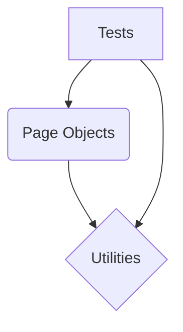

# framework-3.4-ac1.md

# Framework Architecture & Best Practices - Folder Structure

## Overview
A well-defined folder structure is the backbone of a robust, maintainable, and scalable test automation framework. It promotes organization, improves readability, facilitates collaboration, and ensures adherence to best practices. This document outlines a standard, recommended folder structure, primarily aligning with Maven/Gradle conventions, which are widely adopted in the Java ecosystem for test automation projects. Understanding and implementing such a structure is crucial for any SDET to build professional-grade automation solutions.

## Detailed Explanation
The recommended folder structure is largely inspired by build automation tools like Maven and Gradle, which provide a convention-over-configuration paradigm. This standardization helps in separating concerns: test code from framework code, and code from resources.

### `src/main/java`
This directory is designated for the core framework code. In the context of test automation, this would include:
- **Page Objects/Page Factory**: Classes representing web pages or components, encapsulating UI elements and interactions.
- **Utilities (Utils)**: Helper classes for common tasks such as file operations, date manipulations, string utilities, custom listeners, reporting utilities, etc.
- **Base Classes**: Generic classes that provide common functionalities for tests, such as `BaseTest`, `BasePage`, or `DriverFactory`.
- **Managers/Factories**: Classes responsible for managing browser drivers, configuration, or other resources.
- **API Clients**: If you're building an API automation framework, client classes for interacting with the API would reside here.

**Why it matters**: Keeping framework-specific components separate from test cases makes them reusable across different tests and promotes a cleaner, more modular design.

### `src/test/java`
This is where all your actual test cases reside. Each test class should ideally focus on testing a specific feature or component.
- **Test Classes**: Contains methods annotated with `@Test` (TestNG/JUnit) that define the test scenarios.
- **Steps Definitions (BDD)**: If using BDD frameworks like Cucumber, the step definition files would typically be placed here.
- **Runners**: TestNG XML files or JUnit/Cucumber runner classes would also go here.

**Why it matters**: This clear separation ensures that your framework code (how you interact with the application, utilities) is distinct from your test logic (what you are actually testing). This separation makes it easier to navigate the codebase, understand test failures, and refactor.

### `src/test/resources`
This directory is for non-code resources required by your tests.
- **Configuration Files**: `config.properties`, `log4j.properties`, `application.yml`, browser configuration, environment-specific settings.
- **Test Data Files**: CSV, Excel, JSON, XML files containing data to be used in data-driven tests.
- **Locators**: If not embedded within Page Objects, external locator files can be stored here.
- **TestNG XML Suites**: If using TestNG, the XML files defining your test suites.
- **Schema Files**: For API testing, JSON or XML schema files for response validation.

**Why it matters**: Externalizing data and configurations makes your tests more flexible and easier to maintain. You can change test data or switch environments without modifying code.

### Maven/Gradle Structure Compliance
The described structure (`src/main/java`, `src/test/java`, `src/test/resources`) is standard for both Maven and Gradle projects. Adhering to this convention provides several benefits:
- **Automatic Discovery**: Build tools automatically know where to find source code, test code, and resources, simplifying build configurations.
- **Community Standard**: Developers familiar with Maven/Gradle will immediately understand the project layout, reducing the learning curve.
- **Tooling Support**: IDEs (IntelliJ IDEA, Eclipse) and CI/CD pipelines have built-in support for these standard structures.

## Code Implementation
While folder structure itself isn't "code," here's an example of what a typical project structure would look like using a `tree` command output:

```bash
my-automation-framework/
├── pom.xml (or build.gradle)
├── src/
│   ├── main/
│   │   └── java/
│   │       └── com/
│   │           └── example/
│   │               └── framework/
│   │                   ├── pages/
│   │                   │   ├── LoginPage.java
│   │                   │   └── HomePage.java
│   │                   ├── utils/
│   │                   │   ├── ConfigReader.java
│   │                   │   └── WebDriverManager.java
│   │                   └── base/
│   │                       └── BaseTest.java
│   └── test/
│       ├── java/
│       │   └── com/
│       │       └── example/
│       │           └── tests/
│       │               ├── LoginTests.java
│   │               └── HomeTests.java
│       └── resources/
│           ├── config.properties
│           ├── testdata.json
│           └── TestSuite.xml
└── README.md
```

## Best Practices
- **Consistency**: Maintain a consistent naming convention for packages, classes, and files throughout the framework.
- **Modularity**: Design components (Page Objects, Utilities) to be modular and independent, promoting reusability.
- **Clear Separation of Concerns**: Strictly separate framework code, test code, and resources.
- **Avoid Deep Nesting**: While organization is good, overly deep folder nesting can make navigation cumbersome. Strive for a balance.
- **Documentation**: Use `README.md` files at the root of major directories (e.g., `src/main/java/pages/README.md`) to explain the purpose of the components within.
- **Version Control**: Ensure all relevant files and configurations are under version control.

## Common Pitfalls
- **Mixing Code and Resources**: Placing configuration files or test data directly within `src/test/java` can lead to clutter and maintenance issues.
- **Lack of Standardization**: Not following a recognized standard (like Maven/Gradle) can make it difficult for new team members to onboard and for tools to integrate.
- **Over-engineering the Structure**: Starting with an overly complex structure for a small project can lead to unnecessary overhead. Start simple and refactor as the project grows.
- **Hardcoding Values**: Instead of placing configurable data in `src/test/resources`, hardcoding values directly in test code.

## Interview Questions & Answers
1.  **Q: Why is a well-defined folder structure important for a test automation framework?**
    **A:** It enhances maintainability, scalability, and readability. It enforces separation of concerns, making it easier to locate, understand, and update specific parts of the framework. It also simplifies onboarding for new team members and integrates better with build tools and CI/CD pipelines.

2.  **Q: Explain the purpose of `src/main/java`, `src/test/java`, and `src/test/resources` in a typical Maven/Gradle test automation project.**
    **A:** `src/main/java` holds reusable framework components like Page Objects, utility classes, and base classes. `src/test/java` contains the actual test cases and test logic. `src/test/resources` stores non-code assets such as configuration files, test data, and TestNG XML suites.

3.  **Q: How do you ensure your framework's folder structure promotes reusability and maintainability?**
    **A:** By adhering to standard conventions (like Maven/Gradle), strictly separating framework logic from test logic, and externalizing configurations and test data. This modular approach allows components to be used across different tests and makes updates easier without affecting core test logic.

## Hands-on Exercise
1.  **Objective**: Set up a new Maven or Gradle project and implement the recommended folder structure.
2.  **Steps**:
    *   Create a new Maven or Gradle project using your IDE or command line.
    *   Manually create the `src/main/java`, `src/test/java`, and `src/test/resources` directories if they don't already exist.
    *   Inside `src/main/java`, create a package `com.example.framework.pages` and add a `BasePage.java` class.
    *   Inside `src/main/java`, create a package `com.example.framework.utils` and add a `ConfigReader.java` class (empty for now).
    *   Inside `src/test/java`, create a package `com.example.tests` and add a `SampleTest.java` class with a simple `@Test` method.
    *   Inside `src/test/resources`, create a `config.properties` file.
    *   Verify that your IDE recognizes the source and test directories correctly.

## Additional Resources
-   **Maven Standard Directory Layout**: [https://maven.apache.org/guides/introduction/introduction-to-the-standard-directory-layout.html](https://maven.apache.org/guides/introduction/introduction-to-the-standard-directory-layout.html)
-   **Gradle Source Sets**: [https://docs.gradle.org/current/userguide/java_plugin.html#sec:java_project_layout](https://docs.gradle.org/current/userguide/java_plugin.html#sec:java_project_layout)
-   **Page Object Model Best Practices**: [https://www.selenium.dev/documentation/test_practices/page_object_model/](https://www.selenium.dev/documentation/test_practices/page_object_model/)
---
# framework-3.4-ac2.md

# Configuration Management using Properties Files and Config Readers

## Overview
Effective test automation frameworks require robust configuration management to handle varying environments, credentials, and settings without modifying code. Hardcoding values like URLs, browser types, or timeouts makes tests brittle and difficult to maintain. This section explores how to implement configuration management using `config.properties` files and a `ConfigReader` utility class, a common and highly effective pattern in Java-based test automation frameworks. This approach promotes flexibility, reusability, and maintainability, allowing for seamless execution across different stages (e.g., dev, staging, production) and enabling parallel execution with different browser configurations.

## Detailed Explanation
Configuration management involves externalizing parameters that are likely to change. A `.properties` file is a simple, text-based file that stores key-value pairs. It's widely used in Java applications for configuration.

Here's how we'll implement it:
1.  **`config.properties` file**: This file will store all our configuration parameters (e.g., `baseURL`, `browser`, `implicitWaitTimeout`).
2.  **`ConfigReader` utility class**: This class will be responsible for loading the `config.properties` file, reading the values, and providing methods to access them. It typically uses Java's `java.util.Properties` class.
3.  **Integration with tests**: Test scripts will call methods from the `ConfigReader` to retrieve configuration values instead of using hardcoded strings.

### Advantages:
*   **Flexibility**: Easily change configurations without recompiling code.
*   **Maintainability**: Centralized configuration makes updates straightforward.
*   **Reusability**: The same test code can run in different environments.
*   **Security (limited)**: While not for sensitive data like passwords (which should be handled by secure vault systems or environment variables), it prevents credentials from being hardcoded in version-controlled source code. For sensitive data, a layered approach is recommended (e.g., using environment variables that override properties file values).

## Code Implementation

First, let's create a `config.properties` file.

```properties
# config.properties
# Base URL for the application under test
baseURL=https://www.example.com
# Browser to use for execution (e.g., chrome, firefox, edge)
browser=chrome
# Implicit wait timeout in seconds
implicitWaitTimeout=10
# Explicit wait timeout in seconds
explicitWaitTimeout=20
# Headless mode for browser execution (true/false)
headless=false
```

Next, we'll create the `ConfigReader` utility class. This class will load the `config.properties` file once and provide static methods to access the properties.

```java
// src/main/java/utils/ConfigReader.java
package utils;

import java.io.FileInputStream;
import java.io.IOException;
import java.util.Properties;

public class ConfigReader {
    private static Properties properties;
    private static final String CONFIG_FILE_PATH = "src/main/resources/config.properties"; // Or simply "config.properties" if in root/classpath

    // Static block to load properties when the class is initialized
    static {
        try {
            FileInputStream fis = new FileInputStream(CONFIG_FILE_PATH);
            properties = new Properties();
            properties.load(fis);
            fis.close();
        } catch (IOException e) {
            // Log the exception or throw a custom runtime exception
            System.err.println("Error loading config.properties file: " + e.getMessage());
            throw new RuntimeException("Failed to load configuration properties from " + CONFIG_FILE_PATH, e);
        }
    }

    /**
     * Retrieves a property value by its key.
     * @param key The key of the property to retrieve.
     * @return The string value of the property.
     * @throws RuntimeException if the key is not found in the properties file.
     */
    public static String getProperty(String key) {
        String value = properties.getProperty(key);
        if (value == null) {
            // It's good practice to throw an exception if a critical property is missing
            throw new RuntimeException("Property '" + key + "' not found in the config.properties file.");
        }
        return value;
    }

    /**
     * Retrieves a property value by its key, providing a default value if not found.
     * @param key The key of the property to retrieve.
     * @param defaultValue The default value to return if the key is not found.
     * @return The string value of the property or the default value.
     */
    public static String getProperty(String key, String defaultValue) {
        return properties.getProperty(key, defaultValue);
    }

    /**
     * Retrieves an integer property value by its key.
     * @param key The key of the property to retrieve.
     * @return The integer value of the property.
     * @throws NumberFormatException if the property value is not a valid integer.
     * @throws RuntimeException if the key is not found.
     */
    public static int getIntProperty(String key) {
        String value = getProperty(key);
        try {
            return Integer.parseInt(value);
        } catch (NumberFormatException e) {
            throw new RuntimeException("Property '" + key + "' value '" + value + "' is not a valid integer.", e);
        }
    }

    /**
     * Retrieves a boolean property value by its key.
     * @param key The key of the property to retrieve.
     * @return The boolean value of the property.
     * @throws RuntimeException if the key is not found.
     */
    public static boolean getBooleanProperty(String key) {
        String value = getProperty(key);
        // Properties.getProperty returns String, so we parse it.
        // It's robust to handle "true" (case-insensitive) as true, anything else as false.
        return Boolean.parseBoolean(value);
    }

    public static void main(String[] args) {
        // Example usage:
        System.out.println("Base URL: " + ConfigReader.getProperty("baseURL"));
        System.out.println("Browser: " + ConfigReader.getProperty("browser"));
        System.out.println("Implicit Wait Timeout: " + ConfigReader.getIntProperty("implicitWaitTimeout") + " seconds");
        System.out.println("Explicit Wait Timeout (with default): " + ConfigReader.getProperty("explicitWaitTimeout", "15") + " seconds");
        System.out.println("Headless Mode: " + ConfigReader.getBooleanProperty("headless"));

        // Example of a missing property (will throw RuntimeException)
        // System.out.println("Missing Property: " + ConfigReader.getProperty("nonExistentProperty"));
    }
}
```

Now, let's see how to replace hardcoded values in a test with calls to `ConfigReader`.

```java
// src/test/java/com/example/tests/LoginTest.java
package com.example.tests;

import io.github.bonigarcia.wdm.WebDriverManager;
import org.openqa.selenium.WebDriver;
import org.openqa.selenium.chrome.ChromeDriver;
import org.openqa.selenium.chrome.ChromeOptions;
import org.openqa.selenium.firefox.FirefoxDriver;
import org.openqa.selenium.firefox.FirefoxOptions;
import org.testng.annotations.AfterMethod;
import org.testng.annotations.BeforeMethod;
import org.testng.annotations.Test;
import utils.ConfigReader;

import java.time.Duration;

public class LoginTest {
    WebDriver driver;

    @BeforeMethod
    public void setup() {
        String browser = ConfigReader.getProperty("browser", "chrome"); // Default to chrome if not specified
        boolean headless = ConfigReader.getBooleanProperty("headless");
        int implicitWaitTimeout = ConfigReader.getIntProperty("implicitWaitTimeout");

        switch (browser.toLowerCase()) {
            case "chrome":
                WebDriverManager.chromedriver().setup();
                ChromeOptions chromeOptions = new ChromeOptions();
                if (headless) {
                    chromeOptions.addArguments("--headless=new");
                }
                driver = new ChromeDriver(chromeOptions);
                break;
            case "firefox":
                WebDriverManager.firefoxdriver().setup();
                FirefoxOptions firefoxOptions = new FirefoxOptions();
                if (headless) {
                    firefoxOptions.addArguments("-headless");
                }
                driver = new FirefoxDriver(firefoxOptions);
                break;
            // Add other browsers as needed (Edge, Safari, etc.)
            default:
                throw new IllegalArgumentException("Unsupported browser: " + browser);
        }
        driver.manage().window().maximize();
        driver.manage().timeouts().implicitlyWait(Duration.ofSeconds(implicitWaitTimeout));
        driver.get(ConfigReader.getProperty("baseURL")); // Use base URL from config
    }

    @Test
    public void testSuccessfulLogin() {
        // This is a placeholder test. In a real scenario, you would interact with elements
        // using Page Object Model and assertions.
        System.out.println("Navigated to: " + driver.getCurrentUrl());
        System.out.println("Page Title: " + driver.getTitle());
        // Example: Perform login actions (e.g., find elements for username, password, login button)
        // driver.findElement(By.id("username")).sendKeys("testuser");
        // driver.findElement(By.id("password")).sendKeys("password123");
        // driver.findElement(By.id("loginButton")).click();

        // Assertions would go here
        // Assert.assertTrue(driver.getCurrentUrl().contains("dashboard"), "Login failed!");
    }

    @AfterMethod
    public void teardown() {
        if (driver != null) {
            driver.quit();
        }
    }
}
```

**Note on file paths**: For `config.properties`, it's common to place it in `src/main/resources` for Maven/Gradle projects. When running tests, this directory is typically on the classpath, so you might only need `ConfigReader.CONFIG_FILE_PATH = "config.properties";` if it's directly accessible, or ensure your build system copies it correctly. For simplicity in local execution, placing it directly in `src/main/resources` and using the explicit path `src/main/resources/config.properties` works.

## Best Practices
-   **Centralize Configuration**: Keep all environment-specific or frequently changing parameters in one or a few well-defined configuration files.
-   **Environment-Specific Files**: For more complex setups, use multiple property files (e.g., `config_dev.properties`, `config_qa.properties`) and load the appropriate one based on a system property or environment variable.
-   **Prefer `FileInputStream` for flexibility**: While `ConfigReader.class.getClassLoader().getResourceAsStream()` is good for classpath resources, `FileInputStream` allows you to specify a path outside the JAR, useful for external configuration overrides.
-   **Handle Missing Properties Graciously**: Decide whether to throw an exception for missing critical properties or provide sensible default values. The `ConfigReader` above demonstrates both.
-   **Avoid Committing Sensitive Data**: Never store sensitive information like passwords, API keys, or security tokens directly in `.properties` files that are committed to version control. Use environment variables, secure vaults (like HashiCorp Vault), or encrypted files for such data.
-   **Immutable ConfigReader**: Make your `ConfigReader` class immutable (properties loaded once) and thread-safe if it's shared across threads. The static block approach ensures it's loaded only once.
-   **Clear Naming Conventions**: Use clear and consistent naming for your keys (e.g., `baseURL`, `implicitWaitTimeout`).

## Common Pitfalls
-   **Hardcoding Values**: The most common pitfall is not using configuration management at all, leading to maintenance nightmares.
-   **Incorrect File Path**: Issues with the path to the `config.properties` file (e.g., file not found, incorrect relative path). Ensure it's correctly placed and accessible at runtime.
-   **Typos in Keys**: A simple typo in a property key in the `.properties` file or in the `getProperty()` call will result in `null` or a `RuntimeException`.
-   **Not Handling Type Conversions**: Forgetting to convert string properties to their appropriate types (e.g., `Integer.parseInt` for timeouts, `Boolean.parseBoolean` for flags) can lead to runtime errors.
-   **Over-reliance on properties for sensitive data**: Storing credentials in plaintext `config.properties` is a security vulnerability.
-   **Not refreshing configuration**: If your application needs to dynamically change configuration without restarting, a simple `Properties` load won't suffice. However, for most test automation frameworks, loading once at startup is sufficient.

## Interview Questions & Answers
1.  **Q**: Why is configuration management crucial in test automation frameworks?
    **A**: Configuration management is crucial because it externalizes frequently changing parameters (like URLs, browser types, user credentials, timeouts) from the test code. This makes the framework more flexible, maintainable, and reusable. It allows testers to run the same test suite across different environments (dev, QA, staging) without code changes, facilitates parallel execution with varied settings, and helps avoid hardcoding, which is a major anti-pattern.

2.  **Q**: How would you handle different configurations for multiple environments (e.g., Dev, QA, Prod) in your framework?
    **A**: I would use environment-specific properties files, such as `config_dev.properties`, `config_qa.properties`, and `config_prod.properties`. My `ConfigReader` would then dynamically load the appropriate file based on a system property passed during test execution (e.g., `-Denv=qa`), or an environment variable. For example, `ConfigReader.loadProperties("config_" + System.getProperty("env", "qa") + ".properties");`.

3.  **Q**: What are the security considerations when using `.properties` files for configuration, especially concerning sensitive data?
    **A**: The primary security concern is that `.properties` files are typically stored in plain text and often committed to version control systems. This makes them unsuitable for sensitive data like passwords, API keys, or security tokens. For such data, I would advocate using environment variables (which can be injected securely by CI/CD pipelines), secure credential management systems (like HashiCorp Vault or AWS Secrets Manager), or encrypted configuration files. The `.properties` file can then store references or pointers to these secure sources.

4.  **Q**: Describe how you would implement a `ConfigReader` class in Java.
    **A**: I would implement a `ConfigReader` as a singleton utility class. It would have a private constructor and a static `Properties` object. In a static initializer block, it would load the `config.properties` file using `FileInputStream` or `getClassLoader().getResourceAsStream()`. It would provide static `public` methods like `getProperty(String key)`, `getIntProperty(String key)`, and `getBooleanProperty(String key)` to safely retrieve and type-cast configuration values, with error handling for missing keys or invalid formats.

## Hands-on Exercise
1.  **Enhance `config.properties`**: Add new properties to `config.properties` for:
    *   `screenshotPath` (e.g., `target/screenshots/`)
    *   `browserVersion` (e.g., `120`)
    *   `pageLoadTimeout` (e.g., `30` seconds)
2.  **Extend `ConfigReader`**: Add new `getProperty` methods to `ConfigReader` to handle `long` values, and a method to return all properties as a `Map<String, String>`.
3.  **Integrate into a new test**: Create a new test class (e.g., `RegistrationTest.java`). In its `@BeforeMethod`, initialize a WebDriver using `browserVersion` and set `pageLoadTimeout` using the new `ConfigReader` methods. Use `screenshotPath` in an `@AfterMethod` to save a screenshot on test failure.

## Additional Resources
-   [Java Properties class documentation](https://docs.oracle.com/javase/8/docs/api/java/util/Properties.html)
-   [WebDriverManager GitHub Page](https://github.com/bonigarcia/webdrivermanager)
-   [Selenium WebDriver documentation](https://www.selenium.dev/documentation/webdriver/elements/)
-   [TestNG documentation](https://testng.org/doc/index.html)
---
# framework-3.4-ac3.md

# Framework 3.4 AC3: Centralized Utility Packages

## Overview
In robust test automation frameworks, centralizing common functionalities into dedicated utility packages is a critical best practice. This approach promotes code reusability, improves maintainability, reduces redundancy, and ensures consistency across the test suite. Instead of scattering WebDriver calls or database connection logic throughout various test scripts, these operations are encapsulated within well-defined utility classes. This makes tests cleaner, easier to read, and more resilient to changes in underlying libraries or application UI.

## Detailed Explanation
Centralized utility packages act as an abstraction layer over raw API calls (like Selenium WebDriver or JDBC). This means that if, for instance, the way a click operation is performed changes (e.g., from `element.click()` to `Actions.moveToElement(element).click().build().perform()`), only the utility method needs to be updated, not every test case that uses a click. The same principle applies to database interactions, where connection details, query execution, and result processing can be standardized.

### Benefits:
1.  **Reusability:** Write once, use everywhere.
2.  **Maintainability:** Changes to core functionalities are managed in one place.
3.  **Readability:** Tests become more focused on business logic rather than technical implementation details.
4.  **Consistency:** Ensures that common operations are performed uniformly across the framework.
5.  **Error Handling:** Centralized error handling and logging can be implemented.

### Components for framework-3.4-ac3:

1.  **Selenium Actions Wrapper:**
    Selenium's `Actions` class provides a way to simulate complex user interactions like drag-and-drop, right-clicking, hovering, and keyboard events. Wrapping these into a utility class allows for cleaner, more descriptive test steps.

2.  **Database Utility for JDBC Connections:**
    Many applications interact with databases. A database utility class simplifies opening and closing connections, executing queries (SELECT, INSERT, UPDATE, DELETE), and processing result sets. This also centralizes database configuration (connection strings, credentials) and error handling.

## Code Implementation

### Selenium Actions Utility (`SeleniumActionsUtil.java`)

```java
package com.myframework.utilities;

import org.openqa.selenium.Alert;
import org.openqa.selenium.WebDriver;
import org.openqa.selenium.WebElement;
import org.openqa.selenium.interactions.Actions;
import org.openqa.selenium.support.ui.ExpectedConditions;
import org.openqa.selenium.support.ui.WebDriverWait;

import java.time.Duration;

/**
 * Utility class for common Selenium WebDriver actions and waits.
 * Encapsulates complex interactions and explicit waits for better readability and maintainability.
 */
public class SeleniumActionsUtil {

    private WebDriver driver;
    private WebDriverWait wait;
    private Actions actions;

    // Constructor to initialize WebDriver, WebDriverWait, and Actions
    public SeleniumActionsUtil(WebDriver driver, Duration timeoutInSeconds) {
        this.driver = driver;
        this.wait = new WebDriverWait(driver, timeoutInSeconds);
        this.actions = new Actions(driver);
    }

    /**
     * Clicks on a web element using Selenium's Actions class.
     * Useful for elements that are not directly clickable by element.click().
     * @param element The WebElement to click.
     */
    public void clickElement(WebElement element) {
        try {
            wait.until(ExpectedConditions.elementToBeClickable(element));
            actions.moveToElement(element).click().build().perform();
            System.out.println("Clicked on element: " + element.getText());
        } catch (Exception e) {
            System.err.println("Failed to click element: " + element.getText() + " - " + e.getMessage());
            throw new RuntimeException("Error clicking element", e);
        }
    }

    /**
     * Performs a double-click action on a web element.
     * @param element The WebElement to double-click.
     */
    public void doubleClickElement(WebElement element) {
        try {
            wait.until(ExpectedConditions.elementToBeClickable(element));
            actions.doubleClick(element).build().perform();
            System.out.println("Double clicked on element: " + element.getText());
        } catch (Exception e) {
            System.err.println("Failed to double click element: " + element.getText() + " - " + e.getMessage());
            throw new RuntimeException("Error double clicking element", e);
        }
    }

    /**
     * Performs a right-click (context-click) action on a web element.
     * @param element The WebElement to right-click.
     */
    public void rightClickElement(WebElement element) {
        try {
            wait.until(ExpectedConditions.elementToBeClickable(element));
            actions.contextClick(element).build().perform();
            System.out.println("Right clicked on element: " + element.getText());
        } catch (Exception e) {
            System.err.println("Failed to right click element: " + element.getText() + " - " + e.getMessage());
            throw new RuntimeException("Error right clicking element", e);
        }
    }

    /**
     * Moves the mouse to the center of the specified web element.
     * Useful for hover effects.
     * @param element The WebElement to hover over.
     */
    public void hoverOverElement(WebElement element) {
        try {
            wait.until(ExpectedConditions.visibilityOf(element));
            actions.moveToElement(element).build().perform();
            System.out.println("Hovered over element: " + element.getText());
        } catch (Exception e) {
            System.err.println("Failed to hover over element: " + element.getText() + " - " + e.getMessage());
            throw new RuntimeException("Error hovering over element", e);
        }
    }

    /**
     * Drags an element from source to target.
     * @param source The WebElement to drag.
     * @param target The WebElement to drop on.
     */
    public void dragAndDrop(WebElement source, WebElement target) {
        try {
            wait.until(ExpectedConditions.visibilityOf(source));
            wait.until(ExpectedConditions.visibilityOf(target));
            actions.dragAndDrop(source, target).build().perform();
            System.out.println("Dragged element from " + source.getText() + " to " + target.getText());
        } catch (Exception e) {
            System.err.println("Failed to drag and drop: " + e.getMessage());
            throw new RuntimeException("Error performing drag and drop", e);
        }
    }

    /**
     * Sends a sequence of keys to the active web element.
     * @param keysToSend The character sequence to send to the element.
     */
    public void sendKeysToActiveElement(CharSequence... keysToSend) {
        try {
            actions.sendKeys(keysToSend).build().perform();
            System.out.println("Sent keys to active element.");
        } catch (Exception e) {
            System.err.println("Failed to send keys to active element: " + e.getMessage());
            throw new RuntimeException("Error sending keys", e);
        }
    }

    /**
     * Accepts a JavaScript alert.
     */
    public void acceptAlert() {
        try {
            Alert alert = wait.until(ExpectedConditions.alertIsPresent());
            alert.accept();
            System.out.println("Accepted alert.");
        } catch (Exception e) {
            System.err.println("No alert present to accept: " + e.getMessage());
            throw new RuntimeException("Error accepting alert", e);
        }
    }

    /**
     * Dismisses a JavaScript alert.
     */
    public void dismissAlert() {
        try {
            Alert alert = wait.until(ExpectedConditions.alertIsPresent());
            alert.dismiss();
            System.out.println("Dismissed alert.");
        } catch (Exception e) {
            System.err.println("No alert present to dismiss: " + e.getMessage());
            throw new RuntimeException("Error dismissing alert", e);
        }
    }

    /**
     * Gets the text from a JavaScript alert.
     * @return The text of the alert.
     */
    public String getAlertText() {
        try {
            Alert alert = wait.until(ExpectedConditions.alertIsPresent());
            String alertText = alert.getText();
            System.out.println("Alert text: " + alertText);
            return alertText;
        } catch (Exception e) {
            System.err.println("No alert present to get text from: " + e.getMessage());
            throw new RuntimeException("Error getting alert text", e);
        }
    }

    // Example of a custom wait for element to be visible
    public WebElement waitForVisibility(WebElement element) {
        return wait.until(ExpectedConditions.visibilityOf(element));
    }
}
```

### Database Utility (`DatabaseUtil.java`)

```java
package com.myframework.utilities;

import java.sql.*;
import java.util.ArrayList;
import java.util.HashMap;
import java.util.List;
import java.util.Map;
import java.util.Properties;

/**
 * Utility class for handling JDBC database connections and operations.
 * Centralizes database interaction logic, making tests cleaner and more robust.
 */
public class DatabaseUtil implements AutoCloseable {

    private Connection connection;
    private String dbUrl;
    private String username;
    private String password;

    // Constructor to initialize database connection parameters
    public DatabaseUtil(String dbUrl, String username, String password) {
        this.dbUrl = dbUrl;
        this.username = username;
        this.password = password;
    }

    /**
     * Establishes a connection to the database.
     * @throws SQLException If a database access error occurs.
     */
    public void connect() throws SQLException {
        if (connection == null || connection.isClosed()) {
            try {
                // For demonstration, assuming a MySQL database.
                // For other databases, the driver class name might differ (e.g., org.postgresql.Driver)
                // Class.forName("com.mysql.cj.jdbc.Driver"); // No longer strictly needed for JDBC 4.0+
                Properties props = new Properties();
                props.setProperty("user", username);
                props.setProperty("password", password);
                // Optional: Add SSL properties if needed
                // props.setProperty("ssl", "true");
                // props.setProperty("requireSSL", "true");

                connection = DriverManager.getConnection(dbUrl, props);
                System.out.println("Successfully connected to database: " + dbUrl);
            } catch (SQLException e) {
                System.err.println("Database connection failed: " + e.getMessage());
                throw e;
            }
        }
    }

    /**
     * Closes the database connection.
     */
    @Override
    public void close() {
        if (connection != null) {
            try {
                if (!connection.isClosed()) {
                    connection.close();
                    System.out.println("Database connection closed.");
                }
            } catch (SQLException e) {
                System.err.println("Error closing database connection: " + e.getMessage());
            }
            connection = null; // Mark connection as closed
        }
    }

    /**
     * Executes a SELECT query and returns the results as a List of Maps.
     * Each Map represents a row, with column names as keys and values as column data.
     * @param query The SQL SELECT query to execute.
     * @return A List of Maps, where each Map is a row of the result set.
     * @throws SQLException If a database access error occurs.
     */
    public List<Map<String, Object>> executeSelectQuery(String query) throws SQLException {
        List<Map<String, Object>> results = new ArrayList<>();
        if (connection == null || connection.isClosed()) {
            throw new SQLException("Database connection is not established or is closed.");
        }

        try (Statement statement = connection.createStatement();
             ResultSet resultSet = statement.executeQuery(query)) {

            ResultSetMetaData metaData = resultSet.getMetaData();
            int columnCount = metaData.getColumnCount();

            while (resultSet.next()) {
                Map<String, Object> row = new HashMap<>();
                for (int i = 1; i <= columnCount; i++) {
                    row.put(metaData.getColumnLabel(i), resultSet.getObject(i));
                }
                results.add(row);
            }
            System.out.println("Executed SELECT query: " + query);
        } catch (SQLException e) {
            System.err.println("Error executing SELECT query: " + query + " - " + e.getMessage());
            throw e;
        }
        return results;
    }

    /**
     * Executes an INSERT, UPDATE, or DELETE query and returns the number of affected rows.
     * @param query The SQL DML query to execute.
     * @return The number of rows affected by the query.
     * @throws SQLException If a database access error occurs.
     */
    public int executeUpdateQuery(String query) throws SQLException {
        if (connection == null || connection.isClosed()) {
            throw new SQLException("Database connection is not established or is closed.");
        }

        try (Statement statement = connection.createStatement()) {
            int affectedRows = statement.executeUpdate(query);
            System.out.println("Executed UPDATE query: " + query + ". Affected rows: " + affectedRows);
            return affectedRows;
        } catch (SQLException e) {
            System.err.println("Error executing UPDATE query: " + query + " - " + e.getMessage());
            throw e;
        }
    }

    /**
     * Example of using PreparedStatement for queries with parameters, preventing SQL injection.
     * @param query The SQL query with placeholders (e.g., "SELECT * FROM users WHERE username = ?").
     * @param params The parameters to set for the placeholders.
     * @return A List of Maps, where each Map is a row of the result set.
     * @throws SQLException If a database access error occurs.
     */
    public List<Map<String, Object>> executePreparedStatementSelect(String query, Object... params) throws SQLException {
        List<Map<String, Object>> results = new ArrayList<>();
        if (connection == null || connection.isClosed()) {
            throw new SQLException("Database connection is not established or is closed.");
        }

        try (PreparedStatement preparedStatement = connection.prepareStatement(query)) {
            for (int i = 0; i < params.length; i++) {
                preparedStatement.setObject(i + 1, params[i]);
            }

            try (ResultSet resultSet = preparedStatement.executeQuery()) {
                ResultSetMetaData metaData = resultSet.getMetaData();
                int columnCount = metaData.getColumnCount();

                while (resultSet.next()) {
                    Map<String, Object> row = new HashMap<>();
                    for (int i = 1; i <= columnCount; i++) {
                        row.put(metaData.getColumnLabel(i), resultSet.getObject(i));
                    }
                    results.add(row);
                }
            }
            System.out.println("Executed PreparedStatement SELECT query: " + query + " with params: " + java.util.Arrays.toString(params));
        } catch (SQLException e) {
            System.err.println("Error executing PreparedStatement SELECT query: " + query + " - " + e.getMessage());
            throw e;
        }
        return results;
    }

    /**
     * Executes an INSERT, UPDATE, or DELETE query using PreparedStatement.
     * @param query The SQL DML query with placeholders.
     * @param params The parameters to set for the placeholders.
     * @return The number of rows affected by the query.
     * @throws SQLException If a database access error occurs.
     */
    public int executePreparedStatementUpdate(String query, Object... params) throws SQLException {
        if (connection == null || connection.isClosed()) {
            throw new SQLException("Database connection is not established or is closed.");
        }

        try (PreparedStatement preparedStatement = connection.prepareStatement(query)) {
            for (int i = 0; i < params.length; i++) {
                preparedStatement.setObject(i + 1, params[i]);
            }
            int affectedRows = preparedStatement.executeUpdate();
            System.out.println("Executed PreparedStatement UPDATE query: " + query + " with params: " + java.util.Arrays.toString(params) + ". Affected rows: " + affectedRows);
            return affectedRows;
        } catch (SQLException e) {
            System.err.println("Error executing PreparedStatement UPDATE query: " + query + " - " + e.getMessage());
            throw e;
        }
    }
}
```

### Example Test Usage
Imagine you have a `LoginPage` class and a test that interacts with it, and also needs to verify data in a database.

```java
// Page object for a login page
package com.myframework.pages;

import org.openqa.selenium.WebDriver;
import org.openqa.selenium.WebElement;
import org.openqa.selenium.support.FindBy;
import org.openqa.selenium.support.PageFactory;

import com.myframework.utilities.SeleniumActionsUtil; // Import our utility

import java.time.Duration;

public class LoginPage {
    private WebDriver driver;
    private SeleniumActionsUtil actionsUtil; // Instance of our utility

    @FindBy(id = "username")
    private WebElement usernameField;

    @FindBy(id = "password")
    private WebElement passwordField;

    @FindBy(id = "loginButton")
    private WebElement loginButton;

    @FindBy(id = "alertMessage")
    private WebElement alertMessage;

    public LoginPage(WebDriver driver) {
        this.driver = driver;
        PageFactory.initElements(driver, this);
        this.actionsUtil = new SeleniumActionsUtil(driver, Duration.ofSeconds(10)); // Initialize the utility
    }

    public void enterUsername(String username) {
        usernameField.sendKeys(username);
    }

    public void enterPassword(String password) {
        passwordField.sendKeys(password);
    }

    public void clickLoginButton() {
        actionsUtil.clickElement(loginButton); // Using the utility method
    }

    public String getAlertMessageText() {
        return actionsUtil.getAlertText(); // Using the utility method for alerts
    }

    public void acceptAnyAlert() {
        actionsUtil.acceptAlert(); // Using the utility method for alerts
    }

    public String getLoginErrorMessage() {
        return actionsUtil.waitForVisibility(alertMessage).getText();
    }
}
```

```java
// TestNG Test Class
package com.myframework.tests;

import org.openqa.selenium.WebDriver;
import org.openqa.selenium.chrome.ChromeDriver;
import org.testng.Assert;
import org.testng.annotations.AfterMethod;
import org.testng.annotations.BeforeMethod;
import org.testng.annotations.Test;

import com.myframework.pages.LoginPage;
import com.myframework.utilities.DatabaseUtil; // Import our database utility
import com.myframework.utilities.SeleniumActionsUtil; // Import our Selenium utility

import java.sql.SQLException;
import java.time.Duration;
import java.util.List;
import java.util.Map;

public class LoginTest {

    private WebDriver driver;
    private LoginPage loginPage;
    private DatabaseUtil dbUtil;

    // Setup for WebDriver and database connection
    @BeforeMethod
    public void setup() throws SQLException {
        // Assume ChromeDriver is set up via WebDriverManager or system property
        // System.setProperty("webdriver.chrome.driver", "/path/to/chromedriver");
        driver = new ChromeDriver();
        driver.manage().window().maximize();
        driver.manage().timeouts().implicitlyWait(Duration.ofSeconds(10));
        driver.get("http://localhost:8080/login"); // Replace with your application's login URL

        loginPage = new LoginPage(driver);

        // Initialize DatabaseUtil
        String dbUrl = "jdbc:mysql://localhost:3306/testdb";
        String dbUser = "root";
        String dbPass = "password";
        dbUtil = new DatabaseUtil(dbUrl, dbUser, dbPass);
        dbUtil.connect();
    }

    @Test
    public void testSuccessfulLoginAndDatabaseVerification() throws SQLException {
        // Ensure a user exists in the database for the test
        dbUtil.executeUpdateQuery("DELETE FROM users WHERE username = 'testuser'"); // Clean up previous
        dbUtil.executeUpdateQuery("INSERT INTO users (username, password, email) VALUES ('testuser', 'testpass', 'test@example.com')");

        loginPage.enterUsername("testuser");
        loginPage.enterPassword("testpass");
        loginPage.clickLoginButton();

        // Simulate a successful login redirect or check for success element
        // Assert.assertTrue(driver.getCurrentUrl().contains("/dashboard"), "Login was not successful");

        // Example: Verify user status in database after login (if applicable)
        List<Map<String, Object>> userDetails = dbUtil.executePreparedStatementSelect(
                "SELECT status FROM users WHERE username = ?", "testuser");

        Assert.assertFalse(userDetails.isEmpty(), "User details not found in DB.");
        // Assert.assertEquals(userDetails.get(0).get("status"), "active", "User status not updated in DB.");

        System.out.println("Login Test Passed: testSuccessfulLoginAndDatabaseVerification");
    }

    @Test
    public void testInvalidCredentials() {
        loginPage.enterUsername("invaliduser");
        loginPage.enterPassword("wrongpass");
        loginPage.clickLoginButton();

        // Assuming an alert or an error message on the page for invalid credentials
        // If it's an alert:
        // String alertText = loginPage.getAlertMessageText();
        // Assert.assertTrue(alertText.contains("Invalid credentials"), "Expected invalid credentials alert");
        // loginPage.acceptAnyAlert();

        // If it's an on-page error message:
        String errorMessage = loginPage.getLoginErrorMessage();
        Assert.assertTrue(errorMessage.contains("Invalid username or password"), "Expected error message for invalid credentials");
        System.out.println("Login Test Passed: testInvalidCredentials");
    }


    // Teardown to close WebDriver and database connection
    @AfterMethod
    public void tearDown() {
        if (driver != null) {
            driver.quit();
            System.out.println("WebDriver closed.");
        }
        if (dbUtil != null) {
            dbUtil.close(); // Closes the database connection
        }
    }
}
```

**Note:** For the `DatabaseUtil`, you'll need the appropriate JDBC driver in your project's classpath (e.g., `mysql-connector-java` for MySQL, `postgresql` for PostgreSQL). Add it to your `pom.xml` (Maven) or `build.gradle` (Gradle).

Example Maven dependency:
```xml
<!-- https://mvnrepository.com/artifact/mysql/mysql-connector-java -->
<dependency>
    <groupId>mysql</groupId>
    <artifactId>mysql-connector-java</artifactId>
    <version>8.0.28</version> <!-- Use a recent version -->
</dependency>
```

## Best Practices
-   **Keep Utilities Focused:** Each utility class should have a single responsibility (e.g., `SeleniumActionsUtil` for Selenium actions, `DatabaseUtil` for database operations).
-   **Handle Exceptions Gracefully:** Implement robust error handling with meaningful logging and appropriate exception propagation.
-   **Use Explicit Waits:** Always integrate explicit waits in Selenium utilities to handle dynamic web elements reliably.
-   **Parameterize Database Connections:** Avoid hardcoding database credentials and URLs. Use configuration files (e.g., `config.properties`, `YAML`) to manage these.
-   **Use Prepared Statements:** For database operations involving user input or parameters, always use `PreparedStatement` to prevent SQL injection vulnerabilities.
-   **Implement `AutoCloseable`:** For resources like database connections, implement `AutoCloseable` to ensure they are properly closed using try-with-resources blocks.
-   **Centralize Alerts/Waits:** Create separate, focused utilities for waits and alerts, or integrate them logically within broader utility classes like `SeleniumActionsUtil`.

## Common Pitfalls
-   **Over-generalization:** Creating "god" utility classes that try to do too many things. This makes them hard to maintain. Break down functionalities into smaller, focused classes.
-   **Ignoring Error Handling:** Letting exceptions crash tests without proper logging or recovery mechanisms.
-   **Hardcoding Credentials/URLs:** Storing sensitive information or environment-specific URLs directly in code. Use external configuration.
-   **Not Using Explicit Waits:** Relying solely on `Thread.sleep()` or implicit waits, leading to flaky tests.
-   **SQL Injection Vulnerabilities:** Using simple `Statement.executeQuery()` or `Statement.executeUpdate()` with concatenated strings for dynamic queries, especially when dealing with user input. Always use `PreparedStatement`.
-   **Not Closing Resources:** Failing to close WebDriver instances, database connections, or file streams, leading to resource leaks.

## Interview Questions & Answers
1.  **Q: Why is it important to create centralized utility packages in a test automation framework?**
    **A:** Centralized utility packages promote code reusability, improve maintainability, reduce redundancy, and ensure consistency. They abstract away the technical implementation details, allowing test cases to focus purely on business logic. This makes the framework more robust, easier to scale, and more resilient to changes in the underlying application or libraries.

2.  **Q: How do you handle common Selenium actions like clicks, hovers, or drag-and-drop in a reusable way?**
    **A:** I would create a `SeleniumActionsUtil` class that wraps Selenium's `Actions` class. This utility would provide high-level methods like `clickElement(WebElement element)`, `hoverOverElement(WebElement element)`, and `dragAndDrop(WebElement source, WebElement target)`. These methods would also incorporate explicit waits (e.g., `elementToBeClickable`, `visibilityOf`) and basic error handling to make them more robust.

3.  **Q: Describe how you would implement a database utility for test automation. What considerations are important?**
    **A:** A `DatabaseUtil` class would encapsulate JDBC operations. It would have methods for `connect()`, `close()`, `executeSelectQuery(String sql)`, `executeUpdateQuery(String sql)`, and parameterized versions using `PreparedStatement` for security. Key considerations include:
    *   **Connection Management:** Opening and closing connections efficiently, potentially using connection pooling for performance.
    *   **Configuration:** Externalizing database URL, username, and password.
    *   **Error Handling:** Robust try-catch blocks for `SQLException`.
    *   **SQL Injection Prevention:** *Crucially*, using `PreparedStatement` for all queries that involve dynamic parameters to avoid security vulnerabilities.
    *   **Result Set Processing:** Converting `ResultSet` into more usable data structures like `List<Map<String, Object>>`.
    *   **Resource Management:** Ensuring `Statement`, `ResultSet`, and `Connection` objects are closed using try-with-resources.

4.  **Q: What is the role of `WebDriverWait` and `ExpectedConditions` in your Selenium utility methods?**
    **A:** `WebDriverWait` combined with `ExpectedConditions` is vital for creating robust Selenium tests that interact with dynamic web applications. They allow the driver to pause for a specified duration until a certain condition is met (e.g., an element becomes clickable, visible, or an alert is present). Integrating them into utility methods centralizes the waiting logic, prevents `NoSuchElementException` or `ElementNotInteractableException`, reduces test flakiness, and avoids the overuse of `Thread.sleep()`.

## Hands-on Exercise
**Objective:** Enhance the `SeleniumActionsUtil` and `DatabaseUtil` classes.

1.  **Add Screenshot on Failure:** Modify the `SeleniumActionsUtil` methods to take a screenshot and save it to a designated folder whenever an action fails (e.g., `clickElement` throws an exception). You'll need to pass the `driver` instance to a new `ScreenshotUtil` or directly implement the screenshot logic.
2.  **Implement Transaction Management in `DatabaseUtil`:** Add methods to `DatabaseUtil` to start a transaction (`beginTransaction()`), commit it (`commitTransaction()`), and roll it back (`rollbackTransaction()`). This is crucial for test data management where you might want to perform multiple database operations atomically and then revert them.
3.  **Create a Configuration Reader:** Develop a `ConfigReader` utility that loads database credentials and application URLs from a `config.properties` file, so they are not hardcoded in the `LoginTest` or `DatabaseUtil`.

## Additional Resources
-   **Selenium Documentation - Actions:** [https://www.selenium.dev/documentation/webdriver/actions/](https://www.selenium.dev/documentation/webdriver/actions/)
-   **Oracle JDBC Tutorial:** [https://docs.oracle.com/javase/tutorial/jdbc/index.html](https://docs.oracle.com/javase/tutorial/jdbc/index.html)
-   **Baeldung - Guide to JDBC:** [https://www.baeldung.com/java-jdbc](https://www.baeldung.com/java-jdbc)
-   **WebDriver Waits:** [https://www.selenium.dev/documentation/webdriver/waits/](https://www.selenium.dev/documentation/webdriver/waits/)
---
# framework-3.4-ac4.md

# Test Data Management Layer

## Overview
Effective test automation relies heavily on robust test data management. Hardcoding test data directly into test scripts leads to inflexible, difficult-to-maintain, and brittle automation. A dedicated test data management layer externalizes data, making tests more readable, reusable, and adaptable to changes. This section explores how to build such a layer using common data sources like Excel, JSON, and CSV files, leveraging popular Java libraries.

## Detailed Explanation
Externalizing test data allows for:
1.  **Reusability**: The same test script can be executed with different data sets.
2.  **Maintainability**: Data changes don't require code modifications or recompilation.
3.  **Readability**: Test scripts become cleaner and focus solely on the test logic.
4.  **Scalability**: Easily add new test data without altering test code.

We will focus on implementing readers for:
*   **Excel (.xlsx, .xls)**: Often used for structured data, accessible to non-technical users. Apache POI is the standard library for this in Java.
*   **JSON (.json)**: Lightweight, human-readable, and widely used for API testing and configuration. Jackson (or GSON) are popular Java libraries.
*   **CSV (.csv)**: Simple, plain-text format, easy to generate and consume. OpenCSV is a robust library for CSV operations.

To ensure flexibility and extensibility, we'll define a generic `DataReader` interface.

## Code Implementation

First, let's define our generic `DataReader` interface. This interface will allow us to read data from various sources in a standardized way.

**Dependencies (Maven)**:
To run the following examples, ensure you have these dependencies in your `pom.xml`:

```xml
<dependencies>
    <!-- Apache POI for Excel -->
    <dependency>
        <groupId>org.apache.poi</groupId>
        <artifactId>poi</artifactId>
        <version>5.2.3</version>
    </dependency>
    <dependency>
        <groupId>org.apache.poi</groupId>
        <artifactId>poi-ooxml</artifactId>
        <version>5.2.3</version>
    </dependency>

    <!-- Jackson for JSON -->
    <dependency>
        <groupId>com.fasterxml.jackson.core</groupId>
        <artifactId>jackson-databind</artifactId>
        <version>2.15.2</version>
    </dependency>

    <!-- OpenCSV for CSV -->
    <dependency>
        <groupId>com.opencsv</groupId>
        <artifactId>opencsv</artifactId>
        <version>5.7.1</version>
    </dependency>
</dependencies>
```

---

**1. `DataReader.java` (Interface)**

```java
package com.example.datamanagement;

import java.io.IOException;
import java.util.List;
import java.util.Map;

/**
 * Generic interface for reading test data from various sources.
 * Implementations will provide specific logic for Excel, JSON, CSV, etc.
 */
public interface DataReader {

    /**
     * Reads data from the specified source (e.g., file path, database query).
     *
     * @param sourceIdentifier A string identifying the data source (e.g., file path, sheet name, table name).
     * @return A list of maps, where each map represents a row of data
     *         and keys are column/field names, values are the data.
     * @throws IOException If an I/O error occurs during data reading.
     * @throws IllegalArgumentException If the source identifier is invalid or data format is unexpected.
     */
    List<Map<String, String>> readData(String sourceIdentifier) throws IOException;

    /**
     * Reads a single specific piece of data.
     * This might be useful for configuration parameters or single-value lookups.
     *
     * @param sourceIdentifier A string identifying the data source.
     * @param key The key/column name of the data to retrieve.
     * @param rowIdentifier An identifier for the specific row, if applicable (e.g., a primary key value).
     * @return The string value of the requested data, or null if not found.
     * @throws IOException If an I/O error occurs.
     * @throws IllegalArgumentException If parameters are invalid.
     */
    String readSingleValue(String sourceIdentifier, String key, String rowIdentifier) throws IOException;
}
```

---

**2. `ExcelDataReader.java` (Implementation for Excel)**

This reader uses Apache POI to read `.xlsx` files.

```java
package com.example.datamanagement;

import org.apache.poi.ss.usermodel.*;
import org.apache.poi.xssf.usermodel.XSSFWorkbook;

import java.io.FileInputStream;
import java.io.IOException;
import java.util.ArrayList;
import java.util.LinkedHashMap;
import java.util.List;
import java.util.Map;

/**
 * Implementation of DataReader for Excel files (.xlsx).
 * Assumes the first row contains headers.
 */
public class ExcelDataReader implements DataReader {

    private final String filePath;

    public ExcelDataReader(String filePath) {
        if (filePath == null || filePath.trim().isEmpty()) {
            throw new IllegalArgumentException("Excel file path cannot be null or empty.");
        }
        this.filePath = filePath;
    }

    @Override
    public List<Map<String, String>> readData(String sheetName) throws IOException {
        List<Map<String, String>> data = new ArrayList<>();
        try (FileInputStream fis = new FileInputStream(filePath);
             Workbook workbook = new XSSFWorkbook(fis)) {

            Sheet sheet = workbook.getSheet(sheetName);
            if (sheet == null) {
                throw new IllegalArgumentException("Sheet '" + sheetName + "' not found in Excel file: " + filePath);
            }

            Row headerRow = sheet.getRow(0);
            if (headerRow == null) {
                throw new IllegalArgumentException("Header row not found in sheet '" + sheetName + "'.");
            }

            List<String> headers = new ArrayList<>();
            for (Cell cell : headerRow) {
                headers.add(cell.getStringCellValue().trim());
            }

            for (int i = 1; i <= sheet.getLastRowNum(); i++) { // Start from second row (data rows)
                Row dataRow = sheet.getRow(i);
                if (dataRow == null) {
                    continue; // Skip empty rows
                }

                Map<String, String> rowMap = new LinkedHashMap<>();
                for (int j = 0; j < headers.size(); j++) {
                    Cell cell = dataRow.getCell(j);
                    String cellValue = getCellValueAsString(cell);
                    rowMap.put(headers.get(j), cellValue);
                }
                data.add(rowMap);
            }
        }
        return data;
    }

    @Override
    public String readSingleValue(String sheetName, String key, String rowIdentifier) throws IOException {
        List<Map<String, String>> allData = readData(sheetName);
        for (Map<String, String> row : allData) {
            // Assuming rowIdentifier matches a column named "ID" or similar
            if (row.containsKey("ID") && row.get("ID").equals(rowIdentifier)) {
                return row.get(key);
            }
            // Fallback: if no ID, return first match, or require ID to be present
            // For simplicity here, if no explicit ID, we'll require it to be present for now.
            // A more robust implementation might allow specifying the lookup column.
        }
        return null; // Value not found
    }

    private String getCellValueAsString(Cell cell) {
        if (cell == null) {
            return "";
        }
        return switch (cell.getCellType()) {
            case STRING -> cell.getStringCellValue();
            case NUMERIC -> String.valueOf(cell.getNumericCellValue());
            case BOOLEAN -> String.valueOf(cell.getBooleanCellValue());
            case FORMULA -> cell.getCellFormula(); // Consider evaluating formulas
            case BLANK -> "";
            default -> "";
        };
    }
}
```

---

**3. `JsonDataReader.java` (Implementation for JSON)**

This reader uses Jackson to parse JSON files. It expects a JSON array of objects.

```java
package com.example.datamanagement;

import com.fasterxml.jackson.databind.ObjectMapper;
import com.fasterxml.jackson.core.type.TypeReference;

import java.io.File;
import java.io.IOException;
import java.util.List;
import java.util.Map;
import java.util.Optional;

/**
 * Implementation of DataReader for JSON files.
 * Assumes the JSON file contains an array of objects, where each object is a data row.
 * Example:
 * [
 *   {"id": "user1", "username": "testuser1", "password": "password1"},
 *   {"id": "user2", "username": "testuser2", "password": "password2"}
 * ]
 */
public class JsonDataReader implements DataReader {

    private final String filePath;
    private final ObjectMapper objectMapper;

    public JsonDataReader(String filePath) {
        if (filePath == null || filePath.trim().isEmpty()) {
            throw new IllegalArgumentException("JSON file path cannot be null or empty.");
        }
        this.filePath = filePath;
        this.objectMapper = new ObjectMapper();
    }

    @Override
    public List<Map<String, String>> readData(String sourceIdentifier) throws IOException {
        // sourceIdentifier is ignored here, as the whole file is read.
        // Could be used to select a specific top-level key if the JSON is not an array.
        File jsonFile = new File(filePath);
        if (!jsonFile.exists()) {
            throw new IOException("JSON file not found: " + filePath);
        }
        // Read JSON as a List of Maps
        List<Map<String, String>> data = objectMapper.readValue(jsonFile, new TypeReference<List<Map<String, String>>>(){});
        return data;
    }

    @Override
    public String readSingleValue(String sourceIdentifier, String key, String rowIdentifier) throws IOException {
        List<Map<String, String>> allData = readData(sourceIdentifier);
        // Assuming 'rowIdentifier' corresponds to a unique field like 'id'
        Optional<Map<String, String>> matchingRow = allData.stream()
                .filter(row -> row.containsKey("id") && row.get("id").equals(rowIdentifier))
                .findFirst();

        return matchingRow.map(row -> row.get(key)).orElse(null);
    }
}
```

---

**4. `CsvDataReader.java` (Implementation for CSV)**

This reader uses OpenCSV to parse CSV files.

```java
package com.example.datamanagement;

import com.opencsv.CSVReader;
import com.opencsv.exceptions.CsvException;

import java.io.FileReader;
import java.io.IOException;
import java.util.ArrayList;
import java.util.LinkedHashMap;
import java.util.List;
import java.util.Map;
import java.util.Optional;

/**
 * Implementation of DataReader for CSV files.
 * Assumes the first row contains headers.
 */
public class CsvDataReader implements DataReader {

    private final String filePath;

    public CsvDataReader(String filePath) {
        if (filePath == null || filePath.trim().isEmpty()) {
            throw new IllegalArgumentException("CSV file path cannot be null or empty.");
        }
        this.filePath = filePath;
    }

    @Override
    public List<Map<String, String>> readData(String sourceIdentifier) throws IOException {
        List<Map<String, String>> data = new ArrayList<>();
        try (CSVReader reader = new CSVReader(new FileReader(filePath))) {
            List<String[]> allRecords = reader.readAll();
            if (allRecords.isEmpty()) {
                return data; // No data found
            }

            String[] headers = allRecords.get(0);
            for (int i = 1; i < allRecords.size(); i++) { // Start from second row
                String[] record = allRecords.get(i);
                if (record.length != headers.length) {
                    // Log a warning or throw an error for malformed rows
                    System.err.println("Warning: Skipping malformed CSV row " + (i + 1) + ". Expected " + headers.length + " columns, got " + record.length);
                    continue;
                }
                Map<String, String> rowMap = new LinkedHashMap<>();
                for (int j = 0; j < headers.length; j++) {
                    rowMap.put(headers[j].trim(), record[j].trim());
                }
                data.add(rowMap);
            }

        } catch (CsvException e) {
            throw new IOException("Error reading CSV file: " + filePath, e);
        }
        return data;
    }

    @Override
    public String readSingleValue(String sourceIdentifier, String key, String rowIdentifier) throws IOException {
        List<Map<String, String>> allData = readData(sourceIdentifier);
        // Assuming 'rowIdentifier' corresponds to a unique field like 'ID'
        Optional<Map<String, String>> matchingRow = allData.stream()
                .filter(row -> row.containsKey("ID") && row.get("ID").equals(rowIdentifier))
                .findFirst();

        return matchingRow.map(row -> row.get(key)).orElse(null);
    }
}
```

---

**5. `TestDataManager.java` (Facade for managing readers)**

This class acts as a central point to get data from different sources.

```java
package com.example.datamanagement;

import java.io.IOException;
import java.util.List;
import java.util.Map;
import java.util.HashMap;

/**
 * A central manager for providing test data from various sources.
 * Acts as a facade over different DataReader implementations.
 */
public class TestDataManager {

    private final Map<String, DataReader> readers;

    public TestDataManager() {
        this.readers = new HashMap<>();
    }

    /**
     * Registers a DataReader for a specific data type (e.g., "excel", "json", "csv").
     *
     * @param type The type identifier for the reader.
     * @param reader The DataReader instance.
     */
    public void registerReader(String type, DataReader reader) {
        readers.put(type.toLowerCase(), reader);
    }

    /**
     * Retrieves all data from a specified source using a registered reader.
     *
     * @param type The type of data source (e.g., "excel", "json", "csv").
     * @param sourceIdentifier An identifier for the specific data within the source
     *                         (e.g., sheet name for Excel, ignored for simple JSON/CSV files).
     * @return A list of maps representing the data.
     * @throws IOException If an I/O error occurs or the reader type is not registered.
     */
    public List<Map<String, String>> getAllData(String type, String sourceIdentifier) throws IOException {
        DataReader reader = readers.get(type.toLowerCase());
        if (reader == null) {
            throw new IllegalArgumentException("No DataReader registered for type: " + type);
        }
        return reader.readData(sourceIdentifier);
    }

    /**
     * Retrieves a single specific value from a specified source.
     *
     * @param type The type of data source.
     * @param sourceIdentifier The source identifier.
     * @param key The key/column name of the data.
     * @param rowIdentifier An identifier for the specific row to look up (e.g., "user1").
     * @return The string value of the requested data, or null if not found.
     * @throws IOException If an I/O error occurs or the reader type is not registered.
     */
    public String getSingleValue(String type, String sourceIdentifier, String key, String rowIdentifier) throws IOException {
        DataReader reader = readers.get(type.toLowerCase());
        if (reader == null) {
            throw new IllegalArgumentException("No DataReader registered for type: " + type);
        }
        return reader.readSingleValue(sourceIdentifier, key, rowIdentifier);
    }
}
```

---

**6. Example Usage and Data Files**

To test the implementation, create the following data files in a `testdata` directory at the root of your project:

**`testdata/users.xlsx`** (Excel File)
| ID    | Username    | Password    | Email              |
| :---- | :---------- | :---------- | :----------------- |
| user1 | testuser1   | pass123     | user1@example.com  |
| user2 | testuser2   | pass456     | user2@example.com  |

**`testdata/config.json`** (JSON File)
```json
[
  {
    "id": "dev",
    "baseUrl": "https://dev.example.com",
    "timeout": "30000"
  },
  {
    "id": "qa",
    "baseUrl": "https://qa.example.com",
    "timeout": "60000"
  }
]
```

**`testdata/products.csv`** (CSV File)
```csv
ProductID,Name,Price,Category
P001,Laptop,1200.00,Electronics
P002,Mouse,25.50,Electronics
P003,Keyboard,75.00,Electronics
```

**`DataManagementExample.java` (Main class for demonstration)**

```java
package com.example.datamanagement;

import java.io.IOException;
import java.util.List;
import java.util.Map;

public class DataManagementExample {

    public static void main(String[] args) {
        TestDataManager dataManager = new TestDataManager();

        // Register readers with their respective file paths
        dataManager.registerReader("excel", new ExcelDataReader("./testdata/users.xlsx"));
        dataManager.registerReader("json", new JsonDataReader("./testdata/config.json"));
        dataManager.registerReader("csv", new CsvDataReader("./testdata/products.csv"));

        // --- Read from Excel ---
        System.out.println("--- Reading from Excel (users.xlsx, Sheet1) ---");
        try {
            List<Map<String, String>> users = dataManager.getAllData("excel", "Sheet1");
            for (Map<String, String> user : users) {
                System.out.println("User: " + user.get("Username") + ", Pass: " + user.get("Password"));
            }
            String user2Email = dataManager.getSingleValue("excel", "Sheet1", "Email", "user2");
            System.out.println("Email for user2: " + user2Email);
        } catch (IOException | IllegalArgumentException e) {
            System.err.println("Error reading Excel data: " + e.getMessage());
        }

        System.out.println("
--- Reading from JSON (config.json) ---");
        // --- Read from JSON ---
        try {
            List<Map<String, String>> configs = dataManager.getAllData("json", ""); // sourceIdentifier ignored for this JSON reader
            for (Map<String, String> config : configs) {
                System.out.println("Environment: " + config.get("id") + ", Base URL: " + config.get("baseUrl"));
            }
            String devTimeout = dataManager.getSingleValue("json", "", "timeout", "dev");
            System.out.println("Dev environment timeout: " + devTimeout);
        } catch (IOException | IllegalArgumentException e) {
            System.err.println("Error reading JSON data: " + e.getMessage());
        }

        System.out.println("
--- Reading from CSV (products.csv) ---");
        // --- Read from CSV ---
        try {
            List<Map<String, String>> products = dataManager.getAllData("csv", ""); // sourceIdentifier ignored for this CSV reader
            for (Map<String, String> product : products) {
                System.out.println("Product: " + product.get("Name") + ", Price: " + product.get("Price"));
            }
            String laptopPrice = dataManager.getSingleValue("csv", "", "Price", "P001");
            System.out.println("Price for Product P001: " + laptopPrice);
        } catch (IOException | IllegalArgumentException e) {
            System.err.println("Error reading CSV data: " + e.getMessage());
        }

        // Example of unregistered reader type
        System.out.println("
--- Attempting to read with unregistered reader type ---");
        try {
            dataManager.getAllData("xml", "data");
        } catch (IllegalArgumentException e) {
            System.err.println("Caught expected error: " + e.getMessage());
        } catch (IOException e) {
            System.err.println("Caught unexpected error: " + e.getMessage());
        }
    }
}
```

## Best Practices
-   **Separate Data from Code**: Never embed test data directly into your test scripts. Always externalize it.
-   **Choose the Right Format**:
    *   **Excel**: Good for complex tabular data, when non-technical users need to manage data, or when data includes formulas.
    *   **JSON**: Ideal for hierarchical or API response-like data, especially for microservices.
    *   **CSV**: Best for simple tabular data, large datasets where performance is key, or when data is easily exported/imported from databases.
-   **Data Variety**: Ensure your test data covers positive, negative, edge cases, and boundary conditions.
-   **Maintainability**: Keep data files organized and version-controlled alongside your test code. Use clear naming conventions.
-   **Error Handling**: Implement robust error handling in your data readers to gracefully manage malformed data files or missing data.
-   **Performance**: For very large datasets, consider streaming data or using database sources instead of loading entire files into memory.
-   **Parameterized Tests**: Integrate your data management layer with test frameworks like TestNG (using `@DataProvider`) or JUnit (using `@ParameterizedTest`) for efficient test execution with multiple data sets.

## Common Pitfalls
-   **Hardcoding Data**: The most common pitfall, leading to brittle tests and high maintenance effort.
-   **Overly Complex Data Structures**: Storing data in a format that's too complex for the actual data model can make reading and writing difficult.
-   **Lack of Error Handling**: Failing to anticipate and handle malformed data files, missing sheets/columns, or invalid paths will lead to test failures that are hard to diagnose.
-   **Security**: Storing sensitive data (e.g., production credentials) directly in plain text files is a major security risk. Use secure mechanisms like environment variables or encrypted vaults for such data.
-   **Not Version Controlling Data**: If test data isn't versioned with the code, changes in one can break the other without clear traceability.
-   **Performance Bottlenecks**: Loading massive Excel or JSON files entirely into memory for every test can lead to slow test execution and out-of-memory errors.

## Interview Questions & Answers
1.  **Q: Why is test data management crucial in a robust automation framework?**
    *   **A**: It enables data-driven testing, separating test logic from test data. This increases reusability, maintainability, and scalability of tests. It helps cover a wider range of scenarios (positive, negative, edge cases) without modifying code, making tests more robust and less brittle.
2.  **Q: Compare and contrast Excel, JSON, and CSV as test data sources. When would you use each?**
    *   **A**:
        *   **Excel**: Good for complex tabular data, formulas, and when non-technical users need to directly manage data. Offers rich formatting. Use for small to medium datasets.
        *   **JSON**: Ideal for hierarchical data structures, API requests/responses, and microservices environments. Human-readable and widely supported across languages. Use for structured, nested data.
        *   **CSV**: Simple, plain-text tabular data. Excellent for large flat datasets, bulk data operations, or data easily exported from databases. Most performant for large tabular data but lacks hierarchical support.
3.  **Q: How would you design a flexible `DataReader` interface to support multiple data sources?**
    *   **A**: I would create an interface (like `DataReader` shown above) with methods such as `readData(String sourceIdentifier)` returning a `List<Map<String, String>>` and `readSingleValue(String sourceIdentifier, String key, String rowIdentifier)`. Each data source (Excel, JSON, CSV) would have its own implementation of this interface. A `TestDataManager` or Factory class could then manage these implementations, allowing the test to request data by type (e.g., "excel", "json") without knowing the underlying implementation details.
4.  **Q: What considerations are important when dealing with sensitive test data (e.g., passwords)?**
    *   **A**: Never store sensitive data in plain text in version control. Instead, use:
        *   **Environment Variables**: Inject sensitive data during runtime.
        *   **Secrets Management Tools**: (e.g., HashiCorp Vault, AWS Secrets Manager, Azure Key Vault).
        *   **Encrypted Files**: Encrypt test data files and decrypt them at runtime using a key stored securely.
        *   **Test Data Generators**: Generate realistic but non-sensitive data on the fly.
5.  **Q: How do you integrate test data management with TestNG's `@DataProvider`?**
    *   **A**: A `@DataProvider` method can call an instance of the `TestDataManager` to fetch data. The `TestDataManager` would return a `List<Map<String, String>>`. This list can then be converted into an `Object[][]` which `@DataProvider` expects, where each inner array represents a set of parameters for one test execution.

## Hands-on Exercise
1.  **Implement a `PropertiesDataReader`**:
    *   Create a new class `PropertiesDataReader` that implements the `DataReader` interface.
    *   It should read data from a `.properties` file (key-value pairs). For `readData`, you might return a list with a single map containing all properties. For `readSingleValue`, it should directly return the value for the given key.
    *   Create a sample `testdata/config.properties` file.
    *   Register this new reader with `TestDataManager` and demonstrate its usage in `DataManagementExample.java`.
2.  **Integrate with a TestNG Test**:
    *   Set up a simple TestNG project.
    *   Create a test class with a test method that uses `@DataProvider`.
    *   The `@DataProvider` method should use the `TestDataManager` to read data (e.g., user credentials from `users.xlsx`) and pass them to the test method, which then just prints them.

## Additional Resources
-   **Apache POI Documentation**: [https://poi.apache.org/](https://poi.apache.org/)
-   **Jackson JSON Processor**: [https://github.com/FasterXML/jackson](https://github.com/FasterXML/jackson)
-   **OpenCSV GitHub**: [https://opencsv.sourceforge.net/](https://opencsv.sourceforge.net/)
-   **Test Data Management Best Practices**: Search for articles on "Test Data Management Strategies for Automation" on platforms like Medium, LinkedIn Learning, or industry blogs.
---
# framework-3.4-ac5.md

# Environment-Specific Configuration in Test Automation Frameworks

## Overview
In modern software development, applications often interact with different environments (Development, QA, Staging, Production). Test automation frameworks must seamlessly adapt to these environments to ensure reliable and consistent testing. This involves configuring the framework to use environment-specific parameters such as URLs, database credentials, API keys, and other settings without modifying the test code itself. This guide explores how to implement robust environment-specific configuration within a test automation framework, focusing on practical approaches, best practices, and common pitfalls.

## Detailed Explanation
Environment-specific configuration allows your test suite to run against various deployment targets with minimal changes. The core idea is to externalize configuration parameters, making them accessible to your tests based on the active environment.

Common approaches include:
1.  **Property Files:** Using `.properties` files (e.g., `dev.properties`, `qa.properties`, `prod.properties`) is a straightforward method, especially in Java-based frameworks. Each file contains key-value pairs for a specific environment.
2.  **YAML/JSON Files:** More structured and human-readable, YAML (`.yml`) or JSON (`.json`) files can organize complex configurations, including nested structures and lists.
3.  **Environment Variables:** Injecting configuration directly via system environment variables is highly flexible, especially in CI/CD pipelines and containerized environments (like Docker).
4.  **Command-Line Arguments/System Properties:** Passing environment names or specific parameters during test execution.

The implementation typically involves:
*   **Defining Configuration Files:** Create separate files (e.g., `config-dev.properties`, `config-qa.properties`) for each environment.
*   **Configuration Loader:** Develop a utility class responsible for loading the correct configuration file based on an environment variable or system property.
*   **Accessing Parameters:** Provide an API to access configuration values throughout the test framework.

## Code Implementation
This example will demonstrate:
1.  Separate property files for `dev` and `qa`.
2.  A `ConfigManager` class to load properties based on a system property (`env`).
3.  How tests would access these properties.

**`src/main/resources/config-dev.properties`:**
```properties
base.url=https://dev.example.com
api.key=dev-api-key-123
db.username=devuser
db.password=devpass
timeout.seconds=30
```

**`src/main/resources/config-qa.properties`:**
```properties
base.url=https://qa.example.com
api.key=qa-api-key-456
db.username=qauser
db.password=qapass
timeout.seconds=60
```

**`src/main/java/com/example/ConfigManager.java`:**
```java
package com.example;

import java.io.IOException;
import java.io.InputStream;
import java.util.Properties;

public class ConfigManager {
    private static Properties properties;
    private static final String DEFAULT_ENV = "dev"; // Default environment if none specified

    // Private constructor to prevent instantiation
    private ConfigManager() {
    }

    public static void loadProperties() {
        if (properties == null) {
            properties = new Properties();
            String env = System.getProperty("env", DEFAULT_ENV); // Get environment from system property, default to "dev"
            String resourceFileName = "config-" + env.toLowerCase() + ".properties";

            try (InputStream input = ConfigManager.class.getClassLoader().getResourceAsStream(resourceFileName)) {
                if (input == null) {
                    throw new RuntimeException("Property file '" + resourceFileName + "' not found in the classpath.");
                }
                properties.load(input);
                System.out.println("Loaded configuration for environment: " + env.toUpperCase());
            } catch (IOException ex) {
                ex.printStackTrace();
                throw new RuntimeException("Error loading properties from " + resourceFileName, ex);
            }
        }
    }

    public static String getProperty(String key) {
        if (properties == null) {
            loadProperties(); // Ensure properties are loaded on first access
        }
        String value = properties.getProperty(key);
        if (value == null) {
            throw new IllegalArgumentException("Property '" + key + "' not found in the current configuration.");
        }
        return value;
    }

    public static int getIntProperty(String key) {
        return Integer.parseInt(getProperty(key));
    }

    public static boolean getBooleanProperty(String key) {
        return Boolean.parseBoolean(getProperty(key));
    }

    // Optional: Reload properties for dynamic environment changes (use with caution)
    public static void reloadProperties(String newEnv) {
        properties = null; // Clear existing properties
        System.setProperty("env", newEnv); // Set new environment
        loadProperties(); // Reload
    }
}
```

**`src/test/java/com/example/TestRunner.java` (Example Test Usage):**
```java
package com.example;

import org.testng.annotations.BeforeSuite;
import org.testng.annotations.Test;

public class TestRunner {

    @BeforeSuite
    public void setup() {
        ConfigManager.loadProperties(); // Load properties once before all tests
    }

    @Test
    public void testDevEnvironmentSettings() {
        // This test would typically run only when 'env' is 'dev'
        System.out.println("Running test in: " + System.getProperty("env", "dev").toUpperCase() + " environment");
        System.out.println("Base URL: " + ConfigManager.getProperty("base.url"));
        System.out.println("API Key: " + ConfigManager.getProperty("api.key"));
        System.out.println("DB Username: " + ConfigManager.getProperty("db.username"));
        System.out.println("Timeout: " + ConfigManager.getIntProperty("timeout.seconds") + " seconds");
        // Assertions would go here
    }

    @Test
    public void testQaEnvironmentSettings() {
        // This test would typically run only when 'env' is 'qa'
        System.out.println("Running test in: " + System.getProperty("env", "dev").toUpperCase() + " environment");
        System.out.println("Base URL: " + ConfigManager.getProperty("base.url"));
        System.out.println("API Key: " + ConfigManager.getProperty("api.key"));
        // Assertions would go here
    }
}
```

To run tests against a specific environment:
*   **Maven:** `mvn clean test -Denv=qa`
*   **Gradle:** `gradle clean test -Denv=qa`

## Best Practices
-   **Security:** Never hardcode sensitive information (passwords, API keys) directly in your code or commit them to version control. Use environment variables, a secure vault, or encrypted configuration files.
-   **Default Environment:** Always define a default environment (e.g., `dev`) to ensure tests can run even if no explicit environment is specified.
-   **Clear Naming Convention:** Use a consistent naming convention for your configuration files (e.g., `config-env.properties`, `application-{env}.yml`).
-   **Immutability:** Once loaded, configuration properties should ideally be immutable within the test run to prevent unexpected behavior.
-   **Granularity:** Break down large configuration files into smaller, manageable ones if necessary (e.g., `db.properties`, `api.properties`).
-   **Fail Fast:** If a required property is missing, the framework should fail fast and clearly indicate which property is absent.
-   **Centralized Access:** Provide a single point of access (e.g., `ConfigManager`) for all configuration parameters.

## Common Pitfalls
-   **Hardcoding Values:** Directly embedding URLs, credentials, or timeouts in test code, leading to brittle tests that break when environments change.
-   **Inconsistent Naming:** Using different keys for the same parameter across environments, causing confusion and errors.
-   **Lack of Validation:** Not validating if required properties are present, leading to `NullPointerExceptions` at runtime.
-   **Over-complication:** Building an overly complex configuration system when simpler property files suffice for most needs.
-   **Committing Sensitive Data:** Accidentally committing API keys or passwords to public repositories. Use `.gitignore` or a secure secrets management solution.
-   **Scope Issues:** Mismanaging the lifecycle of the configuration loader, leading to properties not being loaded or being reloaded unnecessarily.

## Interview Questions & Answers
1.  **Q:** Why is environment-specific configuration crucial in a test automation framework?
    **A:** It ensures that tests can run against different application environments (DEV, QA, STAGING, PROD) without code changes. This promotes reusability, reduces maintenance effort, prevents hardcoding, and enhances security by abstracting sensitive data. It's vital for CI/CD pipelines to deploy and test against various environments automatically.

2.  **Q:** Describe different ways to manage environment-specific configurations.
    **A:** Common methods include:
    *   **Property Files/YAML/JSON:** External files for key-value pairs.
    *   **Environment Variables:** Injecting values from the OS or CI/CD system.
    *   **System Properties/Command-line Arguments:** Passing values during runtime.
    *   **Secure Vaults:** For highly sensitive data, integrating with tools like HashiCorp Vault.
    The choice depends on project complexity, security needs, and existing infrastructure.

3.  **Q:** How do you ensure sensitive information (like passwords) is not exposed in configuration files or logs?
    **A:**
    *   **Environment Variables:** Preferred method in CI/CD, as variables are not stored in code.
    *   **Secret Management Tools:** Integrate with tools like AWS Secrets Manager, Azure Key Vault, HashiCorp Vault to retrieve secrets at runtime.
    *   **Encryption:** Encrypt sensitive parts of configuration files and decrypt them at runtime, though this adds complexity.
    *   **`.gitignore`:** Ensure config files containing secrets are not committed to version control.
    *   **Restricted Access:** Limit access to configuration files and environment variables.

4.  **Q:** What are the challenges you might face when implementing environment-specific configuration?
    **A:**
    *   **Synchronization:** Keeping configuration files across environments in sync, especially when new parameters are added.
    *   **Security:** Preventing exposure of sensitive data.
    *   **Complexity:** Over-engineering the solution for simple projects.
    *   **Debugging:** Tracing which configuration is being loaded, especially in complex CI/CD setups.
    *   **Scalability:** Ensuring the solution scales as the number of environments or parameters grows.

## Hands-on Exercise
1.  **Objective:** Extend the provided `ConfigManager` example to support a `STAGING` environment.
2.  **Steps:**
    *   Create a `config-staging.properties` file in `src/main/resources`.
    *   Add a unique `base.url` and `api.key` for the staging environment.
    *   Run the `TestRunner` class using the system property `-Denv=staging` and verify that the correct URL and API key are printed.
    *   Modify `ConfigManager` to load from a default `application.properties` if `config-{env}.properties` is not found, providing a fallback.

## Additional Resources
-   [Spring Boot Externalized Configuration](https://docs.spring.io/spring-boot/docs/current/reference/html/features.html#features.external-config): While specific to Spring Boot, the principles of externalized configuration are highly relevant.
-   [12 Factor App - Config](https://12factor.net/config): A methodology for building software-as-a-service apps, with a strong recommendation for storing configuration in the environment.
---
# framework-3.4-ac6.md

# Framework 3.4 AC6: Design abstraction layers separating test logic from implementation

## Overview
In the realm of test automation, particularly with Selenium or Playwright, maintaining clear separation of concerns is paramount for building robust, scalable, and maintainable test frameworks. This acceptance criterion focuses on designing abstraction layers that distinctly separate test logic (what to test) from implementation details (how to interact with the application). This typically involves layers like the Test Layer, Page Object Model (POM) or Screenplay Pattern's Page/Interaction layer, and a Utility/Driver Management layer. The goal is to prevent direct WebDriver instance leakage into the test layer, ensuring tests are business-readable and insulated from UI changes.

Why this matters:
- **Maintainability**: Changes in UI elements only require updates in one place (e.g., Page Objects), not across all tests.
- **Readability**: Tests become more business-readable, focusing on "what" is being tested rather than "how."
- **Reusability**: Page objects and utility methods can be reused across multiple tests.
- **Scalability**: Easier to add new features or modify existing ones without breaking other parts of the framework.
- **Reduced Flakiness**: Isolating interactions helps in building more reliable tests.

## Detailed Explanation

The core idea is to establish a clear hierarchy:

1.  **Test Layer**:
    *   **Purpose**: Contains the actual test scenarios, assertions, and workflow orchestration.
    *   **Responsibilities**: Defines *what* needs to be tested. It interacts with the Page Objects/Interaction Layer but *never* directly with WebDriver or UI elements.
    *   **Characteristics**: Uses descriptive method names (e.g., `loginWithValidCredentials()`, `verifyProductAddedToCart()`). Focuses on business flows.

2.  **Page Object Model (POM) / Interaction Layer**:
    *   **Purpose**: Represents UI screens or components as objects. Encapsulates interactions with elements on a specific page.
    *   **Responsibilities**: Knows *how* to interact with elements on a page. Contains locators and methods that perform actions on those elements. It acts as an interface between the Test Layer and the UI.
    *   **Characteristics**: Each page class corresponds to a unique web page or a significant part of it. Methods return other Page Objects to enable fluent API chaining (e.g., `loginPage.loginAs("user", "pass").goToDashboard()`).

3.  **Driver Management / Utility Layer**:
    *   **Purpose**: Handles WebDriver instantiation, configuration, setup, and teardown. Provides generic utility methods.
    *   **Responsibilities**: Manages the lifecycle of the browser, handles waits, screenshots, JavaScript execution, and other common tasks.
    *   **Characteristics**: Often static methods or a singleton pattern for driver management. Provides core functionalities that Page Objects or Tests might need but don't belong to a specific page.

**Verification of Abstraction Layers:**
-   **Test classes strictly contain assertions and workflow logic**: Test methods should read like user stories. They call methods from Page Objects and assert outcomes. They should not have `driver.findElement()` calls.
-   **Page classes strictly contain element interactions**: Page methods should encapsulate finding elements, interacting with them (click, type, get text), and returning appropriate Page Objects or data.
-   **Verify no WebDriver instance leaks into the Test layer directly**: The `WebDriver` instance should be managed by the Driver Management layer and passed to Page Objects (usually via constructor injection). Test classes should *not* directly import `org.openqa.selenium.WebDriver` (or Playwright's `Page` object) and use its methods.

## Code Implementation

Let's illustrate with a Java, Selenium, and TestNG example.

```java
// src/main/java/com/example/framework/driver/DriverFactory.java
package com.example.framework.driver;

import org.openqa.selenium.WebDriver;
import org.openqa.selenium.chrome.ChromeDriver;
import org.openqa.selenium.firefox.FirefoxDriver;
import io.github.bonigarcia.wdm.WebDriverManager;

/**
 * Manages WebDriver instance creation and teardown.
 * Prevents direct WebDriver exposure to test classes.
 */
public class DriverFactory {

    // ThreadLocal to handle parallel test execution safely
    private static ThreadLocal<WebDriver> driver = new ThreadLocal<>();

    public static WebDriver getDriver() {
        if (driver.get() == null) {
            // Default to Chrome if not specified or unrecognized
            String browser = System.getProperty("browser", "chrome").toLowerCase();
            switch (browser) {
                case "firefox":
                    WebDriverManager.firefoxdriver().setup();
                    driver.set(new FirefoxDriver());
                    break;
                case "chrome":
                default: // Handles 'chrome' and any other unrecognized values
                    WebDriverManager.chromedriver().setup();
                    driver.set(new ChromeDriver());
                    break;
            }
            // Maximize window and set implicit wait (example, prefer explicit waits)
            driver.get().manage().window().maximize();
            // driver.get().manage().timeouts().implicitlyWait(Duration.ofSeconds(10));
        }
        return driver.get();
    }

    public static void quitDriver() {
        if (driver.get() != null) {
            driver.get().quit();
            driver.remove(); // Remove from ThreadLocal to prevent memory leaks
        }
    }
}
```

```java
// src/main/java/com/example/framework/pages/LoginPage.java
package com.example.framework.pages;

import org.openqa.selenium.By;
import org.openqa.selenium.WebDriver;
import org.openqa.selenium.WebElement;
import org.openqa.selenium.support.ui.ExpectedConditions;
import org.openqa.selenium.support.ui.WebDriverWait;

import java.time.Duration;

/**
 * Represents the Login Page of the application.
 * Contains locators and methods for interactions on this page.
 */
public class LoginPage {

    private WebDriver driver;
    private WebDriverWait wait;

    // Locators
    private By usernameField = By.id("username");
    private By passwordField = By.id("password");
    private By loginButton = By.id("loginButton");
    private By errorMessage = By.id("errorMessage");

    // Constructor to inject WebDriver
    public LoginPage(WebDriver driver) {
        this.driver = driver;
        this.wait = new WebDriverWait(driver, Duration.ofSeconds(10));
    }

    public LoginPage navigateTo() {
        driver.get("http://your-app-url/login"); // Replace with actual URL
        wait.until(ExpectedConditions.visibilityOfElementLocated(usernameField));
        return this;
    }

    public DashboardPage login(String username, String password) {
        enterUsername(username);
        enterPassword(password);
        clickLoginButton();
        return new DashboardPage(driver); // Assuming successful login leads to Dashboard
    }

    public String getErrorMessage() {
        return wait.until(ExpectedConditions.visibilityOfElementLocated(errorMessage)).getText();
    }

    private void enterUsername(String username) {
        WebElement userElement = wait.until(ExpectedConditions.visibilityOfElementLocated(usernameField));
        userElement.sendKeys(username);
    }

    private void enterPassword(String password) {
        WebElement passElement = wait.until(ExpectedConditions.visibilityOfElementLocated(passwordField));
        passElement.sendKeys(password);
    }

    private void clickLoginButton() {
        wait.until(ExpectedConditions.elementToBeClickable(loginButton)).click();
    }
}
```

```java
// src/main/java/com/example/framework/pages/DashboardPage.java
package com.example.framework.pages;

import org.openqa.selenium.By;
import org.openqa.selenium.WebDriver;
import org.openqa.selenium.support.ui.ExpectedConditions;
import org.openqa.selenium.support.ui.WebDriverWait;

import java.time.Duration;

/**
 * Represents the Dashboard Page.
 */
public class DashboardPage {

    private WebDriver driver;
    private WebDriverWait wait;

    // Locators
    private By welcomeMessage = By.id("welcomeMessage");
    private By logoutLink = By.linkText("Logout");

    public DashboardPage(WebDriver driver) {
        this.driver = driver;
        this.wait = new WebDriverWait(driver, Duration.ofSeconds(10));
    }

    public boolean isWelcomeMessageDisplayed(String expectedMessage) {
        return wait.until(ExpectedConditions.textToBePresentInElementLocated(welcomeMessage, expectedMessage));
    }

    public LoginPage logout() {
        wait.until(ExpectedConditions.elementToBeClickable(logoutLink)).click();
        return new LoginPage(driver);
    }
}
```

```java
// src/test/java/com/example/framework/tests/LoginTest.java
package com.example.framework.tests;

import com.example.framework.driver.DriverFactory;
import com.example.framework.pages.DashboardPage;
import com.example.framework.pages.LoginPage;
import org.openqa.selenium.WebDriver;
import org.testng.Assert;
import org.testng.annotations.AfterMethod;
import org.testng.annotations.BeforeMethod;
import org.testng.annotations.Test;

/**
 * Test class for login functionality.
 * This class only contains test logic and assertions, no direct WebDriver interactions.
 */
public class LoginTest {

    private WebDriver driver;
    private LoginPage loginPage;
    private DashboardPage dashboardPage;

    @BeforeMethod
    public void setup() {
        driver = DriverFactory.getDriver(); // Get driver instance
        loginPage = new LoginPage(driver);
        // DashboardPage will be instantiated after successful login if needed immediately
    }

    @Test(description = "Verify successful login with valid credentials")
    public void testSuccessfulLogin() {
        // Test logic: Navigate, Login, Assert
        dashboardPage = loginPage.navigateTo().login("validUser", "validPassword"); // Chained calls
        Assert.assertTrue(dashboardPage.isWelcomeMessageDisplayed("Welcome, validUser!"),
                "Welcome message not displayed or incorrect after successful login.");
    }

    @Test(description = "Verify error message with invalid credentials")
    public void testInvalidLogin() {
        loginPage.navigateTo().login("invalidUser", "wrongPassword");
        Assert.assertEquals(loginPage.getErrorMessage(), "Invalid credentials",
                "Error message not displayed or incorrect for invalid login.");
    }

    @AfterMethod
    public void tearDown() {
        DriverFactory.quitDriver(); // Quit driver instance
    }
}
```

## Best Practices
-   **Strict Separation of Concerns**: Ensure Test classes, Page Objects, and Driver Management are distinctly separated. A test should never know *how* to find an element, only *what* action to perform (via a Page Object method).
-   **Meaningful Method Names**: Use highly descriptive method names in Page Objects (e.g., `enterUsername(String user)`, `clickLoginButton()`) and Test classes (e.g., `testSuccessfulLogin()`).
-   **Fluent Interface**: Design Page Object methods to return `this` (the current Page Object) or another relevant Page Object to allow for method chaining, improving readability.
-   **Explicit Waits**: Prefer `WebDriverWait` and `ExpectedConditions` over implicit waits or `Thread.sleep()` to handle dynamic elements robustly.
-   **Configuration Management**: Externalize URLs, credentials, and browser types (e.g., in `config.properties`, environment variables, or TestNG XML parameters) to make the framework flexible.
-   **WebDriverManager**: Use libraries like WebDriverManager (for Selenium) to automatically manage browser driver binaries, simplifying setup.
-   **ThreadLocal for Parallel Execution**: When running tests in parallel, use `ThreadLocal<WebDriver>` to ensure each thread gets its own independent WebDriver instance.

## Common Pitfalls
-   **Leaking WebDriver**: Directly using `driver.findElement()` or `driver.get()` within a Test class. This couples tests too tightly to UI implementation.
    *   **How to avoid**: Ensure `WebDriver` is only passed to Page Object constructors and used internally within Page Object methods. Test methods should only call Page Object methods.
-   **Hardcoding Locators**: Storing locators directly in test methods instead of centralizing them in Page Objects.
    *   **How to avoid**: Define all locators as private `By` objects within their respective Page Object classes.
-   **"God Object" Page Objects**: Creating Page Objects that are too large and contain methods and locators for multiple, unrelated pages.
    *   **How to avoid**: Each Page Object should represent a distinct, logical section of the application's UI. Break down complex pages into smaller components if necessary.
-   **Using `Thread.sleep()`**: Relying on fixed waits, leading to flaky tests or unnecessarily slow execution.
    *   **How to avoid**: Implement robust explicit waits using `WebDriverWait` and `ExpectedConditions`.
-   **Lack of Error Handling**: Not handling cases where elements might not be present or actions might fail.
    *   **How to avoid**: Incorporate `try-catch` blocks where appropriate, add robust waits, and ensure informative error messages in assertions.

## Interview Questions & Answers
1.  **Q**: Explain the Page Object Model (POM) and its benefits in test automation.
    **A**: The Page Object Model is a design pattern used to create an object repository for UI elements within test automation frameworks. Each web page (or significant part of a page) in the application is represented as a separate class, and the elements on that page are defined as variables within the class. Actions that can be performed on the page are defined as methods.
    **Benefits**:
    *   **Code Reusability**: Page objects can be reused across multiple tests.
    *   **Maintainability**: If the UI changes, updates are only required in the respective Page Object class, not in every test case.
    *   **Readability**: Test scripts become more readable and understandable, as they interact with pages and elements in a business-centric way.
    *   **Reduced Duplication**: Avoids repeating locator strategies throughout the test suite.

2.  **Q**: How do you prevent WebDriver instances from leaking into the test layer? Why is this important?
    **A**: We prevent WebDriver leakage by implementing a clear abstraction layer, typically through a Driver Management class and Page Object classes. The `WebDriver` instance is instantiated and managed by a dedicated `DriverFactory` (or similar) class. This instance is then passed to Page Object constructors. Test classes only interact with Page Object methods, never directly calling `driver.findElement()` or other `WebDriver` methods.
    This is important because:
    *   **Loose Coupling**: It decouples the test logic from the browser automation implementation details.
    *   **Flexibility**: Allows changing the underlying automation tool (e.g., from Selenium to Playwright) or browser without altering test logic.
    *   **Cleaner Tests**: Tests become focused on validating business requirements, making them easier to write, read, and maintain.

3.  **Q**: Describe a scenario where poor abstraction leads to maintenance nightmares, and how good abstraction would solve it.
    **A**: **Poor Abstraction Scenario**: Imagine a login feature tested by 50 different test cases, each with `driver.findElement(By.id("username")).sendKeys("user");` and `driver.findElement(By.id("password")).sendKeys("pass");` directly in the test method. If the `id` for the username field changes from "username" to "user-email-input", you'd have to manually update all 50 test cases. This is a maintenance nightmare, prone to errors, and time-consuming.
    **Good Abstraction Solution**: With a Page Object (e.g., `LoginPage`), the locator `By.id("username")` would be defined once in the `LoginPage` class. All 50 test cases would call `loginPage.enterUsername("user");`. When the locator changes, only the `LoginPage` class needs to be updated. All 50 tests will continue to work without modification, demonstrating the power of abstraction.

## Hands-on Exercise
**Objective**: Refactor an existing, poorly structured test case into a well-abstracted test using Page Object Model.

**Scenario**: You have a simple web application with a registration form (fields: `firstName`, `lastName`, `email`, `password`, `confirmPassword`, `registerButton`).

**Initial (Bad) Test Code**:
```java
// DO NOT COPY - Example of bad practice
import org.openqa.selenium.By;
import org.openqa.selenium.WebDriver;
import org.openqa.selenium.chrome.ChromeDriver;
import org.testng.Assert;
import org.testng.annotations.AfterMethod;
import org.testng.annotations.BeforeMethod;
import org.testng.annotations.Test;
import io.github.bonigarcia.wdm.WebDriverManager;

public class BadRegistrationTest {
    WebDriver driver;

    @BeforeMethod
    public void setup() {
        WebDriverManager.chromedriver().setup();
        driver = new ChromeDriver();
        driver.manage().window().maximize();
        driver.get("http://your-registration-app-url/register"); // Replace with actual URL
    }

    @Test
    public void testRegistrationWithValidData() {
        driver.findElement(By.id("firstName")).sendKeys("John");
        driver.findElement(By.id("lastName")).sendKeys("Doe");
        driver.findElement(By.id("email")).sendKeys("john.doe@example.com");
        driver.findElement(By.id("password")).sendKeys("Password123!");
        driver.findElement(By.id("confirmPassword")).sendKeys("Password123!");
        driver.findElement(By.id("registerButton")).click();

        // Assert success message - assume there's a success message element with id "successMessage"
        String successText = driver.findElement(By.id("successMessage")).getText();
        Assert.assertTrue(successText.contains("Registration successful"), "Registration success message not found.");
    }

    @AfterMethod
    public void tearDown() {
        driver.quit();
    }
}
```

**Task**:
1.  Create a `RegistrationPage` Page Object class.
2.  Move all locators and element interaction methods into `RegistrationPage`.
3.  Modify the `BadRegistrationTest` to use the `RegistrationPage` methods exclusively.
4.  Ensure no `WebDriver` calls are present in the refactored test class.

## Additional Resources
-   **Page Object Model official Selenium documentation**: [https://www.selenium.dev/documentation/test_practices/encouraged/page_object_models/](https://www.selenium.dev/documentation/test_practices/encouraged/page_object_models/)
-   **Boni Garcia - WebDriverManager**: [https://bonigarcia.dev/webdrivermanager/](https://bonigarcia.dev/webdrivermanager/)
-   **TestNG Official Documentation**: [https://testng.org/doc/index.html](https://testng.org/doc/index.html)
-   **Software Testing Help - Test Automation Framework with Selenium, TestNG, and POM**: [https://www.softwaretestinghelp.com/selenium-test-automation-framework/](https://www.softwaretestinghelp.com/selenium-test-automation-framework/)
---
# framework-3.4-ac7.md

# Dependency Injection for Enhanced Testability and Parallel Execution Safety

## Overview
Dependency Injection (DI) is a powerful design pattern that helps in creating loosely coupled, maintainable, and testable code. In test automation frameworks, DI is crucial for managing external dependencies like WebDriver instances, page objects, and utility classes. By allowing an external entity (an injector or container) to provide these dependencies, we achieve better separation of concerns, easier testing, and robust support for advanced scenarios like parallel test execution. This document explores how to implement DI for WebDriver instantiation, pass driver instances cleanly to page objects, and explain its role in ensuring parallel execution safety.

## Detailed Explanation

Dependency Injection is a technique where an object receives its dependencies from an external source rather than creating them itself. This "inversion of control" means that components don't create their collaborators but rather are given them.

### Types of Dependency Injection
While there are several ways to inject dependencies (Constructor Injection, Setter Injection, Interface Injection), **Constructor Injection** is generally preferred for mandatory dependencies, especially for WebDriver instances in test automation. It ensures that an object is created in a valid state with all its required dependencies.

### Refactoring Driver Instantiation with Constructor Injection
Traditionally, WebDriver instances might be created directly within a test class or a base test class, leading to tight coupling. With DI, the WebDriver instance is created and managed by a separate factory or a DI container, then "injected" into the test or page object.

Consider a `DriverFactory` responsible for creating and managing WebDriver instances. For parallel execution, each test thread must have its own unique WebDriver instance. This is where `ThreadLocal` comes into play. `ThreadLocal` provides a way to store data that will be accessible only by a specific thread, ensuring isolation.

### Passing Driver Instances Cleanly to Page Objects
Page Objects are a core component of UI test automation. They represent interactions with a web page. A Page Object typically needs a WebDriver instance to perform actions. Instead of having the Page Object create its own WebDriver or retrieve it from a static context (an anti-pattern for parallel execution), the WebDriver should be injected into the Page Object's constructor.

```java
// Bad Practice: Page Object creates its own driver or uses a static one
public class LoginPage {
    private WebDriver driver;

    public LoginPage() {
        this.driver = DriverFactory.getDriver(); // Problematic for parallel execution
    }
    // ...
}

// Good Practice: Driver injected via constructor
public class LoginPage {
    private WebDriver driver;

    public LoginPage(WebDriver driver) {
        this.driver = driver;
        // Optionally, use PageFactory to initialize elements
        // PageFactory.initElements(driver, this);
    }
    // ...
}
```

This approach makes `LoginPage` more flexible and testable. Any test can provide a `WebDriver` instance to it, whether it's a real browser or a mock.

### How DI Aids in Parallel Execution Safety
Parallel test execution significantly reduces test suite runtime. However, it introduces challenges, primarily ensuring that tests don't interfere with each other. The most common interference point is a shared WebDriver instance.

DI, especially when combined with `ThreadLocal` for WebDriver management, directly addresses this:

1.  **Isolation**: Each test thread, when requesting a `WebDriver` instance via DI, receives its own unique `WebDriver` instance managed by `ThreadLocal`. The DI container (or factory) ensures that `ThreadLocal.get()` always returns the correct driver for the current thread.
2.  **No Shared State**: By injecting `WebDriver` and subsequent Page Objects, there's no static or globally shared `WebDriver` instance that multiple threads could simultaneously try to use, leading to unpredictable behavior and test failures.
3.  **Clean Setup/Teardown**: The DI mechanism can be integrated with test framework hooks (e.g., TestNG's `@BeforeMethod`, `@AfterMethod`) to ensure that a new driver is created for each test method (or class, depending on configuration) and properly quit afterwards, guaranteeing a clean state for every test.

## Code Implementation

Here’s a simplified Java example demonstrating Dependency Injection for WebDriver and Page Objects, designed with parallel execution in mind. This example uses a custom `DriverFactory` that leverages `ThreadLocal`.

```java
// src/main/java/com/example/framework/driver/DriverFactory.java
package com.example.framework.driver;

import org.openqa.selenium.WebDriver;
import org.openqa.selenium.chrome.ChromeDriver;
import org.openqa.selenium.firefox.FirefoxDriver;
import org.openqa.selenium.edge.EdgeDriver;
import org.openqa.selenium.remote.DesiredCapabilities;
import org.openqa.selenium.remote.RemoteWebDriver;

import java.net.URL;

public class DriverFactory {

    // ThreadLocal ensures that each thread gets its own WebDriver instance.
    private static ThreadLocal<WebDriver> driver = new ThreadLocal<>();
    private static String browser = System.getProperty("browser", "chrome"); // Default to chrome
    private static String gridUrl = System.getProperty("gridUrl"); // URL for Selenium Grid

    // Prevent instantiation
    private DriverFactory() {}

    public static WebDriver getDriver() {
        if (driver.get() == null) {
            initializeDriver();
        }
        return driver.get();
    }

    private static void initializeDriver() {
        if (gridUrl != null && !gridUrl.isEmpty()) {
            // Run tests on Selenium Grid
            DesiredCapabilities capabilities;
            switch (browser.toLowerCase()) {
                case "firefox":
                    capabilities = DesiredCapabilities.firefox();
                    break;
                case "edge":
                    capabilities = DesiredCapabilities.edge();
                    break;
                case "chrome":
                default:
                    capabilities = DesiredCapabilities.chrome();
                    break;
            }
            try {
                driver.set(new RemoteWebDriver(new URL(gridUrl), capabilities));
            } catch (Exception e) {
                System.err.println("Failed to connect to Selenium Grid: " + e.getMessage());
                throw new RuntimeException("Could not initialize remote WebDriver", e);
            }
        } else {
            // Run tests locally
            switch (browser.toLowerCase()) {
                case "firefox":
                    driver.set(new FirefoxDriver());
                    break;
                case "edge":
                    driver.set(new EdgeDriver());
                    break;
                case "chrome":
                default:
                    driver.set(new ChromeDriver());
                    break;
            }
        }
        driver.get().manage().window().maximize();
    }

    public static void quitDriver() {
        if (driver.get() != null) {
            driver.get().quit();
            driver.remove(); // Important to clean up ThreadLocal
        }
    }
}
```

```java
// src/main/java/com/example/framework/pages/LoginPage.java
package com.example.framework.pages;

import org.openqa.selenium.WebDriver;
import org.openqa.selenium.WebElement;
import org.openqa.selenium.support.FindBy;
import org.openqa.selenium.support.PageFactory;

public class LoginPage {

    private WebDriver driver;

    @FindBy(id = "username")
    private WebElement usernameField;

    @FindBy(id = "password")
    private WebElement passwordField;

    @FindBy(id = "loginButton")
    private WebElement loginButton;

    // Constructor Injection: Driver is passed from outside
    public LoginPage(WebDriver driver) {
        this.driver = driver;
        PageFactory.initElements(driver, this); // Initialize WebElements
    }

    public void enterUsername(String username) {
        usernameField.sendKeys(username);
    }

    public void enterPassword(String password) {
        passwordField.sendKeys(password);
    }

    public void clickLoginButton() {
        loginButton.click();
    }

    public String getPageTitle() {
        return driver.getTitle();
    }
}
```

```java
// src/test/java/com/example/framework/tests/BaseTest.java
package com.example.framework.tests;

import com.example.framework.driver.DriverFactory;
import org.openqa.selenium.WebDriver;
import org.testng.annotations.AfterMethod;
import org.testng.annotations.BeforeMethod;
import org.testng.annotations.Parameters;

public class BaseTest {

    // WebDriver instance for the current thread, managed by DriverFactory
    protected WebDriver driver;

    @BeforeMethod
    public void setup() {
        // DriverFactory handles the creation and ThreadLocal management
        driver = DriverFactory.getDriver();
    }

    @AfterMethod
    public void tearDown() {
        // DriverFactory handles quitting the driver and cleaning ThreadLocal
        DriverFactory.quitDriver();
    }
}
```

```java
// src/test/java/com/example/framework/tests/LoginTest.java
package com.example.framework.tests;

import com.example.framework.pages.LoginPage;
import org.testng.Assert;
import org.testng.annotations.Test;

public class LoginTest extends BaseTest {

    @Test(description = "Verify successful login with valid credentials")
    public void testSuccessfulLogin() {
        // Inject the driver into the Page Object
        LoginPage loginPage = new LoginPage(driver);

        driver.get("http://localhost:8080/login"); // Assuming a local login page

        loginPage.enterUsername("testuser");
        loginPage.enterPassword("password123");
        loginPage.clickLoginButton();

        // Add assertions based on successful login (e.g., URL change, welcome message)
        Assert.assertEquals(loginPage.getPageTitle(), "Welcome Page", "Login was not successful");
    }

    @Test(description = "Verify failed login with invalid credentials")
    public void testFailedLogin() {
        LoginPage loginPage = new LoginPage(driver);

        driver.get("http://localhost:8080/login"); // Assuming a local login page

        loginPage.enterUsername("invalid");
        loginPage.enterPassword("wrong");
        loginPage.clickLoginButton();

        // Add assertions based on failed login (e.g., error message visible)
        // Assert.assertTrue(loginPage.isErrorMessageDisplayed(), "Error message not displayed");
        Assert.assertEquals(loginPage.getPageTitle(), "Login Page", "Should remain on login page after failed attempt");
    }
}
```

To run these tests in parallel with TestNG, you would configure your `testng.xml` like this:

```xml
<!DOCTYPE suite SYSTEM "https://testng.org/testng-1.0.dtd" >

<suite name="Selenium DI Tests" parallel="methods" thread-count="2">
    <test name="Login Functionality">
        <classes>
            <class name="com.example.framework.tests.LoginTest" />
        </classes>
    </test>
</suite>
```
You would run with system properties: `mvn test -Dbrowser=chrome` or `mvn test -Dbrowser=firefox -DgridUrl=http://localhost:4444/wd/hub`

## Best Practices
-   **Prefer Constructor Injection**: For mandatory dependencies like `WebDriver`, constructor injection ensures that an object is fully initialized and valid upon creation.
-   **Encapsulate Driver Management**: Centralize `WebDriver` creation, configuration, and teardown within a dedicated factory or service (e.g., `DriverFactory`).
-   **Use `ThreadLocal` for Parallel Execution**: Always use `ThreadLocal` to store `WebDriver` instances when running tests in parallel to prevent concurrency issues and ensure thread isolation.
-   **Inject Interfaces, Not Implementations**: If using a DI framework, inject `WebDriver` (interface) rather than `ChromeDriver` (implementation) for greater flexibility.
-   **Keep Page Objects Clean**: Page Objects should focus solely on interacting with the UI. Injecting the driver keeps them free from driver management logic.
-   **Dispose of Resources**: Always ensure `WebDriver.quit()` is called and `ThreadLocal` variables are removed (`ThreadLocal.remove()`) after each test to prevent memory leaks and ensure resources are freed.

## Common Pitfalls
-   **Static WebDriver Instances**: Using a `static WebDriver` instance for the entire test suite. This is a critical anti-pattern for parallel execution as it leads to race conditions and unpredictable test failures.
-   **Not Quitting Drivers**: Failing to call `driver.quit()` after each test or test class. This leads to browser processes accumulating, consuming system resources, and eventually causing system instability.
-   **Over-engineering DI**: For very small projects, a full-blown DI framework might be overkill. A simple factory with `ThreadLocal` might suffice. Balance complexity with project needs.
-   **Circular Dependencies**: If objects try to inject each other, it can lead to infinite loops or `StackOverflowError`s. Design your dependencies carefully.
-   **Hiding Dependencies**: If a Page Object internally creates its `WebDriver` or retrieves it from a static context, its dependencies are hidden, making it harder to test and reuse.

## Interview Questions & Answers
1.  **Q: What is Dependency Injection (DI) and why is it beneficial in test automation frameworks?**
    *   **A**: DI is a design pattern where a class receives its dependencies from an external source rather than creating them itself. In test automation, it helps decouple components (e.g., tests from `WebDriver` creation, Page Objects from `WebDriver` retrieval). Benefits include:
        *   **Increased Testability**: Easier to mock or substitute dependencies for unit testing Page Objects.
        *   **Loose Coupling**: Components are independent and reusable.
        *   **Easier Maintenance**: Changes to how a dependency is provided don't require changing every consumer.
        *   **Scalability**: Essential for managing resources like `WebDriver` in parallel execution.

2.  **Q: How do you handle WebDriver instances for parallel test execution in a Selenium framework?**
    *   **A**: The primary concern is ensuring each test thread has its own isolated `WebDriver` instance. This is typically achieved using `ThreadLocal<WebDriver>`. A `DriverFactory` class would encapsulate the logic for creating, storing (in `ThreadLocal`), and quitting `WebDriver` instances. Each `BeforeMethod` in the base test class would call `DriverFactory.getDriver()` (which internally uses `ThreadLocal.get()`), and each `AfterMethod` would call `DriverFactory.quitDriver()` (which internally calls `driver.quit()` and `ThreadLocal.remove()`).

3.  **Q: Explain the difference between Constructor Injection and Setter Injection in the context of Page Objects.**
    *   **A**:
        *   **Constructor Injection**: Dependencies are provided through the class constructor. It's suitable for mandatory dependencies because it ensures that the object is always created in a valid state with all its required collaborators. For Page Objects, the `WebDriver` instance is a mandatory dependency, so constructor injection (e.g., `public LoginPage(WebDriver driver)`) is preferred.
        *   **Setter Injection**: Dependencies are provided through public setter methods. This is suitable for optional dependencies or when dependencies might change during an object's lifecycle. It allows creating an object first and then setting its dependencies. While possible for Page Objects, it might lead to a Page Object being in an invalid state if a mandatory `WebDriver` isn't set, and it complicates ensuring all dependencies are present.

## Hands-on Exercise
**Task**: Refactor an existing Selenium WebDriver test suite to incorporate constructor-based Dependency Injection for its `WebDriver` instances and Page Objects.

**Steps**:
1.  **Identify an existing test**: Choose a simple test that currently creates its `WebDriver` instance directly or uses a static helper for `WebDriver` (if any).
2.  **Create a `DriverFactory`**: Implement a `DriverFactory` class with `ThreadLocal<WebDriver>` to manage thread-safe `WebDriver` instances.
3.  **Update Base Test**: Modify your `BaseTest` class to use the `DriverFactory` to get and quit `WebDriver` instances in `@BeforeMethod` and `@AfterMethod`.
4.  **Refactor Page Objects**: Change your Page Objects to accept the `WebDriver` instance via their constructor.
5.  **Update Test Methods**: In your actual test methods, instantiate Page Objects by passing the `driver` instance obtained from `BaseTest`.
6.  **Configure TestNG for Parallel Execution**: Create a `testng.xml` file configured to run tests in parallel (e.g., `parallel="methods"` or `parallel="classes"`), and observe that tests run without interference.
7.  **Run and Verify**: Execute your tests and confirm that they pass and demonstrate proper isolation in parallel.

## Additional Resources
-   **Selenium WebDriver Documentation**: [https://www.selenium.dev/documentation/](https://www.selenium.dev/documentation/)
-   **TestNG Parallel Execution**: [https://testng.org/doc/documentation-main.html#parallel-methods](https://testng.org/doc/documentation-main.html#parallel-methods)
-   **Google Guice (DI Framework)**: [https://github.com/google/guice](https://github.com/google/guice)
-   **Martin Fowler on Dependency Injection**: [https://martinfowler.com/articles/injection.html](https://martinfowler.com/articles/injection.html)
-   **ThreadLocal in Java**: [https://www.geeksforgeeks.org/threadlocal-class-in-java/](https://www.geeksforgeeks.org/threadlocal-class-in-java/)
---
# framework-3.4-ac8.md

# Framework Architecture & Best Practices

## Overview
A robust and well-designed test automation framework is the backbone of efficient and reliable software quality assurance. It provides a structured approach to writing, executing, and maintaining automated tests, promoting reusability, scalability, and ease of debugging. This document outlines the core architecture, best practices, common pitfalls, and essential documentation for building a resilient test automation framework.

## Detailed Explanation

### Core Components and Their Interaction
A typical test automation framework often comprises several key components that interact seamlessly to achieve comprehensive test coverage. We will focus on three fundamental layers: Tests, Page Objects (or Pages), and Utilities (Utils).

**1. Tests Layer:**
*   **Purpose:** Contains the actual test scenarios, defining *what* is being tested. It orchestrates actions and assertions using methods provided by the Page Objects and Utility classes.
*   **Characteristics:**
    *   Should be highly readable and focus on business logic.
    *   Avoids direct interaction with UI elements or external services.
    *   Uses assertions to verify expected outcomes.

**2. Page Objects Layer (Pages):**
*   **Purpose:** Encapsulates the UI elements and interactions of a specific page or component within the application under test. It acts as an interface between the test and the UI.
*   **Characteristics:**
    *   Each page in the application should ideally have a corresponding Page Object class.
    *   Contains methods representing user interactions (e.g., `login(username, password)`, `clickSubmitButton()`).
    *   Locates elements using appropriate locators (ID, XPath, CSS Selector, etc.).
    *   Shields tests from UI changes; if a locator changes, only the Page Object needs updating.

**3. Utilities Layer (Utils):**
*   **Purpose:** Houses common functions, helper methods, and services that are reusable across multiple tests and Page Objects. This layer promotes code reusability and reduces duplication.
*   **Characteristics:**
    *   Examples include WebDriver initialization/teardown, data generation, file I/O operations, API client interactions, reporting helpers, or custom waits.
    *   Should be generic and independent of specific UI elements or business flows.

### Interaction Diagram (Mermaid)


*   **Tests** call methods on **Page Objects** to interact with the UI.
*   **Page Objects** use **Utilities** for common actions (e.g., explicit waits, WebDriver actions).
*   **Tests** can also directly call **Utilities** for non-UI related helper functions (e.g., data setup, API calls).

### Framework Documentation: `README.md` Example

A comprehensive `README.md` is crucial for any project, especially a test automation framework. It serves as the single source of truth for setup, execution, and contribution guidelines.

```markdown
# My Awesome Test Automation Framework

This repository contains the test automation framework for [Your Application Name]. It is built to ensure the quality and reliability of our application through automated end-to-end, integration, and API tests.

## Table of Contents
- [Prerequisites](#prerequisites)
- [Setup Instructions](#setup-instructions)
- [Running Tests](#running-tests)
- [Reporting](#reporting)
- [Contributing](#contributing)
- [Contact](#contact)

## Prerequisites
Before you begin, ensure you have met the following requirements:
*   Java Development Kit (JDK) 11 or higher
*   Apache Maven 3.6.0 or higher (if using Maven)
*   A compatible web browser (e.g., Chrome, Firefox)
*   WebDriver binaries for your chosen browser (e.g., ChromeDriver). These should ideally be managed by a tool like WebDriverManager or placed in your system PATH.

## Setup Instructions

1.  **Clone the repository:**
    ```bash
    git clone https://github.com/your-org/your-framework.git
    cd your-framework
    ```
2.  **Build the project (Maven example):**
    ```bash
    mvn clean install
    ```
    This command will download all necessary dependencies and compile the project.

## Running Tests

Tests can be executed via Maven or your IDE.

### Running all tests (Maven):
```bash
mvn test
```

### Running specific test classes (Maven):
```bash
mvn test -Dtest=com.example.tests.LoginTest
```

### Running tests with specific TestNG groups (Maven):
```bash
mvn test -Dgroups=regression
```

### Running tests from IDE:
Right-click on the desired test class or method and select "Run".

## Reporting
Test execution reports are generated in `target/surefire-reports/` (for Maven Surefire) or a custom directory configured in `testng.xml`.
*   HTML Reports: `target/surefire-reports/emailable-report.html` (TestNG default)

## Contributing
We welcome contributions to improve this framework! Please follow these guidelines:

1.  Fork the repository.
2.  Create a new branch (`git checkout -b feature/YourFeature`).
3.  Make your changes.
4.  Ensure all existing tests pass and add new tests for your changes.
5.  Commit your changes (`git commit -m 'feat: Add new feature X'`).
6.  Push to the branch (`git push origin feature/YourFeature`).
7.  Open a Pull Request.

## Contact
For any questions or support, please contact [Your Team/Email].
```

### Example Folder Structure Tree
A clear folder structure helps new team members quickly understand where to find or add files.

```
.
├── pom.xml                         # Maven project configuration
├── README.md                       # Project documentation
└── src/
    ├── main/
    │   └── java/
    │       └── com/example/
    │           ├── config/         # Configuration properties, constants
    │           │   └── ConfigurationManager.java
    │           └── utils/          # Generic utility classes (e.g., WebDriverManager, ExcelReader)
    │               ├── WebDriverFactory.java
    │               └── DataProviderUtil.java
    └── test/
        ├── java/
        │   └── com/example/
        │       └── tests/          # Test classes
        │           ├── LoginTest.java
        │           ├── ProductSearchTest.java
        │       └── pages/          # Page Object Model classes
        │           ├── LoginPage.java
        │           ├── HomePage.java
        │           └── SearchResultsPage.java
        └── resources/
            ├── testdata/           # Test data files (e.g., .csv, .json)
            │   └── users.csv
            └── log4j2.xml          # Logging configuration
            └── testng.xml          # TestNG suite configuration
```

## Code Implementation

Below are illustrative Java code snippets demonstrating the interaction between Tests, Page Objects, and Utility classes.

### 1. Utility Class Example (`WebDriverFactory.java`)

```java
package com.example.utils;

import io.github.bonigarcia.wdm.WebDriverManager;
import org.openqa.selenium.WebDriver;
import org.openqa.selenium.chrome.ChromeDriver;
import org.openqa.selenium.firefox.FirefoxDriver;
import org.openqa.selenium.safari.SafariDriver;

import java.util.concurrent.TimeUnit;

public class WebDriverFactory {

    private static ThreadLocal<WebDriver> driver = new ThreadLocal<>();

    public static WebDriver getDriver() {
        return driver.get();
    }

    public static void setDriver(String browser) {
        WebDriver webDriver;
        switch (browser.toLowerCase()) {
            case "chrome":
                WebDriverManager.chromedriver().setup();
                webDriver = new ChromeDriver();
                break;
            case "firefox":
                WebDriverManager.firefoxdriver().setup();
                webDriver = new FirefoxDriver();
                break;
            case "safari":
                webDriver = new SafariDriver(); // Safari often doesn't need WebDriverManager
                break;
            default:
                throw new IllegalArgumentException("Browser "" + browser + "" is not supported.");
        }
        webDriver.manage().timeouts().implicitlyWait(10, TimeUnit.SECONDS);
        webDriver.manage().window().maximize();
        driver.set(webDriver);
    }

    public static void quitDriver() {
        if (driver.get() != null) {
            driver.get().quit();
            driver.remove();
        }
    }
}
```

### 2. Page Object Example (`LoginPage.java`)

```java
package com.example.pages;

import org.openqa.selenium.WebDriver;
import org.openqa.selenium.WebElement;
import org.openqa.selenium.support.FindBy;
import org.openqa.selenium.support.PageFactory;

public class LoginPage {
    private WebDriver driver;

    // Locators
    @FindBy(id = "username")
    private WebElement usernameField;

    @FindBy(id = "password")
    private WebElement passwordField;

    @FindBy(id = "loginButton")
    private WebElement loginButton;

    @FindBy(css = ".error-message")
    private WebElement errorMessage;

    // Constructor
    public LoginPage(WebDriver driver) {
        this.driver = driver;
        PageFactory.initElements(driver, this); // Initializes WebElements
    }

    // Actions
    public void enterUsername(String username) {
        usernameField.sendKeys(username);
    }

    public void enterPassword(String password) {
        passwordField.sendKeys(password);
    }

    public void clickLoginButton() {
        loginButton.click();
    }

    public String getErrorMessage() {
        return errorMessage.getText();
    }

    // High-level actions
    public void login(String username, String password) {
        enterUsername(username);
        enterPassword(password);
        clickLoginButton();
    }
}
```

### 3. Test Class Example (`LoginTest.java`)

```java
package com.example.tests;

import com.example.pages.LoginPage;
import com.example.utils.WebDriverFactory;
import org.openqa.selenium.WebDriver;
import org.testng.Assert;
import org.testng.annotations.AfterMethod;
import org.testng.annotations.BeforeMethod;
import org.testng.annotations.Parameters;
import org.testng.annotations.Test;

public class LoginTest {
    private WebDriver driver;
    private LoginPage loginPage;

    @BeforeMethod
    @Parameters("browser") // Expects 'browser' parameter from testng.xml or Maven
    public void setup(String browser) {
        WebDriverFactory.setDriver(browser);
        driver = WebDriverFactory.getDriver();
        driver.get("http://your-app-url.com/login"); // Replace with your application URL
        loginPage = new LoginPage(driver);
    }

    @Test(description = "Verify successful login with valid credentials")
    public void testSuccessfulLogin() {
        loginPage.login("validUser", "validPassword");
        // Assuming successful login redirects to a dashboard or home page
        // In a real scenario, you'd navigate to and assert on the HomePage/DashboardPage
        Assert.assertTrue(driver.getCurrentUrl().contains("dashboard"), "Login was not successful.");
    }

    @Test(description = "Verify error message for invalid credentials")
    public void testInvalidLogin() {
        loginPage.login("invalidUser", "wrongPassword");
        Assert.assertEquals(loginPage.getErrorMessage(), "Invalid credentials", "Incorrect error message displayed.");
    }

    @AfterMethod
    public void teardown() {
        WebDriverFactory.quitDriver();
    }
}
```

## Best Practices
-   **Page Object Model (POM):** Always use POM for UI automation. It improves code readability, reduces duplication, and simplifies maintenance.
-   **Separation of Concerns:** Keep test logic, UI interactions, and utility functions distinct. Tests should only "tell" Page Objects what to do, not "how."
-   **Driver Management:** Implement robust WebDriver management (e.g., using `ThreadLocal` for parallel execution, proper setup/teardown).
-   **Centralized Configuration:** Store URLs, credentials, and other environment-specific data in a centralized configuration file (e.g., `config.properties`, `YAML`).
-   **Logging:** Implement comprehensive logging to aid debugging and provide execution insights.
-   **Reporting:** Integrate with rich reporting tools (e.g., ExtentReports, Allure) for better visibility of test results.
-   **Explicit Waits:** Prefer explicit waits over implicit waits to handle dynamic elements and improve test stability.
-   **Data-Driven Testing:** Utilize external data sources (CSV, Excel, JSON) for test data to improve test coverage and reusability.
-   **Version Control:** Maintain the framework under version control (Git) with clear branching and merging strategies.
-   **CI/CD Integration:** Design the framework to be easily integrated into CI/CD pipelines for automated execution on every code commit.

## Common Pitfalls
-   **Hardcoding Values:** Directly embedding URLs, credentials, or element locators in tests. This leads to maintenance nightmares.
    *   **Avoid:** `driver.get("http://localhost:8080/login");`
    *   **Instead:** Use a configuration manager: `driver.get(ConfigReader.getProperty("app.url") + "/login");`
-   **Mixing Concerns:** Writing UI interaction logic directly in test methods. This makes tests fragile and hard to read.
    *   **Avoid:** `driver.findElement(By.id("username")).sendKeys("user");`
    *   **Instead:** Use Page Objects: `loginPage.enterUsername("user");`
-   **Over-reliance on Implicit Waits:** Implicit waits can mask real timing issues and lead to flaky tests.
    *   **Avoid:** `driver.manage().timeouts().implicitlyWait(30, TimeUnit.SECONDS);`
    *   **Instead:** Use `WebDriverWait` for specific conditions: `new WebDriverWait(driver, 10).until(ExpectedConditions.visibilityOf(element));`
-   **Poor Element Locators:** Using brittle locators (e.g., highly specific XPath, dynamically generated IDs) that break easily with minor UI changes.
    *   **Avoid:** `By.xpath("/html/body/div[1]/div/div[2]/form/div[1]/input")`
    *   **Instead:** Prefer stable locators: `By.id("username")`, `By.cssSelector("button.submit-btn")`
-   **Lack of Error Handling:** Not implementing proper try-catch blocks or custom exception handling can lead to abrupt test failures without clear diagnostics.

## Interview Questions & Answers

1.  **Q: Explain the Page Object Model (POM) and its benefits.**
    **A:** POM is a design pattern used in test automation to create an object repository for UI elements within web pages. Each web page (or significant component) in the application is represented as a separate class. This class contains WebElements for the page's UI components and methods that interact with those components.
    **Benefits:**
    *   **Maintainability:** If the UI changes, only the Page Object needs to be updated, not every test case using that element.
    *   **Readability:** Tests become more readable as they interact with meaningful methods (e.g., `loginPage.login("user", "pass")`) rather than direct locator-based interactions.
    *   **Reusability:** Page Object methods can be reused across multiple test cases.
    *   **Reduced Duplication:** Avoids repeating element locators or interaction logic in multiple tests.

2.  **Q: How do you handle synchronization issues in Selenium (waits)?**
    **A:** Synchronization is critical for stable Selenium tests. I primarily use **Explicit Waits** (`WebDriverWait` with `ExpectedConditions`) to wait for a specific condition to be met before proceeding (e.g., element visibility, clickability, text presence). I avoid or use **Implicit Waits** sparingly, as they can mask timing issues and slow down tests. I also use `FluentWait` for more granular control over polling intervals and ignored exceptions.

3.  **Q: What is the purpose of a `ThreadLocal` in a test automation framework?**
    **A:** `ThreadLocal` is used to store data that is unique to each thread. In a test automation framework, it's commonly used to manage `WebDriver` instances when running tests in parallel. Each test thread gets its own `WebDriver` instance, preventing conflicts and ensuring thread-safety. This allows tests to run concurrently without interfering with each other's browser sessions.

4.  **Q: Describe how you would structure a test automation framework for scalability and maintainability.**
    **A:** I would structure it with clear layers:
    *   **Base Framework Layer:** Core utilities, driver management (`WebDriverFactory`), base test classes, configuration readers.
    *   **Page Object Layer:** Dedicated classes for each page/component with element locators and interaction methods.
    *   **Test Layer:** Test classes containing actual test scenarios, using Page Objects and base classes.
    *   **Data Layer:** Externalized test data (CSV, JSON, database) managed by data provider utilities.
    *   **Reporting Layer:** Integration with reporting tools like Allure or ExtentReports.
    *   **Helper/Service Layer:** For common actions (e.g., API interactions, database operations, file handlers).
    This separation ensures maintainability, reusability, and makes it easier to scale by adding new tests or integrating new features without impacting existing ones.

## Hands-on Exercise
**Objective:** Enhance the provided framework snippets to include a `DashboardPage` and a data provider for login credentials.

1.  **Create `DashboardPage.java`:**
    *   Identify a unique element on the dashboard page (e.g., a welcome message, a user profile link).
    *   Add a method to verify successful navigation to the dashboard (e.g., `isUserLoggedIn()`).
2.  **Implement Data Provider:**
    *   Create a simple CSV file `users.csv` with columns `username,password,expectedResult` (e.g., `validUser,validPassword,success` and `invalidUser,wrongPass,failure`).
    *   Create a `DataProviderUtil` class in the `utils` package to read this CSV and provide data to the `LoginTest`.
    *   Modify `LoginTest` to use this data provider for both successful and unsuccessful login tests.
3.  **Refactor `LoginTest`:**
    *   After successful login, instantiate `DashboardPage` and assert using its methods.
    *   Use the data provider to run multiple login scenarios.

## Additional Resources
-   **Selenium Documentation:** [https://www.selenium.dev/documentation/](https://www.selenium.dev/documentation/)
-   **TestNG Documentation:** [https://testng.org/doc/index.html](https://testng.org/doc/index.html)
-   **Page Object Model Explained:** [https://www.toolsqa.com/selenium-webdriver/page-object-model/](https://www.toolsqa.com/selenium-webdriver/page-object-model/)
-   **WebDriverManager GitHub:** [https://github.com/bonigarcia/webdrivermanager](https://github.com/bonigarcia/webdrivermanager)
---
# framework-3.4-ac9.md

# Framework Architecture & Best Practices: Scalability, Maintainability, and Reusability Principles

## Overview
A robust test automation framework is the backbone of efficient and reliable software delivery. Beyond merely automating tests, its architecture must embody principles of scalability, maintainability, and reusability. These principles ensure that the framework can gracefully expand to accommodate growing test suites, remain easy to update and debug, and allow for the efficient reuse of components across various test scenarios, ultimately fostering rapid and stable development cycles.

## Detailed Explanation

### Scalability
Scalability refers to the framework's ability to handle an increasing number of tests, users, or data without significant performance degradation or architectural overhaul.

#### Document how the framework handles adding 500 new tests
A scalable framework should manage the addition of 500 new tests (or more) with minimal effort and impact on execution time. This is typically achieved through:

1.  **Modular Design and Page Object Model (POM):** By encapsulating UI elements and interactions within Page Objects, new tests often involve simply combining existing Page Object methods rather than writing new low-level interactions. This reduces boilerplate and promotes consistency.
2.  **Data-Driven Testing:** Separating test data from test logic means new test cases can be added by simply providing new data sets, without modifying the test scripts themselves. This is crucial when testing different scenarios for the same functionality.
3.  **Parallel Execution:** The framework should support running tests in parallel across multiple threads, machines, or even cloud grids (e.g., Selenium Grid, BrowserStack, Sauce Labs). This dramatically reduces the overall execution time as the test suite grows. TestNG or JUnit 5 provide features for parallel execution at the class, method, or suite level.
4.  **Efficient Test Discovery:** Using clear naming conventions and annotation-based test runners (like TestNG or JUnit) allows the framework to quickly discover and execute only the relevant tests, rather than scanning through an entire codebase.
5.  **Robust Reporting and Logging:** As tests scale, monitoring becomes critical. The framework should integrate with reporting tools (e.g., ExtentReports, Allure) and logging frameworks (e.g., Log4j) that can efficiently handle large volumes of output, filter relevant information, and provide clear insights into test results.

**Example Scenario:** Adding 500 new login tests with different user credentials. Instead of 500 new test methods, a single data-driven test method can iterate over 500 rows of data from a CSV, Excel, or database.

### Maintainability
Maintainability is the ease with which a framework can be modified, updated, and debugged. High maintainability reduces the cost and effort associated with evolving the automation suite.

**Strategies for Maintainability:**

1.  **Clear Folder Structure:** A well-organized project structure (e.g., `src/main/java` for utility code, `src/test/java` for tests, `src/test/resources` for data/config) makes it easy for anyone to locate specific files.
2.  **Naming Conventions:** Consistent naming for classes, methods, and variables (e.g., `LoginPage`, `loginAsUser()`, `usernameInput`) improves readability and comprehension.
3.  **Atomic and Independent Tests:** Each test case should test a single, isolated piece of functionality and not depend on the outcome of other tests. This prevents cascading failures and simplifies debugging.
4.  **Logging:** Comprehensive logging at different levels (INFO, DEBUG, ERROR) helps trace execution flow and pinpoint issues quickly during debugging.
5.  **Configuration Management:** Externalizing configurations (URLs, credentials, timeouts) allows changes without code modification, making updates safer and easier. Using properties files, YAML, or environment variables.
6.  **Code Comments and Documentation:** Explaining complex logic or non-obvious design choices ensures future maintainers understand the "why" behind the code.

### Reusability
Reusability means designing components (e.g., Page Objects, utility methods, helper classes) that can be utilized in multiple test cases or even across different projects, minimizing code duplication.

#### Explain strategies used to minimize code duplication (DRY principle)
The **DRY (Don't Repeat Yourself)** principle is central to reusability. Key strategies include:

1.  **Page Object Model (POM):** The most fundamental pattern for UI automation. Each web page (or significant component) has a corresponding class, centralizing locators and interactions. If a UI element's locator changes, only the POM class needs updating, not every test case using that element.
    ```java
    // Example: LoginPage.java (simplified)
    public class LoginPage {
        private WebDriver driver;
        private By usernameField = By.id("username");
        private By passwordField = By.id("password");
        private By loginButton = By.id("loginButton");

        public LoginPage(WebDriver driver) {
            this.driver = driver;
        }

        public void enterUsername(String username) {
            driver.findElement(usernameField).sendKeys(username);
        }

        public void enterPassword(String password) {
            driver.findElement(passwordField).sendKeys(password);
        }

        public void clickLoginButton() {
            driver.findElement(loginButton).click();
        }

        public DashboardPage login(String username, String password) {
            enterUsername(username);
            enterPassword(password);
            clickLoginButton();
            return new DashboardPage(driver); // Returns the next page object
        }
    }

    // Example Test (simplified)
    public class LoginTest extends BaseTest { // BaseTest handles driver setup/teardown
        @Test
        public void testSuccessfulLogin() {
            LoginPage loginPage = new LoginPage(driver);
            DashboardPage dashboardPage = loginPage.login("validUser", "validPass");
            Assert.assertTrue(dashboardPage.isDashboardDisplayed());
        }
    }
    ```
2.  **Utility/Helper Classes:** Common actions not tied to a specific page (e.g., `ExcelReader`, `WebDriverUtils`, `ScreenshotUtils`) are grouped into utility classes.
    ```java
    // Example: ScreenshotUtils.java
    public class ScreenshotUtils {
        public static void takeScreenshot(WebDriver driver, String fileName) {
            File srcFile = ((TakesScreenshot) driver).getScreenshotAs(OutputType.FILE);
            try {
                FileUtils.copyFile(srcFile, new File("./screenshots/" + fileName + ".png"));
            } catch (IOException e) {
                e.printStackTrace();
            }
        }
    }
    ```
3.  **Base Classes and Test Listeners:** Using a base test class to handle setup (`@BeforeMethod`, `@BeforeClass`) and teardown (`@AfterMethod`, `@AfterClass`) operations for all tests, such as WebDriver initialization, browser setup, and test data loading. TestNG/JUnit listeners can handle common actions like taking screenshots on failure.
    ```java
    // Example: BaseTest.java
    public class BaseTest {
        protected WebDriver driver;

        @BeforeMethod
        public void setup() {
            // Initialize WebDriver (e.g., ChromeDriver)
            driver = new ChromeDriver();
            driver.manage().window().maximize();
            driver.get("http://your-app-url.com");
        }

        @AfterMethod
        public void teardown() {
            if (driver != null) {
                driver.quit();
            }
        }
    }
    ```
4.  **Framework Design Patterns:** Applying patterns like Factory Method (for WebDriver initialization based on browser type), Strategy (for different waiting mechanisms), or Builder (for complex test data objects) enhances reusability and flexibility.

#### Explain how the framework supports team collaboration
Effective team collaboration is vital for scaling test automation efforts.

1.  **Version Control System (VCS):** Using Git (or similar) for source code management is non-negotiable. It allows multiple team members to work on different parts of the framework and test cases simultaneously, merge changes, and track history.
2.  **Code Reviews:** Mandatory code reviews ensure code quality, adherence to standards, knowledge sharing, and early detection of issues.
3.  **Standardized Coding Guidelines:** Enforcing consistent coding styles, naming conventions, and design patterns across the team reduces friction and makes everyone's code easier for others to understand and maintain. Tools like Checkstyle or SonarQube can automate this.
4.  **Modular Structure:** A modular framework allows different team members or sub-teams to own specific modules (e.g., one team for API tests, another for UI tests, another for performance utilities).
5.  **Centralized Documentation:** Keeping the framework's design, setup, usage, and contribution guidelines well-documented (e.g., in a Confluence page, Wiki, or `README.md`) helps new and existing team members quickly get up to speed.
6.  **Shared Test Data Management:** A common approach to managing test data (e.g., shared test data files, a dedicated test data service) prevents conflicts and ensures consistency.
7.  **CI/CD Integration:** Integrating the framework with CI/CD pipelines (e.g., Jenkins, GitLab CI, GitHub Actions) provides a centralized place for test execution, reporting, and immediate feedback, allowing the entire team to see the status of the application and the test suite.

## Code Implementation
The code snippets above under "Reusability" demonstrate practical implementation of Page Object Model, Utility Classes, and Base Test classes using Java and Selenium.

### Example: WebDriver Factory for Browser Reusability
```java
// src/main/java/com/example/driver/WebDriverFactory.java
package com.example.driver;

import org.openqa.selenium.WebDriver;
import org.openqa.selenium.chrome.ChromeDriver;
import org.openqa.selenium.firefox.FirefoxDriver;
import org.openqa.selenium.edge.EdgeDriver;
import io.github.bonigarcia.wdm.WebDriverManager;

public class WebDriverFactory {

    // Private constructor to prevent instantiation
    private WebDriverFactory() {
        // SonarQube: Add a private constructor to hide the implicit public one
    }

    public static WebDriver getDriver(String browser) {
        WebDriver driver;
        switch (browser.toLowerCase()) {
            case "chrome":
                WebDriverManager.chromedriver().setup();
                driver = new ChromeDriver();
                break;
            case "firefox":
                WebDriverManager.firefoxdriver().setup();
                driver = new FirefoxDriver();
                break;
            case "edge":
                WebDriverManager.edgedriver().setup();
                driver = new EdgeDriver();
                break;
            default:
                // Log a warning or throw an exception for unsupported browser
                System.err.println("Unsupported browser: " + browser + ". Defaulting to Chrome.");
                WebDriverManager.chromedriver().setup();
                driver = new ChromeDriver();
                break;
        }
        driver.manage().window().maximize();
        return driver;
    }
}

// src/test/java/com/example/base/BaseTest.java
package com.example.base;

import org.openqa.selenium.WebDriver;
import org.testng.annotations.AfterMethod;
import org.testng.annotations.BeforeMethod;
import org.testng.annotations.Parameters;
import com.example.driver.WebDriverFactory;

public class BaseTest {
    protected WebDriver driver;

    @BeforeMethod
    @Parameters("browser") // Expects 'browser' parameter from TestNG XML
    public void setup(String browser) {
        driver = WebDriverFactory.getDriver(browser);
        driver.manage().window().maximize(); // Maximize window after driver creation
        driver.get("http://your-application-url.com"); // Base URL
    }

    @AfterMethod
    public void teardown() {
        if (driver != null) {
            driver.quit();
        }
    }
}

// src/test/java/com/example/tests/LoginTest.java
package com.example.tests;

import com.example.base.BaseTest;
import com.example.pages.LoginPage;
import com.example.pages.DashboardPage;
import org.testng.Assert;
import org.testng.annotations.Test;

public class LoginTest extends BaseTest {

    @Test(description = "Verify successful login with valid credentials")
    public void testSuccessfulLogin() {
        LoginPage loginPage = new LoginPage(driver);
        // Assuming a login method in LoginPage that returns DashboardPage
        DashboardPage dashboardPage = loginPage.login("testuser", "password123");
        Assert.assertTrue(dashboardPage.isDashboardDisplayed(), "Dashboard should be displayed after successful login.");
    }
}
```
**Explanation:**
-   `WebDriverFactory` centralizes WebDriver creation, making it reusable for any test needing a browser instance. It handles different browsers and uses `WebDriverManager` for automatic driver setup.
-   `BaseTest` initializes and tears down the `WebDriver` for each test method, inheriting the driver from `WebDriverFactory`. The `@Parameters` annotation allows specifying the browser from a TestNG XML suite.
-   `LoginTest` extends `BaseTest`, gaining access to the `driver` and inheriting the setup/teardown logic, demonstrating reusability.

## Best Practices
-   **Follow SOLID Principles:** Apply Single Responsibility Principle (SRP) to Page Objects and utility classes.
-   **Use Design Patterns:** Implement patterns like Page Object Model, Factory Method, and Builder for better structure and reusability.
-   **Early and Continuous Integration:** Integrate tests into CI/CD pipelines from the start to get fast feedback.
-   **Comprehensive Reporting:** Use rich reporting tools (ExtentReports, Allure) for clear, actionable test results.
-   **Parameterization:** Drive tests with external data sources (CSV, Excel, JSON, databases) for scalability.
-   **Environment Agnostic:** Design tests to run against different environments (dev, QA, staging) without code changes.

## Common Pitfalls
-   **Tight Coupling:** Tests directly interacting with `WebDriver` instead of through Page Objects lead to brittle and hard-to-maintain code.
-   **Hardcoded Values:** Embedding URLs, credentials, or timeouts directly in code makes the framework inflexible and hard to update.
-   **Excessive Waits:** Using `Thread.sleep()` instead of explicit waits (`WebDriverWait`) makes tests slow and unreliable.
-   **Flaky Tests:** Tests failing intermittently due to timing issues or unstable elements reduce trust in the automation suite. Address flakiness aggressively.
-   **Ignoring Code Reviews:** Skipping code reviews leads to inconsistent code quality, missed bugs, and knowledge silos.
-   **Lack of Documentation:** A framework without documentation becomes a black box, difficult for new team members to adopt.

## Interview Questions & Answers
1.  **Q: How do you ensure your automation framework is scalable to handle hundreds or thousands of tests?**
    **A:** By implementing a modular design, Page Object Model, data-driven testing, and supporting parallel execution across grids. Efficient test discovery and robust reporting are also crucial.
2.  **Q: Explain the DRY principle in the context of test automation and how your framework achieves it.**
    **A:** DRY means "Don't Repeat Yourself." In automation, it's achieved through Page Objects (centralizing UI interactions), utility/helper classes (common functions), and base classes (shared setup/teardown logic), preventing redundant code.
3.  **Q: Describe how your test automation framework facilitates team collaboration.**
    **A:** Through a strict Git workflow, mandatory code reviews, standardized coding guidelines (enforced by linters), clear modularity, centralized documentation, and integration with CI/CD for shared visibility and continuous feedback.
4.  **Q: What are the key elements you consider when designing a maintainable automation framework?**
    **A:** A clear, logical project structure, consistent naming conventions, atomic and independent test cases, comprehensive logging, externalized configurations, and well-placed comments/documentation.

## Hands-on Exercise
**Objective:** Enhance the `WebDriverFactory` to support reading browser type from a configuration file and add basic reporting.

1.  **Create a `config.properties` file:** In `src/test/resources`, add `browser=chrome` and `baseUrl=http://your-application-url.com`.
2.  **Update `BaseTest`:** Modify `BaseTest` to read `browser` and `baseUrl` from `config.properties` instead of using `@Parameters` and hardcoded URL.
3.  **Implement a simple logger:** Integrate a basic logging mechanism (e.g., using `java.util.logging` or a simple `System.out.println` wrapper for demonstration) in `BaseTest` and `WebDriverFactory` to log driver initialization and test start/end.
4.  **Run with TestNG:** Execute your `LoginTest` using a TestNG XML suite (even if you're reading from config, the XML defines the suite).

## Additional Resources
-   **Selenium Page Object Model:** [https://www.selenium.dev/documentation/test_practices/encouraged/page_object_models/](https://www.selenium.dev/documentation/test_practices/encouraged/page_object_models/)
-   **TestNG Documentation:** [https://testng.org/doc/index.html](https://testng.org/doc/index.html)
-   **WebDriverManager GitHub:** [https://github.com/bonigarcia/webdrivermanager](https://github.com/bonigarcia/webdrivermanager)
-   **Baeldung: Selenium Page Object Model:** [https://www.baeldung.com/selenium-page-object-model](https://www.baeldung.com/selenium-page-object-model)
-   **GeeksforGeeks: SOLID Principles in Java:** [https://www.geeksforgeeks.org/solid-principles-in-java/](https://www.geeksforgeeks.org/solid-principles-in-java/)
