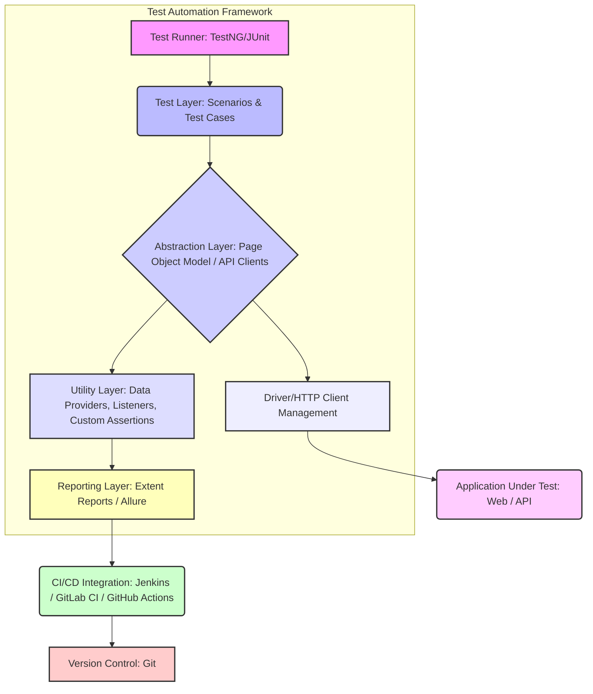

# interview-3.6-ac1.md

# Framework Architecture Explanation

## Overview
Understanding and being able to clearly articulate the architecture of your test automation framework is a critical skill for any senior SDET. Interviewers often use this as a gauge for your depth of knowledge, problem-solving abilities, and how well you can design scalable and maintainable solutions. This explanation will cover the common components and data flow within a typical framework, emphasizing key design patterns and best practices.

## Detailed Explanation
A well-designed test automation framework typically follows a layered architecture, promoting separation of concerns, reusability, and maintainability. Let's break down the data flow from `Test` -> `Page` -> `Driver`.

### 1. Test Layer (Test Classes)
- **Purpose**: This layer contains the actual test cases. It orchestrates the flow of interactions with the application under test (AUT) by calling methods from the Page Object Model (POM) layer. Tests should be highly readable, focusing on *what* is being tested rather than *how*.
- **Key Characteristics**:
    - Uses a testing framework (e.g., TestNG, JUnit) for test annotations, assertions, and reporting.
    - Minimal logic; primarily calls Page Object methods.
    - Data-driven testing often originates here, providing test data to page objects.
- **Data Flow**: Initiates actions by calling methods on Page Objects, passing necessary test data. Receives results (e.g., boolean, specific values) back from Page Objects to perform assertions.

### 2. Page Layer (Page Object Model - POM)
- **Purpose**: The POM layer encapsulates the UI elements and interactions of a specific page or component of the AUT. Each page/component has its own class, and methods within these classes represent user actions or verification points on that page. This abstraction shields the tests from UI changes.
- **Key Characteristics**:
    - Locators (e.g., XPath, CSS selectors, IDs) are defined within the page classes.
    - Methods perform actions (e.g., `login(username, password)`, `addToCart()`) or return state (e.g., `isLoggedIn()`, `getProductPrice()`).
    - Does *not* contain assertions; its role is to interact and return data/state.
- **Data Flow**: Receives commands and data from the Test Layer. Translates these into interactions with web elements using the Driver Layer. Returns results of these interactions or the state of UI elements back to the Test Layer.

### 3. Driver Layer (WebDriver/Browser Interaction)
- **Purpose**: This is the lowest layer, responsible for direct interaction with the web browser or application. It abstracts away the complexities of WebDriver (or Playwright, Appium, etc.) initialization, element finding, and basic actions.
- **Key Characteristics**:
    - Manages WebDriver instances (e.g., ChromeDriver, FirefoxDriver).
    - Contains utility methods for common browser actions (e.g., `findElement`, `click`, `sendKeys`, `waitForElement`).
    - Often includes implicit/explicit waits and screenshot capabilities.
    - Handles browser-specific configurations and capabilities.
- **Data Flow**: Receives instructions from the Page Layer (e.g., "click on element X", "type 'text' into element Y"). Executes these commands via the underlying WebDriver API. Returns success/failure of the action or the requested element's properties/state back to the Page Layer.

### Architecture Diagram

```
+-------------------+      +-------------------+      +-------------------+
|     Test Layer    |<---->|    Page Layer     |<---->|    Driver Layer   |
| (e.g., TestNG/JUnit)|      | (Page Object Model)|      | (WebDriver/Browser)|
+-------------------+      +-------------------+      +-------------------+
        ^                            ^                            ^
        |                            |                            |
        |  Calls Page Object Methods |  Uses Driver for UI Ops    |  Interacts with Browser
        |  (e.g., login, navigate)   |  (e.g., findElement, click)|  (e.g., Selenium API)
        v                            v                            v
```

## Code Implementation
Here's a simplified Java example illustrating the data flow:

```java
// --- Driver Layer (e.g., WebDriverManager & DriverSetup class) ---
// This class manages WebDriver instantiation and basic interactions.
public class DriverSetup {
    private static WebDriver driver;

    public static void initializeDriver(String browser) {
        if (driver == null) {
            if ("chrome".equalsIgnoreCase(browser)) {
                WebDriverManager.chromedriver().setup();
                driver = new ChromeDriver();
            } else if ("firefox".equalsIgnoreCase(browser)) {
                WebDriverManager.firefoxdriver().setup();
                driver = new FirefoxDriver();
            }
            driver.manage().window().maximize();
            driver.manage().timeouts().implicitlyWait(10, TimeUnit.SECONDS); // Example wait
        }
    }

    public static WebDriver getDriver() {
        return driver;
    }

    public static void quitDriver() {
        if (driver != null) {
            driver.quit();
            driver = null;
        }
    }

    public static void navigateTo(String url) {
        getDriver().get(url);
    }

    public static WebElement findElement(By locator) {
        // Here you might add explicit waits for robustness
        return getDriver().findElement(locator);
    }
}

// --- Page Layer (e.g., LoginPage) ---
// Represents the Login Page and its interactions.
public class LoginPage {
    // Locators
    private final By usernameField = By.id("username");
    private final By passwordField = By.id("password");
    private final By loginButton = By.id("loginButton");
    private final By errorMessage = By.cssSelector(".error-message");

    public LoginPage(WebDriver driver) {
        // WebDriver is passed, though in a real framework, DriverSetup would provide it.
        // For simplicity in this example, we directly use it.
        // In a more advanced framework, the PageObject itself might not hold the driver.
        // It would call DriverSetup's methods directly.
    }

    public void enterUsername(String username) {
        DriverSetup.findElement(usernameField).sendKeys(username);
    }

    public void enterPassword(String password) {
        DriverSetup.findElement(passwordField).sendKeys(password);
    }

    public void clickLogin() {
        DriverSetup.findElement(loginButton).click();
    }

    public void login(String username, String password) {
        enterUsername(username);
        enterPassword(password);
        clickLogin();
    }

    public boolean isErrorMessageDisplayed() {
        return DriverSetup.findElement(errorMessage).isDisplayed();
    }

    public String getErrorMessageText() {
        return DriverSetup.findElement(errorMessage).getText();
    }
}

// --- Test Layer (e.g., LoginTest) ---
// Contains the test cases for the Login Page.
@Test
public class LoginTest {
    private LoginPage loginPage;

    @BeforeClass
    public void setup() {
        DriverSetup.initializeDriver("chrome"); // Initialize the driver
        loginPage = new LoginPage(DriverSetup.getDriver());
        DriverSetup.navigateTo("http://your-app-url.com/login"); // Navigate to login page
    }

    @Test
    public void testSuccessfulLogin() {
        loginPage.login("validUser", "validPassword");
        // Assertions for successful login, e.g., verify welcome message or URL change
        Assert.assertTrue(DriverSetup.getDriver().getCurrentUrl().contains("dashboard"), "Login was not successful.");
    }

    @Test
    public void testInvalidLogin() {
        loginPage.login("invalidUser", "wrongPassword");
        // Assertions for invalid login, e.g., verify error message
        Assert.assertTrue(loginPage.isErrorMessageDisplayed(), "Error message was not displayed for invalid login.");
        Assert.assertEquals(loginPage.getErrorMessageText(), "Invalid credentials", "Incorrect error message.");
    }

    @AfterClass
    public void tearDown() {
        DriverSetup.quitDriver(); // Quit the driver
    }
}
```

## Best Practices
- **Single Responsibility Principle (SRP):** Each layer and class should have one well-defined responsibility. Tests test, Pages interact, Drivers drive.
- **Don't Repeat Yourself (DRY):** Abstract common functionalities into utility classes or base classes (e.g., `BasePage` for common page methods, `DriverSetup` for driver management).
- **Readability:** Tests should read like user stories. Page object methods should clearly describe the action they perform.
- **Robustness (Waits):** Implement explicit waits (`WebDriverWait`) rather than implicit waits or `Thread.sleep()` to handle dynamic page loads and AJAX requests effectively.
- **Configuration Management:** Externalize configurations (URLs, browser types, test data) to properties files or environment variables.
- **Reporting Integration:** Integrate with robust reporting tools (e.g., Extent Reports, Allure) to provide clear test execution results.

## Common Pitfalls
- **"Fat" Page Objects:** Page objects becoming too large and complex, handling too many responsibilities (e.g., assertions, setup/teardown logic).
    - **How to avoid:** Keep page objects focused on element interaction and state retrieval. Delegate assertions to the Test Layer.
- **Mixing Assertions in Page Objects:** Page objects should *not* contain assertions. Their role is to provide an API for interacting with the page.
    - **How to avoid:** All assertions should reside in the Test Layer.
- **Direct WebDriver Usage in Tests:** Tests directly interacting with `WebDriver` (e.g., `driver.findElement(...)`) defeats the purpose of the Page Object Model, making tests fragile to UI changes.
    - **How to avoid:** All UI interactions must go through Page Object methods.
- **Poor Locator Strategy:** Relying solely on fragile locators (e.g., absolute XPaths, dynamically generated IDs) leads to brittle tests.
    - **How to avoid:** Prioritize stable locators like `id`, `name`, `CSS selectors`, and custom `data-*` attributes.
- **Ignoring Setup/Teardown:** Failing to properly initialize and quit WebDriver instances can lead to resource leaks and flaky tests.
    - **How to avoid:** Always use `@Before` / `@BeforeClass` and `@After` / `@AfterClass` (TestNG/JUnit) to manage driver lifecycle.

## Interview Questions & Answers
1. Q: Explain the Page Object Model (POM) and its benefits.
   A: POM is a design pattern in test automation where each web page in the application has a corresponding page class. This class contains the web elements (locators) and methods that represent user interactions on that page. Its benefits include:
      - **Maintainability:** If the UI changes, only the page object needs to be updated, not every test case using that element.
      - **Reusability:** Page object methods can be reused across multiple test cases.
      - **Readability:** Tests become more readable as they interact with high-level methods (e.g., `loginPage.login(...)`) rather than low-level WebDriver commands.
      - **Reduced Duplication:** Avoids repeating locator definitions and interaction logic.

2. Q: How do you ensure your framework is scalable and maintainable?
   A: By adhering to design principles like SRP and DRY, employing a layered architecture (Test, Page, Driver), using robust locator strategies, implementing proper waits, externalizing configurations, and integrating with CI/CD for early feedback. Modularization, clear naming conventions, and comprehensive documentation also play a crucial role.

3. Q: Describe the data flow from Test -> Page -> Driver in your framework.
   A: The **Test Layer** initiates actions by calling high-level methods on **Page Objects**, potentially passing test data. The **Page Layer** then translates these calls into specific UI interactions, using element locators defined within the page object and delegating the actual browser manipulation to the **Driver Layer**. The **Driver Layer** (using WebDriver or similar API) executes these low-level commands against the browser. Any results or updated states are then passed back up the chain: from Driver to Page, and then from Page to Test for assertions.

## Hands-on Exercise
**Scenario:** Implement a simple "To-Do List" application automation.
1. **Application:** Use a publicly available To-Do app or a simple one you create (e.g., HTML with input field and add button).
2. **Task:**
   - Create a `DriverSetup` class to manage Chrome WebDriver.
   - Create a `TodoPage` class with locators for the input field, add button, and the list of to-do items. Implement methods like `addTodoItem(String itemText)`, `getTodoItems()`, `isTodoItemPresent(String itemText)`.
   - Create a `TodoTest` class with TestNG annotations (`@BeforeClass`, `@AfterClass`, `@Test`).
   - Write a test case `testAddSingleTodoItem` that adds a single item and verifies its presence.
   - Write a test case `testAddMultipleTodoItems` that adds several items and verifies all are present.

## Additional Resources
- **Selenium WebDriver Documentation:** [https://www.selenium.dev/documentation/en/](https://www.selenium.dev/documentation/en/)
- **TestNG Official Website:** [https://testng.org/doc/index.html](https://testng.org/doc/index.html)
- **Page Object Model by Martin Fowler:** [https://martinfowler.com/bliki/PageObject.html](https://martinfowler.com/bliki/PageObject.html)
- **WebDriverManager by Boni Garcia:** [https://bonigarcia.dev/webdrivermanager/](https://bonigarcia.dev/webdrivermanager/)
---
# interview-3.6-ac2.md

# Framework Components and Their Responsibilities

## Overview
In modern software development, especially in test automation, a well-structured framework is crucial for efficiency, scalability, and maintainability. An automation framework isn't just a collection of scripts; it's an integrated system of tools, libraries, practices, and guidelines that collectively streamline the test automation process. Understanding its components and their interplay is fundamental for any SDET to design, implement, and maintain robust automation solutions.

This document details common components found in a Java-based Selenium/TestNG test automation framework, their specific responsibilities, and the rationale behind choosing them.

## Detailed Explanation

A typical Java-based Selenium/TestNG test automation framework often comprises several key components, each serving a distinct purpose:

1.  **Programming Language (e.g., Java):**
    *   **Role:** The core language for writing test scripts, automation logic, utility functions, and framework components.
    *   **Why Chosen:** Java is widely adopted in enterprise environments, boasts a rich ecosystem of libraries and tools, strong community support, excellent IDEs, and platform independence. Its object-oriented nature facilitates modular and reusable code.

2.  **Build Automation Tool (e.g., Maven/Gradle):**
    *   **Role:** Manages project dependencies, compiles code, runs tests, packages artifacts, and generally automates the build lifecycle.
    *   **Why Chosen:** Maven (or Gradle) simplifies dependency management (transitive dependencies), provides a standardized project structure, and offers a vast plugin ecosystem for various tasks like reporting, code analysis, and integration with CI/CD. This ensures consistent builds across different environments.

3.  **Test Automation Library/API (e.g., Selenium WebDriver):**
    *   **Role:** Provides APIs to interact with web browsers programmatically, simulating user actions (clicks, typing, navigation, assertions).
    *   **Why Chosen:** Selenium WebDriver is the de-facto open-source standard for web UI automation. It supports multiple browsers, programming languages, and operating systems, offering great flexibility and a large community for support.

4.  **Test Framework (e.g., TestNG/JUnit):**
    *   **Role:** Provides annotations for structuring tests, managing test execution flow, grouping tests, parameterizing tests, and reporting test results.
    *   **Why Chosen:** TestNG (Next Generation) offers powerful features over JUnit, such as advanced test configuration (before/after methods at different scopes), dependency management between tests, parallel test execution, and comprehensive reporting capabilities. It's highly flexible for complex test suites.

5.  **Page Object Model (POM) Implementation:**
    *   **Role:** An architectural design pattern where web pages are represented as classes, with elements and interactions defined as methods within these classes. It separates UI locators and interactions from test logic.
    *   **Why Chosen:** POM enhances test maintainability by reducing code duplication (if UI changes, only the Page Object needs updating), improves readability, and makes tests more robust against UI changes.

6.  **Reporting Library (e.g., ExtentReports, Allure, TestNG's default reports):**
    *   **Role:** Generates human-readable test execution reports, often with detailed steps, screenshots, and pass/fail statistics.
    *   **Why Chosen:** Clear and comprehensive reports are vital for understanding test results, identifying failures quickly, and communicating test status to stakeholders. Tools like ExtentReports offer rich visualizations and easy integration.

7.  **Logging Framework (e.g., Log4j2, SLF4j + Logback):**
    *   **Role:** Provides a mechanism to record events, debugging information, and errors during test execution.
    *   **Why Chosen:** Effective logging is critical for debugging failures, tracing test execution flow, and monitoring automation health. These frameworks offer configurable logging levels and output destinations.

8.  **Configuration Management (e.g., `config.properties`, YAML files, environment variables):**
    *   **Role:** Externalizes test data, environment-specific parameters (URLs, credentials), and framework settings from the code.
    *   **Why Chosen:** Separating configuration from code allows easy switching between environments (dev, QA, prod) without code changes, enhances security (credentials not hardcoded), and makes the framework more flexible.

9.  **Data Management (e.g., Excel, CSV, JSON, Databases):**
    *   **Role:** Provides external sources for test data, allowing tests to be run with various inputs.
    *   **Why Chosen:** Data-driven testing is essential for covering a wide range of scenarios with a single test script. Externalizing data makes tests more flexible and easier to manage.

10. **Version Control System (e.g., Git):**
    *   **Role:** Manages changes to the codebase, enables collaboration among team members, tracks history, and facilitates branching/merging.
    *   **Why Chosen:** Git is the industry standard for source code management, essential for team collaboration, code reviews, and maintaining a robust development workflow.

11. **Continuous Integration/Continuous Delivery (CI/CD) Tool (e.g., Jenkins, GitLab CI, GitHub Actions):**
    *   **Role:** Automates the build, test, and deployment process, triggering builds on code commits and running tests automatically.
    *   **Why Chosen:** CI/CD ensures early detection of defects, provides fast feedback on code quality, and automates repetitive tasks, leading to faster and more reliable software delivery.

## Code Implementation

Below is a simplified example demonstrating how some of these components might interact in a Java-based Selenium TestNG project. This example focuses on basic setup, Page Object Model, and TestNG test.

**Project Structure (simplified):**

```
src/
└── main/
    └── java/
        └── com/
            └── example/
                └── pages/
                    └── LoginPage.java
                └── util/
                    └── WebDriverManager.java
└── test/
    └── java/
        └── com/
            └── example/
                └── tests/
                    └── LoginTest.java
pom.xml
config.properties
```

**`pom.xml` (Maven Dependencies):**
```xml
<?xml version="1.0" encoding="UTF-8"?>
<project xmlns="http://maven.apache.org/POM/4.0.0"
         xmlns:xsi="http://www.w3.org/2001/XMLSchema-instance"
         xsi:schemaLocation="http://maven.apache.org/POM/4.0.0 http://maven.apache.org/xsd/maven-4.0.0.xsd">
    <modelVersion>4.0.0</modelVersion>

    <groupId>com.example</groupId>
    <artifactId>automation-framework</artifactId>
    <version>1.0-SNAPSHOT</version>

    <properties>
        <maven.compiler.source>11</maven.compiler.source>
        <maven.compiler.target>11</maven.compiler.target>
        <selenium.version>4.17.0</selenium.version>
        <testng.version>7.8.0</testng.version>
        <webdrivermanager.version>5.6.3</webdrivermanager.version>
        <log4j.version>2.22.1</log4j.version>
    </properties>

    <dependencies>
        <!-- Selenium WebDriver -->
        <dependency>
            <groupId>org.seleniumhq.selenium</groupId>
            <artifactId>selenium-java</artifactId>
            <version>${selenium.version}</version>
        </dependency>
        <!-- TestNG -->
        <dependency>
            <groupId>org.testng</groupId>
            <artifactId>testng</artifactId>
            <version>${testng.version}</version>
            <scope>test</scope>
        </dependency>
        <!-- WebDriverManager for automatic browser driver management -->
        <dependency>
            <groupId>io.github.bonigarcia</groupId>
            <artifactId>webdrivermanager</artifactId>
            <version>${webdrivermanager.version}</version>
        </dependency>
        <!-- Apache Log4j2 for logging -->
        <dependency>
            <groupId>org.apache.logging.log4j</groupId>
            <artifactId>log4j-api</artifactId>
            <version>${log4j.version}</version>
        </dependency>
        <dependency>
            <groupId>org.apache.logging.log4j</groupId>
            <artifactId>log4j-core</artifactId>
            <version>${log4j.version}</version>
        </dependency>
    </dependencies>

    <build>
        <plugins>
            <!-- Maven Surefire Plugin for running tests -->
            <plugin>
                <groupId>org.apache.maven.plugins</groupId>
                <artifactId>maven-surefire-plugin</artifactId>
                <version>3.2.5</version>
                <configuration>
                    <suiteXmlFiles>
                        <suiteXmlFile>testng.xml</suiteXmlFile>
                    </suiteXmlFiles>
                </configuration>
            </plugin>
        </plugins>
    </build>

</project>
```

**`config.properties` (Configuration Management):**
```properties
base.url=https://www.saucedemo.com/
browser=chrome
username=standard_user
password=secret_sauce
```

**`WebDriverManager.java` (Utility for WebDriver setup):**
```java
package com.example.util;

import io.github.bonigarcia.wdm.WebDriverManager;
import org.openqa.selenium.WebDriver;
import org.openqa.selenium.chrome.ChromeDriver;
import org.openqa.selenium.firefox.FirefoxDriver;
import org.apache.logging.log4j.LogManager;
import org.apache.logging.log4j.Logger;

import java.io.FileInputStream;
import java.io.IOException;
import java.util.Properties;

public class WebDriverManager {

    private static final Logger logger = LogManager.getLogger(WebDriverManager.class);
    private static WebDriver driver;
    private static Properties properties;

    static {
        properties = new Properties();
        try {
            // Load configuration from config.properties
            properties.load(new FileInputStream("config.properties"));
            logger.info("Loaded config.properties successfully.");
        } catch (IOException e) {
            logger.error("Error loading config.properties: " + e.getMessage());
            throw new RuntimeException("Failed to load config.properties", e);
        }
    }

    public static WebDriver getDriver() {
        if (driver == null) {
            initializeDriver();
        }
        return driver;
    }

    private static void initializeDriver() {
        String browser = properties.getProperty("browser", "chrome").toLowerCase(); // Default to chrome if not specified
        logger.info("Initializing WebDriver for browser: " + browser);

        switch (browser) {
            case "chrome":
                WebDriverManager.chromedriver().setup();
                driver = new ChromeDriver();
                break;
            case "firefox":
                WebDriverManager.firefoxdriver().setup();
                driver = new FirefoxDriver();
                break;
            // Add more browsers as needed
            default:
                logger.error("Unsupported browser specified in config.properties: " + browser);
                throw new IllegalArgumentException("Unsupported browser: " + browser);
        }
        driver.manage().window().maximize();
        logger.info(browser + " WebDriver initialized and maximized.");
    }

    public static String getProperty(String key) {
        return properties.getProperty(key);
    }

    public static void quitDriver() {
        if (driver != null) {
            logger.info("Quitting WebDriver.");
            driver.quit();
            driver = null;
        }
    }
}
```

**`LoginPage.java` (Page Object Model):**
```java
package com.example.pages;

import org.openqa.selenium.By;
import org.openqa.selenium.WebDriver;
import org.openqa.selenium.WebElement;
import org.openqa.selenium.support.ui.ExpectedConditions;
import org.openqa.selenium.support.ui.WebDriverWait;
import java.time.Duration;

public class LoginPage {
    private WebDriver driver;
    private WebDriverWait wait;

    // Locators
    private By usernameField = By.id("user-name");
    private By passwordField = By.id("password");
    private By loginButton = By.id("login-button");
    private By errorContainer = By.cssSelector("[data-test='error']");

    public LoginPage(WebDriver driver) {
        this.driver = driver;
        this.wait = new WebDriverWait(driver, Duration.ofSeconds(10));
    }

    public void navigateToLoginPage(String url) {
        driver.get(url);
        wait.until(ExpectedConditions.visibilityOfElementLocated(loginButton));
    }

    public void enterUsername(String username) {
        driver.findElement(usernameField).sendKeys(username);
    }

    public void enterPassword(String password) {
        driver.findElement(passwordField).sendKeys(password);
    }

    public void clickLoginButton() {
        driver.findElement(loginButton).click();
    }

    public String getErrorMessage() {
        WebElement errorElement = wait.until(ExpectedConditions.visibilityOfElementLocated(errorContainer));
        return errorElement.getText();
    }

    public boolean isErrorMessageDisplayed() {
        return driver.findElements(errorContainer).size() > 0;
    }
}
```

**`LoginTest.java` (TestNG Test Class):**
```java
package com.example.tests;

import com.example.pages.LoginPage;
import com.example.util.WebDriverManager;
import org.openqa.selenium.WebDriver;
import org.testng.Assert;
import org.testng.annotations.*;
import org.apache.logging.log4j.LogManager;
import org.apache.logging.log4j.Logger;

public class LoginTest {

    private static final Logger logger = LogManager.getLogger(LoginTest.class);
    private WebDriver driver;
    private LoginPage loginPage;

    @BeforeMethod
    public void setup() {
        logger.info("Starting test setup...");
        driver = WebDriverManager.getDriver();
        loginPage = new LoginPage(driver);
        loginPage.navigateToLoginPage(WebDriverManager.getProperty("base.url"));
        logger.info("Navigated to login page: " + WebDriverManager.getProperty("base.url"));
    }

    @Test(description = "Verify successful login with valid credentials")
    public void testSuccessfulLogin() {
        logger.info("Executing test: testSuccessfulLogin");
        loginPage.enterUsername(WebDriverManager.getProperty("username"));
        loginPage.enterPassword(WebDriverManager.getProperty("password"));
        loginPage.clickLoginButton();
        // Assert successful login (e.g., check for inventory page URL or element)
        Assert.assertTrue(driver.getCurrentUrl().contains("inventory.html"), "Expected to be on inventory page after successful login.");
        logger.info("Successful login verified.");
    }

    @Test(description = "Verify login with invalid credentials")
    public void testInvalidLogin() {
        logger.info("Executing test: testInvalidLogin");
        loginPage.enterUsername("invalid_user");
        loginPage.enterPassword("wrong_password");
        loginPage.clickLoginButton();
        Assert.assertTrue(loginPage.isErrorMessageDisplayed(), "Error message should be displayed for invalid login.");
        String expectedErrorMessage = "Epic sadface: Username and password do not match any user in this service";
        Assert.assertEquals(loginPage.getErrorMessage(), expectedErrorMessage, "Incorrect error message displayed.");
        logger.info("Invalid login error message verified.");
    }

    @AfterMethod
    public void teardown() {
        logger.info("Ending test teardown...");
        WebDriverManager.quitDriver();
        logger.info("WebDriver quit.");
    }
}
```

**`testng.xml` (TestNG Suite Configuration):**
```xml
<!DOCTYPE suite SYSTEM "https://testng.org/testng-1.0.dtd" >
<suite name="SauceDemo Automation Suite" verbose="1" parallel="methods" thread-count="2">
    <test name="Login Functionality Tests">
        <classes>
            <class name="com.example.tests.LoginTest" />
        </classes>
    </test>
</suite>
```

**`log4j2.xml` (Logging Configuration - placed in `src/main/resources`):**
```xml
<?xml version="1.0" encoding="UTF-8"?>
<Configuration status="WARN">
    <Appenders>
        <Console name="Console" target="SYSTEM_OUT">
            <PatternLayout pattern="%d{HH:mm:ss.SSS} [%t] %-5level %logger{36} - %msg%n"/>
        </Console>
        <File name="File" fileName="logs/automation.log">
            <PatternLayout pattern="%d{yyyy-MM-dd HH:mm:ss.SSS} [%t] %-5level %logger{36} - %msg%n"/>
        </File>
    </Appenders>
    <Loggers>
        <Root level="info">
            <AppenderRef ref="Console"/>
            <AppenderRef ref="File"/>
        </Root>
    </Loggers>
</Configuration>
```

## Best Practices
-   **Modularity:** Break down the framework into small, independent modules.
-   **Reusability:** Design components and utility functions to be reusable across different tests and projects.
-   **Maintainability:** Keep locators and test data externalized and organized (e.g., using POM, config files).
-   **Readability:** Write clean, self-documenting code. Use meaningful names for variables, methods, and classes.
-   **Scalability:** Design the framework to easily accommodate new tests, features, and parallel execution.
-   **Error Handling:** Implement robust error handling and logging to diagnose issues quickly.
-   **Reporting:** Ensure comprehensive and clear reports are generated for every test run.
-   **Version Control:** Always use a VCS (like Git) for collaborative development and change tracking.
-   **CI/CD Integration:** Integrate the framework with CI/CD pipelines for automated execution and continuous feedback.

## Common Pitfalls
-   **Hardcoded Values:** Hardcoding URLs, credentials, or test data directly in test scripts makes them brittle and difficult to maintain. *Avoid by using configuration files and data providers.*
-   **Spaghetti Code:** Mixing test logic, locator strategies, and utility functions in a single script leads to unmanageable code. *Avoid by adopting design patterns like POM.*
-   **Poor Locator Strategy:** Using fragile locators (e.g., absolute XPath) that break with minor UI changes. *Avoid by using robust locators (ID, name, CSS selectors) and maintaining them centrally in POM.*
-   **Ignoring Error Handling:** Not handling exceptions can lead to abrupt test failures without clear diagnostics. *Implement try-catch blocks and comprehensive logging.*
-   **Lack of Reporting:** Without proper reports, it's hard to understand test execution results and identify trends. *Integrate a powerful reporting library.*
-   **Not Using Version Control:** Leads to collaboration issues, loss of changes, and inability to revert to stable versions. *Always use Git.*
-   **Skipping Code Reviews:** Lack of peer review can lead to inconsistent code quality and missed defects in the framework itself. *Regular code reviews are essential.*

## Interview Questions & Answers

1.  **Q: What is a test automation framework, and why is it important?**
    *   **A:** A test automation framework is a set of guidelines, protocols, tools, and best practices that facilitate efficient, consistent, and scalable test automation. It's important because it promotes code reusability, reduces maintenance efforts, improves test reliability, enhances team collaboration, and ultimately accelerates the software delivery lifecycle.

2.  **Q: Explain the Page Object Model (POM) and its benefits.**
    *   **A:** The Page Object Model is a design pattern in test automation where each web page or significant part of a page in the application under test is represented as a class. This class contains web elements (locators) and methods that interact with those elements. Its benefits include:
        *   **Maintainability:** If the UI changes, updates are confined to the Page Object class, not spread across multiple test scripts.
        *   **Readability:** Tests become cleaner and more readable as they interact with Page Object methods rather than direct element locators.
        *   **Reusability:** Page Object methods can be reused across different test cases.
        *   **Reduced Duplication:** Prevents redundant definition of locators.

3.  **Q: How do you manage test data in your framework? Why is externalizing data important?**
    *   **A:** Test data can be managed using various external sources like Excel sheets, CSV files, JSON/YAML files, or databases. Externalizing data is crucial because it enables data-driven testing (running the same test logic with different inputs), improves test coverage, makes tests more flexible (easy to modify data without code changes), and prevents hardcoding sensitive information.

4.  **Q: What role do build tools like Maven or Gradle play in your automation framework?**
    *   **A:** Build tools like Maven or Gradle are essential for managing project dependencies, automating the build process (compiling code, running tests), and packaging the application. They provide a standardized project structure, simplify adding external libraries (Selenium, TestNG), and integrate seamlessly with CI/CD pipelines, ensuring consistent and reproducible builds.

5.  **Q: Describe how you would integrate your automation framework with a CI/CD pipeline.**
    *   **A:** Integration involves configuring the CI/CD tool (e.g., Jenkins, GitLab CI) to:
        1.  **Trigger:** Automatically trigger a build and test execution upon code commits to the version control system.
        2.  **Checkout:** Fetch the latest code from the repository.
        3.  **Build:** Execute the build command (e.g., `mvn clean install` or `gradle build`) to compile code and resolve dependencies.
        4.  **Test:** Run the automation test suite (e.g., `mvn test` or `gradle test`).
        5.  **Report:** Publish test reports (e.g., TestNG, ExtentReports, Allure) for easy access and analysis.
        6.  **Notify:** Send notifications (email, Slack) about build and test status.
        This ensures continuous feedback on code quality and early defect detection.

## Hands-on Exercise
**Objective:** Enhance the provided framework by adding a simple Data-Driven Test (DDT) using TestNG's `@DataProvider` annotation.

1.  **Create `testdata.json`:** In your project root, create a file named `testdata.json` with the following content (you can add more invalid credentials):
    ```json
    [
      {
        "username": "locked_out_user",
        "password": "secret_sauce",
        "expectedError": "Epic sadface: Sorry, this user has been locked out."
      },
      {
        "username": "performance_glitch_user",
        "password": "secret_sauce",
        "expectedError": "Epic sadface: Username and password do not match any user in this service"
      }
    ]
    ```
2.  **Modify `WebDriverManager.java`:** Add a method to read JSON data. You'll need to add a dependency for JSON parsing (e.g., `jackson-databind`) to your `pom.xml`.
    *   **Add Jackson Dependency to `pom.xml`:**
        ```xml
        <dependency>
            <groupId>com.fasterxml.jackson.core</groupId>
            <artifactId>jackson-databind</artifactId>
            <version>2.16.1</version>
        </dependency>
        ```
    *   **Add `getJsonData` method to `WebDriverManager.java`:**
        ```java
        import com.fasterxml.jackson.databind.JsonNode;
        import com.fasterxml.jackson.databind.ObjectMapper;
        import java.io.File;
        // ... (other imports)

        public class WebDriverManager {
            // ... (existing code)

            public static Object[][] getJsonData(String filePath) {
                ObjectMapper mapper = new ObjectMapper();
                try {
                    JsonNode rootNode = mapper.readTree(new File(filePath));
                    if (rootNode.isArray()) {
                        Object[][] data = new Object[rootNode.size()][];
                        for (int i = 0; i < rootNode.size(); i++) {
                            JsonNode node = rootNode.get(i);
                            // Assuming each entry has username, password, expectedError
                            data[i] = new Object[]{
                                    node.get("username").asText(),
                                    node.get("password").asText(),
                                    node.get("expectedError").asText()
                            };
                        }
                        return data;
                    }
                } catch (IOException e) {
                    logger.error("Error reading JSON data from " + filePath + ": " + e.getMessage());
                }
                return new Object[0][0];
            }
        }
        ```
3.  **Modify `LoginTest.java`:** Add a data provider and a new test method.
    ```java
    // ... (existing imports)

    public class LoginTest {
        // ... (existing code)

        @DataProvider(name = "invalidLoginData")
        public Object[][] getInvalidLoginData() {
            return WebDriverManager.getJsonData("testdata.json");
        }

        @Test(dataProvider = "invalidLoginData", description = "Verify login with various invalid credentials from JSON")
        public void testInvalidLoginWithDataProvider(String username, String password, String expectedError) {
            logger.info("Executing data-driven test for user: " + username);
            loginPage.enterUsername(username);
            loginPage.enterPassword(password);
            loginPage.clickLoginButton();
            Assert.assertTrue(loginPage.isErrorMessageDisplayed(), "Error message should be displayed for invalid login.");
            Assert.assertEquals(loginPage.getErrorMessage(), expectedError, "Incorrect error message displayed for user: " + username);
            logger.info("Invalid login scenario for user " + username + " verified.");
        }
        // ... (existing @AfterMethod)
    }
    ```
4.  **Run Tests:** Execute `mvn clean test` from your terminal. Observe how the new test method runs multiple times with different data from `testdata.json`.

## Additional Resources
-   **Selenium WebDriver Documentation:** [https://www.selenium.dev/documentation/](https://www.selenium.dev/documentation/)
-   **TestNG Documentation:** [https://testng.org/doc/index.html](https://testng.org/doc/index.html)
-   **Maven Official Website:** [https://maven.apache.org/](https://maven.apache.org/)
-   **Page Object Model Explained:** [https://www.toolsqa.com/selenium-webdriver/page-object-model/](https://www.toolsqa.com/selenium-webdriver/page-object-model/)
-   **Log4j2 Documentation:** [https://logging.apache.org/log4j/2.x/manual/index.html](https://logging.apache.org/log4j/2.x/manual/index.html)
-   **WebDriverManager GitHub:** [https://github.com/bonigarcia/webdrivermanager](https://github.com/bonigarcia/webdrivermanager)
---
# interview-3.6-ac3.md

# Design Pattern Choices and Alternatives in Test Automation Frameworks

## Overview
In the realm of test automation, selecting appropriate design patterns is crucial for building robust, maintainable, and scalable frameworks. This document explores common design patterns used in test automation, focusing on the Page Object Model (POM) and Singleton patterns, along with their justifications, potential issues, and alternatives. Understanding these choices is vital for any SDET to effectively design and discuss framework architecture.

## Detailed Explanation

### 1. Page Object Model (POM)
The Page Object Model is a design pattern used in test automation to create an object repository for UI elements within web or mobile applications. Each 'Page Object' represents a single web page or a significant part of a page. The methods within these page objects interact with the UI elements and encapsulate the logic required to perform actions on those elements.

#### Justification for selecting POM:
- **Maintainability**: When UI changes occur (e.g., an element's locator changes), only the corresponding Page Object needs to be updated, not every test script that uses that element. This significantly reduces maintenance effort.
- **Readability**: Test scripts become cleaner and more readable as they interact with Page Object methods, which are more business-readable (e.g., `loginPage.loginAs(username, password)`) rather than direct locator interactions (`driver.findElement(By.id("username")).sendKeys(username)`).
- **Reusability**: Page Object methods can be reused across multiple test cases, promoting the DRY (Don't Repeat Yourself) principle.
- **Abstraction**: It separates the UI layer from the test logic layer, allowing testers to focus on test scenarios rather than intricate UI details.

### 2. Singleton Pattern
The Singleton pattern is a creational design pattern that ensures a class has only one instance and provides a global point of access to that instance. In test automation, it's often considered for managing resources like WebDriver instances or configuration objects.

#### Where Singleton was used:
The Singleton pattern is typically used for managing the WebDriver instance. The goal is to ensure that all test classes within a test run use the same WebDriver instance or a controlled pool of instances, especially in scenarios where a new browser instance for every test method would be inefficient or problematic.

**Example Use Case (simplified Java):**
```java
public class WebDriverManager {
    private static WebDriver driver;
    private static ThreadLocal<WebDriver> threadDriver = new ThreadLocal<>(); // For parallel execution

    private WebDriverManager() {
        // Private constructor to prevent instantiation
    }

    public static WebDriver getDriver() {
        if (threadDriver.get() == null) { // Check for current thread's driver
            // Initialize driver if not already initialized for this thread
            // Example: ChromeDriver
            // WebDriverManager.chromedriver().setup(); // Using WebDriverManager library
            driver = new ChromeDriver();
            threadDriver.set(driver);
        }
        return threadDriver.get();
    }

    public static void quitDriver() {
        if (threadDriver.get() != null) {
            threadDriver.get().quit();
            threadDriver.remove();
        }
    }
}
```

#### Potential Thread-Safety Issues with Singleton:
If the Singleton pattern is implemented naively (e.g., a single static `WebDriver` instance without `ThreadLocal`), it can lead to severe thread-safety issues, especially in parallel test execution:
- **Race Conditions**: Multiple threads trying to access and modify the same `WebDriver` instance concurrently can lead to unpredictable behavior, element not found errors, or tests interacting with the wrong browser instance.
- **Stale Elements/Session Issues**: Actions from one thread might inadvertently affect the browser state of another thread, leading to stale element exceptions or incorrect test results.
- **Resource Contention**: Without proper management, concurrent threads might compete for the same browser instance, leading to performance degradation or deadlocks.

**Solution for Thread-Safety**: The use of `ThreadLocal` (as shown in the example above) is the standard approach to make Singleton-managed resources thread-safe. `ThreadLocal` provides a way to store data that will be accessible only by a specific thread, ensuring each thread gets its own independent copy of the `WebDriver` instance.

### 3. Patterns Considered but Rejected

#### Factory Method (for WebDriver Initialization)
- **Considered for**: Abstracting the creation of different WebDriver instances (ChromeDriver, FirefoxDriver, EdgeDriver).
- **Rejected because**: While useful for more complex scenarios, for simpler frameworks or those using a library like WebDriverManager (which handles driver binaries), a simpler utility class or configuration-driven approach for driver instantiation was sufficient. Over-engineering with a full Factory pattern might add unnecessary complexity for initial stages. However, for a highly extensible framework supporting many browser types and cloud execution, a Factory is a strong contender.

#### Builder Pattern (for Test Data or Complex Objects)
- **Considered for**: Constructing complex test data objects or configuration objects with many optional parameters, leading to more readable object creation.
- **Rejected because**: For the current scope, test data was relatively straightforward and could be managed effectively using POJOs (Plain Old Java Objects) or utility methods. The overhead of creating dedicated Builder classes for every complex object was deemed excessive for the project's initial phase. Could be reconsidered as data complexity grows.

#### Observer Pattern (for Reporting or Logging)
- **Considered for**: Decoupling the reporting and logging mechanisms from the core test execution logic. When a test event occurs (e.g., test start, test pass, test fail), observers (reporters, loggers) would be notified and react accordingly.
- **Rejected because**: Most modern test frameworks (e.g., TestNG, JUnit) provide their own robust listener interfaces or reporting integrations that fulfill the same purpose without needing a custom Observer implementation. Leveraging built-in features was prioritized over custom solutions to reduce framework code and maintenance.

## Code Implementation

### `LoginPage.java` (Page Object Example)
```java
package pages;

import org.openqa.selenium.By;
import org.openqa.selenium.WebDriver;
import org.openqa.selenium.WebElement;
import org.openqa.selenium.support.ui.ExpectedConditions;
import org.openqa.selenium.support.ui.WebDriverWait;

import java.time.Duration;

public class LoginPage {
    private WebDriver driver;
    private WebDriverWait wait;

    // Locators
    private By usernameField = By.id("username");
    private By passwordField = By.id("password");
    private By loginButton = By.id("loginButton");
    private By errorMessage = By.id("errorMessage");

    public LoginPage(WebDriver driver) {
        this.driver = driver;
        this.wait = new WebDriverWait(driver, Duration.ofSeconds(10));
    }

    public void navigateToLoginPage(String url) {
        driver.get(url);
        wait.until(ExpectedConditions.visibilityOfElementLocated(usernameField));
    }

    public void enterUsername(String username) {
        driver.findElement(usernameField).sendKeys(username);
    }

    public void enterPassword(String password) {
        driver.findElement(passwordField).sendKeys(password);
    }

    public void clickLoginButton() {
        driver.findElement(loginButton).click();
    }

    public String getErrorMessage() {
        WebElement error = wait.until(ExpectedConditions.visibilityOfElementLocated(errorMessage));
        return error.getText();
    }

    // Example of a common action
    public HomePage login(String username, String password) {
        enterUsername(username);
        enterPassword(password);
        clickLoginButton();
        return new HomePage(driver); // Assuming successful login navigates to HomePage
    }

    public boolean isLoginPageDisplayed() {
        return driver.findElement(loginButton).isDisplayed();
    }
}
```

### `WebDriverManager.java` (Thread-Safe Singleton Example)
*(Refer to the example provided in the "Detailed Explanation" section above, as it's a complete code sample. Re-including it here would be redundant.)*

### `LoginTest.java` (Example Test Using POM and WebDriverManager)
```java
package tests;

import org.openqa.selenium.WebDriver;
import org.testng.Assert;
import org.testng.annotations.AfterMethod;
import org.testng.annotations.BeforeMethod;
import org.testng.annotations.Test;
import pages.HomePage;
import pages.LoginPage;
import utils.WebDriverManager; // Assuming WebDriverManager is in a 'utils' package

public class LoginTest {
    private WebDriver driver;
    private String baseUrl = "http://your-app-url.com/login"; // Replace with actual URL

    @BeforeMethod
    public void setup() {
        driver = WebDriverManager.getDriver();
        driver.manage().window().maximize();
    }

    @Test(description = "Verify successful login with valid credentials")
    public void testSuccessfulLogin() {
        LoginPage loginPage = new LoginPage(driver);
        loginPage.navigateToLoginPage(baseUrl);

        HomePage homePage = loginPage.login("validUser", "validPassword");
        Assert.assertTrue(homePage.isHomePageDisplayed(), "Home page should be displayed after successful login");
        Assert.assertEquals(homePage.getWelcomeMessage(), "Welcome, validUser!", "Welcome message is incorrect");
    }

    @Test(description = "Verify error message with invalid credentials")
    public void testInvalidLogin() {
        LoginPage loginPage = new LoginPage(driver);
        loginPage.navigateToLoginPage(baseUrl);

        loginPage.login("invalidUser", "wrongPass");
        Assert.assertTrue(loginPage.getErrorMessage().contains("Invalid credentials"), "Error message for invalid login is incorrect");
        Assert.assertTrue(loginPage.isLoginPageDisplayed(), "Login page should still be displayed after invalid login");
    }

    @AfterMethod
    public void teardown() {
        WebDriverManager.quitDriver();
    }
}
```

## Best Practices
- **Strictly separate concerns**: Ensure Page Objects only interact with UI elements and provide methods for common actions, while test scripts handle test logic and assertions.
- **Locator Strategy**: Use robust and resilient locators (e.g., ID, unique CSS selectors, XPath with care) within Page Objects. Avoid flaky locators.
- **ThreadLocal for WebDriver**: Always use `ThreadLocal` when managing WebDriver instances in a Singleton pattern, especially for parallel execution, to prevent thread-safety issues.
- **Meaningful Method Names**: Name Page Object methods clearly, reflecting the user action they perform (e.g., `loginAs()`, `addToCart()`).
- **Encapsulate synchronization**: Build explicit waits into Page Object methods to ensure elements are ready for interaction.

## Common Pitfalls
- **Anemic Page Objects**: Page Objects that only expose locators and no interaction methods. This defeats the purpose of abstraction and reusability.
  - **How to avoid**: Ensure every Page Object method performs a meaningful action or returns a new Page Object (if it navigates to a new page).
- **Over-reliance on Singleton**: Using Singleton for every object. While useful for WebDriver, overuse can lead to tightly coupled code and make testing harder.
  - **How to avoid**: Apply Singleton judiciously to truly global, singular resources. For other dependencies, consider Dependency Injection.
- **Ignoring Thread-Safety**: Implementing a basic Singleton for WebDriver without `ThreadLocal` in a parallel execution environment.
  - **How to avoid**: Always implement `ThreadLocal` for WebDriver Singletons when parallel execution is a possibility.
- **Flaky tests due to poor synchronization**: Not incorporating sufficient waits in Page Object methods, leading to element not found or stale element exceptions.
  - **How to avoid**: Use `WebDriverWait` with `ExpectedConditions` to wait for elements to be visible, clickable, or present before interacting with them.

## Interview Questions & Answers
1.  **Q: Explain the Page Object Model and its benefits in test automation.**
    **A:** The Page Object Model (POM) is a design pattern where each web page in an application is represented as a class. This class contains web elements (locators) and methods that interact with those elements. Its primary benefits include improved code maintainability (changes to UI only affect one class), enhanced readability of test scripts, and increased reusability of code, as common page actions are encapsulated in one place.

2.  **Q: When would you use the Singleton pattern in an automation framework, and what are its potential drawbacks, especially in parallel execution?**
    **A:** The Singleton pattern is commonly used in automation frameworks for managing a single instance of a WebDriver, a configuration reader, or a report generator. This ensures a global point of access to these resources. In parallel execution, a naive Singleton implementation for WebDriver can lead to severe thread-safety issues like race conditions, tests interfering with each other's browser instances, and unpredictable results. The primary drawback is shared state, which is problematic in concurrent environments.

3.  **Q: How do you address thread-safety issues with a Singleton WebDriver instance during parallel test execution?**
    **A:** To address thread-safety, we use `ThreadLocal`. `ThreadLocal` provides a way to store data that is local to each thread. By wrapping the WebDriver instance in `ThreadLocal`, each thread gets its own independent WebDriver instance, preventing interference and ensuring isolation during parallel execution. When a test thread calls `WebDriverManager.getDriver()`, it retrieves its unique instance.

4.  **Q: What other design patterns did you consider for your framework, and why did you decide against them for your specific project?**
    **A:** We considered the Factory Method for WebDriver initialization, but for our current needs, a simpler utility class sufficed. The Builder pattern was evaluated for complex test data, but our data was manageable with POJOs. The Observer pattern was also considered for reporting, but modern test frameworks provide robust listener interfaces that achieve the same decoupling with less custom code. The decision against them was primarily due to avoiding over-engineering for the project's current complexity, prioritizing simplicity and leveraging built-in framework features where possible.

## Hands-on Exercise
**Objective**: Implement a simple login scenario using Page Object Model and a thread-safe Singleton WebDriver.

1.  **Setup**: Create a new Java project with Selenium WebDriver and TestNG dependencies.
2.  **Page Object**: Create a `LoginPage` class for a fictional login page (e.g., `https://www.saucedemo.com/`). Include locators for username, password, login button, and an error message. Implement methods like `navigateTo()`, `enterUsername()`, `enterPassword()`, `clickLogin()`, and `getErrorMessage()`.
3.  **WebDriver Manager**: Implement the `WebDriverManager` class using the Singleton pattern with `ThreadLocal` to provide and quit WebDriver instances.
4.  **Test Class**: Create a `LoginTest` class with `@BeforeMethod`, `@Test`, and `@AfterMethod` annotations from TestNG.
    -   Write one test case for a successful login.
    -   Write another test case for an unsuccessful login (invalid credentials) and verify the error message.
5.  **Parallel Execution (Optional but recommended)**: Configure TestNG XML to run your test class in parallel (e.g., `parallel="methods"` or `parallel="classes"`) to observe the benefits of `ThreadLocal`.

## Additional Resources
-   **Page Object Model (Selenium Documentation)**: [https://www.selenium.dev/documentation/test_type/page_objects/](https://www.selenium.dev/documentation/test_type/page_objects/)
-   **Singleton Design Pattern (GeeksforGeeks)**: [https://www.geeksforgeeks.org/singleton-class-java/](https://www.geeksforgeeks.org/singleton-class-java/)
-   **ThreadLocal in Java (Baeldung)**: [https://www.baeldung.com/java-threadlocal](https://www.baeldung.com/java-threadlocal)
-   **TestNG Parallel Execution**: [https://testng.org/doc/documentation-main.html#parallel-methods](https://testng.org/doc/documentation-main.html#parallel-methods)
---
# interview-3.6-ac4.md

# Handling Technical Challenges and Implementing Solutions in Test Automation

## Overview
In the dynamic world of software testing, SDETs frequently encounter technical challenges that can impede automation efforts. Interviewers often probe candidates on their problem-solving abilities by asking about past challenges and the solutions they implemented. This section provides a framework for discussing common technical hurdles in test automation, detailing effective solutions, and explaining the positive outcomes. Mastering this topic demonstrates not only technical proficiency but also critical thinking and resilience.

## Detailed Explanation
Successfully navigating technical challenges requires a systematic approach: identifying the problem, analyzing its root cause, designing and implementing a solution, and finally, validating its effectiveness. Here, we'll explore three common technical challenges faced by SDETs in test automation and their respective solutions.

### Challenge 1: Handling Dynamic Web Elements with Unstable Locators

**Description:** Web applications often feature elements whose attributes (like `id` or `class`) change dynamically with each page load or user interaction, making them difficult to locate reliably using static locators. This leads to frequent `NoSuchElementException` or `StaleElementReferenceException` errors, resulting in flaky tests.

**Solution Implemented:**
To address this, we adopted a strategy combining robust locator techniques and explicit waits.

1.  **Chaining Locators:** Instead of relying on a single dynamic attribute, we identified stable parent elements or unique attributes within the element's hierarchy. We then used relative XPath or CSS selectors to locate the dynamic element. For example, `//div[@class='stable-parent']/button[contains(text(),'Dynamic')]` or `div.stable-parent > button:contains('Dynamic')`.
2.  **Attribute-Based Locators:** When partial attribute values were stable (e.g., an `id` that always starts with "product-"), we used `contains()` for XPath or `*=` for CSS selectors.
3.  **Explicit Waits:** We implemented `WebDriverWait` with `ExpectedConditions` to wait for elements to be clickable, visible, or present, rather than relying on arbitrary `Thread.sleep()`. This ensures that the test interacts with the element only when it's ready.

**Outcome/Improvement Gained:**
This approach significantly reduced test flakiness caused by dynamic elements. Test runs became more stable and reliable, reducing maintenance overhead and increasing confidence in the automation suite. The tests now gracefully handle variations in element attributes without breaking.

### Challenge 2: Managing Asynchronous Operations and Synchronization Issues

**Description:** Modern web applications heavily rely on AJAX calls and asynchronous JavaScript execution, where elements might load at different times. If automation scripts try to interact with elements before they are fully loaded or visible, it results in `ElementNotInteractableException` or `TimeoutException`. Traditional implicit waits often aren't sufficient or can lead to excessively long wait times, slowing down test execution.

**Solution Implemented:**
We refined our synchronization strategy using a combination of explicit waits and custom wait conditions.

1.  **Granular Explicit Waits:** Instead of a single, long implicit wait, we introduced explicit waits for specific conditions (e.g., `visibilityOfElementLocated`, `elementToBeClickable`).
2.  **Custom Wait Conditions:** For complex scenarios, like waiting for a specific API call to complete or an attribute to change, we created custom `ExpectedCondition` implementations. For example, waiting for a spinner to disappear or a data table to be populated.
3.  **Page Object Model Enhancement:** Incorporated wait conditions directly into Page Object methods, ensuring that every interaction with an element is preceded by an appropriate wait, making the page objects more robust.

**Code Implementation (Example with Selenium WebDriver in Java):**

```java
import org.openqa.selenium.By;
import org.openqa.selenium.WebDriver;
import org.openqa.selenium.WebElement;
import org.openqa.selenium.chrome.ChromeDriver;
import org.openqa.selenium.support.ui.ExpectedConditions;
import org.openqa.selenium.support.ui.WebDriverWait;

import java.time.Duration;

public class SynchronizationExample {

    public static void main(String[] args) {
        // Setup WebDriver
        System.setProperty("webdriver.chrome.driver", "path/to/chromedriver.exe"); // Replace with actual path
        WebDriver driver = new ChromeDriver();
        driver.manage().window().maximize();

        try {
            driver.get("https://www.example.com/async-page"); // Assume this page has dynamic loading

            // Challenge: Element might not be immediately present or clickable after page load
            // Solution: Use explicit wait for visibility and clickability

            // Example 1: Waiting for a dynamic button to be clickable
            WebDriverWait wait = new WebDriverWait(driver, Duration.ofSeconds(10));
            WebElement dynamicButton = wait.until(ExpectedConditions.elementToBeClickable(
                    By.xpath("//div[@id='dynamicContent']//button[contains(text(),'Load More')]")));
            dynamicButton.click();
            System.out.println("Clicked dynamic 'Load More' button.");

            // Example 2: Waiting for a new element to appear after an AJAX call
            WebElement newContent = wait.until(ExpectedConditions.visibilityOfElementLocated(
                    By.id("newlyLoadedSection")));
            System.out.println("Newly loaded content found: " + newContent.getText());

            // Example 3: Custom wait condition - waiting for text to change
            // This assumes an element whose text changes from "Loading..." to "Data Loaded!"
            By statusMessageLocator = By.id("statusMessage");
            wait.until(ExpectedConditions.textToBePresentInElementLocated(statusMessageLocator, "Data Loaded!"));
            WebElement statusMessage = driver.findElement(statusMessageLocator);
            System.out.println("Status message updated to: " + statusMessage.getText());

        } catch (Exception e) {
            e.printStackTrace();
        } finally {
            if (driver != null) {
                driver.quit();
            }
        }
    }
}
```

**Outcome/Improvement Gained:**
This refined synchronization strategy led to significantly more stable and robust tests. Test execution time improved as tests no longer waited unnecessarily long due to implicit waits or failed due to race conditions. This reduced false positives and false negatives, making the automation reports more trustworthy.

### Challenge 3: Integrating Test Automation into CI/CD Pipeline with Headless Browsers

**Description:** Initially, our test automation ran only on local machines, manually triggered. The challenge was to integrate these tests into our CI/CD pipeline (Jenkins/GitLab CI) to run automatically on every code commit. This required setting up a consistent environment and often meant running tests in a headless mode, which sometimes presented rendering or interaction issues not seen in headed browsers.

**Solution Implemented:**
We implemented the following steps to achieve seamless CI/CD integration:

1.  **Dockerized Test Environment:** Created Docker images that contained all necessary dependencies: OS, browser drivers (e.g., ChromeDriver, GeckoDriver), and the test framework. This ensured a consistent and isolated environment for test execution regardless of the CI agent.
2.  **Headless Browser Execution:** Configured our Selenium tests to run in headless mode (e.g., `ChromeOptions().addArguments("--headless")`). This allowed tests to run without a GUI, consuming fewer resources and making them suitable for server environments.
3.  **Pipeline Configuration:** Updated our CI/CD pipeline scripts to:
    *   Pull the latest code.
    *   Build the application (if applicable).
    *   Pull and run the Dockerized test environment.
    *   Execute the test suite within the Docker container.
    *   Publish test reports (e.g., Allure reports, JUnit XML) as artifacts.
4.  **Screenshot on Failure:** Implemented a mechanism to capture screenshots automatically on test failure, even in headless mode, to aid in debugging.

**Outcome/Improvement Gained:**
Integrating test automation into the CI/CD pipeline transformed our development process. We achieved:
*   **Early Feedback:** Developers received immediate feedback on code changes, catching regressions much earlier in the development cycle.
*   **Increased Confidence:** Automated tests running continuously provided a safety net, increasing confidence in deployments.
*   **Faster Release Cycles:** The ability to automatically verify code quality expedited the release process.
*   **Resource Optimization:** Headless execution in Docker containers optimized CI agent resource usage.

## Best Practices
-   **Parameterize Locators:** Whenever possible, create utility methods that accept parameters for dynamic parts of locators rather than hardcoding.
-   **Layered Waits:** Combine implicit waits (for element presence) with explicit waits (for specific conditions like visibility or clickability).
-   **Retry Mechanisms:** Implement retry logic for flaky actions (e.g., clicks that sometimes fail due to transient issues).
-   **Meaningful Assertions:** Ensure assertions are clear and directly validate the expected behavior.
-   **Clean-up After Tests:** Ensure test data and application state are reset after each test to maintain isolation.

## Common Pitfalls
-   **Over-reliance on `Thread.sleep()`:** Leads to slow, unreliable, and brittle tests. Always prefer explicit waits.
-   **Using Absolute XPaths:** Highly susceptible to UI changes, making tests fragile. Use relative and more robust locators.
-   **Ignoring Stale Element Exceptions:** Often indicates a synchronization issue. Debug and implement appropriate waits.
-   **Lack of Reporting:** Without proper reporting, test failures are hard to diagnose and track trends.
-   **Not Testing in CI Environment:** Tests can pass locally but fail in CI due to environment differences. Always test where your CI runs.

## Interview Questions & Answers
1.  **Q:** How do you handle `StaleElementReferenceException` in Selenium?
    **A:** This exception occurs when the element is no longer attached to the DOM. The most common solution is to re-locate the element just before interaction. This often happens due to AJAX updates; implementing explicit waits to wait for the element's state to stabilize (e.g., waiting for the AJAX call to complete) before re-locating can prevent this.
2.  **Q:** Describe a time you faced a significant challenge in test automation and how you overcame it.
    **A:** (Refer to the detailed explanations above for structure). Choose one of the challenges (dynamic elements, synchronization, or CI/CD integration) and elaborate on the problem, your step-by-step solution, and the positive impact it had. Emphasize your problem-solving process.
3.  **Q:** How do you ensure your automated tests are reliable and not flaky?
    **A:** Reliability is achieved through robust locator strategies (CSS, relative XPath), effective synchronization using explicit waits and custom conditions, comprehensive error handling (try-catch blocks, soft assertions), implementing retry mechanisms, maintaining test data integrity, and running tests in a consistent CI/CD environment.

## Hands-on Exercise
**Scenario:** You are testing a dashboard application where data loads asynchronously. There's a "Refresh Data" button that, when clicked, triggers an AJAX call to update a table. The table initially shows "Loading..." and then populates with data.

**Task:**
1.  Automate clicking the "Refresh Data" button.
2.  Implement an explicit wait to ensure the "Loading..." message disappears and the data table becomes visible and populated.
3.  Verify that at least one row of data is present in the table.

**Hint:** You might need `ExpectedConditions.invisibilityOfElementLocated()` for the loading message and `ExpectedConditions.visibilityOfElementLocated()` for the table, or a custom wait for the table rows to appear.

## Additional Resources
-   **Selenium Documentation on Waits:** [https://www.selenium.dev/documentation/webdriver/waits/](https://www.selenium.dev/documentation/webdriver/waits/)
-   **WebDriver Patterns: Page Object Model:** [https://www.selenium.dev/documentation/webdriver/guidelines/page_objects/](https://www.selenium.dev/documentation/webdriver/guidelines/page_objects/)
-   **Dockerizing Selenium Tests:** [https://www.selenium.dev/documentation/grid/advanced_features/docker_support/](https://www.selenium.dev/documentation/grid/advanced_features/docker_support/)
-   **XPath and CSS Selector Cheatsheet:** (A good resource from any reputable QA blog)
---
# interview-3.6-ac5.md

# How to Calculate ROI for Test Automation

## Overview
Calculating the Return on Investment (ROI) for test automation is crucial for justifying its adoption and continued investment within an organization. It helps stakeholders understand the financial benefits of automation by comparing the costs incurred (automation development, maintenance) against the savings generated (reduced manual effort, faster time-to-market, improved quality). A clear ROI calculation demonstrates the strategic value of test automation beyond just technical advantages.

## Detailed Explanation
ROI for test automation is primarily driven by the reduction in manual testing effort and the acceleration of feedback cycles, leading to earlier defect detection and remediation. The core principle involves quantifying the time and cost saved by automating tests that would otherwise be executed manually.

The formula for ROI is generally:

`ROI = (Benefits - Costs) / Costs * 100%`

For test automation, this translates to:

### Benefits (Savings)
1.  **Reduced Manual Execution Time:** This is the most direct saving. For each test case, quantify the time it takes to execute manually versus the time it takes the automated script to run.
    *   **Manual Execution Time (MET):** Time taken by a human to execute a test case.
    *   **Automated Execution Time (AET):** Time taken by an automated script to execute the same test case.
    *   **Number of Executions (N):** How many times the test case is expected to run over a period (e.g., per sprint, per release, annually).
    *   **Manual Tester Cost (MTC):** Fully loaded cost per hour of a manual tester.

    `Savings per Test Case = (MET - AET) * N * MTC`
    This should be summed across all automated test cases.

2.  **Earlier Defect Detection:** Automation helps find bugs faster, reducing the cost of fixing them (cost of delay). While harder to quantify precisely, it can be estimated by considering the average cost of a bug fix at different stages (e.g., dev, QA, production).

3.  **Improved Quality & Reputation:** Fewer escaped defects lead to higher customer satisfaction and brand reputation, which can indirectly contribute to revenue or reduced customer support costs.

4.  **Faster Time-to-Market:** Automated regression suites allow for quicker releases, potentially leading to increased revenue from new features reaching customers sooner.

### Costs
1.  **Automation Development Cost (ADC):** The initial effort to design, develop, and implement the automation scripts.
    *   **Automation Engineer Time (AETime):** Time spent by an automation engineer to develop the script.
    *   **Automation Engineer Cost (AEC):** Fully loaded cost per hour of an automation engineer.

    `ADC = AETime * AEC`
    This needs to be summed across all test cases and initial framework setup.

2.  **Maintenance Costs (MC):** The ongoing effort to update and maintain automated scripts due to application changes, environment shifts, or new features. This is a critical factor and often underestimated.
    *   Can be estimated as a percentage of initial development cost per cycle (e.g., 10-20% per sprint) or by tracking actual maintenance hours.

3.  **Tooling and Infrastructure Costs (TIC):** Licenses for automation tools, hardware (servers for execution), cloud services, CI/CD pipeline integration.

4.  **Training Costs (TC):** Cost of training team members on new automation tools and frameworks.

### Concrete Example from a Past Project

Let's consider a hypothetical e-commerce project where a critical user flow (e.g., "Add to Cart and Checkout") involves 10 distinct test cases.

*   **Manual Execution:** Each test case takes 10 minutes to execute manually. Total manual execution time for the flow = 10 test cases * 10 min/test = 100 minutes (1.67 hours).
*   **Automation Execution:** Once automated, the entire flow runs in 5 minutes.
*   **Frequency:** This flow is executed 5 times per day (e.g., during development, nightly builds, pre-release).
*   **Costs:**
    *   Manual Tester Cost (MTC): $50/hour
    *   Automation Engineer Cost (AEC): $75/hour
    *   Time to automate one test case: 2 hours. Total automation development time for 10 test cases = 10 * 2 hours = 20 hours.
    *   Estimated Annual Maintenance: 20% of ADC.

**Calculation:**

**1. Automation Development Cost (ADC):**
`ADC = 20 hours * $75/hour = $1,500`

**2. Annual Savings from Reduced Execution Time:**
*   **Daily Manual Execution Time:** 1.67 hours * 5 runs/day = 8.35 hours/day
*   **Daily Automated Execution Time:** 5 min/run * 5 runs/day = 25 minutes (0.42 hours/day)
*   **Daily Time Saved:** 8.35 hours - 0.42 hours = 7.93 hours/day
*   **Daily Cost Saved:** 7.93 hours/day * $50/hour = $396.50/day
*   **Annual Cost Saved (assuming 250 working days):** $396.50/day * 250 days = $99,125

**3. Annual Maintenance Cost (MC):**
`MC = 20% of ADC = 0.20 * $1,500 = $300`

**4. Total Annual Costs:**
`Total Costs = ADC (amortized over a year, or considered initial investment) + MC`
For a simple ROI, we often consider the *initial investment* (ADC) and *annual recurring costs* (MC) against *annual savings*.
Let's consider the initial development as an upfront cost and calculate annual ROI.
`Annual Costs = $300 (Maintenance) + (Tools/Infrastructure, if any - let's assume negligible for this example)`

**5. ROI Calculation (First Year):**
`Benefits (first year) = Annual Cost Saved = $99,125`
`Costs (first year) = ADC + MC = $1,500 + $300 = $1,800`

`ROI = (($99,125 - $1,800) / $1,800) * 100%`
`ROI = ($97,325 / $1,800) * 100%`
`ROI ≈ 5407%`

This demonstrates a very high ROI, largely due to the high frequency of execution. Even if the initial development cost is amortized over multiple years, or if maintenance costs are higher, the frequent execution of test suites often leads to significant savings.

## Best Practices
-   **Start Small, Demonstrate Value:** Begin with automating high-priority, frequently executed, and stable test cases to quickly show tangible savings.
-   **Track Metrics Diligently:** Continuously monitor manual vs. automation execution times, defect detection rates, and maintenance efforts.
-   **Include Non-Monetary Benefits:** While ROI is financial, also highlight qualitative benefits like improved team morale, faster feedback, and better code quality.
-   **Factor in Maintenance Accurately:** Maintenance is an ongoing cost; accurately estimate and account for it to avoid overstating ROI.
-   **Communicate Clearly:** Present ROI calculations in an understandable way to both technical and non-technical stakeholders.

## Common Pitfalls
-   **Underestimating Maintenance:** Many projects fail to account for the continuous effort required to maintain automation scripts, leading to inflated ROI expectations and eventual script decay.
-   **Automating Everything:** Not all tests are suitable for automation. Automating unstable, rarely executed, or exploratory tests can be a waste of resources.
-   **Ignoring Initial Setup Costs:** Overlooking the time and effort required to set up the automation framework and infrastructure.
-   **Focusing Only on Execution Time:** While important, neglecting the savings from earlier defect detection and faster time-to-market can provide an incomplete picture.
-   **Lack of Skilled Resources:** Without skilled automation engineers, development and maintenance become costly and inefficient, negatively impacting ROI.

## Interview Questions & Answers
1.  **Q:** How do you calculate the ROI of test automation?
    **A:** I calculate ROI by comparing the benefits (primarily cost savings from reduced manual execution time, faster defect detection, and improved quality) against the costs (automation development, ongoing maintenance, tools, and infrastructure). A key aspect is quantifying the manual effort saved by each automated test run over its lifetime. The formula is generally `(Benefits - Costs) / Costs * 100%`.

2.  **Q:** What are the key metrics you would track to demonstrate the value of test automation?
    **A:** I'd track metrics such as:
    *   **Manual vs. Automated Execution Time:** To show direct time savings.
    *   **Number of Defects Found by Automation vs. Manual:** To demonstrate effectiveness.
    *   **Cost of Defect per Stage:** To highlight savings from earlier detection.
    *   **Test Coverage:** To show the scope of automation.
    *   **Maintenance Effort/Cost:** To ensure realistic cost projections.
    *   **Regression Cycle Time:** To demonstrate speed improvements.

3.  **Q:** How do you account for the maintenance cost of test automation in your ROI calculation?
    **A:** Maintenance cost is a critical component. I typically estimate it as a percentage of the initial development cost, based on historical data or industry benchmarks (e.g., 10-20% of development cost per release cycle). Alternatively, I track actual hours spent on maintenance tasks (e.g., updating locators, adapting to new features) and factor in the automation engineer's hourly rate to get a more precise figure. Failing to include maintenance leads to an inaccurate and overly optimistic ROI.

## Hands-on Exercise
**Scenario:** You are leading an automation initiative for a new feature with 50 critical regression test cases. Each manual execution takes an average of 15 minutes. An automation engineer takes 3 hours to automate each test case. Once automated, each test case runs in 1 minute. The manual testing team executes these tests 3 times per week.

*   Manual Tester Cost: $40/hour
*   Automation Engineer Cost: $60/hour
*   Annual Maintenance Cost: 15% of initial automation development cost.
*   Assume 50 working weeks in a year.

**Task:** Calculate the first-year ROI for automating these 50 test cases.

## Additional Resources
-   **Test Automation ROI Calculator:** [https://www.tricentis.com/blog/roi-test-automation-calculator-infographic](https://www.tricentis.com/blog/roi-test-automation-calculator-infographic)
-   **How to Calculate Test Automation ROI – A Complete Guide:** [https://www.browserstack.com/guide/test-automation-roi](https://www.browserstack.com/guide/test-automation-roi)
-   **Measuring ROI for Test Automation:** [https://medium.com/@khamar.jay/measuring-roi-for-test-automation-42296e8d2e8b](https://medium.com/@khamar.jay/measuring-roi-for-test-automation-42296e8d2e8b)
---
# interview-3.6-ac6.md

# Framework Scalability and Maintenance Strategies

## Overview
As test automation frameworks evolve, ensuring their scalability and maintainability becomes crucial for long-term success. A scalable framework can handle an increasing number of tests, diverse environments, and a growing team without significant overhead or performance degradation. A maintainable framework is easy to understand, update, and extend, reducing the cost of ownership and accelerating new feature development. This document discusses key strategies for achieving both.

## Detailed Explanation

### How the Framework Supports Parallel Execution
Parallel execution is fundamental for reducing test suite execution time, especially in large projects. A well-designed framework should inherently support or be easily configurable for parallel test runs.

1.  **Test Runner Configuration**: Utilize test runners like TestNG (Java) or Playwright (TypeScript/JavaScript) that have built-in capabilities for parallel execution.
    *   **TestNG**: Allows parallel execution at the suite, tests, classes, or methods level using `parallel` and `thread-count` attributes in `testng.xml`.
        ```xml
        <!DOCTYPE suite SYSTEM "https://testng.org/testng-1.0.dtd" >
        <suite name="MyTestSuite" parallel="methods" thread-count="5">
          <test name="LoginPageTests">
            <classes>
              <class name="com.example.tests.LoginTests" />
            </classes>
          </test>
          <test name="ProductPageTests">
            <classes>
              <class name="com.example.tests.ProductTests" />
            </classes>
          </test>
        </suite>
        ```
    *   **Playwright**: Automatically runs tests in parallel across worker processes by default. Configuration in `playwright.config.ts` can control the number of workers.
        ```typescript
        // playwright.config.ts
        import { defineConfig } from '@playwright/test';

        export default defineConfig({
          workers: process.env.CI ? 2 : undefined, // Run 2 workers on CI, unlimited locally
          // ... other configurations
        });
        ```

2.  **WebDriver/Browser Management**: Each parallel test instance must have its own isolated WebDriver or browser instance. Frameworks should use a `ThreadLocal` (Java) or context-specific approach to manage these instances, preventing cross-test contamination.
    *   **ThreadLocal**: In Java, a `ThreadLocal<WebDriver>` ensures each thread gets its own WebDriver instance.

3.  **Environment Management**: Tests should be independent and not share or modify global states. Parallel execution thrives on isolated test environments. This often involves:
    *   Spinning up dedicated test data for each test or test suite.
    *   Using Docker containers for isolated test environments.
    *   Ensuring tests clean up their own generated data.

4.  **Reporting**: Parallel execution requires robust reporting that aggregates results from all threads/workers into a single, comprehensive report (e.g., ExtentReports, Allure Report).

### Strategy for Handling Flaky Tests
Flaky tests are a significant hindrance to framework maintenance and team productivity. They pass and fail inconsistently without any code changes, eroding trust in the automation suite.

1.  **Identification and Prioritization**:
    *   **Monitoring**: Implement CI/CD pipeline integration to track test flakiness rates. Tools like Test Analytics (for Cypress), Allure, or custom dashboards can help.
    *   **Categorization**: Classify flaky tests by their apparent cause (e.g., timing, environment, data dependency).
    *   **Prioritization**: Prioritize fixing the most critical or frequently failing flaky tests.

2.  **Root Cause Analysis**:
    *   **Environment Instability**: Inconsistent test environments, network latency, or shared test data.
    *   **Timing Issues**: Missing explicit waits, reliance on implicit waits, or race conditions. Use explicit waits (`WebDriverWait` in Selenium, `page.waitForSelector` in Playwright) instead of hard-coded sleeps.
    *   **Asynchronous Operations**: Improper handling of AJAX calls, animations, or dynamic content loading.
    *   **Test Data Dependency**: Tests relying on specific, volatile data from other tests or external systems.
    *   **Browser/Driver Bugs**: Less common, but possible.
    *   **Poorly Written Assertions**: Assertions that are too strict or check for volatile elements.

3.  **Mitigation and Fixes**:
    *   **Retry Mechanisms**: Implement an automatic retry mechanism for flaky tests. TestNG's `IRetryAnalyzer` or Playwright's `retries` option can be used. This should be a temporary measure, not a permanent solution.
        ```java
        // TestNG IRetryAnalyzer implementation
        public class RetryAnalyzer implements IRetryAnalyzer {
            private int retryCount = 0;
            private static final int MAX_RETRY_COUNT = 2;

            @Override
            public boolean retry(ITestResult result) {
                if (retryCount < MAX_RETRY_COUNT) {
                    System.out.println("Retrying test " + result.getName() + " for " + (retryCount + 1) + " time(s).");
                    retryCount++;
                    return true;
                }
                return false;
            }
        }

        // Usage: @Test(retryAnalyzer = RetryAnalyzer.class)
        ```
    *   **Explicit Waits**: Replace all `Thread.sleep()` with intelligent explicit waits.
    *   **Atomic Tests**: Ensure each test is independent and doesn't rely on the outcome or state of another test.
    *   **Test Data Management**: Use dedicated, isolated test data for each test run. Reset the database or use API calls to set up prerequisites.
    *   **Idempotency**: Design tests to be idempotent, meaning running them multiple times produces the same result without side effects.
    *   **Component Isolation**: Test UI components in isolation where possible, reducing dependencies.

4.  **Continuous Improvement**: Regularly review flaky tests, analyze trends, and update guidelines for writing stable tests.

### How Easy It Is to Onboard a New Team Member
A maintainable framework is one where a new team member can quickly become productive. This requires clear structure, good documentation, and consistent practices.

1.  **Well-Defined Structure and Conventions**:
    *   **Page Object Model (POM)**: Consistently apply POM or a similar pattern (e.g., Screenplay Pattern, Component-based model) for UI automation. This separates UI element locators and interactions from test logic.
    *   **Clear Folder Structure**: Organize tests, pages, utilities, and configurations logically (e.g., `src/main/java`, `src/test/java`, `pages`, `utils`, `resources`).
    *   **Naming Conventions**: Establish and enforce consistent naming for classes, methods, variables, and files.

2.  **Comprehensive Documentation**:
    *   **README.md**: A clear and concise `README.md` at the project root with instructions on:
        *   Setting up the local environment.
        *   How to run tests (locally, in CI).
        *   Project dependencies.
        *   Basic framework architecture.
        *   Contact points for support.
    *   **Framework Guide**: Detailed documentation covering:
        *   Core components and their responsibilities.
        *   How to create new tests, pages, and components.
        *   Best practices for writing stable and maintainable tests.
        *   Debugging guidelines.
    *   **Code Comments**: High-quality, meaningful comments for complex logic, public APIs, and tricky sections.

3.  **Simplicity and Readability**:
    *   **Clean Code Principles**: Adhere to SOLID principles, DRY (Don't Repeat Yourself), and YAGNI (You Ain't Gonna Need It).
    *   **Self-Explanatory Tests**: Tests should read almost like plain language, describing the user flow clearly. Use descriptive method names.
    *   **Minimize Boilerplate**: Abstract away common setup and teardown tasks.

4.  **Tooling and Automation**:
    *   **IDE Setup**: Provide clear instructions or configuration files (e.g., `.editorconfig`) to help new members set up their IDEs quickly with recommended plugins and settings.
    *   **Code Linting/Formatting**: Use tools like Checkstyle (Java) or ESLint/Prettier (TypeScript/JavaScript) to enforce code style automatically, reducing bikeshedding.
    *   **CI/CD Integration**: Explain how tests are run in CI/CD and how to view reports.

5.  **Mentorship and Support**: Pair programming, dedicated onboarding sessions, and a culture of asking questions are invaluable for new team members.

## Code Implementation
Here's a simplified example of `ThreadLocal` for WebDriver management in Java, crucial for parallel execution:

```java
// WebDriverManager.java
package com.example.utils;

import org.openqa.selenium.WebDriver;
import org.openqa.selenium.chrome.ChromeDriver;
import org.openqa.selenium.firefox.FirefoxDriver;
import io.github.bonigarcia.wdm.WebDriverManager;

public class WebDriverManager {

    // ThreadLocal ensures each thread has its own WebDriver instance
    private static ThreadLocal<WebDriver> driver = new ThreadLocal<>();

    public static WebDriver getDriver() {
        if (driver.get() == null) {
            String browser = System.getProperty("browser", "chrome"); // Default to chrome

            switch (browser.toLowerCase()) {
                case "chrome":
                    WebDriverManager.chromedriver().setup();
                    driver.set(new ChromeDriver());
                    break;
                case "firefox":
                    WebDriverManager.firefoxdriver().setup();
                    driver.set(new FirefoxDriver());
                    break;
                // Add more browsers as needed
                default:
                    throw new IllegalArgumentException("Browser " + browser + " is not supported.");
            }
            // Basic setup for the driver
            driver.get().manage().window().maximize();
            // Add implicit waits or other common configurations here
        }
        return driver.get();
    }

    public static void quitDriver() {
        if (driver.get() != null) {
            driver.get().quit();
            driver.remove(); // Remove the driver from ThreadLocal
        }
    }
}
```
Usage in a TestNG base test class:
```java
// BaseTest.java
package com.example.tests;

import com.example.utils.WebDriverManager;
import org.openqa.selenium.WebDriver;
import org.testng.annotations.AfterMethod;
import org.testng.annotations.BeforeMethod;

public class BaseTest {

    protected WebDriver driver;

    @BeforeMethod
    public void setup() {
        driver = WebDriverManager.getDriver();
        // Navigate to base URL or other common setup
        driver.get("https://www.example.com");
    }

    @AfterMethod
    public void tearDown() {
        WebDriverManager.quitDriver();
    }
}
```

## Best Practices
-   **Atomic and Independent Tests**: Each test should be able to run independently without relying on the order or state of other tests.
-   **Explicit Waits**: Always use explicit waits (`WebDriverWait`, Playwright's `await page.waitFor...`) instead of `Thread.sleep()`.
-   **Robust Locators**: Use stable and unique locators (ID, name, unique CSS selectors). Avoid fragile XPaths or relying solely on text content.
-   **Test Data Management**: Implement strategies for isolated and clean test data, either by creating new data for each test or resetting it before each run.
-   **Comprehensive Documentation**: Maintain up-to-date `README.md` and framework-specific documentation.
-   **CI/CD Integration**: Integrate test runs into CI/CD pipelines early for continuous feedback and flakiness detection.
-   **Regular Refactoring**: Periodically review and refactor the framework code to keep it clean, efficient, and adaptable.

## Common Pitfalls
-   **Over-reliance on `Thread.sleep()`**: Leads to flaky tests and slow execution.
-   **Shared State between Tests**: Causes unpredictable failures and makes parallel execution difficult.
-   **Poor Locator Strategy**: Using fragile locators that break with minor UI changes.
-   **Lack of Documentation**: Makes onboarding new team members difficult and increases maintenance burden.
-   **Ignoring Flaky Tests**: Allowing flaky tests to persist erodes trust and masks real issues.
-   **No Clear Architecture**: A haphazard framework structure becomes a spaghetti code mess over time.
-   **Not Version Controlling Test Data**: Manual test data changes can lead to inconsistencies.

## Interview Questions & Answers
1.  **Q: How do you ensure your test automation framework is scalable?**
    A: Scalability is achieved through parallel execution, efficient resource management (like `ThreadLocal` for WebDrivers), independent test design (atomic tests), and robust test data management. I'd also mention cloud-based test execution platforms (e.g., Sauce Labs, BrowserStack) that provide scalable infrastructure.

2.  **Q: Describe your strategy for handling flaky tests.**
    A: My strategy involves:
        1.  **Identification**: Monitoring flakiness rates in CI/CD.
        2.  **Root Cause Analysis**: Deep diving into logs, videos, and environment details to find the exact cause (timing, data, environment).
        3.  **Mitigation**: Implementing explicit waits, ensuring atomic tests, using retry mechanisms (as a temporary measure), and improving test data setup.
        4.  **Prevention**: Establishing best practices for writing stable tests and conducting regular code reviews.

3.  **Q: What steps do you take to make it easy for a new SDET to onboard onto your framework?**
    A: I focus on:
        1.  **Clear Structure**: Using design patterns like POM, logical folder organization, and consistent naming conventions.
        2.  **Comprehensive Documentation**: A detailed `README.md` for setup, a framework guide for usage, and meaningful code comments.
        3.  **Clean Code**: Emphasizing readability, simplicity, and adherence to coding standards enforced by linting tools.
        4.  **Tooling**: Providing necessary IDE configurations and ensuring easy access to CI/CD pipelines and reporting.
        5.  **Mentorship**: Offering direct support and opportunities for pair programming.

## Hands-on Exercise
**Scenario**: You are tasked with improving the maintainability of an existing Selenium WebDriver framework. The framework currently uses `Thread.sleep()` extensively and has a single WebDriver instance shared across all tests.

**Task**:
1.  **Refactor WebDriver Management**: Implement a `ThreadLocal<WebDriver>` pattern to ensure each test thread gets its own isolated WebDriver instance.
2.  **Replace `Thread.sleep()`**: Identify and replace all occurrences of `Thread.sleep()` with appropriate explicit waits (e.g., `WebDriverWait` for element visibility, clickability, etc.) for a given test file.
3.  **Document Onboarding**: Write a `CONTRIBUTING.md` file explaining how a new team member would set up their local environment, run tests, and create a new Page Object.

## Additional Resources
-   **TestNG Parallel Execution**: [https://testng.org/doc/documentation-main.html#parallel-methods](https://testng.org/doc/documentation-main.html#parallel-methods)
-   **Playwright Test Configuration**: [https://playwright.dev/docs/test-configuration](https://playwright.dev/docs/test-configuration)
-   **Page Object Model (Selenium)**: [https://www.selenium.dev/documentation/test_practices/page_object_models/](https://www.selenium.dev/documentation/test_practices/page_object_models/)
-   **Allure Report**: [https://allurereport.org/](https://allurereport.org/)
-   **WebDriver Waits**: [https://www.selenium.dev/documentation/webdriver/waits/](https://www.selenium.dev/documentation/webdriver/waits/)
---
# interview-3.6-ac7.md

# Designing a Test Automation Framework from Scratch

## Overview
Interviewers often gauge an SDET's architectural thinking and practical experience by asking them to design a test automation framework from the ground up. This scenario tests not just technical knowledge but also strategic planning, understanding of best practices, and ability to articulate complex solutions. This guide provides a comprehensive approach to tackling such a question, focusing on a robust, maintainable, and scalable framework.

## Detailed Explanation

When faced with designing a framework from an empty folder, consider a layered approach that separates concerns and promotes reusability. The goal is to build a system that is easy to extend, debug, and maintain over time.

### Steps to Build a Framework from an Empty Folder:

1.  **Project Setup & Version Control Initialization:**
    *   Initialize a new project (e.g., Maven for Java, npm for JavaScript/TypeScript, pip for Python).
    *   Initialize a Git repository (`git init`).
    *   Create a `.gitignore` file to exclude unnecessary files (build artifacts, IDE files, sensitive data).
    *   Establish a clear project structure (folders for tests, pages, utilities, configurations, reports, etc.).

2.  **Choose Core Technologies/Tools:**
    *   **Programming Language:** (e.g., Java, Python, JavaScript/TypeScript).
    *   **Test Runner/Framework:** (e.g., TestNG/JUnit for Java, Pytest for Python, Playwright Test/Cypress/Jest for JS/TS).
    *   **Automation Library:** (e.g., Selenium WebDriver, Playwright, Cypress, Appium).
    *   **Build Tool:** (e.g., Maven/Gradle for Java, npm/Yarn for JS/TS).

3.  **Basic Configuration Setup:**
    *   **Dependency Management:** Add core automation library and test runner dependencies.
    *   **Logger:** Integrate a logging framework (e.g., Log4j/SLF4j for Java, `logging` module for Python, Winston for JS).
    *   **Reporting:** Set up a reporting mechanism (e.g., ExtentReports, Allure, built-in reporter).

4.  **Implement Core Components (Page Object Model/Screenplay Pattern):**
    *   **Base Test Class:** A class containing setup (`@BeforeSuite`, `@BeforeTest`, `@BeforeMethod`) and teardown (`@AfterMethod`, `@AfterTest`, `@AfterSuite`) logic for browser/driver initialization and termination, screenshot on failure, etc.
    *   **Page Objects/Actors:** Classes representing UI pages or application components, encapsulating elements and actions specific to that page. This abstracts UI details from test logic.
    *   **Utility Classes:** Helper methods for common tasks like reading test data (from Excel, JSON, CSV), taking screenshots, explicit waits, random data generation.

5.  **Data Management:**
    *   **Configuration Management:** Implement a way to manage environment-specific configurations (URLs, credentials) using properties files, YAML, or environment variables.
    *   **Test Data Management:** Design a strategy for handling test data, potentially separating it from test cases.

6.  **Continuous Integration (CI) Integration:**
    *   Configure CI/CD pipelines (e.g., Jenkins, GitHub Actions, GitLab CI) to trigger tests automatically on code pushes or scheduled intervals.
    *   Ensure test reports are published and accessible.

### The First 5 Things You Would Configure:

When starting, prioritize foundational elements that enable basic test execution and maintainability:

1.  **Version Control System (Git):** Initialize the repository and set up `.gitignore`. This is fundamental for collaboration and tracking changes.
2.  **Build Tool & Core Dependencies:** Configure Maven/Gradle/npm to manage project dependencies. This includes adding the test runner (TestNG/JUnit) and the primary automation library (Selenium/Playwright/Cypress).
3.  **Project Structure:** Create a logical directory structure (e.g., `src/main/java`, `src/test/java`, `pages`, `utils`, `config`, `reports`). A well-defined structure is crucial for organization.
4.  **Base Test Class/Hooks:** Implement a basic setup/teardown mechanism. This will likely involve initializing and quitting the browser/driver before and after tests, respectively. This allows for writing the first simple test cases.
5.  **Configuration Management (Basic):** Set up a simple properties file or similar mechanism to store environment URLs. This allows tests to run against different environments without code changes.

### Walking an Interviewer Through This Process:

When explaining, structure your answer logically, starting with the big picture and then diving into specifics.

"I'd start by understanding the project's needs: what kind of application (web, mobile, API), technologies used, and team size. This informs my tool choices.

From an empty folder, the absolute first step is to set up **version control (Git)** and a **basic project structure**. This is non-negotiable for team collaboration.

Next, I'd bring in a **build tool** like Maven or Gradle and add the essential **core dependencies**: our test runner (e.g., TestNG for robust reporting and parallel execution) and our chosen automation library (e.g., Playwright for its speed and multi-browser support).

With the basic setup, I'd establish a **Base Test class**. This class would handle browser initialization and teardown, capturing screenshots on failure, and potentially integrating a logging framework. This forms the backbone for all our test scripts.

Simultaneously, I'd implement **configuration management**, starting with a simple `config.properties` file for environment URLs. This separates environment-specific data from code, making our tests portable.

Once these foundational elements are in place, I'd move to implementing a **Page Object Model** (or Screenplay Pattern) to represent the application's UI. This is critical for maintainability.

Finally, I'd integrate robust **reporting** and set up **CI/CD pipelines** to ensure tests run automatically and provide quick feedback."

## Code Implementation

While a full framework is extensive, here's a simplified Java example demonstrating the core concepts discussed (using Selenium, TestNG, and Maven).

**`pom.xml` (Maven Dependencies)**
```xml
<?xml version="1.0" encoding="UTF-8"?>
<project xmlns="http://maven.apache.org/POM/4.0.0"
         xmlns:xsi="http://www.w3.org/2001/XMLSchema-instance"
         xsi:schemaLocation="http://maven.apache.org/POM/4.0.0 http://maven.apache.org/xsd/maven-4.0.0.xsd">
    <modelVersion>4.0.0</modelVersion>

    <groupId>com.example</groupId>
    <artifactId>AutomationFramework</artifactId>
    <version>1.0-SNAPSHOT</version>

    <properties>
        <maven.compiler.source>11</maven.compiler.source>
        <maven.compiler.target>11</maven.compiler.target>
        <selenium.version>4.18.1</selenium.version>
        <testng.version>7.8.0</testng.version>
        <webdrivermanager.version>5.7.0</webdrivermanager.version>
    </properties>

    <dependencies>
        <!-- Selenium WebDriver -->
        <dependency>
            <groupId>org.seleniumhq.selenium</groupId>
            <artifactId>selenium-java</artifactId>
            <version>${selenium.version}</version>
        </dependency>
        <!-- TestNG -->
        <dependency>
            <groupId>org.testng</groupId>
            <artifactId>testng</artifactId>
            <version>${testng.version}</version>
            <scope>test</scope>
        </dependency>
        <!-- WebDriverManager for automatic driver management -->
        <dependency>
            <groupId>io.github.bonigarcia</groupId>
            <artifactId>webdrivermanager</artifactId>
            <version>${webdrivermanager.version}</version>
        </dependency>
        <!-- Logging (slf4j and log4j2 implementation) -->
        <dependency>
            <groupId>org.slf4j</groupId>
            <artifactId>slf4j-api</artifactId>
            <version>1.7.36</version>
        </dependency>
        <dependency>
            <groupId>org.apache.logging.log4j</groupId>
            <artifactId>log4j-slf4j-impl</artifactId>
            <version>2.17.1</version>
            <scope>test</scope>
        </dependency>
        <dependency>
            <groupId>org.apache.logging.log4j</groupId>
            <artifactId>log4j-core</artifactId>
            <version>2.17.1</version>
            <scope>test</scope>
        </dependency>
    </dependencies>

    <build>
        <plugins>
            <plugin>
                <groupId>org.apache.maven.plugins</groupId>
                <artifactId>maven-compiler-plugin</artifactId>
                <version>3.8.1</version>
                <configuration>
                    <source>${maven.compiler.source}</source>
                    <target>${maven.compiler.target}</target>
                </configuration>
            </plugin>
            <plugin>
                <groupId>org.apache.maven.plugins</groupId>
                <artifactId>maven-surefire-plugin</artifactId>
                <version>3.0.0-M5</version>
                <configuration>
                    <suiteXmlFiles>
                        <suiteXmlFile>testng.xml</suiteXmlFile>
                    </suiteXmlFiles>
                </configuration>
            </plugin>
        </plugins>
    </build>
</project>
```

**`config.properties` (under `src/test/resources`)**
```properties
base.url=https://www.google.com
browser=chrome
```

**`log4j2.xml` (under `src/test/resources`)**
```xml
<?xml version="1.0" encoding="UTF-8"?>
<Configuration status="WARN">
    <Appenders>
        <Console name="Console" target="SYSTEM_OUT">
            <PatternLayout pattern="%d{HH:mm:ss.SSS} [%t] %-5level %logger{36} - %msg%n"/>
        </Console>
    </Appenders>
    <Loggers>
        <Root level="info">
            <AppenderRef ref="Console"/>
        </Root>
    </Loggers>
</Configuration>
```

**`BaseTest.java`**
```java
// src/test/java/com/example/framework/BaseTest.java
package com.example.framework;

import io.github.bonigarcia.wdm.WebDriverManager;
import org.openqa.selenium.WebDriver;
import org.openqa.selenium.chrome.ChromeDriver;
import org.openqa.selenium.firefox.FirefoxDriver;
import org.testng.annotations.AfterMethod;
import org.testng.annotations.BeforeMethod;

import java.io.FileInputStream;
import java.io.IOException;
import java.util.Properties;
import java.util.concurrent.TimeUnit;
import org.apache.logging.log4j.LogManager;
import org.apache.logging.log4j.Logger;

public class BaseTest {

    protected static WebDriver driver;
    protected static Properties config;
    private static final Logger logger = LogManager.getLogger(BaseTest.class);

    @BeforeMethod
    public void setup() {
        // Load configuration
        if (config == null) {
            config = new Properties();
            try {
                FileInputStream fis = new FileInputStream("src/test/resources/config.properties");
                config.load(fis);
                logger.info("Configuration loaded from config.properties");
            } catch (IOException e) {
                logger.error("Failed to load config.properties: " + e.getMessage());
                throw new RuntimeException("Could not load configuration properties.", e);
            }
        }

        // Initialize WebDriver
        String browser = config.getProperty("browser", "chrome").toLowerCase(); // Default to chrome
        switch (browser) {
            case "chrome":
                WebDriverManager.chromedriver().setup();
                driver = new ChromeDriver();
                logger.info("Chrome browser initialized.");
                break;
            case "firefox":
                WebDriverManager.firefoxdriver().setup();
                driver = new FirefoxDriver();
                logger.info("Firefox browser initialized.");
                break;
            default:
                logger.error("Browser type '" + browser + "' not supported.");
                throw new IllegalArgumentException("Browser type '" + browser + "' is not supported.");
        }

        driver.manage().window().maximize();
        driver.manage().timeouts().implicitlyWait(10, TimeUnit.SECONDS);
        driver.get(config.getProperty("base.url"));
        logger.info("Navigated to URL: " + config.getProperty("base.url"));
    }

    @AfterMethod
    public void teardown() {
        if (driver != null) {
            driver.quit();
            logger.info("Browser closed.");
        }
    }
}
```

**`GoogleSearchPage.java` (Page Object)**
```java
// src/test/java/com/example/pages/GoogleSearchPage.java
package com.example.pages;

import org.openqa.selenium.By;
import org.openqa.selenium.WebDriver;
import org.openqa.selenium.WebElement;
import org.openqa.selenium.support.FindBy;
import org.openqa.selenium.support.PageFactory;
import org.openqa.selenium.support.ui.ExpectedConditions;
import org.openqa.selenium.support.ui.WebDriverWait;

import java.time.Duration;

public class GoogleSearchPage {

    private WebDriver driver;
    private WebDriverWait wait;

    // Locators
    @FindBy(name = "q")
    private WebElement searchBox;

    @FindBy(name = "btnK")
    private WebElement searchButton;

    public GoogleSearchPage(WebDriver driver) {
        this.driver = driver;
        PageFactory.initElements(driver, this);
        this.wait = new WebDriverWait(driver, Duration.ofSeconds(10));
    }

    public void enterSearchTerm(String term) {
        wait.until(ExpectedConditions.visibilityOf(searchBox));
        searchBox.sendKeys(term);
    }

    public void clickSearchButton() {
        // Handle potential multiple search buttons or visibility issues
        // Use JavaScript click if regular click doesn't work consistently
        try {
            wait.until(ExpectedConditions.elementToBeClickable(searchButton));
            searchButton.click();
        } catch (org.openqa.selenium.StaleElementReferenceException e) {
            // Re-find element and try again
            searchButton = driver.findElement(By.name("btnK"));
            searchButton.click();
        }
    }

    public String getPageTitle() {
        return driver.getTitle();
    }
}
```

**`GoogleSearchTest.java` (Test Class)**
```java
// src/test/java/com/example/tests/GoogleSearchTest.java
package com.example.tests;

import com.example.framework.BaseTest;
import com.example.pages.GoogleSearchPage;
import org.testng.Assert;
import org.testng.annotations.Test;
import org.apache.logging.log4j.LogManager;
import org.apache.logging.log4j.Logger;


public class GoogleSearchTest extends BaseTest {

    private static final Logger logger = LogManager.getLogger(GoogleSearchTest.class);

    @Test
    public void verifyGoogleSearch() {
        logger.info("Starting verifyGoogleSearch test.");
        GoogleSearchPage googleSearchPage = new GoogleSearchPage(driver);
        String searchTerm = "Selenium WebDriver";

        googleSearchPage.enterSearchTerm(searchTerm);
        logger.debug("Entered search term: " + searchTerm);
        googleSearchPage.clickSearchButton();
        logger.debug("Clicked search button.");

        String pageTitle = googleSearchPage.getPageTitle();
        logger.info("Page title after search: " + pageTitle);
        Assert.assertTrue(pageTitle.contains(searchTerm), "Page title does not contain the search term.");
        logger.info("Test verifyGoogleSearch completed successfully.");
    }
}
```

**`testng.xml` (for TestNG suite execution)**
```xml
<!DOCTYPE suite SYSTEM "https://testng.org/testng-1.0.dtd" >

<suite name="Automation Suite">
    <test name="Google Search Test">
        <classes>
            <class name="com.example.tests.GoogleSearchTest"/>
        </classes>
    </test>
</suite>
```

## Best Practices
-   **Page Object Model (POM):** Decouple test logic from UI elements. Enhances readability and maintainability.
-   **Configuration Management:** Use external files (e.g., `.properties`, YAML) for environment-specific data. Avoid hardcoding.
-   **Logging:** Implement a robust logging mechanism to aid debugging and provide execution insights.
-   **Error Handling & Screenshots:** Gracefully handle exceptions and capture screenshots on test failures for quick diagnosis.
-   **Explicit Waits:** Prefer explicit waits (`WebDriverWait`) over implicit waits to avoid flaky tests due to timing issues.
-   **Data-Driven Testing:** Separate test data from test logic, using external sources (CSV, Excel, JSON, databases).
-   **Modularity:** Break down the framework into small, reusable components (utilities, helpers, base classes).
-   **Clear Naming Conventions:** Use descriptive names for classes, methods, and variables.
-   **Version Control:** Commit frequently with meaningful messages. Use branches for feature development.
-   **CI/CD Integration:** Automate test execution within your CI/CD pipeline.

## Common Pitfalls
-   **Hardcoding Values:** Directly embedding URLs, credentials, or timeouts in code makes the framework inflexible and hard to maintain. *Avoid by using configuration files.*
-   **Flaky Tests:** Tests that pass sometimes and fail others without code changes. Often due to improper waits, reliance on implicit waits, or poorly constructed locators. *Mitigate with explicit waits and robust locators.*
-   **Tight Coupling:** Test scripts directly interacting with UI elements without an abstraction layer (like POM). Makes UI changes costly to the test suite. *Solve with Page Object Model or Screenplay Pattern.*
-   **Poor Reporting:** Lack of clear, actionable test reports makes it difficult to understand test results and identify failures quickly. *Integrate comprehensive reporting tools like ExtentReports or Allure.*
-   **Ignoring Test Data Management:** Scattering test data throughout test cases. *Adopt a dedicated test data management strategy.*
-   **Lack of Version Control:** Not using Git or using it improperly leads to collaboration issues, lost changes, and difficulty in tracking history. *Always use Git effectively.*

## Interview Questions & Answers

1.  **Q: How do you handle element locators in your framework?**
    A: We primarily use a Page Object Model (POM) where locators are defined within the respective Page classes. We prefer robust locators like `id` or unique `data-*` attributes. If those aren't available, CSS selectors or XPath (used sparingly and carefully) are considered. We centralize locators to reduce maintenance when UI changes.

2.  **Q: Describe your strategy for managing test data.**
    A: For small sets, we might use `@DataProvider` in TestNG or simple JSON files. For larger or more complex data, we externalize it into CSV, Excel, or dedicated test data management tools/databases. This separation ensures test data is reusable and easily modifiable without touching test code.

3.  **Q: How do you ensure your tests are stable and not flaky?**
    A: Stability is paramount. I enforce strict use of explicit waits (`WebDriverWait`) for all element interactions. I also avoid fragile XPath locators, prioritizing `id` or unique CSS selectors. Regular review of test failures to identify patterns, and implementing retry mechanisms for known transient issues in CI, also help.

4.  **Q: What reporting tools do you integrate, and why?**
    A: We use reporting tools like ExtentReports or Allure because they provide rich, interactive reports with screenshots, logs, and execution details. This helps in quick debugging, stakeholder communication, and tracking test suite health over time.

5.  **Q: How do you integrate your automation framework into a CI/CD pipeline?**
    A: We configure a CI tool (e.g., Jenkins, GitLab CI, GitHub Actions) to automatically trigger test runs on every code commit or nightly. The pipeline executes the tests, collects results, publishes reports, and sends notifications on failures. This provides immediate feedback on code quality.

## Hands-on Exercise
**Task:** Extend the provided framework to add a test case for navigating to a different page on Google (e.g., "Images" or "Maps") and verifying a unique element on that page.

**Steps:**
1.  Create a new Page Object for the target page (e.g., `GoogleImagesPage.java`).
2.  Add a method to `GoogleSearchPage.java` to click the link/button that leads to the new page.
3.  Create a new TestNG test method in `GoogleSearchTest.java` that:
    *   Performs a search.
    *   Navigates to the new page using the method from `GoogleSearchPage`.
    *   Uses the new Page Object (`GoogleImagesPage`) to verify an element unique to that page.

## Additional Resources
-   **Selenium Official Documentation:** [https://www.selenium.dev/documentation/](https://www.selenium.dev/documentation/)
-   **TestNG Documentation:** [https://testng.org/doc/index.html](https://testng.org/doc/index.html)
-   **Page Object Model Design Pattern:** [https://www.selenium.dev/documentation/webdriver/guidelines/page_objects/](https://www.selenium.dev/documentation/webdriver/guidelines/page_objects/)
-   **WebDriverManager GitHub:** [https://github.com/bonigarcia/webdrivermanager](https://github.com/bonigarcia/webdrivermanager)
-   **Log4j2 Manual:** [https://logging.apache.org/log4j/2.x/manual/index.html](https://logging.apache.org/log4j/2.x/manual/index.html)
---
# interview-3.6-ac8.md

# Framework Interview Preparation: Presentation Slides

## Overview
In high-stakes technical interviews, especially for Senior SDET or Lead positions, effectively communicating your test automation framework's features, architecture, and impact is crucial. This document outlines how to create compelling presentation slides that serve as a visual aid during remote or in-person interviews. These slides are not just for showing off; they demonstrate your ability to articulate complex technical solutions, quantify impact, and think strategically about test automation.

## Detailed Explanation
The goal of these slides is to provide a structured overview of your framework, highlighting its key components, the problems it solves, and the value it delivers. This typically involves 3-5 slides, focusing on:

1.  **Architecture Overview:** A high-level diagram showcasing the different layers and components of your framework (e.g., test runner, page object model, reporting, utilities, CI/CD integration). Emphasize modularity, scalability, and maintainability.
2.  **Key Features & Capabilities:** Detail specific features like data-driven testing, parallel execution, cross-browser support, API testing integration, mobile testing capabilities, self-healing selectors (if applicable), or advanced reporting.
3.  **Impact & Metrics:** This is critical. Quantify the benefits your framework brought to the project/organization. Include metrics such as:
    *   Reduction in test execution time (e.g., "Reduced regression suite execution time by 60% through parallelization.")
    *   Improvement in defect detection rate (e.g., "Increased early defect detection by 25%.")
    *   Cost savings (e.g., "Saved X developer hours per month on test maintenance.")
    *   Test coverage growth (e.g., "Achieved 85% critical path test coverage.")
    *   Faster feedback loops (e.g., "Integrated with CI/CD for sub-10 minute feedback on pull requests.")
    *   Reduction in flaky tests.
4.  **Future Enhancements (Optional but Recommended):** Briefly mention your vision for the framework's evolution, demonstrating foresight and continuous improvement mindset.

**Visuals are key:** Use clear diagrams, icons, and minimal text per slide. The slides should complement your verbal explanation, not replace it.

## Code Implementation
While presentation slides don't involve "code implementation" in the traditional sense, they are about presenting your code and framework's structure. Here's how you might structure the "mock code" for a conceptual slide on architecture:

```markdown
# Slide 1: Test Automation Framework Architecture Overview

## Components & Flow



*   **Test Runner**: Manages test execution (e.g., TestNG, JUnit).
*   **Test Layer**: Contains the actual test scenarios, designed to be readable and focused on business logic.
*   **Abstraction Layer**: Decouples tests from UI/API implementation details using Page Object Model (for UI) or dedicated API clients (for API).
*   **Utility Layer**: Provides common functionalities like data generation, test listeners for lifecycle hooks, and custom assertion helpers.
*   **Driver/HTTP Client Management**: Handles browser/driver setup and teardown, or HTTP client configuration for API tests.
*   **Reporting Layer**: Generates comprehensive test execution reports (e.g., Extent Reports, Allure) for traceability and analysis.
*   **CI/CD Integration**: Seamlessly integrates into the continuous integration/delivery pipeline for automated execution on every code change.

## Best Practices
-   **Keep it concise:** Each slide should convey one main idea. Use bullet points and visuals, not dense paragraphs.
-   **Focus on value:** Emphasize how your framework solves real-world problems and brings quantifiable benefits.
-   **Know your audience:** Tailor the depth of technical detail to the interviewer's role and expected level of understanding.
-   **Practice your narrative:** Your slides are an aid; your ability to explain and elaborate is paramount. Practice explaining each slide's content smoothly.
-   **Be ready for deep dives:** While presenting high-level, be prepared to answer detailed questions about any component or decision.

## Common Pitfalls
-   **Overloading slides with text:** Reading off slides is disengaging. Use minimal text as prompts for your discussion.
-   **Lack of quantifiable impact:** Interviewers want to know the "so what." Without metrics, your framework's value is unclear.
-   **Too much detail, too soon:** Start high-level and drill down only when prompted. Don't overwhelm with implementation specifics on the first slide.
-   **Not practicing:** A clunky presentation undermines the quality of your work.
-   **Ignoring visual appeal:** Poorly designed or hard-to-read slides reflect negatively on attention to detail.

## Interview Questions & Answers
1.  **Q: Can you walk me through the architecture of a test automation framework you've built or significantly contributed to?**
    **A:** "Certainly. I designed a [Java/Python/JS]-based framework utilizing [Selenium WebDriver/Playwright/Cypress] for UI testing and [REST Assured/HttpClient] for API testing. At its core, the framework follows a [Page Object Model/Screenplay Pattern] for maintainability and scalability. We have a clear separation of concerns with dedicated layers for test definitions, page/API interactions, utility functions (like data providers and custom listeners), and reporting. All tests are integrated into our [Jenkins/GitLab CI] pipeline, triggering on every pull request and providing immediate feedback. A key aspect is its modular design, allowing easy integration of new test types or tools."

2.  **Q: How did your framework contribute to the quality and delivery speed of the product? Can you share some metrics?**
    **A:** "The framework significantly improved our quality gates. For instance, by implementing parallel execution, we reduced our full regression suite runtime from 4 hours to just 45 minutes, enabling faster release cycles. We also saw a 30% reduction in production defects directly attributable to the improved test coverage and earlier bug detection facilitated by the framework. Furthermore, it streamlined test creation, leading to a 20% increase in test automation coverage over 6 months without increasing team size, translating to substantial savings in manual testing efforts."

3.  **Q: What challenges did you face while building/maintaining the framework, and how did you overcome them?**
    **A:** "One significant challenge was managing test data effectively, especially for complex scenarios. We addressed this by developing a robust data-driven testing mechanism, integrating with [database/external YAML files] for test data management, and implementing data generation utilities. Another was handling flaky tests; we tackled this through explicit waits, robust locator strategies (avoiding fragile XPaths), and implementing retry mechanisms at the framework level, alongside continuous analysis of failure patterns to identify and fix root causes."

## Hands-on Exercise
**Task:** Design a simple presentation (3 slides) for a hypothetical test automation framework for an e-commerce website.
*   **Slide 1:** Framework Architecture (Diagram + Key Components)
*   **Slide 2:** Key Features (e.g., cross-browser, API testing, data-driven) and their benefits.
*   **Slide 3:** Impact Metrics (e.g., reduced execution time, increased defect detection).
*   **Constraint:** Use only icons and 1-2 bullet points per feature/component.

## Additional Resources
-   **Effective Technical Presentations:** [https://www.coursera.org/articles/how-to-give-atechnical-presentation](https://www.coursera.org/articles/how-to-give-atechnical-presentation)
-   **Quantifying the Value of Test Automation:** [https://www.saucelabs.com/blog/how-to-calculate-roi-of-test-automation](https://www.saucelabs.com/blog/how-to-calculate-roi-of-test-automation)
-   **Mermaid Live Editor (for diagrams):** [https://mermaid.live/](https://mermaid.live/)
