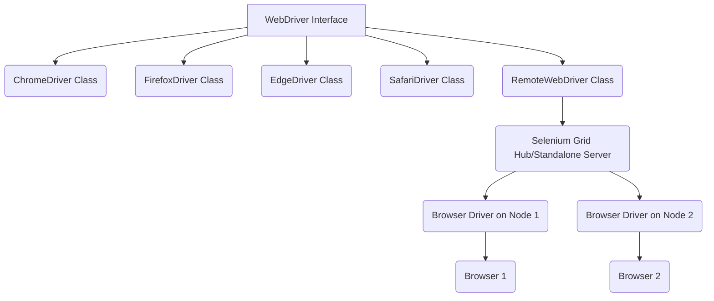

# selenium-2.1-ac1.md

# Selenium WebDriver Architecture

## Overview
Understanding the Selenium WebDriver architecture is fundamental for any SDET. It demystifies how your test scripts, written in a language like Java, can control a web browser. This knowledge is crucial for troubleshooting common issues, writing more efficient tests, and explaining your technical expertise in an interview. At its core, the architecture is a client-server model that has been standardized by the World Wide Web Consortium (W3C), ensuring cross-browser compatibility and predictability.

## Detailed Explanation
The Selenium WebDriver architecture consists of four main components that communicate with each other to execute test commands. The communication primarily happens over HTTP, using a standardized RESTful API.

1.  **Selenium Client Libraries (Language Bindings)**: These are the libraries you interact with directly in your code (e.g., the `selenium-java` JAR files). They provide the classes and methods (like `WebDriver`, `findElement`, `click()`) that you use to write your test scripts. Each supported language (Java, Python, C#, etc.) has its own set of client libraries. When you write a command like `driver.click()`, the client library converts it into a JSON object following the W3C WebDriver protocol.

2.  **JSON Wire Protocol / W3C WebDriver Protocol**: This is the heart of the communication. Historically, Selenium used the JSON Wire Protocol. In Selenium 4 and later, this has been replaced by the official **W3C WebDriver Protocol**, which is the current web standard. This protocol defines a RESTful API that both client libraries and browser drivers understand. Every browser action is mapped to a specific HTTP request (e.g., `POST /session/{session_id}/element/{element_id}/click`). The "wire" refers to the data being sent over the network (even if it's just on your local machine).

3.  **Browser Drivers**: These are the executables that act as the "server" and the bridge between Selenium and the actual browser. Each browser has its own specific driver (e.g., `ChromeDriver` for Chrome, `GeckoDriver` for Firefox, `EdgeDriver` for Edge). The browser driver receives the JSON/HTTP requests from the client library, interprets them, and then uses the browser's own internal automation API to execute the command on the browser. After executing the command, it sends an HTTP response back, which is then parsed by the client library.

4.  **Real Browsers**: This is the actual browser (e.g., Chrome, Firefox) where the application under test is rendered and interacted with. The browser driver has a tight coupling with the browser it controls.

**Communication Flow:**
`Test Script` -> `Selenium Client Library` -> `(W3C Protocol)` -> `Browser Driver` -> `Real Browser`


## Code Implementation
This code demonstrates the setup where the client library (Java) communicates with the `ChromeDriver` to open a browser.

```java
// Import necessary classes from the Selenium Client Library
import org.openqa.selenium.WebDriver;
import org.openqa.selenium.chrome.ChromeDriver;
import org.openqa.selenium.chrome.ChromeOptions;

public class WebDriverArchitectureExample {

    public static void main(String[] args) {
        // 1. You are using the Selenium Client Library (selenium-java) here.

        // The W3C WebDriver Protocol standardizes this setup.
        // Selenium Manager (since 4.6.0) automatically finds and downloads the correct driver.
        // If not using Selenium Manager, you would set the path to the driver executable:
        // System.setProperty("webdriver.chrome.driver", "/path/to/chromedriver");

        ChromeOptions options = new ChromeOptions();
        // The ChromeOptions object is converted to a JSON "capabilities" object.

        // 2. When you instantiate ChromeDriver, the client library sends an HTTP POST request
        //    to the ChromeDriver executable (which starts a server) to create a new session.
        //    The request body contains the desired capabilities (e.g., browserName: "chrome").
        WebDriver driver = new ChromeDriver(options);

        try {
            // 3. This command sends a POST request to the driver's endpoint for navigation.
            //    Example: POST /session/{session_id}/url
            //    Request Body: { "url": "https://www.google.com" }
            driver.get("https://www.google.com");

            // 4. The Browser Driver receives the request, tells the Chrome browser to navigate,
            //    waits for the page to load, and then sends an HTTP response back to the script.

            System.out.println("Page title is: " + driver.getTitle());

        } finally {
            // 5. This sends a DELETE request to the driver to end the session and close the browser.
            //    Example: DELETE /session/{session_id}
            if (driver != null) {
                driver.quit();
            }
        }
    }
}
```

## Best Practices
- **Use Selenium Manager**: Since Selenium 4.6.0, `Selenium Manager` is included, which automatically manages browser drivers. Avoid `System.setProperty()` unless you have a very specific reason to manage drivers manually.
- **Rely on the W3C Protocol**: Understand that this is the standard. It ensures your tests are more stable and compatible across different browsers and a future-proof approach.
- **Keep Drivers and Browsers Updated**: The browser driver is tightly coupled with the browser version. Mismatches are a common source of errors. Keeping both updated prevents compatibility issues.
- **Isolate Your Driver Initialization**: Use a factory or a singleton pattern to manage `WebDriver` instances. This makes your code cleaner and helps in managing browser sessions, especially during parallel execution.

## Common Pitfalls
- **Driver/Browser Version Mismatch**: The most common error. An old `ChromeDriver` will not work with a new version of Chrome. Symptoms include `SessionNotCreatedException`.
- **Mixing Selenium 3 and 4 Concepts**: Selenium 4 is fully W3C compliant. Old code using `DesiredCapabilities` should be updated to use browser-specific `Options` classes (e.g., `ChromeOptions`).
- **Firewall/Network Issues**: Because the architecture uses HTTP, firewalls or network policies can block communication between the client library and the browser driver, especially in remote or containerized environments.

## Interview Questions & Answers
1.  **Q: Can you explain the architecture of Selenium WebDriver?**
    **A:** Selenium WebDriver uses a client-server architecture based on the W3C WebDriver protocol. The four key components are: the **Selenium Client Libraries** (which we use to write code), the **JSON Wire Protocol/W3C Protocol** (the RESTful API for communication), the **Browser Drivers** (executables that control the browser), and the **Real Browser** itself. Our script uses the client library to send a JSON command over HTTP to the browser driver, which then uses the browser's native automation features to perform the action and send a response back.

2.  **Q: How is Selenium 4's architecture different from Selenium 3?**
    **A:** The biggest change is the full adoption of the W3C WebDriver Protocol. In Selenium 3, the client libraries still used the JSON Wire Protocol, and the browser driver would have to translate it to the W3C protocol for modern browsers, creating an extra step. Selenium 4 communicates directly using the W3C protocol, making communication more direct, stable, and standardized. This removes the need for this translation layer, reducing potential points of failure.

3.  **Q: What happens when I type `driver.get("url")`?**
    **A:** When `driver.get()` is called, the Selenium client library creates a JSON payload representing the "navigate to URL" command. It sends this payload as an HTTP POST request to the corresponding browser driver's server endpoint (e.g., `/session/{id}/url`). The browser driver receives this request, validates it, and then instructs the actual browser to navigate to the specified URL. Once the browser confirms the page has loaded, the driver sends an HTTP response back to the client library, and the execution of the test script continues.

## Hands-on Exercise
1.  **Find the Browser Driver Log**: Run a simple Selenium test. In your console output, you'll see a line similar to `INFO: Using ChromeDriver directly...`. Find the `chromedriver.log` file mentioned in the output or in your system's temp directory.
2.  **Examine the Log**: Open the log file. You will see the raw HTTP requests and responses being sent between your script and the driver. Try to identify the `[... INFO]: COMMAND InitSession` and `[... INFO]: COMMAND Get` log entries. This provides a real look at the W3C protocol in action.
3.  **Induce a Version Mismatch**: If you have `nvm` or a way to manage browser versions, try running your tests against an incompatible browser version. Observe the `SessionNotCreatedException` and read the error message. This will give you practical experience in diagnosing this very common issue.

## Additional Resources
- [Official Selenium Documentation on WebDriver](https://www.selenium.dev/documentation/webdriver/)
- [W3C WebDriver Protocol Specification](https://www.w3.org/TR/webdriver/)
- [Blog Post: How Selenium 4 Works](https://www.browserstack.com/guide/selenium-4-architecture)
---
# selenium-2.1-ac2.md

# WebDriver vs. RemoteWebDriver in Selenium

## Overview
In Selenium automation, `WebDriver` and `RemoteWebDriver` are fundamental concepts that represent the interface and its remote implementation, respectively. Understanding their differences and when to use each is crucial for building robust, scalable, and distributed test automation frameworks. This guide will clarify these concepts, their hierarchy, and practical use cases, especially in the context of Selenium Grid.

## Detailed Explanation

### WebDriver Interface
`WebDriver` is an interface in Selenium. It acts as a contract that all browser-specific driver classes (like `ChromeDriver`, `FirefoxDriver`, `EdgeDriver`, `SafariDriver`) must implement. This interface provides a common set of methods for interacting with web browsers, such as `get()`, `findElement()`, `click()`, `sendKeys()`, `quit()`, etc.

The core idea behind the `WebDriver` interface is to provide a consistent API for controlling different browsers. When you write `WebDriver driver = new ChromeDriver();`, you are programming to the interface, which is a key OOP principle (Polymorphism). This makes your test code portable across different browsers with minimal changes.

**Key characteristics of `WebDriver`:**
-   **Interface:** Defines the standard methods for browser automation.
-   **Local Execution:** Typically used for executing tests on the local machine where the browser and driver executable reside.
-   **Polymorphic:** Allows you to instantiate different browser drivers using a common interface type.

### RemoteWebDriver Class
`RemoteWebDriver` is a class that implements the `WebDriver` interface. Its primary purpose is to allow tests to be executed on a remote machine. This is particularly useful in environments like Selenium Grid, where tests run on a central hub, and the actual browser interaction happens on distributed nodes.

When you use `RemoteWebDriver`, you specify the URL of the remote Selenium Grid Hub (or a standalone Selenium Server) and the desired browser capabilities (e.g., Chrome, Firefox, version, platform). The `RemoteWebDriver` then communicates with the remote server using the W3C WebDriver protocol (or the now deprecated JSON Wire Protocol in older Selenium versions). The remote server, in turn, forwards the commands to the appropriate browser driver on a registered node.

**Key characteristics of `RemoteWebDriver`:**
-   **Class:** Implements the `WebDriver` interface.
-   **Remote Execution:** Designed for running tests on remote machines, often part of a Selenium Grid setup or cloud-based testing platforms (e.g., Sauce Labs, BrowserStack).
-   **Requires Configuration:** Needs a `URL` pointing to the remote Selenium server and `DesiredCapabilities` or `Options` to specify the target browser and environment.
-   **Scalability:** Enables parallel execution of tests across multiple browsers and operating systems on different machines.

### Hierarchy Diagram



In the diagram:
-   `WebDriver Interface` defines the common API.
-   `ChromeDriver`, `FirefoxDriver`, etc., are concrete implementations for local execution.
-   `RemoteWebDriver` is another concrete implementation that proxies commands to a remote Selenium server.
-   The remote server (Hub) then dispatches these commands to the actual browser drivers running on different nodes.

### When to Use Which

| Feature / Scenario       | `WebDriver` (Local Drivers)                            | `RemoteWebDriver`                                    |
|:-------------------------|:-------------------------------------------------------|:-----------------------------------------------------|
| **Execution Environment**| Local machine                                          | Remote machine (Selenium Grid, Cloud Platforms)      |
| **Setup Complexity**     | Simpler: just need driver executable and browser       | More complex: requires remote server setup (Grid)    |
| **Scalability**          | Limited to local machine resources                     | Highly scalable, distributed testing                 |
| **Parallel Execution**   | Can be achieved locally with careful configuration     | Inherently designed for parallel and distributed tests |
| **Cross-Browser/OS**     | Requires installing all browsers/drivers locally       | Easily switch browsers/OS via capabilities/options   |
| **Use Cases**            | Local development, debugging, small projects           | CI/CD pipelines, large test suites, cross-browser testing |
| **Configuration**        | Minimal (e.g., `new ChromeDriver()`)                   | `new RemoteWebDriver(URL, Options)`                  |

## Code Implementation

To demonstrate, we'll use a simple test that navigates to a website.

**Prerequisites:**
-   Maven project with Selenium WebDriver dependency.
-   A running Selenium Grid Hub (for `RemoteWebDriver` example). You can start a standalone server or a Grid. For a quick standalone server: `java -jar selenium-server-4.x.x.jar standalone`. The default URL will be `http://localhost:4444`.

```java
import org.openqa.selenium.WebDriver;
import org.openqa.selenium.chrome.ChromeDriver;
import org.openqa.selenium.chrome.ChromeOptions;
import org.openqa.selenium.remote.RemoteWebDriver;
import java.net.MalformedURLException;
import java.net.URL;

public class WebDriverComparison {

    public static void main(String[] args) {
        // --- Local WebDriver Example (ChromeDriver) ---
        System.out.println("--- Running Local WebDriver Example ---");
        WebDriver localDriver = null;
        try {
            // Path to your ChromeDriver executable
            // System.setProperty("webdriver.chrome.driver", "path/to/chromedriver.exe");
            // In modern Selenium (4.6+), WebDriverManager or Selenium Manager handles this automatically

            ChromeOptions localChromeOptions = new ChromeOptions();
            // Optional: run headless for local execution
            // localChromeOptions.addArguments("--headless");
            // localChromeOptions.addArguments("--disable-gpu");

            localDriver = new ChromeDriver(localChromeOptions);
            runTest(localDriver, "Local ChromeDriver");
        } catch (Exception e) {
            System.err.println("Error during local WebDriver execution: " + e.getMessage());
        } finally {
            if (localDriver != null) {
                localDriver.quit();
            }
        }

        System.out.println("\n--- Running RemoteWebDriver Example ---");
        WebDriver remoteDriver = null;
        try {
            // URL of your Selenium Grid Hub or standalone server
            // Ensure a Selenium Grid Hub is running, e.g., on http://localhost:4444
            String gridUrl = "http://localhost:4444"; 

            ChromeOptions remoteChromeOptions = new ChromeOptions();
            // This is crucial for RemoteWebDriver to specify the browser
            remoteChromeOptions.setBrowserVersion("stable"); // Request the latest stable Chrome version
            remoteChromeOptions.setPlatformName("ANY"); // Request any available platform

            remoteDriver = new RemoteWebDriver(new URL(gridUrl), remoteChromeOptions);
            runTest(remoteDriver, "RemoteWebDriver (Chrome on Grid)");
        } catch (MalformedURLException e) {
            System.err.println("Invalid Grid URL: " + e.getMessage());
        } catch (Exception e) {
            System.err.println("Error during remote WebDriver execution: " + e.getMessage());
            System.err.println("Ensure Selenium Grid Hub is running at specified URL: http://localhost:4444");
        } finally {
            if (remoteDriver != null) {
                remoteDriver.quit();
            }
        }
    }

    private static void runTest(WebDriver driver, String driverType) {
        System.out.println(driverType + ": Navigating to Google...");
        driver.get("https://www.google.com");
        System.out.println(driverType + ": Title is: " + driver.getTitle());
        // Add more test steps here, e.g., finding elements, interacting
        // For demonstration, we'll just navigate and get title
        System.out.println(driverType + ": Test completed.");
    }
}
```

**To run the `RemoteWebDriver` example:**
1.  Download `selenium-server-4.x.x.jar` from the Selenium downloads page.
2.  Open a terminal and navigate to the directory where you saved the `.jar` file.
3.  Run the Selenium Grid Hub: `java -jar selenium-server-4.x.x.jar hub`
4.  Open another terminal and run a Selenium Grid Node: `java -jar selenium-server-4.x.x.jar node` (this will automatically detect and register with the hub). Ensure the browser (e.g., Chrome) and its corresponding driver (if not using Selenium Manager) are available on the node machine.
5.  Run the Java code above.

## Best Practices
-   **Always program to the `WebDriver` interface:** This ensures your test code is flexible and easy to adapt if you switch between local and remote execution.
-   **Use `RemoteWebDriver` for CI/CD:** For continuous integration and large-scale testing, `RemoteWebDriver` with Selenium Grid or cloud services is essential for parallelization and platform diversity.
-   **Manage driver lifecycle:** Always call `driver.quit()` in a `finally` block or `@AfterMethod` (TestNG/JUnit) to ensure browser instances are properly closed, preventing resource leaks.
-   **Leverage `DesiredCapabilities` / `Options`:** When using `RemoteWebDriver`, precisely define the browser, version, platform, and other settings via `ChromeOptions`, `FirefoxOptions`, etc., to target the correct environment on the Grid.
-   **Centralized Driver Management:** For local tests, consider using a library like WebDriverManager or leveraging Selenium Manager (built-in from Selenium 4.6+) to automatically download and manage browser drivers.

## Common Pitfalls
-   **Forgetting `driver.quit()`:** This can lead to numerous zombie browser processes consuming system resources, especially in parallel execution.
-   **Mixing local and remote driver properties:** If you intend to use `RemoteWebDriver`, make sure you're not accidentally setting `System.setProperty("webdriver.chrome.driver", ...)` which is meant for local `ChromeDriver` instances.
-   **Incorrect Grid URL:** A common error with `RemoteWebDriver` is providing an unreachable or incorrect URL for the Selenium Grid Hub.
-   **Capabilities Mismatch:** Requesting a browser/version/platform combination that is not available or not correctly configured on your Selenium Grid nodes will result in session creation failures.
-   **Session timeouts:** If tests take too long to start or execute, the Grid might time out the session, leading to `WebDriverException`. Configure appropriate timeouts.

## Interview Questions & Answers

1.  **Q: Explain the primary difference between `WebDriver` and `RemoteWebDriver`.**
    A: `WebDriver` is an interface that defines the contract for browser automation, providing a common set of methods. `RemoteWebDriver` is a concrete class that implements the `WebDriver` interface, specifically designed to execute tests on a *remote* machine (e.g., a Selenium Grid node) by sending commands over the network to a Selenium server. Local drivers like `ChromeDriver` also implement `WebDriver` but run tests on the local machine.

2.  **Q: When would you choose `RemoteWebDriver` over a local `ChromeDriver`?**
    A: I would choose `RemoteWebDriver` for:
    -   **Parallel Execution:** To run many tests concurrently across multiple browsers/OS combinations.
    -   **Cross-Browser/Platform Testing:** To test an application on various browsers (Chrome, Firefox, Edge, Safari) and operating systems (Windows, Linux, macOS) without needing to install all of them locally.
    -   **CI/CD Integration:** To integrate tests into a Continuous Integration/Continuous Deployment pipeline, leveraging a centralized test infrastructure like Selenium Grid.
    -   **Cloud-Based Testing:** When using services like Sauce Labs, BrowserStack, or LambdaTest.

3.  **Q: How does `RemoteWebDriver` communicate with the browser?**
    A: `RemoteWebDriver` communicates with a remote Selenium Server (Hub in a Grid, or a standalone server). It serializes `WebDriver` commands into HTTP requests using the W3C WebDriver protocol (previously JSON Wire Protocol) and sends them to the remote server. The remote server then translates these commands into browser-specific actions via the local browser driver (e.g., `chromedriver.exe`) running on a node, and the browser performs the action. The server then sends the response back to the `RemoteWebDriver`.

4.  **Q: What is the role of `DesiredCapabilities` or `Options` when using `RemoteWebDriver`?**
    A: `DesiredCapabilities` (deprecated in favor of browser-specific `Options` classes like `ChromeOptions` in Selenium 4+) are used to specify the desired browser, its version, the operating system, and other browser-specific settings (e.g., headless mode, browser arguments). When `RemoteWebDriver` initiates a session with the Selenium Grid Hub, it sends these capabilities. The Hub then matches these requests with an available node that can provide the specified environment.

## Hands-on Exercise
1.  **Set up a local Selenium Grid:** Follow the instructions in the "Code Implementation" section to get a Hub and at least one Node (Chrome or Firefox) running on your local machine.
2.  **Modify the `WebDriverComparison.java`:**
    *   Change the `gridUrl` in the `RemoteWebDriver` example to point to your running Hub (`http://localhost:4444`).
    *   Add a new `RemoteWebDriver` instantiation for `FirefoxOptions` and ensure you have a Firefox node running on your Grid.
    *   Execute a simple test (`get("url")` and `getTitle()`) for both Chrome and Firefox using `RemoteWebDriver`.
3.  **Observe:** Verify that both local and remote tests execute successfully. Check the Grid console (`http://localhost:4444/ui`) to see the remote sessions being created and torn down.

## Additional Resources
-   **Selenium WebDriver Documentation:** [https://www.selenium.dev/documentation/webdriver/](https://www.selenium.dev/documentation/webdriver/)
-   **Selenium Grid Documentation:** [https://www.selenium.dev/documentation/grid/](https://www.selenium.dev/documentation/grid/)
-   **W3C WebDriver Specification:** [https://www.w3.org/TR/webdriver/](https://www.w3.org/TR/webdriver/)
-   **WebDriverManager (for local driver management):** [https://bonigarcia.dev/webdrivermanager/](https://bonigarcia.dev/webdrivermanager/)
---
# selenium-2.1-ac3.md

# Selenium - Configuring Browser Options (ChromeOptions, FirefoxOptions)

## Overview

In test automation, we rarely run browsers in their default state. We need to configure them for consistency, performance, and to handle specific application behaviors. `ChromeOptions`, `FirefoxOptions`, and similar classes for other browsers are the keys to this control. They allow SDETs to modify browser behavior at startup, such as running headless, disabling pop-ups, setting a default download directory, or even mimicking a mobile device. Mastering these options is crucial for creating robust, efficient, and reliable automation scripts.

## Detailed Explanation

When Selenium WebDriver launches a browser, it does so with a default profile. `Options` classes allow us to programmatically define a collection of settings (or "capabilities") that override this default profile. These settings are passed to the browser driver when it initiates a new session.

**Key Use Cases in Test Automation:**

1.  **Headless Execution:** Running tests in the background without a visible UI. This is essential for CI/CD environments where no display is available. It's faster and consumes fewer resources.
2.  **Disabling Notifications:** Web applications often use browser notifications (e.g., "Show notifications"). These can interfere with test scripts by obscuring elements or creating unexpected alerts. We can disable them at startup.
3.  **Managing Extensions:** You can start a browser with specific extensions loaded (e.g., an ad-blocker for performance) or disable existing ones.
4.  **Accepting Insecure Certificates:** For test environments that use self-signed SSL certificates, you can instruct the browser to trust them and avoid security warnings that block automation.
5.  **Setting Window Size:** Starting the browser in a specific resolution (e.g., `1920x1080`) ensures a consistent viewport for all test runs, which helps prevent responsive design-related flakiness.
6.  **Disabling Infobars:** Chrome often shows infobars like "Chrome is being controlled by automated test software." These can be disabled to maximize the viewable area.

## Code Implementation

This example demonstrates how to configure `ChromeOptions` and `FirefoxOptions` for common scenarios like headless execution and disabling notifications.

```java
import org.openqa.selenium.WebDriver;
import org.openqa.selenium.chrome.ChromeDriver;
import org.openqa.selenium.chrome.ChromeOptions;
import org.openqa.selenium.firefox.FirefoxDriver;
import org.openqa.selenium.firefox.FirefoxOptions;
import org.openqa.selenium.firefox.FirefoxProfile;

public class BrowserOptionsExample {

    public static void main(String[] args) {
        System.out.println("--- Running with Configured Chrome ---");
        runWithChromeOptions();

        System.out.println("\n--- Running with Configured Firefox ---");
        runWithFirefoxOptions();
    }

    public static void runWithChromeOptions() {
        // Selenium Manager will handle the driver binary automatically
        
        // 1. Create an instance of ChromeOptions
        ChromeOptions options = new ChromeOptions();

        // 2. Set common configurations
        options.addArguments("--headless"); // Run in headless mode
        options.addArguments("--disable-gpu"); // Recommended for headless on Windows
        options.addArguments("--window-size=1920,1080"); // Set a specific window size
        options.addArguments("--disable-notifications"); // Disable browser notifications
        options.addArguments("--start-maximized"); // Start browser maximized
        options.addArguments("--disable-infobars"); // Deprecated but still used, use excludeSwitches
        options.setExperimentalOption("excludeSwitches", new String[]{"enable-automation"}); // Disables "controlled by automation" infobar

        // For accepting insecure SSL certificates
        options.setAcceptInsecureCerts(true);

        WebDriver driver = null;
        try {
            // 3. Pass the options object to the ChromeDriver constructor
            driver = new ChromeDriver(options);

            driver.get("https://www.google.com");
            System.out.println("Chrome Page Title: " + driver.getTitle());
            System.out.println("Successfully configured and launched Chrome with custom options.");

        } catch (Exception e) {
            System.err.println("An error occurred during Chrome execution: " + e.getMessage());
        } finally {
            if (driver != null) {
                driver.quit();
            }
        }
    }

    public static void runWithFirefoxOptions() {
        // Selenium Manager will handle the driver binary automatically
        
        // 1. Create an instance of FirefoxOptions
        FirefoxOptions options = new FirefoxOptions();

        // 2. Set common configurations
        options.addArguments("-headless"); // Run in headless mode for Firefox

        // To disable notifications, we need to modify the Firefox profile preferences
        FirefoxProfile profile = new FirefoxProfile();
        profile.setPreference("dom.webnotifications.enabled", false);
        options.setProfile(profile);

        // For accepting insecure SSL certificates
        options.setAcceptInsecureCerts(true);

        WebDriver driver = null;
        try {
            // 3. Pass the options object to the FirefoxDriver constructor
            driver = new FirefoxDriver(options);
            
            driver.get("https://www.mozilla.org");
            System.out.println("Firefox Page Title: " + driver.getTitle());
            System.out.println("Successfully configured and launched Firefox with custom options.");

        } catch (Exception e) {
            System.err.println("An error occurred during Firefox execution: " + e.getMessage());
        } finally {
            if (driver != null) {
                driver.quit();
            }
        }
    }
}
```

## Best Practices

-   **Centralize Options Configuration:** Create a factory or utility class (e.g., `DriverFactory`) that builds the `Options` object based on input parameters (like browser name, headless mode). This avoids code duplication in your test setup.
-   **Parameterize for CI/CD:** Don't hardcode options like `headless`. Make them configurable via system properties or environment variables, so you can run tests with a UI locally and headless in the CI pipeline.
-   **Stay Updated:** Browser vendors frequently change available options and arguments. Periodically review the official documentation (e.g., Chromium Command Line Switches) for the latest.
-   **Use `setAcceptInsecureCerts(true)` Judiciously:** Only use this for trusted test environments. Never use it to bypass certificate warnings on production sites.

## Common Pitfalls

-   **Mixing `addArguments`:** Firefox uses a single dash for arguments (e.g., `-headless`), while Chrome uses a double dash (e.g., `--headless`). Using the wrong format will cause the option to be ignored.
-   **Relying on Outdated Arguments:** Arguments like `--disable-infobars` for Chrome are deprecated. While they might still work, it's better to find the modern equivalent (like `excludeSwitches`) for future compatibility.
-   **Incorrectly Configuring Profiles:** For complex settings like notification management in Firefox, modifying the profile is necessary. Simply adding an argument won't work.
-   **Ignoring Headless-Related Issues:** Some websites behave differently in headless mode or require a specific user-agent string. Be prepared to add a user-agent argument (`--user-agent=...`) if you encounter issues.

## Interview Questions & Answers

1.  **Q:** How would you run your Selenium tests in a CI/CD environment like Jenkins where there's no display?
    **A:** I would configure the browser to run in **headless mode**. This is achieved by using the `ChromeOptions` or `FirefoxOptions` class. For Chrome, I'd add the `--headless` argument, and for Firefox, the `-headless` argument. These options are typically parameterized so they can be enabled specifically for the CI environment via a build parameter or environment variable.

2.  **Q:** A test is failing because a "Show Notifications" pop-up is blocking a button you need to click. How do you handle this?
    **A:** The most robust solution is to disable notifications at the browser level before the test starts. For Chrome, I would add the `--disable-notifications` argument to `ChromeOptions`. For Firefox, it's more complex; I'd create a `FirefoxProfile` object, set the `dom.webnotifications.enabled` preference to `false`, and then assign this profile to my `FirefoxOptions` object. This prevents the pop-up from ever appearing.

3.  **Q:** Your tests need to run against a staging environment with a self-signed SSL certificate, causing a privacy error page. How do you bypass this?
    **A:** Both `ChromeOptions` and `FirefoxOptions` have a method called `setAcceptInsecureCerts(true)`. By calling this on the options object before creating the WebDriver instance, I instruct the browser to automatically trust these insecure certificates for the duration of the session, allowing the test to proceed without being blocked.

## Hands-on Exercise

1.  **Objective:** Create a test that runs in headless mode, navigates to a website, and verifies its title.
2.  **Steps:**
    *   Create a new Java class.
    *   In your `main` or a `@Test` method, create an instance of `ChromeOptions`.
    *   Add the `--headless` argument.
    *   Add an argument to set the window size to `1280x800`.
    *   Instantiate `ChromeDriver` with your configured options.
    *   Navigate to `https://www.wikipedia.org`.
    *   Get the page title and print it to the console.
    *   Assert that the title contains the word "Wikipedia".
    *   Close the browser using `driver.quit()`.
    *   **(Bonus):** Refactor the code to accept the browser name ("chrome" or "firefox") as a command-line argument and run the same test on either browser.

## Additional Resources

-   [Chromium Command Line Switches](https://peter.sh/experiments/chromium-command-line-switches/) - An exhaustive list of arguments for Chrome.
-   [Firefox Source Tree: commandline-args.js](https://searchfox.org/mozilla-central/source/testing/firefox-ui/common/commandline-args.js) - Official source defining Firefox command-line arguments.
-   [Selenium Documentation on Options](https://www.selenium.dev/documentation/webdriver/browsers/chrome/) - Official Selenium docs for configuring Chrome.
---
# selenium-2.1-ac4.md

# Browser Profile Management for Test Scenarios

## Overview
Browser profiles store a user's browsing data, including history, bookmarks, extensions, cookies, cached data, and login information. In test automation, managing browser profiles is crucial for creating isolated, consistent, and realistic test environments. This allows testers to simulate different user configurations, maintain state between test runs, or test specific browser settings without interference.

This document will cover how to implement browser profile management for various test scenarios in Selenium WebDriver, primarily focusing on Chrome and Firefox.

## Detailed Explanation

Browser profiles are directories on your system that store specific user data for a browser. When Selenium launches a browser, it typically uses a fresh, default profile, meaning no history, no cookies, no extensions, and no logged-in sessions. While this provides a clean slate for each test, there are scenarios where you might want to:
1.  **Persist login sessions**: Avoid re-logging in for every test, saving execution time.
2.  **Test with specific extensions**: Verify functionality of web pages that rely on or interact with browser extensions.
3.  **Use pre-configured settings**: For example, specific proxy settings, language preferences, or download directories.
4.  **Isolate test data**: Ensure tests don't interfere with each other or with a developer's local browsing data.

Selenium WebDriver provides mechanisms through `ChromeOptions` and `FirefoxOptions` to manage browser profiles.

### Chrome Profile Management
For Chrome, you can specify an existing user data directory or create a new one.

-   **Using an existing profile**: If you have a Chrome profile (`User Data` directory) with specific settings or logged-in sessions, you can tell Selenium to use it. This is generally **not recommended for CI/CD** as it introduces external dependencies, but can be useful for local debugging or specific development scenarios.
    -   The `User Data` directory location varies by OS:
        -   Windows: `%LOCALAPPDATA%\Google\Chrome\User Data` (e.g., `C:\Users\YourUser\AppData\Local\Google\Chrome\User Data`)
        -   macOS: `~/Library/Application Support/Google/Chrome`
        -   Linux: `~/.config/google-chrome`
    -   Inside `User Data`, default profiles are usually named `Default` or `Profile 1`, `Profile 2`, etc. You need to specify the path to the parent `User Data` directory, and optionally, the specific profile to use within it.

-   **Creating a temporary profile**: More commonly, you'd create a temporary profile for your tests. Selenium often does this by default, but you can explicitly specify a temporary directory. This is good for isolation.

### Firefox Profile Management
Firefox has a more explicit "profile manager" concept. You can create, delete, and manage profiles directly within Firefox or via Selenium.

-   **Using an existing profile**:
    -   Firefox profiles are located in a `.mozilla/firefox/Profiles` directory (e.g., `C:\Users\YourUser\AppData\Roaming\Mozilla\Firefox\Profiles\` on Windows). Each profile has a unique name like `abcdefgh.default-release`.
    -   You can load an existing `FirefoxProfile` object and pass it to `FirefoxOptions`. This allows precise control over what data and settings are loaded.
    -   You can also specify a profile directory path.

-   **Creating a temporary profile**: When you initialize `FirefoxProfile` without specifying a path, Selenium creates a new temporary profile. This is the most common and recommended approach for test isolation.

### Key Considerations
-   **Isolation**: Each test should ideally run in an isolated environment to prevent side effects. Temporary profiles or uniquely generated profile paths for each test/suite are best.
-   **Cleanup**: If you create temporary profiles, ensure they are deleted after tests complete to avoid clutter and potential data leaks. Selenium typically handles this for temporary profiles, but if you specify custom temporary directories, you might need manual cleanup.
-   **Security**: Be cautious when persisting sensitive data (like login credentials) in profiles, especially in shared environments.
-   **Performance**: Loading very large profiles (with lots of history/cache) can slow down browser launch times. Keep profiles lean.

## Code Implementation

Let's create a utility class `BrowserProfileManager` to handle setting up browser profiles for Chrome and Firefox.

```java
package com.example.utils;

import org.openqa.selenium.WebDriver;
import org.openqa.selenium.chrome.ChromeDriver;
import org.openqa.selenium.chrome.ChromeOptions;
import org.openqa.selenium.firefox.FirefoxDriver;
import org.openqa.selenium.firefox.FirefoxOptions;
import org.openqa.selenium.firefox.FirefoxProfile;
import org.openqa.selenium.firefox.ProfilesIni; // For managing existing Firefox profiles

import java.io.File;
import java.io.IOException;
import java.nio.file.Files;
import java.nio.file.Path;
import java.util.Comparator;

public class BrowserProfileManager {

    private static final String CHROME_USER_DATA_DIR_PREFIX = "chrome-profile-";
    private static final String FIREFOX_PROFILE_DIR_PREFIX = "firefox-profile-";
    private static Path tempProfileDir;

    /**
     * Initializes a Chrome WebDriver with a custom profile.
     * This method can either use a temporary profile or an existing one based on the scenario.
     * For demonstration, we will focus on creating a temporary profile.
     *
     * @param useTemporaryProfile If true, creates a new temporary profile.
     *                            If false, attempts to use a specific existing profile (not fully implemented in example).
     * @return Configured ChromeDriver instance.
     */
    public static WebDriver getChromeDriverWithProfile(boolean useTemporaryProfile) {
        ChromeOptions options = new ChromeOptions();

        if (useTemporaryProfile) {
            try {
                // Create a unique temporary directory for the Chrome user data
                tempProfileDir = Files.createTempDirectory(CHROME_USER_DATA_DIR_PREFIX);
                options.addArguments("--user-data-dir=" + tempProfileDir.toAbsolutePath());
                System.out.println("Chrome using temporary profile: " + tempProfileDir.toAbsolutePath());
                // Optional: Add other profile-related arguments
                // options.addArguments("--profile-directory=Profile 1"); // If you want to specify a profile within user-data-dir
            } catch (IOException e) {
                System.err.println("Failed to create temporary directory for Chrome profile: " + e.getMessage());
                // Fallback to default or rethrow
            }
        } else {
            // Example: Using an existing specific profile. This requires knowing the exact path.
            // Replace with your actual Chrome user data directory path
            // String existingUserProfileDir = "C:\\Users\\YourUser\\AppData\\Local\\Google\\Chrome\\User Data";
            // options.addArguments("--user-data-dir=" + existingUserProfileDir);
            // options.addArguments("--profile-directory=Default"); // Specify which profile within the User Data dir
            System.out.println("Chrome using default or system-managed profile.");
        }

        // Add other common options (e.g., headless, maximize)
        // options.addArguments("--headless"); // Run in headless mode
        options.addArguments("--start-maximized"); // Maximize browser window

        return new ChromeDriver(options);
    }

    /**
     * Initializes a Firefox WebDriver with a custom profile.
     * This method demonstrates creating a temporary profile.
     *
     * @param useTemporaryProfile If true, creates a new temporary profile.
     *                            If false, attempts to use an existing profile by name (e.g., "default-release").
     * @return Configured FirefoxDriver instance.
     */
    public static WebDriver getFirefoxDriverWithProfile(boolean useTemporaryProfile) {
        FirefoxOptions options = new FirefoxOptions();
        FirefoxProfile profile;

        if (useTemporaryProfile) {
            // Creating a new, empty profile
            profile = new FirefoxProfile();
            // You can set preferences for this new profile
            profile.setPreference("browser.download.folderList", 2); // 0-desktop, 1-downloads, 2-custom location
            profile.setPreference("browser.download.dir", System.getProperty("user.dir") + File.separator + "downloads");
            profile.setPreference("browser.download.useDownloadDir", true);
            profile.setPreference("browser.helperApps.neverAsk.saveToDisk", "application/pdf"); // Auto-download PDFs
            System.out.println("Firefox using temporary profile with custom preferences.");
        } else {
            // Using an existing named profile (e.g., created via firefox -P)
            // Note: This requires the profile to exist and ProfilesIni to find it.
            // Not generally recommended for CI/CD due to environment dependency.
            ProfilesIni profileIni = new ProfilesIni();
            profile = profileIni.getProfile("default-release"); // Replace "default-release" with your profile name
            if (profile == null) {
                System.err.println("Firefox profile 'default-release' not found. Using new temporary profile instead.");
                profile = new FirefoxProfile(); // Fallback to a new profile
            } else {
                System.out.println("Firefox using existing profile: " + profile.getName());
            }
        }
        options.setProfile(profile);
        // Add other common options
        // options.addArguments("-headless"); // Run in headless mode
        return new FirefoxDriver(options);
    }

    /**
     * Cleans up the temporary browser profile directory created by getChromeDriverWithProfile.
     * This should be called in an @AfterSuite or similar teardown method.
     */
    public static void cleanupTempProfile() {
        if (tempProfileDir != null && Files.exists(tempProfileDir)) {
            try {
                Files.walk(tempProfileDir)
                        .sorted(Comparator.reverseOrder())
                        .map(Path::toFile)
                        .forEach(File::delete);
                System.out.println("Cleaned up temporary profile directory: " + tempProfileDir.toAbsolutePath());
            } catch (IOException e) {
                System.err.println("Failed to clean up temporary profile directory " + tempProfileDir.toAbsolutePath() + ": " + e.getMessage());
            } finally {
                tempProfileDir = null; // Reset for next run
            }
        }
    }

    // Example of how you might use this in a test
    public static void main(String[] args) throws InterruptedException {
        // Setup WebDriverManager if not already done in your project
        // WebDriverManager.chromedriver().setup();
        // WebDriverManager.firefoxdriver().setup();

        System.setProperty("webdriver.chrome.driver", "path/to/chromedriver.exe"); // Replace with actual path or use WebDriverManager
        System.setProperty("webdriver.gecko.driver", "path/to/geckodriver.exe"); // Replace with actual path or use WebDriverManager

        // --- Chrome Example ---
        System.out.println("--- Starting Chrome test with temporary profile ---");
        WebDriver chromeDriver = getChromeDriverWithProfile(true);
        try {
            chromeDriver.get("https://www.google.com");
            System.out.println("Chrome Title: " + chromeDriver.getTitle());
            Thread.sleep(2000); // For demonstration
        } finally {
            if (chromeDriver != null) {
                chromeDriver.quit();
                cleanupTempProfile(); // Clean up Chrome temporary profile
            }
        }
        System.out.println("--- Chrome test finished ---");
        System.out.println();

        // --- Firefox Example ---
        System.out.println("--- Starting Firefox test with temporary profile ---");
        WebDriver firefoxDriver = getFirefoxDriverWithProfile(true);
        try {
            firefoxDriver.get("https://www.mozilla.org/en-US/firefox/new/");
            System.out.println("Firefox Title: " + firefoxDriver.getTitle());
            Thread.sleep(2000); // For demonstration
        } finally {
            if (firefoxDriver != null) {
                firefoxDriver.quit();
            }
        }
        System.out.println("--- Firefox test finished ---");
    }
}
```

**Note**: For the `main` method to run, you will need to have `chromedriver.exe` and `geckodriver.exe` installed and their paths correctly set, or use a library like `WebDriverManager` (recommended) to manage them automatically.

To use `WebDriverManager`, add it to your `pom.xml` (Maven) or `build.gradle` (Gradle):

**Maven (`pom.xml`):**
```xml
<dependency>
    <groupId>io.github.bonigarcia</groupId>
    <artifactId>webdrivermanager</artifactId>
    <version>5.6.2</version> <!-- Use the latest version -->
</dependency>
<dependency>
    <groupId>org.seleniumhq.selenium</groupId>
    <artifactId>selenium-java</artifactId>
    <version>4.11.0</version> <!-- Use the latest compatible version -->
</dependency>
```

Then in your code, before creating the driver:
```java
import io.github.bonigarcia.wdm.WebDriverManager;

// In your main method or @BeforeSuite
WebDriverManager.chromedriver().setup();
WebDriverManager.firefoxdriver().setup();
```

## Best Practices
-   **Automate Profile Creation/Deletion**: For test automation, always aim to create temporary profiles for each test run or suite. This ensures isolation and a clean state. Never rely on manually created profiles for CI/CD.
-   **Use WebDriverManager**: This library simplifies driver setup significantly by automatically downloading and managing browser drivers, removing the need for manual `System.setProperty()` calls.
-   **Cleanup**: If you're manually managing profile directories (e.g., creating custom temporary ones), implement robust cleanup mechanisms (`@AfterSuite` or `try-finally` blocks) to delete them after tests, preventing disk clutter and potential issues.
-   **Isolation is Key**: Each test or test suite should ideally have its own isolated browser profile. This prevents test interference, where one test's actions (e.g., login, cookie changes) affect subsequent tests.
-   **Avoid Hardcoding Paths**: Profile paths should be dynamically generated or configured via environment variables, not hardcoded into your test framework.
-   **Focus on Relevant Preferences**: Only set profile preferences that are critical for your test scenarios (e.g., download directory, notification settings). Avoid unnecessary customization, as it can make tests harder to debug or maintain.

## Common Pitfalls
-   **Using Developer's Profile**: Accidentally launching Chrome/Firefox with a developer's default profile can lead to inconsistent test results due to cached data, extensions, or login states. Ensure tests use isolated profiles.
-   **Profile Bloat**: If temporary profiles are not cleaned up, they can accumulate over time, consuming significant disk space and potentially slowing down the system.
-   **Incorrect Profile Path**: Specifying an incorrect or non-existent profile path will either cause the browser to launch with a default profile or throw an error.
-   **Security Risks with Persistent Profiles**: Using persistent profiles with sensitive login data in CI/CD environments can pose security risks if the environment is compromised.
-   **Mixing Implicit and Explicit Waits**: Not directly related to profiles, but a common pitfall in Selenium that can lead to unexpected wait behaviors when not used correctly. (Mentioned for general awareness for SDETs).

## Interview Questions & Answers
1.  **Q: Why is browser profile management important in test automation?**
    **A:** It's important for ensuring test isolation, consistency, and realism. By managing profiles, we can:
    *   Maintain a clean state for each test run, preventing data from previous runs from affecting current ones (e.g., cookies, cache).
    *   Simulate specific user scenarios, such as testing with a logged-in user or with particular browser settings (e.g., language, download folder).
    *   Debug more effectively by observing browser behavior with specific configurations.
    *   Avoid conflicts with other users or parallel test executions.

2.  **Q: How do you handle browser profiles in Selenium for Chrome and Firefox?**
    **A:**
    *   **Chrome**: We use `ChromeOptions` and the `--user-data-dir` argument. For temporary profiles, we can create a unique temporary directory and pass its path to this argument. For existing profiles, we pass the path to the main `User Data` directory and optionally specify a specific `--profile-directory` (e.g., `Profile 1`).
    *   **Firefox**: We use `FirefoxOptions` and create a `FirefoxProfile` object. For temporary profiles, simply instantiating `new FirefoxProfile()` creates a new one. To use an existing named profile, we can use `ProfilesIni().getProfile("ProfileName")` and set it to the `FirefoxOptions`.

3.  **Q: What are the best practices for managing browser profiles in a CI/CD pipeline?**
    **A:**
    *   **Use Temporary Profiles**: Always create new, temporary profiles for each test run or job in CI/CD. This guarantees a clean and isolated environment.
    *   **Automate Cleanup**: Ensure any custom temporary profile directories are deleted after the test execution. Selenium usually handles this for its default temporary profiles.
    *   **Avoid Persistence**: Do not rely on persistent profiles (e.g., pre-configured profiles with login data) in CI/CD. If authentication is needed, handle it programmatically within the tests (e.g., API login, then UI).
    *   **Environment Variables for Configuration**: If profile settings need to vary by environment, use environment variables to pass these configurations to your test suite, rather than hardcoding.
    *   **WebDriverManager**: Utilize tools like `WebDriverManager` for automated browser driver management, simplifying setup in dynamic CI environments.

4.  **Q: Describe a scenario where using a custom browser profile would be beneficial for testing.**
    **A:**
    *   **Scenario**: Testing a web application's functionality that heavily relies on a specific browser extension (e.g., an ad-blocker or a custom security plugin).
    *   **Benefit**: By creating a profile that already has the required extension installed and configured, we can ensure that our tests accurately reflect the user experience with that extension. This avoids the complexity of installing and configuring the extension programmatically within each test.
    *   **Another Scenario**: Testing download functionality where files should always be downloaded to a specific, predefined directory without user interaction. A custom profile can be configured to automatically save files to that location, streamlining the test process.

## Hands-on Exercise

1.  **Objective**: Configure Chrome to always download files to a specific "downloads" folder within your project directory, and automatically accept PDF downloads.
2.  **Steps**:
    a.  Modify the `getChromeDriverWithProfile` method in the `BrowserProfileManager` class.
    b.  Add `ChromeOptions` preferences to set the default download directory. You'll need to specify:
        *   `"download.default_directory"`: The absolute path to your desired download folder.
        *   `"download.prompt_for_download"`: Set to `false` to prevent the download prompt.
        *   `"plugins.always_open_pdf_externally"`: Set to `true` to prevent Chrome's built-in PDF viewer from opening PDFs.
    c.  Create a `downloads` directory in your project root.
    d.  Write a simple Selenium test that navigates to a URL where clicking a link triggers a PDF download (e.g., a sample PDF link you can find online).
    e.  Verify that the PDF file is downloaded to your specified `downloads` folder without any prompts.
    f.  Ensure the temporary profile directory is cleaned up after the test.

**Hint for Chrome Options download settings**:
```java
// Inside getChromeDriverWithProfile method
Map<String, Object> prefs = new HashMap<>();
prefs.put("download.default_directory", System.getProperty("user.dir") + File.separator + "downloads");
prefs.put("download.prompt_for_download", false);
prefs.put("plugins.always_open_pdf_externally", true); // To auto-download PDF
options.setExperimentalOption("prefs", prefs);
```

## Additional Resources
-   **Selenium WebDriver Documentation**: [https://www.selenium.dev/documentation/](https://www.selenium.dev/documentation/)
-   **ChromeOptions Documentation**: [https://chromedriver.chromium.org/capabilities#h.k0k38c3w944f](https://chromedriver.chromium.org/capabilities#h.k0k38c3w944f) (Look for "Preferences")
-   **Firefox Profile Preferences**: You can explore Firefox preferences by typing `about:config` in Firefox's address bar. This can help you identify keys for `profile.setPreference()`: [https://developer.mozilla.org/en-US/docs/Mozilla/Developer_guide/Setting_preferences_at_runtime](https://developer.mozilla.org/en-US/docs/Mozilla/Developer_guide/Setting_preferences_at_runtime)
-   **WebDriverManager GitHub**: [https://github.com/bonigarcia/webdrivermanager](https://github.com/bonigarcia/webdrivermanager)
---
# selenium-2.1-ac5.md

# Understanding findElement() vs. findElements()

## Overview
In Selenium, `findElement()` and `findElements()` are two fundamental methods used to locate elements on a web page. While they sound similar, they have critical differences in their behavior, return types, and exception handling. Mastering these differences is essential for writing robust and reliable automation scripts that can gracefully handle various web UI states.

## Detailed Explanation

### `findElement(By locator)`
- **Purpose**: Finds the **first** web element that matches the given locator strategy.
- **Return Type**: `WebElement`. It returns a single `WebElement` object representing the found element.
- **Exception Handling**: If **no element** is found matching the locator, it throws a `NoSuchElementException`. This will immediately halt the execution of the test script unless it's handled within a `try-catch` block.

**Use Case**: Use `findElement()` when you expect one and only one element to be present on the page and you want your test to fail fast if it's missing. For example, locating a unique "Login" button or a specific user input field.

### `findElements(By locator)`
- **Purpose**: Finds **all** web elements that match the given locator strategy.
- **Return Type**: `List<WebElement>`. It returns a list of `WebElement` objects.
- **Exception Handling**: If **no elements** are found, it **does not** throw an exception. Instead, it returns an **empty list**.

**Use Case**: Use `findElements()` when you expect zero, one, or multiple elements to be present. This is perfect for verifying the number of items in a search result list, checking if an optional element exists without failing the test, or iterating through a collection of elements (e.g., all links in a footer).

## Code Implementation
This example demonstrates how to use both methods and handle their distinct outcomes.

```java
import org.openqa.selenium.By;
import org.openqa.selenium.WebDriver;
import org.openqa.selenium.WebElement;
import org.openqa.selenium.chrome.ChromeDriver;
import org.openqa.selenium.NoSuchElementException;
import java.util.List;
import java.util.concurrent.TimeUnit;

public class FindElementVsElementsExample {

    public static void main(String[] args) {
        // Ensure you have chromedriver executable in your PATH
        WebDriver driver = new ChromeDriver();
        driver.manage().timeouts().implicitlyWait(5, TimeUnit.SECONDS);
        driver.manage().window().maximize();

        try {
            driver.get("https://www.automationexercise.com/products");

            // --- Scenario 1: Using findElement() for a unique, existing element ---
            System.out.println("--- Scenario 1: findElement() for a unique element ---");
            WebElement searchInput = driver.findElement(By.id("search_product"));
            searchInput.sendKeys("Tshirt");
            System.out.println("Successfully found the search input field.");

            // --- Scenario 2: Using findElements() to get a list of elements ---
            System.out.println("\n--- Scenario 2: findElements() for multiple elements ---");
            List<WebElement> productItems = driver.findElements(By.cssSelector(".single-products"));
            System.out.println("Found " + productItems.size() + " product items on the page.");
            if (!productItems.isEmpty()) {
                System.out.println("First product name: " + productItems.get(0).findElement(By.cssSelector("p")).getText());
            }

            // --- Scenario 3: Using findElement() for a non-existent element (throws exception) ---
            System.out.println("\n--- Scenario 3: findElement() for a non-existent element ---");
            try {
                WebElement nonExistentElement = driver.findElement(By.id("nonExistentId"));
                System.out.println("This line will not be printed.");
            } catch (NoSuchElementException e) {
                System.out.println("Correctly caught NoSuchElementException as expected.");
                // e.printStackTrace();
            }

            // --- Scenario 4: Using findElements() for a non-existent element (returns empty list) ---
            System.out.println("\n--- Scenario 4: findElements() for a non-existent element ---");
            List<WebElement> nonExistentElements = driver.findElements(By.id("nonExistentId"));
            System.out.println("Found " + nonExistentElements.size() + " elements. The list is empty.");
            if (nonExistentElements.isEmpty()) {
                System.out.println("Script continues execution gracefully.");
            }

        } finally {
            if (driver != null) {
                driver.quit();
            }
        }
    }
}
```

## Best Practices
- **Use `findElement()` for mandatory elements**: If an element is critical for a test step (e.g., a submit button), use `findElement()` to ensure the test fails immediately if it's missing.
- **Use `findElements()` to verify non-existence**: The safest way to check if an element does *not* exist is to use `findElements().isEmpty()`. This avoids slow implicit waits and `try-catch` blocks.
- **Avoid mixing implicit and explicit waits**: Relying on implicit waits can slow down `findElements()` checks for non-existent elements, as it will wait for the full duration before returning an empty list. Explicit waits offer more control.
- **Store `findElements()` results**: When iterating, store the result in a `List<WebElement>` variable first. Calling `driver.findElements()` repeatedly within a loop is inefficient.

## Common Pitfalls
- **Accidental Test Passes**: Using `findElements()` and not asserting the list size can lead to tests passing even when the target element isn't there. Always check `!list.isEmpty()` or `list.size() > 0` if you expect at least one element.
- **Performance Issues**: Using `findElement()` inside a `try-catch` block to check for element presence is an anti-pattern. It's slow because it waits for the implicit wait timeout before throwing the exception. `findElements().isEmpty()` is much faster.
- **Forgetting the 's'**: A common typo is to use `findElement` when `findElements` was intended, leading to unexpected `NoSuchElementException` when multiple elements match.

## Interview Questions & Answers
1. **Q:** What is the primary difference between `findElement()` and `findElements()`?
   **A:** The primary difference lies in their behavior when an element is not found. `findElement()` throws a `NoSuchElementException`, immediately failing the step, while `findElements()` returns an empty list and allows the script to continue. Additionally, `findElement()` returns a single `WebElement`, whereas `findElements()` returns a `List<WebElement>`.

2. **Q:** How would you safely check if an element is present on the page?
   **A:** The most robust and efficient way is to use `findElements(locator).isEmpty()`. If the list is empty, the element is not present. This avoids the overhead of exception handling and the performance penalty of waiting for an implicit timeout that `findElement()` would incur.

3. **Q:** Can `findElement()` ever return more than one element?
   **A:** No. By definition, `findElement()` is designed to return only the first element that matches the locator criteria in the DOM. Even if multiple elements on the page match, it will always stop at the first one it encounters.

## Hands-on Exercise
1. **Objective**: Write a script to validate product search results on `https://www.automationexercise.com/products`.
2. **Steps**:
   - Navigate to the URL.
   - Use `findElement()` to locate the search bar (`#search_product`) and search for "Jeans".
   - Use `findElement()` to click the search button (`#submit_search`).
   - Use `findElements()` to get a list of all products displayed after the search (`.single-products`).
   - Assert that the size of the list is greater than 0.
   - Iterate through the list and print the name of each product to the console.
   - **Bonus**: Add a check using `findElements()` to see if a "Product Not Found" message is displayed when you search for a non-existent item like "XYZABC".

## Additional Resources
- [Selenium Documentation: Finding Elements](https://www.selenium.dev/documentation/webdriver/elements/finders/)
- [GeeksforGeeks: findElement() vs findElements()](https://www.geeksforgeeks.org/difference-between-findelement-and-findelements-in-selenium/)
---
# selenium-2.1-ac6.md

# selenium-2.1-ac6: Handle NoSuchElementException and StaleElementReferenceException Properly

## Overview
In Selenium WebDriver, `NoSuchElementException` and `StaleElementReferenceException` are two of the most common exceptions encountered during test automation. Understanding why they occur and how to handle them effectively is crucial for building robust and stable test suites. This document provides a detailed explanation of each exception, practical code examples for reproduction and handling, best practices, common pitfalls, and interview insights.

## Detailed Explanation

### NoSuchElementException
This exception is thrown by `findElement()` if an element is not found on the page matching the given locator. It indicates that the WebDriver could not locate the element within the current DOM structure.

**Common Causes:**
*   **Incorrect Locator:** The XPath, CSS selector, ID, etc., is wrong or has changed.
*   **Timing Issues:** The element has not yet loaded or rendered on the page when `findElement()` is called. This is a very frequent cause, especially in modern web applications with asynchronous loading.
*   **Element within an iframe:** The element exists but is inside an iframe, and WebDriver is not switched to the correct frame context.
*   **Element not visible/present:** The element might be present in the DOM but not visible, or it might be rendered via JavaScript after the initial page load.

**Handling Strategy:**
The primary way to handle `NoSuchElementException` when it's due to timing is by using explicit waits (`WebDriverWait`). This allows WebDriver to wait for a certain condition to become true before trying to interact with the element. For incorrect locators, it's a matter of debugging and fixing the locator.

### StaleElementReferenceException
This exception occurs when the element that WebDriver was interacting with is no longer attached to the DOM. This typically happens when the page has refreshed, or a part of the DOM containing the element has been reloaded. Even if the element reappears with the same properties, Selenium considers the reference "stale" because the original element instance in memory is no longer valid.

**Common Causes:**
*   **Page Refresh/Reload:** The entire page reloads, invalidating all existing `WebElement` references.
*   **DOM Modification:** A portion of the page's DOM, including the element, is re-rendered or updated via JavaScript (e.g., dynamic content updates, AJAX calls).
*   **Navigation:** Navigating to a different page and then returning (e.g., using back button or `navigate().to()`).

**Handling Strategy:**
Handling `StaleElementReferenceException` often involves re-locating the element or implementing a retry mechanism. When the DOM changes, the reference held by WebDriver becomes outdated. The solution is to get a fresh reference to the element after the DOM interaction that caused the staleness.

## Code Implementation

To demonstrate, let's consider a scenario where we interact with a dynamically loading element or an element that might become stale. We'll use a simple HTML structure for demonstration purposes.

**`index.html` (for reproduction):**
Create a file named `index.html` with the following content:

```html
<!DOCTYPE html>
<html>
<head>
    <title>Selenium Exception Demo</title>
    <style>
        body { font-family: Arial, sans-serif; }
        .hidden { display: none; }
        .dynamic-element {
            margin-top: 20px;
            padding: 10px;
            border: 1px solid #ccc;
            background-color: #f9f9f9;
        }
    </style>
</head>
<body>
    <h1>Exception Handling in Selenium</h1>

    <div id="section1">
        <p>This is a static paragraph.</p>
        <button id="showDynamicElementBtn">Show Dynamic Element (after 3s)</button>
    </div>

    <div id="dynamicContainer" class="hidden">
        <p id="dynamicParagraph" class="dynamic-element">This is a dynamically loaded element.</p>
        <button id="reloadContainerBtn">Reload Container (after 2s)</button>
    </div>

    <div id="section2">
        <p>Another static paragraph.</p>
    </div>

    <script>
        document.getElementById('showDynamicElementBtn').onclick = function() {
            setTimeout(function() {
                document.getElementById('dynamicContainer').classList.remove('hidden');
            }, 3000); // Element appears after 3 seconds
        };

        document.getElementById('reloadContainerBtn').onclick = function() {
            var container = document.getElementById('dynamicContainer');
            setTimeout(function() {
                // Simulate partial DOM refresh
                var newContent = '<p id="dynamicParagraph" class="dynamic-element">This element was reloaded!</p><button id="reloadContainerBtn">Reload Container (after 2s)</button>';
                container.innerHTML = newContent;
                // Re-attach event listener for the new button if needed,
                // but for this demo, we're just showing staleness.
            }, 2000); // Container content reloads after 2 seconds
        };
    </script>
</body>
</html>
```

**Java Code (`ExceptionHandlingDemo.java`):**

```java
import org.openqa.selenium.By;
import org.openqa.selenium.WebDriver;
import org.openqa.selenium.WebElement;
import org.openqa.selenium.chrome.ChromeDriver;
import org.openqa.selenium.support.ui.ExpectedConditions;
import org.openqa.selenium.support.ui.WebDriverWait;
import org.openqa.selenium.StaleElementReferenceException;
import org.openqa.selenium.NoSuchElementException;

import java.time.Duration;

public class ExceptionHandlingDemo {

    public static void main(String[] args) {
        // Set the path to your ChromeDriver. Make sure it matches your Chrome browser version.
        // If using Selenium Manager (Selenium 4.6+), this line might not be strictly necessary.
        // System.setProperty("webdriver.chrome.driver", "path/to/chromedriver.exe");

        WebDriver driver = new ChromeDriver();
        driver.manage().window().maximize();

        // Assuming index.html is in the project root or accessible via file protocol
        String filePath = System.getProperty("user.dir") + "/index.html";
        driver.get("file:///" + filePath.replace("\", "/"));

        try {
            // --- Scenario 1: Reproducing and handling NoSuchElementException ---
            System.out.println("--- Scenario 1: NoSuchElementException Demo ---");
            // Attempt to find element before it appears - will likely throw NoSuchElementException
            System.out.println("Attempting to find dynamic element before it's visible (will fail initially)");
            try {
                driver.findElement(By.id("dynamicParagraph")).getText();
            } catch (NoSuchElementException e) {
                System.out.println("Caught expected NoSuchElementException: " + e.getMessage());
                System.out.println("This is because the element is not yet in the DOM.");
            }

            // Click button to make dynamic element appear after a delay
            driver.findElement(By.id("showDynamicElementBtn")).click();
            System.out.println("Clicked 'Show Dynamic Element' button. Waiting for element to appear...");

            // Handling NoSuchElementException with explicit wait
            WebDriverWait wait = new WebDriverWait(driver, Duration.ofSeconds(10));
            WebElement dynamicElement = wait.until(ExpectedConditions.visibilityOfElementLocated(By.id("dynamicParagraph")));
            System.out.println("Successfully found dynamic element: " + dynamicElement.getText());

            // --- Scenario 2: Reproducing and handling StaleElementReferenceException ---
            System.out.println("\n--- Scenario 2: StaleElementReferenceException Demo ---");
            System.out.println("Current dynamic element text: " + dynamicElement.getText());

            // Click button to reload the container, making the 'dynamicElement' reference stale
            driver.findElement(By.id("reloadContainerBtn")).click();
            System.out.println("Clicked 'Reload Container' button. Waiting for container to reload...");

            // Attempt to interact with the stale element reference
            try {
                // This will likely throw StaleElementReferenceException
                System.out.println("Attempting to get text from stale element reference...");
                dynamicElement.getText();
            } catch (StaleElementReferenceException e) {
                System.out.println("Caught expected StaleElementReferenceException: " + e.getMessage());
                System.out.println("The element reference is stale because the DOM was reloaded.");
            }

            // Handling StaleElementReferenceException with a retry mechanism (re-locating the element)
            System.out.println("Re-locating the element to get a fresh reference...");
            WebElement freshDynamicElement = wait.until(ExpectedConditions.visibilityOfElementLocated(By.id("dynamicParagraph")));
            System.out.println("Successfully re-located element. Fresh text: " + freshDynamicElement.getText());

        } catch (Exception e) {
            System.err.println("An unexpected error occurred: " + e.getMessage());
        } finally {
            // It's good practice to add a small wait before quitting to observe the final state
            try {
                Thread.sleep(2000);
            } catch (InterruptedException e) {
                Thread.currentThread().interrupt();
            }
            driver.quit();
            System.out.println("Browser closed.");
        }
    }
}
```

**Project Setup (Maven `pom.xml`):**
To run this code, you'll need to set up a Maven project and add the Selenium WebDriver dependency.

```xml
<?xml version="1.0" encoding="UTF-8"?>
<project xmlns="http://maven.apache.org/POM/4.0.0"
         xmlns:xsi="http://www.w3.org/2001/XMLSchema-instance"
         xsi:schemaLocation="http://maven.apache.org/POM/4.0.0 http://maven.apache.org/xsd/maven-4.0.0.xsd">
    <modelVersion>4.0.0</modelVersion>

    <groupId>com.sdetlearning</groupId>
    <artifactId>selenium-exceptions</artifactId>
    <version>1.0-SNAPSHOT</version>

    <properties>
        <maven.compiler.source>11</maven.compiler.source>
        <maven.compiler.target>11</maven.compiler.target>
        <selenium.version>4.17.0</selenium.version> <!-- Use a recent stable version -->
    </properties>

    <dependencies>
        <!-- Selenium Java Client -->
        <dependency>
            <groupId>org.seleniumhq.selenium</groupId>
            <artifactId>selenium-java</artifactId>
            <version>${selenium.version}</version>
        </dependency>
    </dependencies>

</project>
```

**To run the code:**
1.  Save `index.html`, `pom.xml`, and `ExceptionHandlingDemo.java` in appropriate locations (e.g., `src/main/java/ExceptionHandlingDemo.java`).
2.  Open a terminal in the project root directory.
3.  Run `mvn clean install` to download dependencies.
4.  Run `mvn exec:java -Dexec.mainClass="ExceptionHandlingDemo"` to execute the program.

## Best Practices
-   **Use Explicit Waits:** Always prefer `WebDriverWait` with `ExpectedConditions` over `Thread.sleep()` or implicit waits for dynamic elements. This addresses `NoSuchElementException` due to timing.
-   **Robust Locators:** Create stable and unique locators. Prioritize IDs, then CSS selectors, and use XPath judiciously for complex cases. Avoid locators that are likely to change.
-   **Re-locate Elements:** If a `WebElement` reference might become stale (e.g., after an AJAX call or partial page refresh), always re-locate the element before interacting with it.
-   **Encapsulate Element Interactions:** In Page Object Models, interactions with elements should be encapsulated in methods that include waits and re-location logic, making tests more robust.
-   **Consider FluentWait for Complex Retries:** For scenarios where you need to retry an operation multiple times with custom polling intervals and ignored exceptions, `FluentWait` is more powerful than `WebDriverWait`.

## Common Pitfalls
-   **Over-reliance on `Thread.sleep()`:** This makes tests brittle and slow. It doesn't genuinely solve timing issues; it just introduces a fixed delay, which may be too short or too long.
-   **Mixing Implicit and Explicit Waits:** While not always problematic, mixing these can lead to unexpected wait times and debugging headaches. Generally, it's recommended to stick to explicit waits.
-   **Not understanding DOM changes:** Assuming a `WebElement` reference remains valid after any dynamic interaction on the page can lead to `StaleElementReferenceException`.
-   **Generic `try-catch` blocks:** Catching `Exception` (the parent class of all exceptions) without specific handling for `NoSuchElementException` or `StaleElementReferenceException` can hide underlying issues and make debugging harder. Always catch specific exceptions where possible.
-   **Using `findElement()` where `findElements()` is more appropriate:** If you expect multiple elements or zero elements, `findElements()` returning an empty list is safer than `findElement()` throwing `NoSuchElementException`.

## Interview Questions & Answers

1.  **Q: What is `NoSuchElementException` in Selenium and how do you handle it?**
    **A:** `NoSuchElementException` is thrown when WebDriver cannot find an element on the web page using the provided locator. It commonly occurs due to incorrect locators or timing issues (element not yet loaded). To handle it, for timing issues, I primarily use `WebDriverWait` with `ExpectedConditions` (e.g., `visibilityOfElementLocated`, `presenceOfElementLocated`) to ensure the element is available before interaction. For incorrect locators, debugging and correcting the locator is necessary.

2.  **Q: Explain `StaleElementReferenceException` and your strategy for dealing with it.**
    **A:** `StaleElementReferenceException` occurs when a previously located `WebElement` is no longer attached to the DOM. This typically happens after a page refresh, an AJAX update, or any dynamic modification to the DOM that re-renders the element. My strategy involves re-locating the element just before interacting with it if there's a possibility of the DOM changing. I might encapsulate this re-location logic within a utility method or the Page Object methods themselves, often combined with explicit waits to ensure the new element is ready.

3.  **Q: When would you use `findElement()` versus `findElements()`?**
    **A:** I use `findElement()` when I expect a single, unique element to be present, and its absence should generally indicate a test failure (throwing `NoSuchElementException`). I use `findElements()` when I expect zero, one, or multiple elements. `findElements()` returns a `List<WebElement>`, which will be empty if no elements are found, allowing for more graceful handling of optional or variable numbers of elements without throwing an exception immediately.

4.  **Q: Can you describe a scenario where you would intentionally catch `NoSuchElementException` and what you would do inside the catch block?**
    **A:** I might intentionally catch `NoSuchElementException` if I'm checking for the *absence* of an element as a valid test condition, or if an element is optional. For example, if testing a user dashboard where a "New Message" notification might or might not appear. In the `catch` block, instead of failing the test, I would log that the element was not found and proceed, or set a boolean flag if the element's presence/absence is a core part of the assertion.

5.  **Q: How do `Implicit Wait`, `Explicit Wait`, and `Fluent Wait` help in handling these exceptions?**
    **A:**
    *   **Implicit Wait:** Sets a global timeout for `findElement()` to wait for an element to be present in the DOM. It can help prevent `NoSuchElementException` but doesn't handle `StaleElementReferenceException` or conditions beyond element presence. Its global nature can also lead to longer test execution times.
    *   **Explicit Wait (`WebDriverWait`):** The most recommended approach. It waits for a specific `ExpectedCondition` (like `visibilityOfElementLocated` or `elementToBeClickable`) for a defined period. This precisely addresses `NoSuchElementException` caused by timing. It can indirectly help with `StaleElementReferenceException` by waiting for a fresh element to become available.
    *   **Fluent Wait:** An advanced form of `Explicit Wait` that allows more granular control, such as defining custom polling intervals and ignoring specific exceptions during the wait period. This is particularly useful for very dynamic elements where `StaleElementReferenceException` might occur frequently, allowing the wait to retry until the element is stable or a specific condition is met.

## Hands-on Exercise

**Exercise:** Automate a search functionality with dynamic results that might cause staleness.

1.  **Scenario:** Go to a website with a search bar (e.g., Google, Amazon).
2.  **Steps:**
    *   Enter a search query into the search bar.
    *   Click the search button or press Enter.
    *   Wait for the search results to load.
    *   Click on the *first* search result link.
    *   After clicking, simulate a "Back" button action (e.g., `driver.navigate().back();`).
    *   Attempt to click the *same first search result link again* on the returned search results page.
3.  **Task:**
    *   Observe if `StaleElementReferenceException` occurs on the second click.
    *   Modify your code to handle `StaleElementReferenceException` gracefully by re-locating the element after navigating back, ensuring the second click succeeds.
    *   Ensure proper `WebDriverWait` is used when waiting for search results to appear to avoid `NoSuchElementException`.

## Additional Resources
-   **Selenium Documentation on Waits:** [https://www.selenium.dev/documentation/webdriver/waits/](https://www.selenium.dev/documentation/webdriver/waits/)
-   **Selenium Documentation on Exceptions:** While there isn't one central page for all exceptions, the general WebDriver documentation often touches upon common exceptions in context.
-   **Guru99 Tutorial on StaleElementReferenceException:** [https://www.guru99.com/staleelementreferenceexception.html](https://www.guru99.com/staleelementreferenceexception.html)
-   **Medium Article on Selenium Exceptions:** A good general overview of common exceptions in Selenium. (Search for "Common Selenium Exceptions" on Medium for various articles)
---
# selenium-2.1-ac7.md

# Navigate using get(), navigate().to(), back(), forward(), refresh()

## Overview

In test automation, controlling the browser's navigation history is a fundamental requirement. Selenium WebDriver provides a straightforward and powerful navigation interface that allows scripts to visit URLs, move backward and forward in the browser history, and refresh the current page. Understanding the nuances between different navigation methods, particularly `get()` and `navigate().to()`, is crucial for writing robust and predictable automation scripts.

## Detailed Explanation

Selenium's `WebDriver.Navigation` interface offers a set of commands to control the browser's session history. These methods are essential for simulating real user behavior, such as clicking a link, using the back button, or reloading a page.

### `driver.get(String url)` vs. `driver.navigate().to(String url)`

Both `get()` and `to()` are used to load a new web page. They are functionally identical; `get()` is simply a convenient shorthand for `navigate().to()`.

- **`driver.get(String url)`**: This method loads a new web page in the current browser window. It waits until the page has fully loaded (i.e., the `onload` event has fired) before returning control to the script. This is the most common and recommended way to navigate to a URL.
- **`driver.navigate().to(String url)`**: This method does exactly the same thing as `get()`. The choice between them is purely a matter of preference or readability. Some developers prefer the more descriptive `navigate().to()` as it clearly expresses the intent of browser navigation.

### Other Navigation Methods

- **`driver.navigate().refresh()`**: This method reloads the current web page, simulating a user clicking the refresh button. It is useful for scenarios where you need to verify that state is maintained or reset correctly after a page reload.
- **`driver.navigate().back()`**: This method simulates a user clicking the browser's back button. It navigates one step back in the session history. The script will fail with an exception if there is no prior page in the history.
- **`driver.navigate().forward()`**: This method simulates a user clicking the browser's forward button. It navigates one step forward in the session history. The script will fail with an exception if the user has not previously navigated back.

## Code Implementation

This example demonstrates the complete navigation workflow: visiting a primary page, navigating to a secondary page, moving back and forth in history, and refreshing the page.

```java
import io.github.bonigarcia.wdm.WebDriverManager;
import org.openqa.selenium.By;
import org.openqa.selenium.WebDriver;
import org.openqa.selenium.WebElement;
import org.openqa.selenium.chrome.ChromeDriver;
import org.openqa.selenium.support.ui.ExpectedConditions;
import org.openqa.selenium.support.ui.WebDriverWait;

import java.time.Duration;

public class NavigationCommands {

    public static void main(String[] args) throws InterruptedException {
        // Setup WebDriver using WebDriverManager
        WebDriverManager.chromedriver().setup();
        WebDriver driver = new ChromeDriver();
        WebDriverWait wait = new WebDriverWait(driver, Duration.ofSeconds(10));

        try {
            // 1. Navigate using driver.get() - The most common method
            System.out.println("1. Navigating to the main page using driver.get()...");
            driver.get("https://www.saucedemo.com/");
            System.out.println("   Current URL: " + driver.getCurrentUrl());
            System.out.println("   Page Title: " + driver.getTitle());

            // Simple login to get to the next page
            driver.findElement(By.id("user-name")).sendKeys("standard_user");
            driver.findElement(By.id("password")).sendKeys("secret_sauce");
            driver.findElement(By.id("login-button")).click();
            wait.until(ExpectedConditions.visibilityOfElementLocated(By.className("inventory_list")));
            System.out.println("   Successfully logged in.");

            // 2. Navigate using driver.navigate().to()
            System.out.println("\n2. Navigating to a different page using driver.navigate().to()...");
            driver.navigate().to("https://www.saucedemo.com/inventory-item.html?id=4");
            System.out.println("   Current URL: " + driver.getCurrentUrl());
            WebElement item = wait.until(ExpectedConditions.visibilityOfElementLocated(By.className("inventory_details_name")));
            System.out.println("   Landed on item: " + item.getText());

            // 3. Navigate back
            System.out.println("\n3. Navigating back in history...");
            driver.navigate().back();
            wait.until(ExpectedConditions.visibilityOfElementLocated(By.className("inventory_list")));
            System.out.println("   Current URL after navigating back: " + driver.getCurrentUrl());
            System.out.println("   Landed on the inventory page.");

            // 4. Navigate forward
            System.out.println("\n4. Navigating forward in history...");
            driver.navigate().forward();
            wait.until(ExpectedConditions.visibilityOfElementLocated(By.className("inventory_details_name")));
            System.out.println("   Current URL after navigating forward: " + driver.getCurrentUrl());
            System.out.println("   Landed back on the item page.");

            // 5. Refresh the page
            System.out.println("\n5. Refreshing the current page...");
            String originalItemName = driver.findElement(By.className("inventory_details_name")).getText();
            driver.navigate().refresh();
            wait.until(ExpectedConditions.visibilityOfElementLocated(By.className("inventory_details_name")));
            String refreshedItemName = driver.findElement(By.className("inventory_details_name")).getText();
            System.out.println("   Item name before refresh: " + originalItemName);
            System.out.println("   Item name after refresh: " + refreshedItemName);
            if (originalItemName.equals(refreshedItemName)) {
                System.out.println("   Page successfully refreshed and content is consistent.");
            } else {
                System.out.println("   Page refresh resulted in inconsistent content.");
            }

        } finally {
            // Close the browser
            if (driver != null) {
                System.out.println("\nClosing browser...");
                driver.quit();
            }
        }
    }
}
```

## Best Practices

- **Prefer `get()` for Initial Navigation**: While `get()` and `navigate().to()` are identical, using `get()` for the initial URL visit is a common convention that improves readability.
- **Always Wait After Navigation**: Never assume a page loads instantly. Always use explicit waits (`WebDriverWait`) to ensure the page or a key element is fully loaded before proceeding with the next action. This prevents `NoSuchElementException`.
- **Verify Navigation Success**: After any navigation action (`get`, `to`, `back`, `forward`, `refresh`), assert that the browser is in the expected state. Check the URL (`driver.getCurrentUrl()`) or the page title (`driver.getTitle()`) to confirm.
- **Handle Navigation Exceptions**: Be prepared for navigation to fail. If `back()` or `forward()` is called at the beginning or end of the history stack, it will throw an exception. Use try-catch blocks if the history state is uncertain.

## Common Pitfalls

- **No Difference Between `get()` and `navigate().to()`**: A common point of confusion is believing `get()` and `navigate().to()` have different behaviors. They are functionally the same; the underlying code for `get()` simply calls `navigate().to()`.
- **Forgetting to Wait**: The most frequent cause of flaky tests is failing to wait for the page to load after navigation. Selenium's `get()` method waits for the page load event, but AJAX calls or dynamic content may still be loading. Always use explicit waits for critical elements.
- **Incorrect URL Assertions**: When asserting URLs after navigation, be mindful of redirects. The final URL might be different from the one you passed to `get()` or `to()`.

## Interview Questions & Answers

1.  **Q: What is the difference between `driver.get()` and `driver.navigate().to()`?**
    **A:** There is no functional difference between `driver.get()` and `driver.navigate().to()`. Both methods are used to load a new web page, and both will wait for the page to fully load before returning control. `driver.get()` is a shorthand alias for `driver.navigate().to()`, making it a more concise and commonly used option. The choice between them is a matter of coding style.

2.  **Q: When would you use `driver.navigate().refresh()` in a test script?**
    **A:** You would use `driver.navigate().refresh()` in scenarios where you need to verify the application's behavior after a page reload. For example:
    - **Data Persistence:** To test if data entered into a form is cleared or preserved after a refresh.
    - **Cache Validation:** To ensure that caching mechanisms are working correctly or to force the browser to fetch the latest content from the server.
    - **State Reset:** To verify that the UI returns to a default state after a user action and subsequent refresh.

3.  **Q: Can `driver.navigate().back()` ever throw an exception? If so, when?**
    **A:** Yes, `driver.navigate().back()` can throw an exception. This happens if you call the method when the browser is on the first page of its session history, as there is no "back" entry to navigate to. This would result in an `UnsupportedCommandException` or a similar error, depending on the browser driver. It's important to design test flows logically or handle potential exceptions if the history state is unpredictable.

## Hands-on Exercise

1.  **Objective**: Create a test script that validates the navigation flow of a shopping cart.
2.  **Website**: Use `https://www.saucedemo.com/`.
3.  **Steps**:
    - Navigate to the login page using `driver.get()`.
    - Log in with valid credentials (`standard_user`, `secret_sauce`).
    - Add an item to the cart from the inventory page.
    - Navigate directly to the cart page using `driver.navigate().to("https://www.saucedemo.com/cart.html")`.
    - Verify that the item is present in the cart.
    - Use `driver.navigate().back()` to go back to the inventory page.
    - Use `driver.navigate().forward()` to return to the cart page.
    - Verify the item is still in the cart.
    - Use `driver.navigate().refresh()` and verify the cart is not empty.
4.  **Verification**: Add assertions using `Assert` or print statements to confirm the URL and the presence of the cart item at each step.

## Additional Resources

-   **Selenium Documentation (Navigation)**: [https://www.selenium.dev/documentation/webdriver/browser/navigation/](https://www.selenium.dev/documentation/webdriver/browser/navigation/)
-   **Sauce Labs Demo Site**: [https://www.saucedemo.com/](https://www.saucedemo.com/)
---
# selenium-2.1-ac8.md

# selenium-2.1-ac8: Manage Browser Windows: Maximize, Minimize, Set Size, Get Position

## Overview
Effective test automation often requires controlling the browser window's state to ensure elements are visible, layouts are consistent, and tests run reliably across different environments. Selenium WebDriver provides robust APIs to manage browser windows, allowing you to maximize, minimize, set specific dimensions, and retrieve their current size and position. This capability is crucial for replicating various user scenarios, handling responsive designs, and debugging.

## Detailed Explanation
Selenium WebDriver's `WebDriver.Window` interface, accessed via `driver.manage().window()`, offers several methods to control the browser window. These methods enable you to programmatically adjust the window's state and query its properties.

### Key Methods:

1.  **`maximize()`**: Maximizes the current window. This is commonly used at the start of tests to ensure maximum visibility of elements, preventing issues with elements being off-screen.
2.  **`minimize()`**: Minimizes the current window. Useful for specific scenarios or for cleaning up after test execution. Note: Minimizing usually means the window is still open but not visible or interactive.
3.  **`fullscreen()`**: Makes the current window go full screen. This is different from maximize as it typically hides browser UI elements like the address bar and tabs.
4.  **`setSize(Dimension targetSize)`**: Sets the size of the current window to the specified width and height. This is essential for testing responsive web designs at various resolutions.
    *   `Dimension` is a Selenium class representing width and height.
5.  **`getSize()`**: Retrieves the current size (width and height) of the current window. Returns a `Dimension` object.
6.  **`setPosition(Point targetPosition)`**: Sets the position of the top-left corner of the current window to the specified X and Y coordinates. Useful for arranging windows during test execution, especially for visual testing or multi-window scenarios.
    *   `Point` is a Selenium class representing X and Y coordinates.
7.  **`getPosition()`**: Retrieves the current position (X and Y coordinates) of the top-left corner of the current window. Returns a `Point` object.

### Why these are important for SDETs:

*   **Reproducibility**: Ensuring tests run with consistent browser window states improves test reliability and reproducibility.
*   **Responsive Design Testing**: Setting specific window sizes is fundamental for verifying how web applications behave on different screen sizes (e.g., desktop, tablet, mobile viewports).
*   **Debugging**: Adjusting window size/position can aid in debugging by allowing more control over the visible area.
*   **Visual Testing**: For visual regression testing, consistent window sizes are critical for capturing comparable screenshots.

## Code Implementation

This example demonstrates how to set up a WebDriver, manage the browser window (maximize, set size, get size, set position, get position), perform basic navigation, and then quit the driver.

```java
import org.openqa.selenium.Dimension;
import org.openqa.selenium.Point;
import org.openqa.selenium.WebDriver;
import org.openqa.selenium.chrome.ChromeDriver;
import org.openqa.selenium.chrome.ChromeOptions;
import io.github.bonigarcia.wdm.WebDriverManager;

public class WindowManagementDemo {

    public static void main(String[] args) {
        // 1. Setup WebDriver using WebDriverManager
        WebDriverManager.chromedriver().setup();

        // 2. Configure ChromeOptions (optional, but good practice for headless or other settings)
        ChromeOptions options = new ChromeOptions();
        // options.addArguments("--headless"); // Uncomment to run in headless mode
        // options.addArguments("--window-size=1920,1080"); // Initial window size if not maximizing

        // 3. Initialize ChromeDriver
        WebDriver driver = new ChromeDriver(options);

        try {
            System.out.println("--- Starting Browser Window Management Demo ---");

            // Navigate to a sample website
            driver.get("https://www.selenium.dev/");
            System.out.println("Initial URL: " + driver.getCurrentUrl());
            System.out.println("Initial Window Title: " + driver.getTitle());
            System.out.println("Initial Window Size: " + driver.manage().window().getSize());
            System.out.println("Initial Window Position: " + driver.manage().window().getPosition());

            // 4. Maximize the window
            System.out.println("\nMaximizing window...");
            driver.manage().window().maximize();
            Thread.sleep(2000); // Wait to observe the change
            System.out.println("After Maximize - Window Size: " + driver.manage().window().getSize());
            System.out.println("After Maximize - Window Position: " + driver.manage().window().getPosition());


            // 5. Set a specific window size (e.g., for responsive testing)
            System.out.println("\nSetting window size to 1024x768...");
            Dimension tabletSize = new Dimension(1024, 768);
            driver.manage().window().setSize(tabletSize);
            Thread.sleep(2000);
            System.out.println("After Set Size - Window Size: " + driver.manage().window().getSize());
            System.out.println("After Set Size - Window Position: " + driver.manage().window().getPosition());

            // 6. Get current window size and position
            Dimension currentSize = driver.manage().window().getSize();
            Point currentPosition = driver.manage().window().getPosition();
            System.out.println("\nCurrent Size: Width=" + currentSize.getWidth() + ", Height=" + currentSize.getHeight());
            System.out.println("Current Position: X=" + currentPosition.getX() + ", Y=" + currentPosition.getY());

            // 7. Set window position
            System.out.println("\nSetting window position to (100, 100)...");
            Point customPosition = new Point(100, 100);
            driver.manage().window().setPosition(customPosition);
            Thread.sleep(2000);
            System.out.println("After Set Position - Window Position: " + driver.manage().window().getPosition());
            System.out.println("After Set Position - Window Size: " + driver.manage().window().getSize());


            // 8. Minimize the window (note: behavior can vary based on OS/browser)
            System.out.println("\nMinimizing window...");
            driver.manage().window().minimize();
            Thread.sleep(2000); // You might not see it, but it typically minimizes
            System.out.println("After Minimize - Window State changed (check taskbar/dock)");


            // 9. Bring it back to normal (e.g., maximize from minimized state)
            System.out.println("\nMaximizing from minimized state to restore visibility...");
            driver.manage().window().maximize();
            Thread.sleep(2000);
            System.out.println("After Maximizing from Minimized - Window Size: " + driver.manage().window().getSize());


            // 10. Fullscreen the window
            System.out.println("\nFullscreening window...");
            driver.manage().window().fullscreen();
            Thread.sleep(2000);
            System.out.println("After Fullscreen - Window Size: " + driver.manage().window().getSize());


        } catch (InterruptedException e) {
            Thread.currentThread().interrupt();
            System.err.println("Thread interrupted: " + e.getMessage());
        } finally {
            // 11. Close the browser
            if (driver != null) {
                System.out.println("\nQuitting browser.");
                driver.quit();
            }
        }
        System.out.println("--- Demo Finished ---");
    }
}
```

**To run this code:**
1.  **Maven/Gradle Setup**: Add the following dependencies to your `pom.xml` (Maven) or `build.gradle` (Gradle):
    *   **Maven**:
        ```xml
        <dependencies>
            <!-- Selenium Java -->
            <dependency>
                <groupId>org.seleniumhq.selenium</groupId>
                <artifactId>selenium-java</artifactId>
                <version>4.17.0</version> <!-- Use the latest stable version -->
            </dependency>
            <!-- WebDriverManager -->
            <dependency>
                <groupId>io.github.bonigarcia</groupId>
                <artifactId>webdrivermanager</artifactId>
                <version>5.6.3</version> <!-- Use the latest stable version -->
            </dependency>
        </dependencies>
        ```
    *   **Gradle**:
        ```gradle
        dependencies {
            // Selenium Java
            implementation 'org.seleniumhq.selenium:selenium-java:4.17.0' // Use the latest stable version
            // WebDriverManager
            implementation 'io.github.bonigarcia:webdrivermanager:5.6.3' // Use the latest stable version
        }
        ```
2.  **IDE**: Import the project into an IDE like IntelliJ IDEA or Eclipse.
3.  **Run**: Execute the `main` method of `WindowManagementDemo.java`. Observe the browser window's behavior.

## Best Practices
-   **Always Maximize Initially**: Start most UI tests by maximizing the browser window (`driver.manage().window().maximize()`). This ensures a consistent starting point for element visibility and interaction, reducing flakiness caused by elements being off-screen.
-   **Use Specific Sizes for Responsive Testing**: If your application has responsive design, use `setSize()` to emulate various device viewports (e.g., mobile, tablet) and verify layout and functionality.
-   **Avoid `Thread.sleep()`**: In real test automation frameworks, replace `Thread.sleep()` with explicit waits (`WebDriverWait`) to wait for specific conditions (e.g., elements to be visible, page to load) after window operations. This makes tests more robust and faster.
-   **Capture Window State for Debugging/Reporting**: Log the window size and position (`getSize()`, `getPosition()`) at critical points or on test failure to aid in debugging and providing context in reports.
-   **Mind Operating System Behavior**: Be aware that `minimize()` and `fullscreen()` behavior can sometimes vary slightly across different operating systems or browser versions.

## Common Pitfalls
-   **Not Maximizing**: Forgetting to maximize or set a consistent window size can lead to tests failing intermittently because elements are not in the viewport or JavaScript logic behaves differently due to screen size.
-   **Over-reliance on `Thread.sleep()`**: Using `Thread.sleep()` after window operations (or any action) makes tests brittle and slow. Prefer explicit waits for specific conditions.
-   **Incorrect Dimensions**: Providing invalid or too small `Dimension` values to `setSize()` might result in unexpected browser behavior or the window snapping back to a default minimum size.
-   **Ignoring Position**: While less common, explicitly setting window position without a clear reason can sometimes interfere with how the operating system manages windows, especially in Grid environments. Use `setPosition()` judiciously.
-   **Headless Mode and Window Size**: When running in headless mode, remember that the browser still renders with a specific window size. If not explicitly set via `ChromeOptions` (e.g., `--window-size=1920,1080`), it might default to a smaller size, affecting layout. Always set an appropriate size for headless tests.

## Interview Questions & Answers
1.  **Q: What is the primary difference between `driver.manage().window().maximize()` and `driver.manage().window().fullscreen()`?**
    **A:** `maximize()` typically expands the browser window to fill the entire screen while leaving the operating system's taskbar/dock and browser's title bar/address bar visible. `fullscreen()`, on the other hand, usually removes all browser UI elements (like the address bar, tabs, and bookmarks bar) and the operating system's taskbar, providing a completely immersive view of the web content. Maximizing is more common for general test execution, while fullscreen might be used for specific display tests or presentations.

2.  **Q: How would you test a responsive web application using Selenium, specifically focusing on different viewport sizes?**
    **A:** I would use `driver.manage().window().setSize(new Dimension(width, height))` to programmatically set the browser window to various standard mobile, tablet, and desktop resolutions. After setting the size, I would perform assertions on element visibility, layout, and functionality to ensure the application adapts correctly. This approach allows simulating different device viewports without needing actual devices.

3.  **Q: In a test automation framework, at what point would you typically manage the browser window size, and why?**
    **A:** I would typically manage the browser window size in the `setup` or `BeforeMethod`/`BeforeClass` methods of the test framework, immediately after the WebDriver instance is initialized. This ensures that every test method starts with a consistent and known browser window state (e.g., maximized or a specific resolution for responsive testing). It promotes test reliability and consistency across different test runs and environments.

4.  **Q: What are the potential drawbacks of using `driver.manage().window().minimize()` in your test automation suite?**
    **A:** While `minimize()` can free up screen space, it generally makes the browser window non-interactive and invisible to the user. This can make debugging difficult as you cannot directly observe the test execution. Furthermore, some element interactions might behave differently or fail if the browser window is not actively rendered. It's rarely used in typical UI automation, except for very specific background tasks or clean-up operations where visual interaction is not required.

## Hands-on Exercise
**Scenario**: You need to test a website's layout and functionality at three different screen sizes: a large desktop, a tablet, and a small mobile viewport.

1.  **Choose a Public Website**: Select any publicly accessible website (e.g., `https://www.google.com`, `https://www.amazon.com`, `https://www.theuselessweb.com/`).
2.  **Initial Setup**: Set up your Maven/Gradle project with Selenium and WebDriverManager as shown in the code implementation section.
3.  **Implement Test**:
    *   Initialize a ChromeDriver.
    *   Navigate to your chosen website.
    *   **Test Case 1 (Desktop)**: Maximize the window, assert something specific to the desktop layout (e.g., a specific element is visible or a menu icon is *not* visible).
    *   **Test Case 2 (Tablet)**: Set the window size to `new Dimension(768, 1024)` (common tablet portrait size). Assert something specific to the tablet layout (e.g., a hamburger menu icon *is* visible, or certain elements are stacked differently).
    *   **Test Case 3 (Mobile)**: Set the window size to `new Dimension(360, 640)` (common mobile portrait size). Assert something specific to the mobile layout (e.g., the navigation bar is completely transformed).
    *   After each size change, you might want to add a `Thread.sleep(1000)` to visually observe the change (but remove it in a real framework for efficiency).
    *   Ensure to `quit()` the driver in a `finally` block.
4.  **Analyze**: Run your test. Does the website adapt as expected? Do your assertions pass?

## Additional Resources
-   **Selenium WebDriver Documentation - Window Management**: [https://www.selenium.dev/documentation/webdriver/browser/windows/](https://www.selenium.dev/documentation/webdriver/browser/windows/)
-   **WebDriverManager GitHub**: [https://github.com/bonigarcia/webdrivermanager](https://github.com/bonigarcia/webdrivermanager)
-   **Selenium Best Practices for Responsive Testing**: Search for "Selenium Responsive Testing Best Practices" on Google for more articles and discussions.
