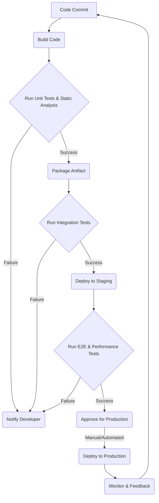

# CI/CD Fundamentals & Best Practices for Test Automation

## Overview
Continuous Integration (CI), Continuous Delivery (CD), and Continuous Deployment (CD) form the backbone of modern software development, enabling teams to deliver high-quality software rapidly and reliably. For test automation engineers, understanding CI/CD is not just beneficial—it's essential. CI/CD pipelines automate the process of building, testing, and deploying applications, with automated tests acting as critical quality gates that ensure every change meets predefined quality standards before moving forward. This document will delve into these concepts, highlighting their importance, particularly in the realm of test automation.

## Detailed Explanation

### Continuous Integration (CI)
Continuous Integration is a development practice where developers frequently merge their code changes into a central repository, typically multiple times a day. Each integration is then verified by an automated build and automated tests to detect integration errors as quickly as possible.

**Key aspects:**
- **Frequent Commits:** Developers commit small, incremental changes.
- **Automated Builds:** Every commit triggers an automated build process.
- **Automated Tests:** Unit tests, and sometimes integration tests, are run automatically with each build.
- **Fast Feedback:** Developers receive immediate feedback on the health of their changes.

**Benefits for Test Automation:**
- **Early Bug Detection:** Identifies integration issues and broken functionality almost immediately.
- **Reduced Integration Problems:** Avoids "integration hell" by catching conflicts early.
- **Improved Code Quality:** Encourages smaller, more focused changes, leading to better code.

### Continuous Delivery (CD)
Continuous Delivery is an extension of Continuous Integration. It ensures that software can be released to production at any time, once changes have passed automated tests. This means that every change, whether it's a new feature, a bug fix, or a configuration change, is ready for deployment to a production environment after the CI stage. The deployment to production, however, is a manual step.

**Key aspects:**
- **Deployable Artifacts:** Builds produce deployable artifacts (e.g., JARs, Docker images).
- **Automated Testing (Broader Scope):** Includes a wider range of automated tests like system, acceptance, and performance tests in pre-production environments.
- **Ready for Release:** Software is always in a state where it can be released to end-users.

**Benefits for Test Automation:**
- **Reduced Release Risk:** Deployments are routine and less prone to errors due to thorough automation.
- **Faster Time to Market:** New features and fixes can be released to users quickly.
- **Consistent Environments:** Ensures that development, testing, and production environments are consistent.

### Continuous Deployment (CD)
Continuous Deployment takes Continuous Delivery a step further. With Continuous Deployment, every change that passes all stages of the CI/CD pipeline (including all automated tests) is automatically deployed to production without human intervention. This practice requires an extremely high level of confidence in the automated testing suite and the entire pipeline.

**Key aspects:**
- **Full Automation:** No manual gate for deployment to production.
- **High Trust in Tests:** Relies heavily on comprehensive and reliable automated tests.
- **Immediate Releases:** Changes are live almost instantly after development.

**Benefits for Test Automation:**
- **True Agility:** Enables continuous flow of value to users.
- **Maximum Efficiency:** Eliminates manual bottlenecks in the release process.
- **Rapid Iteration:** Allows for quick experimentation and response to user feedback.

### Automated Tests as Quality Gates
Automated tests are the guardians of quality within a CI/CD pipeline. Each stage of the pipeline can incorporate different levels and types of automated tests, effectively acting as "quality gates." If any test fails, the pipeline typically stops, preventing the faulty code from progressing further.

**How they function as quality gates:**
- **Unit Tests (CI Stage):** Verify individual components or functions in isolation. A failing unit test immediately halts the build.
- **Integration Tests (CI/CD Stage):** Verify the interaction between different components or services.
- **End-to-End (E2E) Tests (CD Stage):** Simulate real user scenarios to ensure the entire application flows correctly.
- **Performance Tests (CD Stage):** Assess application responsiveness, scalability, and stability under load.
- **Security Tests (CD Stage):** Identify vulnerabilities in the code or infrastructure.
- **Static Code Analysis (CI Stage):** Checks code quality, style, and potential bugs without executing the code.

By strategically placing these quality gates throughout the pipeline, teams can ensure that only high-quality, stable code reaches production.

### Typical CI/CD Pipeline Diagram

A typical CI/CD pipeline involves several stages, often visualized sequentially:



**Stages Explained:**
1.  **Code Commit:** Developers push code to a version control system (e.g., Git).
2.  **Build Code:** The code is compiled, and dependencies are resolved.
3.  **Run Unit Tests & Static Analysis:** Automated unit tests are executed, and code quality tools analyze the code. (First Quality Gate)
4.  **Package Artifact:** If tests pass, a deployable artifact (e.g., Docker image, WAR file) is created.
5.  **Run Integration Tests:** Automated tests verify interactions between different modules or services. (Second Quality Gate)
6.  **Deploy to Staging:** The artifact is deployed to a staging or UAT environment.
7.  **Run E2E & Performance Tests:** Comprehensive tests are run against the deployed application in a realistic environment. (Third Quality Gate)
8.  **Approve for Production:** (Manual for CD, Automated for Continuous Deployment)
9.  **Deploy to Production:** The application is released to live users.
10. **Monitor & Feedback:** Performance and errors are monitored, and feedback is collected to inform future development.

## Code Implementation

While CI/CD pipelines are configured using various tools (Jenkins, GitLab CI, GitHub Actions, Azure DevOps, etc.), the core concept of integrating tests remains similar. Here's a conceptual example using GitHub Actions to illustrate how automated tests (e.g., Playwright E2E tests) might be integrated into a CI pipeline.

```yaml
# .github/workflows/ci.yml
name: CI/CD Pipeline

on:
  push:
    branches:
      - main
  pull_request:
    branches:
      - main

jobs:
  build_and_test:
    runs-on: ubuntu-latest

    steps:
    - name: Checkout code
      uses: actions/checkout@v4

    - name: Set up Node.js
      uses: actions/setup-node@v4
      with:
        node-version: '20'

    - name: Install dependencies
      run: npm ci

    - name: Run Unit Tests
      run: npm test -- --run-tests-by-path src/unit-tests/*.test.js
      # Assuming you have a script to run only unit tests

    - name: Install Playwright browsers
      run: npx playwright install --with-deps

    - name: Run Playwright E2E Tests
      run: npx playwright test
      # This step acts as a critical quality gate. If E2E tests fail, the workflow stops.

    - name: Build Application (if applicable)
      # This step would build your frontend/backend application
      run: npm run build

    - name: Upload production artifact
      uses: actions/upload-artifact@v4
      with:
        name: production-build
        path: ./build # Or wherever your build artifacts are located
      # This artifact can then be used in a subsequent deployment job (for CD/CD)
```

**Explanation:**
- The workflow is triggered on `push` and `pull_request` to the `main` branch.
- It checks out the code, sets up Node.js, and installs dependencies.
- **`Run Unit Tests`**: An early quality gate using `npm test`.
- **`Run Playwright E2E Tests`**: A more comprehensive quality gate. If these UI tests fail, the pipeline will stop, preventing further progression.
- **`Build Application`**: Creates the deployable artifact.
- **`Upload production artifact`**: Makes the built application available for subsequent deployment steps.

## Best Practices
-   **Automate Everything:** From building and testing to deployment and monitoring, automate as many steps as possible to reduce manual errors and increase speed.
-   **Version Control Your Pipeline:** Store your CI/CD pipeline configurations (e.g., Jenkinsfile, `.github/workflows/ci.yml`) in your version control system alongside your code. This ensures traceability and allows for collaborative development of the pipeline itself.
-   **Fast Feedback Loops:** Design your pipeline to provide quick feedback. Long-running builds or test suites delay defect detection and slow down development. Prioritize fast-executing tests early in the pipeline.
-   **Shift-Left Testing:** Integrate testing activities as early as possible in the development lifecycle. Unit and integration tests should be part of CI, with broader tests further down the pipeline.
-   **Reliable and Comprehensive Tests:** Invest in writing robust, non-flaky automated tests that cover critical functionalities. The pipeline is only as good as the tests it runs.
-   **Small, Frequent Commits:** Encourage developers to commit small, well-defined changes frequently. This reduces the blast radius of potential issues and makes debugging easier.
-   **Monitor Your Pipeline:** Implement monitoring for your CI/CD pipeline to track build statuses, test results, and deployment successes/failures. Use alerts to notify teams of issues promptly.
-   **Idempotent Deployments:** Ensure your deployment processes are idempotent, meaning that applying the same deployment repeatedly produces the same result and is safe to rerun.

## Common Pitfalls
-   **Flaky Tests:** Tests that intermittently pass or fail without any code change erode trust in the automation and lead to wasted time investigating false positives. Prioritize fixing flaky tests immediately.
-   **Long-Running Builds/Tests:** Pipelines that take a long time to complete (e.g., hours) negate the benefits of CI/CD by delaying feedback. Optimize build processes and parallelize tests.
-   **Ignoring Failed Builds:** Allowing failed builds or tests to be ignored or manually overridden without proper resolution undermines the quality gates and the purpose of CI/CD.
-   **Lack of Environment Consistency:** Inconsistencies between development, test, and production environments can lead to "works on my machine" syndrome and unexpected issues in later stages. Use containerization (e.g., Docker) or configuration management tools to maintain consistency.
-   **Manual Interventions in the Pipeline:** Too many manual steps or approvals slow down the pipeline and introduce human error. Automate as much as possible, only retaining manual gates for critical, high-risk deployments if absolutely necessary.
-   **Insufficient Test Coverage:** If automated tests don't adequately cover critical paths, bugs can slip through the pipeline, even if all tests pass. Strive for meaningful test coverage, focusing on risk areas.

## Interview Questions & Answers

1.  **Q: What is the primary difference between Continuous Delivery and Continuous Deployment?**
    **A:** The main difference lies in the final step of releasing to production. In **Continuous Delivery**, the software is always in a deployable state, and every change is validated by automated tests, making it ready for a *manual* release to production at any time. In **Continuous Deployment**, every change that passes all automated tests and quality gates is *automatically* released to production without human intervention. Continuous Deployment requires a higher level of trust in automation and tests.

2.  **Q: How do automated tests serve as quality gates in a CI/CD pipeline? Provide examples.**
    **A:** Automated tests act as quality gates by automatically verifying code quality and functionality at different stages of the pipeline, preventing defects from progressing. If tests at any gate fail, the pipeline typically stops, providing immediate feedback.
    *   **Examples:**
        *   **Unit Tests (CI stage):** Verify individual code components. If a unit test fails, the build breaks, indicating a developer error.
        *   **Static Code Analysis (CI stage):** Tools like SonarQube or ESLint check for code smells, security vulnerabilities, or style violations. A failed check can block the build.
        *   **Integration Tests (CD stage):** Verify interactions between services. If a new API endpoint breaks existing integrations, these tests fail.
        *   **End-to-End Tests (CD stage):** Simulate user flows. A failure here indicates a critical user experience issue in the deployed application.
        *   **Performance Tests (CD stage):** Ensure the application meets performance benchmarks. A performance regression can halt deployment.

3.  **Q: Why is frequent merging (Continuous Integration) important for test automation?**
    **A:** Frequent merging is crucial for test automation because it facilitates early and continuous detection of integration issues and bugs. When developers merge small changes frequently, automated tests run against these changes more often. This allows for:
    *   **Faster Isolation of Defects:** It's easier to pinpoint the source of a bug when only a small amount of new code has been introduced.
    *   **Reduced Merge Conflicts:** Smaller, more frequent merges minimize the chance of large, complex merge conflicts, which are time-consuming to resolve.
    *   **Consistent Codebase Health:** The codebase is always in a known, working state, making it easier for automated tests to run against a stable foundation.
    *   **Immediate Feedback:** Developers get quick feedback on their changes, allowing them to fix issues before they grow into larger problems.

## Hands-on Exercise

**Exercise: Build a Basic CI Pipeline for a Simple Project with Unit Tests**

**Objective:** Set up a GitHub Actions workflow that automatically builds a small project and runs its unit tests on every push to the `main` branch.

**Steps:**

1.  **Create a New GitHub Repository:**
    *   Go to GitHub and create a new public repository (e.g., `my-ci-project`).
    *   Clone the repository to your local machine: `git clone https://github.com/your-username/my-ci-project.git`

2.  **Initialize a Node.js Project:**
    *   Navigate into the project directory: `cd my-ci-project`
    *   Initialize a Node.js project: `npm init -y`
    *   Install a simple testing framework like `jest`: `npm install --save-dev jest`

3.  **Create a Simple Function and Unit Test:**
    *   Create a file `src/calculator.js`:
        ```javascript
        // src/calculator.js
        function add(a, b) {
          return a + b;
        }

        function subtract(a, b) {
          return a - b;
        }

        module.exports = { add, subtract };
        ```
    *   Create a file `test/calculator.test.js`:
        ```javascript
        // test/calculator.test.js
        const { add, subtract } = require('../src/calculator');

        describe('Calculator', () => {
          test('should add two numbers correctly', () => {
            expect(add(1, 2)).toBe(3);
            expect(add(-1, 1)).toBe(0);
            expect(add(0, 0)).toBe(0);
          });

          test('should subtract two numbers correctly', () => {
            expect(subtract(5, 3)).toBe(2);
            expect(subtract(3, 5)).toBe(-2);
            expect(subtract(0, 0)).toBe(0);
          });
        });
        ```

4.  **Configure `package.json` for Testing:**
    *   Open `package.json` and add a test script:
        ```json
        {
          "name": "my-ci-project",
          "version": "1.0.0",
          "description": "",
          "main": "index.js",
          "scripts": {
            "test": "jest" // Add this line
          },
          "keywords": [],
          "author": "",
          "license": "ISC",
          "devDependencies": {
            "jest": "^29.7.0"
          }
        }
        ```
    *   Run `npm test` locally to ensure tests pass.

5.  **Create GitHub Actions Workflow:**
    *   Create a directory `.github/workflows` at the root of your project.
    *   Inside `.github/workflows`, create a file named `main.yml`:
        ```yaml
        # .github/workflows/main.yml
        name: Node.js CI

        on:
          push:
            branches: [ main ]
          pull_request:
            branches: [ main ]

        jobs:
          build:
            runs-on: ubuntu-latest

            steps:
            - uses: actions/checkout@v4
            - name: Use Node.js 20.x
              uses: actions/setup-node@v4
              with:
                node-version: '20.x'
            - name: Install dependencies
              run: npm ci
            - name: Run tests
              run: npm test
        ```

6.  **Commit and Push:**
    *   Add all the new files: `git add .`
    *   Commit your changes: `git commit -m "feat: Add calculator and basic CI workflow"`
    *   Push to GitHub: `git push origin main`

7.  **Observe the Pipeline:**
    *   Go to your GitHub repository, navigate to the "Actions" tab.
    *   You should see your workflow running. Observe it building the project and running the tests.
    *   Try making a small change that breaks a test (e.g., change `add(1, 2)).toBe(4);`) and push it. See how the pipeline fails.

## Additional Resources
-   **Atlassian - What is CI/CD?**: [https://www.atlassian.com/continuous-delivery/ci-cd-pipeline-explained](https://www.atlassian.com/continuous-delivery/ci-cd-pipeline-explained)
-   **IBM - What is CI/CD?**: [https://www.ibm.com/topics/ci-cd](https://www.ibm.com/topics/ci-cd)
-   **GitHub Actions Documentation**: [https://docs.github.com/en/actions](https://docs.github.com/en/actions)
-   **Jenkins User Handbook**: [https://www.jenkins.io/doc/book/](https://www.jenkins.io/doc/book/)
-   **GitLab CI/CD Documentation**: [https://docs.gitlab.com/ee/ci/](https://docs.gitlab.com/ee/ci/)
