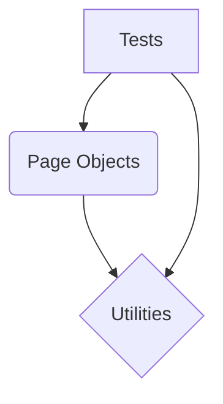

# Framework Architecture & Best Practices

## Overview
A robust and well-designed test automation framework is the backbone of efficient and reliable software quality assurance. It provides a structured approach to writing, executing, and maintaining automated tests, promoting reusability, scalability, and ease of debugging. This document outlines the core architecture, best practices, common pitfalls, and essential documentation for building a resilient test automation framework.

## Detailed Explanation

### Core Components and Their Interaction
A typical test automation framework often comprises several key components that interact seamlessly to achieve comprehensive test coverage. We will focus on three fundamental layers: Tests, Page Objects (or Pages), and Utilities (Utils).

**1. Tests Layer:**
*   **Purpose:** Contains the actual test scenarios, defining *what* is being tested. It orchestrates actions and assertions using methods provided by the Page Objects and Utility classes.
*   **Characteristics:**
    *   Should be highly readable and focus on business logic.
    *   Avoids direct interaction with UI elements or external services.
    *   Uses assertions to verify expected outcomes.

**2. Page Objects Layer (Pages):**
*   **Purpose:** Encapsulates the UI elements and interactions of a specific page or component within the application under test. It acts as an interface between the test and the UI.
*   **Characteristics:**
    *   Each page in the application should ideally have a corresponding Page Object class.
    *   Contains methods representing user interactions (e.g., `login(username, password)`, `clickSubmitButton()`).
    *   Locates elements using appropriate locators (ID, XPath, CSS Selector, etc.).
    *   Shields tests from UI changes; if a locator changes, only the Page Object needs updating.

**3. Utilities Layer (Utils):**
*   **Purpose:** Houses common functions, helper methods, and services that are reusable across multiple tests and Page Objects. This layer promotes code reusability and reduces duplication.
*   **Characteristics:**
    *   Examples include WebDriver initialization/teardown, data generation, file I/O operations, API client interactions, reporting helpers, or custom waits.
    *   Should be generic and independent of specific UI elements or business flows.

### Interaction Diagram (Mermaid)


*   **Tests** call methods on **Page Objects** to interact with the UI.
*   **Page Objects** use **Utilities** for common actions (e.g., explicit waits, WebDriver actions).
*   **Tests** can also directly call **Utilities** for non-UI related helper functions (e.g., data setup, API calls).

### Framework Documentation: `README.md` Example

A comprehensive `README.md` is crucial for any project, especially a test automation framework. It serves as the single source of truth for setup, execution, and contribution guidelines.

```markdown
# My Awesome Test Automation Framework

This repository contains the test automation framework for [Your Application Name]. It is built to ensure the quality and reliability of our application through automated end-to-end, integration, and API tests.

## Table of Contents
- [Prerequisites](#prerequisites)
- [Setup Instructions](#setup-instructions)
- [Running Tests](#running-tests)
- [Reporting](#reporting)
- [Contributing](#contributing)
- [Contact](#contact)

## Prerequisites
Before you begin, ensure you have met the following requirements:
*   Java Development Kit (JDK) 11 or higher
*   Apache Maven 3.6.0 or higher (if using Maven)
*   A compatible web browser (e.g., Chrome, Firefox)
*   WebDriver binaries for your chosen browser (e.g., ChromeDriver). These should ideally be managed by a tool like WebDriverManager or placed in your system PATH.

## Setup Instructions

1.  **Clone the repository:**
    ```bash
    git clone https://github.com/your-org/your-framework.git
    cd your-framework
    ```
2.  **Build the project (Maven example):**
    ```bash
    mvn clean install
    ```
    This command will download all necessary dependencies and compile the project.

## Running Tests

Tests can be executed via Maven or your IDE.

### Running all tests (Maven):
```bash
mvn test
```

### Running specific test classes (Maven):
```bash
mvn test -Dtest=com.example.tests.LoginTest
```

### Running tests with specific TestNG groups (Maven):
```bash
mvn test -Dgroups=regression
```

### Running tests from IDE:
Right-click on the desired test class or method and select "Run".

## Reporting
Test execution reports are generated in `target/surefire-reports/` (for Maven Surefire) or a custom directory configured in `testng.xml`.
*   HTML Reports: `target/surefire-reports/emailable-report.html` (TestNG default)

## Contributing
We welcome contributions to improve this framework! Please follow these guidelines:

1.  Fork the repository.
2.  Create a new branch (`git checkout -b feature/YourFeature`).
3.  Make your changes.
4.  Ensure all existing tests pass and add new tests for your changes.
5.  Commit your changes (`git commit -m 'feat: Add new feature X'`).
6.  Push to the branch (`git push origin feature/YourFeature`).
7.  Open a Pull Request.

## Contact
For any questions or support, please contact [Your Team/Email].
```

### Example Folder Structure Tree
A clear folder structure helps new team members quickly understand where to find or add files.

```
.
├── pom.xml                         # Maven project configuration
├── README.md                       # Project documentation
└── src/
    ├── main/
    │   └── java/
    │       └── com/example/
    │           ├── config/         # Configuration properties, constants
    │           │   └── ConfigurationManager.java
    │           └── utils/          # Generic utility classes (e.g., WebDriverManager, ExcelReader)
    │               ├── WebDriverFactory.java
    │               └── DataProviderUtil.java
    └── test/
        ├── java/
        │   └── com/example/
        │       └── tests/          # Test classes
        │           ├── LoginTest.java
        │           ├── ProductSearchTest.java
        │       └── pages/          # Page Object Model classes
        │           ├── LoginPage.java
        │           ├── HomePage.java
        │           └── SearchResultsPage.java
        └── resources/
            ├── testdata/           # Test data files (e.g., .csv, .json)
            │   └── users.csv
            └── log4j2.xml          # Logging configuration
            └── testng.xml          # TestNG suite configuration
```

## Code Implementation

Below are illustrative Java code snippets demonstrating the interaction between Tests, Page Objects, and Utility classes.

### 1. Utility Class Example (`WebDriverFactory.java`)

```java
package com.example.utils;

import io.github.bonigarcia.wdm.WebDriverManager;
import org.openqa.selenium.WebDriver;
import org.openqa.selenium.chrome.ChromeDriver;
import org.openqa.selenium.firefox.FirefoxDriver;
import org.openqa.selenium.safari.SafariDriver;

import java.util.concurrent.TimeUnit;

public class WebDriverFactory {

    private static ThreadLocal<WebDriver> driver = new ThreadLocal<>();

    public static WebDriver getDriver() {
        return driver.get();
    }

    public static void setDriver(String browser) {
        WebDriver webDriver;
        switch (browser.toLowerCase()) {
            case "chrome":
                WebDriverManager.chromedriver().setup();
                webDriver = new ChromeDriver();
                break;
            case "firefox":
                WebDriverManager.firefoxdriver().setup();
                webDriver = new FirefoxDriver();
                break;
            case "safari":
                webDriver = new SafariDriver(); // Safari often doesn't need WebDriverManager
                break;
            default:
                throw new IllegalArgumentException("Browser "" + browser + "" is not supported.");
        }
        webDriver.manage().timeouts().implicitlyWait(10, TimeUnit.SECONDS);
        webDriver.manage().window().maximize();
        driver.set(webDriver);
    }

    public static void quitDriver() {
        if (driver.get() != null) {
            driver.get().quit();
            driver.remove();
        }
    }
}
```

### 2. Page Object Example (`LoginPage.java`)

```java
package com.example.pages;

import org.openqa.selenium.WebDriver;
import org.openqa.selenium.WebElement;
import org.openqa.selenium.support.FindBy;
import org.openqa.selenium.support.PageFactory;

public class LoginPage {
    private WebDriver driver;

    // Locators
    @FindBy(id = "username")
    private WebElement usernameField;

    @FindBy(id = "password")
    private WebElement passwordField;

    @FindBy(id = "loginButton")
    private WebElement loginButton;

    @FindBy(css = ".error-message")
    private WebElement errorMessage;

    // Constructor
    public LoginPage(WebDriver driver) {
        this.driver = driver;
        PageFactory.initElements(driver, this); // Initializes WebElements
    }

    // Actions
    public void enterUsername(String username) {
        usernameField.sendKeys(username);
    }

    public void enterPassword(String password) {
        passwordField.sendKeys(password);
    }

    public void clickLoginButton() {
        loginButton.click();
    }

    public String getErrorMessage() {
        return errorMessage.getText();
    }

    // High-level actions
    public void login(String username, String password) {
        enterUsername(username);
        enterPassword(password);
        clickLoginButton();
    }
}
```

### 3. Test Class Example (`LoginTest.java`)

```java
package com.example.tests;

import com.example.pages.LoginPage;
import com.example.utils.WebDriverFactory;
import org.openqa.selenium.WebDriver;
import org.testng.Assert;
import org.testng.annotations.AfterMethod;
import org.testng.annotations.BeforeMethod;
import org.testng.annotations.Parameters;
import org.testng.annotations.Test;

public class LoginTest {
    private WebDriver driver;
    private LoginPage loginPage;

    @BeforeMethod
    @Parameters("browser") // Expects 'browser' parameter from testng.xml or Maven
    public void setup(String browser) {
        WebDriverFactory.setDriver(browser);
        driver = WebDriverFactory.getDriver();
        driver.get("http://your-app-url.com/login"); // Replace with your application URL
        loginPage = new LoginPage(driver);
    }

    @Test(description = "Verify successful login with valid credentials")
    public void testSuccessfulLogin() {
        loginPage.login("validUser", "validPassword");
        // Assuming successful login redirects to a dashboard or home page
        // In a real scenario, you'd navigate to and assert on the HomePage/DashboardPage
        Assert.assertTrue(driver.getCurrentUrl().contains("dashboard"), "Login was not successful.");
    }

    @Test(description = "Verify error message for invalid credentials")
    public void testInvalidLogin() {
        loginPage.login("invalidUser", "wrongPassword");
        Assert.assertEquals(loginPage.getErrorMessage(), "Invalid credentials", "Incorrect error message displayed.");
    }

    @AfterMethod
    public void teardown() {
        WebDriverFactory.quitDriver();
    }
}
```

## Best Practices
-   **Page Object Model (POM):** Always use POM for UI automation. It improves code readability, reduces duplication, and simplifies maintenance.
-   **Separation of Concerns:** Keep test logic, UI interactions, and utility functions distinct. Tests should only "tell" Page Objects what to do, not "how."
-   **Driver Management:** Implement robust WebDriver management (e.g., using `ThreadLocal` for parallel execution, proper setup/teardown).
-   **Centralized Configuration:** Store URLs, credentials, and other environment-specific data in a centralized configuration file (e.g., `config.properties`, `YAML`).
-   **Logging:** Implement comprehensive logging to aid debugging and provide execution insights.
-   **Reporting:** Integrate with rich reporting tools (e.g., ExtentReports, Allure) for better visibility of test results.
-   **Explicit Waits:** Prefer explicit waits over implicit waits to handle dynamic elements and improve test stability.
-   **Data-Driven Testing:** Utilize external data sources (CSV, Excel, JSON) for test data to improve test coverage and reusability.
-   **Version Control:** Maintain the framework under version control (Git) with clear branching and merging strategies.
-   **CI/CD Integration:** Design the framework to be easily integrated into CI/CD pipelines for automated execution on every code commit.

## Common Pitfalls
-   **Hardcoding Values:** Directly embedding URLs, credentials, or element locators in tests. This leads to maintenance nightmares.
    *   **Avoid:** `driver.get("http://localhost:8080/login");`
    *   **Instead:** Use a configuration manager: `driver.get(ConfigReader.getProperty("app.url") + "/login");`
-   **Mixing Concerns:** Writing UI interaction logic directly in test methods. This makes tests fragile and hard to read.
    *   **Avoid:** `driver.findElement(By.id("username")).sendKeys("user");`
    *   **Instead:** Use Page Objects: `loginPage.enterUsername("user");`
-   **Over-reliance on Implicit Waits:** Implicit waits can mask real timing issues and lead to flaky tests.
    *   **Avoid:** `driver.manage().timeouts().implicitlyWait(30, TimeUnit.SECONDS);`
    *   **Instead:** Use `WebDriverWait` for specific conditions: `new WebDriverWait(driver, 10).until(ExpectedConditions.visibilityOf(element));`
-   **Poor Element Locators:** Using brittle locators (e.g., highly specific XPath, dynamically generated IDs) that break easily with minor UI changes.
    *   **Avoid:** `By.xpath("/html/body/div[1]/div/div[2]/form/div[1]/input")`
    *   **Instead:** Prefer stable locators: `By.id("username")`, `By.cssSelector("button.submit-btn")`
-   **Lack of Error Handling:** Not implementing proper try-catch blocks or custom exception handling can lead to abrupt test failures without clear diagnostics.

## Interview Questions & Answers

1.  **Q: Explain the Page Object Model (POM) and its benefits.**
    **A:** POM is a design pattern used in test automation to create an object repository for UI elements within web pages. Each web page (or significant component) in the application is represented as a separate class. This class contains WebElements for the page's UI components and methods that interact with those components.
    **Benefits:**
    *   **Maintainability:** If the UI changes, only the Page Object needs to be updated, not every test case using that element.
    *   **Readability:** Tests become more readable as they interact with meaningful methods (e.g., `loginPage.login("user", "pass")`) rather than direct locator-based interactions.
    *   **Reusability:** Page Object methods can be reused across multiple test cases.
    *   **Reduced Duplication:** Avoids repeating element locators or interaction logic in multiple tests.

2.  **Q: How do you handle synchronization issues in Selenium (waits)?**
    **A:** Synchronization is critical for stable Selenium tests. I primarily use **Explicit Waits** (`WebDriverWait` with `ExpectedConditions`) to wait for a specific condition to be met before proceeding (e.g., element visibility, clickability, text presence). I avoid or use **Implicit Waits** sparingly, as they can mask timing issues and slow down tests. I also use `FluentWait` for more granular control over polling intervals and ignored exceptions.

3.  **Q: What is the purpose of a `ThreadLocal` in a test automation framework?**
    **A:** `ThreadLocal` is used to store data that is unique to each thread. In a test automation framework, it's commonly used to manage `WebDriver` instances when running tests in parallel. Each test thread gets its own `WebDriver` instance, preventing conflicts and ensuring thread-safety. This allows tests to run concurrently without interfering with each other's browser sessions.

4.  **Q: Describe how you would structure a test automation framework for scalability and maintainability.**
    **A:** I would structure it with clear layers:
    *   **Base Framework Layer:** Core utilities, driver management (`WebDriverFactory`), base test classes, configuration readers.
    *   **Page Object Layer:** Dedicated classes for each page/component with element locators and interaction methods.
    *   **Test Layer:** Test classes containing actual test scenarios, using Page Objects and base classes.
    *   **Data Layer:** Externalized test data (CSV, JSON, database) managed by data provider utilities.
    *   **Reporting Layer:** Integration with reporting tools like Allure or ExtentReports.
    *   **Helper/Service Layer:** For common actions (e.g., API interactions, database operations, file handlers).
    This separation ensures maintainability, reusability, and makes it easier to scale by adding new tests or integrating new features without impacting existing ones.

## Hands-on Exercise
**Objective:** Enhance the provided framework snippets to include a `DashboardPage` and a data provider for login credentials.

1.  **Create `DashboardPage.java`:**
    *   Identify a unique element on the dashboard page (e.g., a welcome message, a user profile link).
    *   Add a method to verify successful navigation to the dashboard (e.g., `isUserLoggedIn()`).
2.  **Implement Data Provider:**
    *   Create a simple CSV file `users.csv` with columns `username,password,expectedResult` (e.g., `validUser,validPassword,success` and `invalidUser,wrongPass,failure`).
    *   Create a `DataProviderUtil` class in the `utils` package to read this CSV and provide data to the `LoginTest`.
    *   Modify `LoginTest` to use this data provider for both successful and unsuccessful login tests.
3.  **Refactor `LoginTest`:**
    *   After successful login, instantiate `DashboardPage` and assert using its methods.
    *   Use the data provider to run multiple login scenarios.

## Additional Resources
-   **Selenium Documentation:** [https://www.selenium.dev/documentation/](https://www.selenium.dev/documentation/)
-   **TestNG Documentation:** [https://testng.org/doc/index.html](https://testng.org/doc/index.html)
-   **Page Object Model Explained:** [https://www.toolsqa.com/selenium-webdriver/page-object-model/](https://www.toolsqa.com/selenium-webdriver/page-object-model/)
-   **WebDriverManager GitHub:** [https://github.com/bonigarcia/webdrivermanager](https://github.com/bonigarcia/webdrivermanager)
