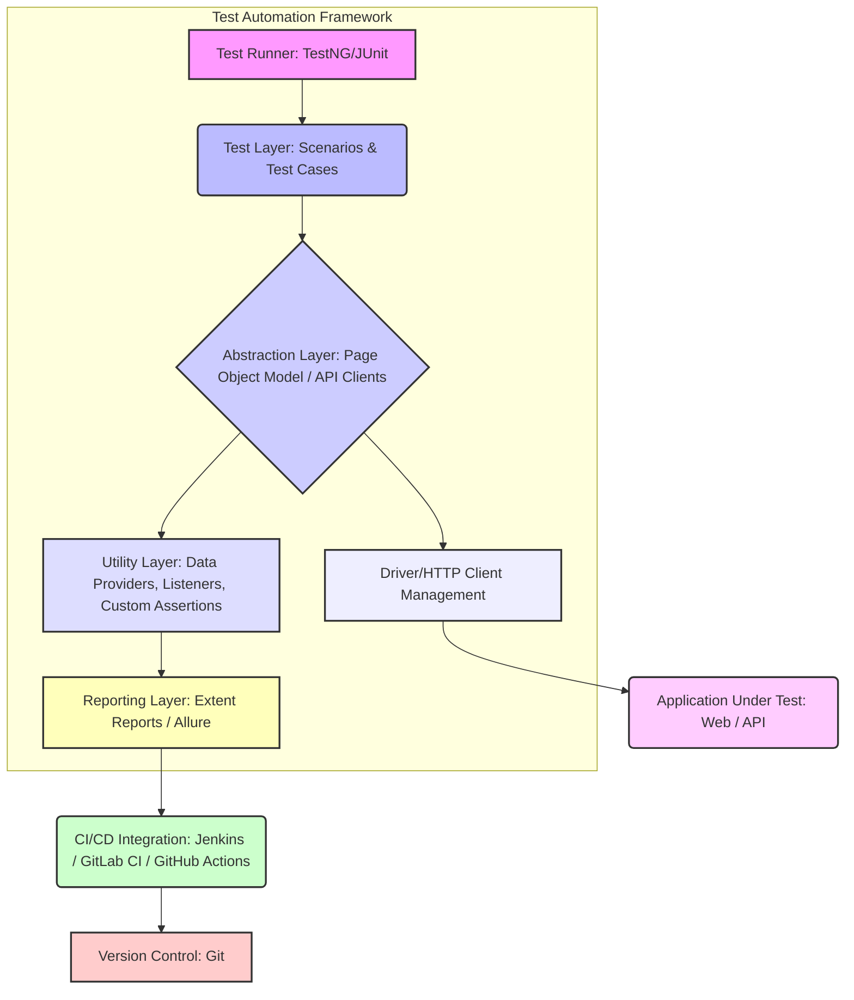

# Framework Interview Preparation: Presentation Slides

## Overview
In high-stakes technical interviews, especially for Senior SDET or Lead positions, effectively communicating your test automation framework's features, architecture, and impact is crucial. This document outlines how to create compelling presentation slides that serve as a visual aid during remote or in-person interviews. These slides are not just for showing off; they demonstrate your ability to articulate complex technical solutions, quantify impact, and think strategically about test automation.

## Detailed Explanation
The goal of these slides is to provide a structured overview of your framework, highlighting its key components, the problems it solves, and the value it delivers. This typically involves 3-5 slides, focusing on:

1.  **Architecture Overview:** A high-level diagram showcasing the different layers and components of your framework (e.g., test runner, page object model, reporting, utilities, CI/CD integration). Emphasize modularity, scalability, and maintainability.
2.  **Key Features & Capabilities:** Detail specific features like data-driven testing, parallel execution, cross-browser support, API testing integration, mobile testing capabilities, self-healing selectors (if applicable), or advanced reporting.
3.  **Impact & Metrics:** This is critical. Quantify the benefits your framework brought to the project/organization. Include metrics such as:
    *   Reduction in test execution time (e.g., "Reduced regression suite execution time by 60% through parallelization.")
    *   Improvement in defect detection rate (e.g., "Increased early defect detection by 25%.")
    *   Cost savings (e.g., "Saved X developer hours per month on test maintenance.")
    *   Test coverage growth (e.g., "Achieved 85% critical path test coverage.")
    *   Faster feedback loops (e.g., "Integrated with CI/CD for sub-10 minute feedback on pull requests.")
    *   Reduction in flaky tests.
4.  **Future Enhancements (Optional but Recommended):** Briefly mention your vision for the framework's evolution, demonstrating foresight and continuous improvement mindset.

**Visuals are key:** Use clear diagrams, icons, and minimal text per slide. The slides should complement your verbal explanation, not replace it.

## Code Implementation
While presentation slides don't involve "code implementation" in the traditional sense, they are about presenting your code and framework's structure. Here's how you might structure the "mock code" for a conceptual slide on architecture:

```markdown
# Slide 1: Test Automation Framework Architecture Overview

## Components & Flow



*   **Test Runner**: Manages test execution (e.g., TestNG, JUnit).
*   **Test Layer**: Contains the actual test scenarios, designed to be readable and focused on business logic.
*   **Abstraction Layer**: Decouples tests from UI/API implementation details using Page Object Model (for UI) or dedicated API clients (for API).
*   **Utility Layer**: Provides common functionalities like data generation, test listeners for lifecycle hooks, and custom assertion helpers.
*   **Driver/HTTP Client Management**: Handles browser/driver setup and teardown, or HTTP client configuration for API tests.
*   **Reporting Layer**: Generates comprehensive test execution reports (e.g., Extent Reports, Allure) for traceability and analysis.
*   **CI/CD Integration**: Seamlessly integrates into the continuous integration/delivery pipeline for automated execution on every code change.
```

## Best Practices
-   **Keep it concise:** Each slide should convey one main idea. Use bullet points and visuals, not dense paragraphs.
-   **Focus on value:** Emphasize how your framework solves real-world problems and brings quantifiable benefits.
-   **Know your audience:** Tailor the depth of technical detail to the interviewer's role and expected level of understanding.
-   **Practice your narrative:** Your slides are an aid; your ability to explain and elaborate is paramount. Practice explaining each slide's content smoothly.
-   **Be ready for deep dives:** While presenting high-level, be prepared to answer detailed questions about any component or decision.

## Common Pitfalls
-   **Overloading slides with text:** Reading off slides is disengaging. Use minimal text as prompts for your discussion.
-   **Lack of quantifiable impact:** Interviewers want to know the "so what." Without metrics, your framework's value is unclear.
-   **Too much detail, too soon:** Start high-level and drill down only when prompted. Don't overwhelm with implementation specifics on the first slide.
-   **Not practicing:** A clunky presentation undermines the quality of your work.
-   **Ignoring visual appeal:** Poorly designed or hard-to-read slides reflect negatively on attention to detail.

## Interview Questions & Answers
1.  **Q: Can you walk me through the architecture of a test automation framework you've built or significantly contributed to?**
    **A:** "Certainly. I designed a [Java/Python/JS]-based framework utilizing [Selenium WebDriver/Playwright/Cypress] for UI testing and [REST Assured/HttpClient] for API testing. At its core, the framework follows a [Page Object Model/Screenplay Pattern] for maintainability and scalability. We have a clear separation of concerns with dedicated layers for test definitions, page/API interactions, utility functions (like data providers and custom listeners), and reporting. All tests are integrated into our [Jenkins/GitLab CI] pipeline, triggering on every pull request and providing immediate feedback. A key aspect is its modular design, allowing easy integration of new test types or tools."

2.  **Q: How did your framework contribute to the quality and delivery speed of the product? Can you share some metrics?**
    **A:** "The framework significantly improved our quality gates. For instance, by implementing parallel execution, we reduced our full regression suite runtime from 4 hours to just 45 minutes, enabling faster release cycles. We also saw a 30% reduction in production defects directly attributable to the improved test coverage and earlier bug detection facilitated by the framework. Furthermore, it streamlined test creation, leading to a 20% increase in test automation coverage over 6 months without increasing team size, translating to substantial savings in manual testing efforts."

3.  **Q: What challenges did you face while building/maintaining the framework, and how did you overcome them?**
    **A:** "One significant challenge was managing test data effectively, especially for complex scenarios. We addressed this by developing a robust data-driven testing mechanism, integrating with [database/external YAML files] for test data management, and implementing data generation utilities. Another was handling flaky tests; we tackled this through explicit waits, robust locator strategies (avoiding fragile XPaths), and implementing retry mechanisms at the framework level, alongside continuous analysis of failure patterns to identify and fix root causes."

## Hands-on Exercise
**Task:** Design a simple presentation (3 slides) for a hypothetical test automation framework for an e-commerce website.
*   **Slide 1:** Framework Architecture (Diagram + Key Components)
*   **Slide 2:** Key Features (e.g., cross-browser, API testing, data-driven) and their benefits.
*   **Slide 3:** Impact Metrics (e.g., reduced execution time, increased defect detection).
*   **Constraint:** Use only icons and 1-2 bullet points per feature/component.

## Additional Resources
-   **Effective Technical Presentations:** [https://www.coursera.org/articles/how-to-give-atechnical-presentation](https://www.coursera.org/articles/how-to-give-atechnical-presentation)
-   **Quantifying the Value of Test Automation:** [https://www.saucelabs.com/blog/how-to-calculate-roi-of-test-automation](https://www.saucelabs.com/blog/how-to-calculate-roi-of-test-automation)
-   **Mermaid Live Editor (for diagrams):** [https://mermaid.live/](https://mermaid.live/)
