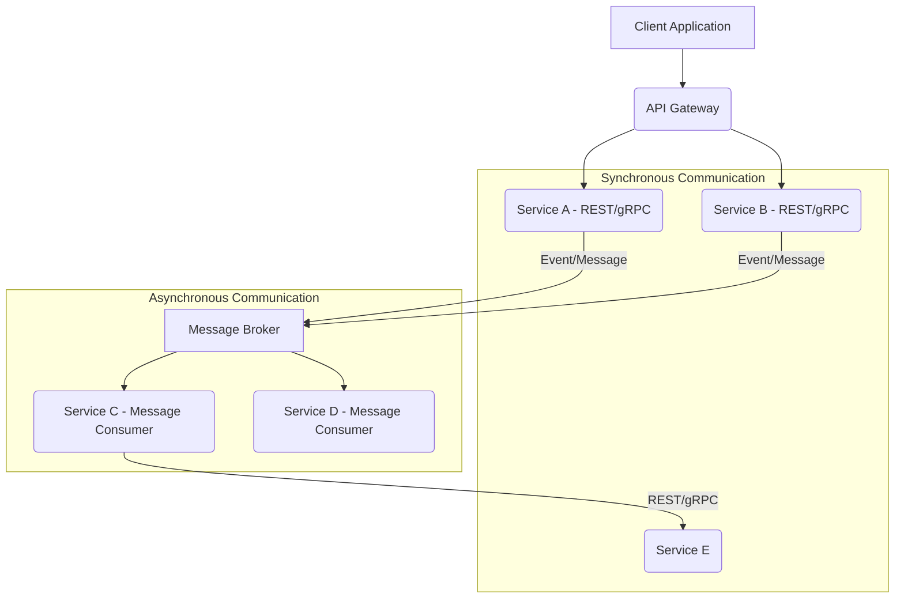

# Microservices Architecture and Testing Challenges

## Overview
Microservices architecture has become a prevalent approach for building scalable, resilient, and independently deployable applications. Unlike monolithic applications where all components are tightly coupled within a single unit, microservices break down an application into a collection of small, autonomous services, each running in its own process and communicating through lightweight mechanisms, often an API. This paradigm shift, while offering significant benefits in terms of agility and scalability, introduces a unique set of testing challenges that SDETs must master to ensure software quality. Understanding these challenges and implementing effective testing strategies is crucial for the success of any microservice-based system.

## Detailed Explanation

### Monolithic Architecture vs. Microservices Architecture

#### Monolithic Architecture
A monolithic application is built as a single, indivisible unit. All its components—user interface, business logic, and data access layer—are packaged together and deployed as one large application.

**Characteristics:**
*   **Single Codebase:** All features are part of one large application.
*   **Single Deployment Unit:** The entire application is deployed together.
*   **Shared Resources:** Components often share resources like databases and memory.

**Pros:**
*   **Simpler Development (initially):** Easier to build, test, and deploy small, simple applications.
*   **Easier Debugging:** All code runs in one process, making tracing easier.
*   **Fewer Cross-Cutting Concerns:** Centralized logging, configuration, and monitoring.

**Cons:**
*   **Scalability Challenges:** Scaling requires scaling the entire application, even if only a small part needs more resources.
*   **Maintenance Complexity:** Large codebases become difficult to understand and maintain over time ("Big Ball of Mud").
*   **Technology Lock-in:** Difficult to adopt new technologies or frameworks for specific components.
*   **Slower Development:** Changes in one part often require redeploying the entire application, slowing down release cycles.

#### Microservices Architecture
Microservices architecture structures an application as a collection of loosely coupled, independently deployable services. Each service typically focuses on a single business capability.

**Characteristics:**
*   **Decentralized:** Services are autonomous and can be developed, deployed, and scaled independently.
*   **Single Responsibility Principle:** Each service focuses on a specific business function.
*   **Communication via APIs:** Services communicate using lightweight mechanisms (e.g., HTTP/REST, gRPC, message brokers).
*   **Data Decentralization:** Each service typically owns its data store.

**Pros:**
*   **Scalability:** Individual services can be scaled independently based on demand.
*   **Agility & Faster Development:** Teams can develop, test, and deploy services independently and more frequently.
*   **Technology Diversity:** Different services can use different technologies optimized for their specific needs.
*   **Resilience:** Failure in one service is less likely to bring down the entire application.

**Cons:**
*   **Operational Complexity:** More services mean more deployments, monitoring, and infrastructure to manage.
*   **Distributed Systems Challenges:** Handling network latency, fault tolerance, and distributed data consistency.
*   **Increased Development Complexity:** Requires careful design for communication, data consistency, and distributed tracing.
*   **Testing Complexity:** The focus of this document.

### Microservices Testing Challenges

The distributed nature of microservices introduces several significant testing challenges:

1.  **Data Consistency:**
    *   **Challenge:** In a monolithic application, transactions often ensure ACID properties across the entire application. In microservices, data is often decentralized across multiple services, each with its own database. Ensuring data consistency across these services, especially during complex business processes involving multiple services, becomes a significant challenge. Eventual consistency is a common pattern, but it introduces complexities in testing scenarios where immediate consistency is assumed.
    *   **Testing Impact:** Traditional transactional testing is insufficient. Testers need to verify eventual consistency, test for race conditions, and ensure compensating transactions or sagas work correctly to maintain data integrity.

2.  **Service Dependencies:**
    *   **Challenge:** Microservices rely heavily on inter-service communication. A single user request might traverse multiple services. Testing a single service often requires its dependent services to be available and behaving as expected. Managing the complexity of setting up and coordinating all dependent services for integration or end-to-end testing can be daunting.
    *   **Testing Impact:** This necessitates strategies like contract testing to ensure compatible APIs, service virtualization/mocking to isolate services during testing, and robust environment management for integration tests. End-to-end tests become more complex to orchestrate and debug.

3.  **Deployment Complexity:**
    *   **Challenge:** With many services, each having its own deployment pipeline, the complexity of managing releases, versioning, and environment configurations escalates. Ensuring that all services are deployed correctly and are compatible with each other in a given environment is critical.
    *   **Testing Impact:** Comprehensive automated deployment pipelines (CI/CD) become essential, incorporating various levels of testing (unit, integration, contract, end-to-end). Canary releases, blue-green deployments, and feature flags need to be tested thoroughly to ensure new versions don't introduce regressions or compatibility issues.

### Inter-service Communication (Conceptual Diagram)

Microservices communicate using various protocols, broadly categorized into synchronous and asynchronous patterns.

*   **Synchronous Communication (e.g., REST, gRPC):** Services directly call each other and wait for a response.
*   **Asynchronous Communication (e.g., Message Queues):** Services communicate indirectly via a message broker; the sender doesn't wait for an immediate response.


**Explanation:**
*   **API Gateway:** Acts as a single entry point for clients, routing requests to appropriate services.
*   **Service A, B, E, H:** Communicate synchronously using technologies like REST (HTTP/JSON) or gRPC (Protocol Buffers over HTTP/2). These calls are typically blocking.
*   **Message Broker:** Facilitates asynchronous communication. Services publish events/messages to topics/queues, and other services subscribe to them. Examples: Kafka, RabbitMQ, AWS SQS/SNS.
*   **Service C, D:** Consume messages from the message broker, reacting to events.

## Code Implementation (Conceptual Examples)

### 1. Synchronous REST Communication (Java with Spring Boot & RestTemplate/WebClient)

**Service A (Client) calling Service B (API):**

```java
// Service A: Order Processing Service
// Example of making a synchronous REST call to a Payment Service

import org.springframework.stereotype.Service;
import org.springframework.web.client.RestTemplate; // or WebClient for reactive approach

@Service
public class OrderService {

    private final RestTemplate restTemplate; // Or WebClient webClient;
    private final String paymentServiceBaseUrl = "http://payment-service"; // Service discovery in real app

    public OrderService(RestTemplate restTemplate) {
        this.restTemplate = restTemplate;
    }

    public String processOrder(String orderId, double amount) {
        // Assume PaymentRequest is a DTO matching Payment Service's expected input
        PaymentRequest paymentRequest = new PaymentRequest(orderId, amount);

        try {
            // Synchronous call to Payment Service
            PaymentResponse response = restTemplate.postForObject(
                paymentServiceBaseUrl + "/payments/process",
                paymentRequest,
                PaymentResponse.class
            );

            if (response != null && "SUCCESS".equals(response.getStatus())) {
                return "Order " + orderId + " processed and payment successful.";
            } else {
                return "Order " + orderId + " processed, but payment failed: " + (response != null ? response.getMessage() : "Unknown error");
            }
        } catch (Exception e) {
            // Handle network issues, service unavailability, timeouts etc.
            return "Failed to communicate with payment service: " + e.getMessage();
        }
    }
}

// Assume PaymentRequest and PaymentResponse are simple POJOs/Records
record PaymentRequest(String orderId, double amount) {}
record PaymentResponse(String status, String message) {}
```

### 2. Asynchronous Messaging Communication (Java with Apache Kafka)

**Service A (Producer) sending a message to a Message Broker:**

```java
// Service A: Order Creation Service
// Example of producing an order event to a Kafka topic

import org.springframework.kafka.core.KafkaTemplate;
import org.springframework.stereotype.Service;

@Service
public class OrderEventProducer {

    private final KafkaTemplate<String, String> kafkaTemplate;
    private final String orderTopic = "order-events";

    public OrderEventProducer(KafkaTemplate<String, String> kafkaTemplate) {
        this.kafkaTemplate = kafkaTemplate;
    }

    public void sendOrderCreatedEvent(String orderId, String customerId, double totalAmount) {
        String eventMessage = String.format("{"orderId": "%s", "customerId": "%s", "totalAmount": %.2f, "status": "CREATED"}",
                                            orderId, customerId, totalAmount);
        try {
            kafkaTemplate.send(orderTopic, orderId, eventMessage)
                         .addCallback(
                             result -> System.out.println("Sent order event: " + eventMessage + " with offset " + result.getRecordMetadata().offset()),
                             ex -> System.err.println("Failed to send order event: " + eventMessage + " due to " + ex.getMessage())
                         );
        } catch (Exception e) {
            System.err.println("Error producing order event: " + e.getMessage());
        }
    }
}
```

**Service B (Consumer) receiving a message from a Message Broker:**

```java
// Service B: Notification Service
// Example of consuming order events from a Kafka topic

import org.springframework.kafka.annotation.KafkaListener;
import org.springframework.stereotype.Service;

@Service
public class OrderEventConsumer {

    @KafkaListener(topics = "order-events", groupId = "notification-group")
    public void listenOrderEvents(String message) {
        System.out.println("Received order event for notification: " + message);
        // Parse the message (e.g., JSON) and send a notification to the customer
        // Example: {"orderId": "123", "customerId": "CUST001", "totalAmount": 99.99, "status": "CREATED"}
        // In a real application, you'd parse this JSON and trigger an email/SMS.
        System.out.println("Sending notification for order: " + extractOrderId(message));
    }

    private String extractOrderId(String message) {
        // Simple regex or JSON parsing to get orderId
        // For production, use a proper JSON library like Jackson
        int start = message.indexOf(""orderId": "") + ""orderId": "".length();
        int end = message.indexOf(""", start);
        return message.substring(start, end);
    }
}
```

## Best Practices

*   **Contract Testing:** Use tools like Pact or Spring Cloud Contract to define and verify the API contracts between communicating services. This ensures that changes in one service's API don't break its consumers, even before full integration.
*   **Service Virtualization/Mocking:** For integration tests, use service virtualization (e.g., WireMock, Hoverfly) to simulate the behavior of dependent services. This isolates the service under test, makes tests faster and more reliable, and avoids complex environment setups.
*   **Observability (Logging, Tracing, Metrics):** Implement robust logging, distributed tracing (e.g., OpenTelemetry, Zipkin, Jaeger), and metrics (e.g., Prometheus, Grafana) across all services. This is critical for understanding system behavior, debugging issues in a distributed environment, and monitoring health.
*   **Automated Deployment Pipelines (CI/CD):** Invest heavily in CI/CD. Every service should have its own automated pipeline that includes unit, integration, and contract tests, followed by automated deployment to various environments.
*   **Consumer-Driven Contracts:** Adopt a consumer-driven contract (CDC) approach where consumers specify the API contracts they expect from a provider. This ensures providers build APIs that actually meet consumer needs.
*   **Testing in Production (with safeguards):** Employ techniques like A/B testing, canary releases, and feature flags to test new features or versions in a controlled manner in a production environment, minimizing blast radius for potential issues.

## Common Pitfalls

*   **Ignoring End-to-End Testing:** While unit and integration tests are crucial, neglecting end-to-end testing can lead to integration issues that only surface in production when all services are deployed together.
*   **Distributed Monolith:** Over-coupling services through shared databases or tightly coupled synchronous communication can lead to a "distributed monolith," losing the benefits of microservices while inheriting all the complexity.
*   **Over-engineering:** Building microservices where a monolith would suffice can introduce unnecessary complexity, overhead, and maintenance costs without providing proportional benefits. Start simple and split services when justified by business needs or scaling requirements.
*   **Lack of Decentralized Governance:** Imposing a single technology stack or process across all teams can hinder the autonomy and agility that microservices aim to provide.
*   **Inadequate Monitoring and Alerting:** Without proper observability, debugging issues in a distributed system can be a nightmare. Ignoring comprehensive logging, tracing, and metrics can leave teams blind to performance bottlenecks or errors.
*   **Neglecting Data Consistency Strategies:** Assuming immediate data consistency across distributed databases will lead to hard-to-debug bugs. Not properly implementing and testing eventual consistency patterns (e.g., Sagas) is a major pitfall.

## Interview Questions & Answers

1.  **Q: What are the key differences between monolithic and microservices architecture, and what are the main benefits of microservices?**
    *   **A:** Monoliths are single, tightly coupled applications, while microservices are collections of small, independent, loosely coupled services. Benefits of microservices include improved scalability (individual services can scale), faster development cycles (independent deployments), technology diversity, and enhanced resilience (failure isolation).

2.  **Q: Describe the main testing challenges unique to microservices architecture.**
    *   **A:** The primary challenges are:
        *   **Data Consistency:** Ensuring data integrity across multiple decentralized data stores, especially with eventual consistency models.
        *   **Service Dependencies:** Managing the complexity of testing a service that relies on many other services, requiring strategies like service virtualization or contract testing.
        *   **Deployment Complexity:** Orchestrating deployments and ensuring compatibility across numerous independently deployed services.
        *   **Observability:** Debugging and monitoring issues across a distributed system requires robust logging, tracing, and metrics.

3.  **Q: How do you ensure data consistency in a microservices environment where each service has its own database?**
    *   **A:** Data consistency is typically achieved through patterns like eventual consistency. This involves using message queues or event buses (e.g., Kafka) to propagate changes asynchronously between services. When a change occurs in one service, it emits an event, which other services consume and update their own data stores accordingly. For complex, multi-step transactions, the Saga pattern is often used, involving a sequence of local transactions coordinated by events, with compensating transactions for failures.

4.  **Q: Explain Contract Testing. Why is it important in a microservices context?**
    *   **A:** Contract testing verifies that the API contracts between a service (provider) and its consumers are met. The consumer defines the contract (e.g., expected request/response formats), and the provider verifies its API against this contract. It's crucial because it ensures compatibility between independently deployed services without requiring full end-to-end integration tests for every change, catching integration issues early in the CI/CD pipeline and preventing breaking changes.

5.  **Q: What strategies would you employ to test a microservice that has multiple external dependencies?**
    *   **A:**
        *   **Unit Tests:** Thoroughly test the internal logic of the service in isolation.
        *   **Component/Service Tests:** Test the service's API endpoints and business logic, typically mocking out direct external dependencies.
        *   **Contract Tests:** Ensure the service's API conforms to its consumers' expectations and that it correctly consumes its upstream dependencies' APIs (using consumer-driven contracts).
        *   **Service Virtualization/Mocking:** Use tools like WireMock to simulate the behavior of external (downstream) dependent services for integration testing, controlling their responses and error scenarios.
        *   **Integration Tests:** Test the service with its *real* immediate dependencies in a dedicated environment.
        *   **End-to-End Tests:** Higher-level tests that simulate real user flows across multiple services, usually in a staging-like environment.

## Hands-on Exercise

**Scenario:** Implement a simple "Product Catalog" microservice and an "Inventory Management" microservice.

**Task:**
1.  **Product Catalog Service:**
    *   Expose a REST API endpoint `GET /products/{id}` to retrieve product details.
    *   Expose a REST API endpoint `POST /products` to add a new product.
2.  **Inventory Management Service:**
    *   Expose a REST API endpoint `GET /inventory/{productId}` to check stock levels.
    *   Internally, this service should *consume* the `GET /products/{id}` endpoint from the Product Catalog Service to get product details before checking inventory (demonstrates synchronous communication).
3.  **Implement Contract Tests:** Use a tool like Pact (or Spring Cloud Contract if using Java/Spring) to define and verify the contract between the Inventory Management Service (consumer) and the Product Catalog Service (provider).
4.  **Implement Service Virtualization:** For the Inventory Management Service's integration tests, virtualize the Product Catalog Service using WireMock to simulate various product scenarios (e.g., product found, product not found, slow response).

This exercise will give you practical experience with synchronous inter-service communication, API design, and critical microservices testing strategies like contract testing and service virtualization.

## Additional Resources

*   **Microservices Patterns Book by Chris Richardson:** [https://microservices.io/patterns/index.html](https://microservices.io/patterns/index.html) (Essential reading)
*   **Martin Fowler's Microservices Article:** [https://martinfowler.com/articles/microservices.html](https://martinfowler.com/articles/microservices.html) (Classic introduction)
*   **Pact Documentation (Contract Testing):** [https://docs.pact.io/](https://docs.pact.io/)
*   **WireMock Documentation (Service Virtualization):** [http://wiremock.org/docs/](http://wiremock.org/docs/)
*   **OpenTelemetry:** [https://opentelemetry.io/](https://opentelemetry.io/) (For distributed tracing and observability)
*   **Saga Pattern (Microservices.io):** [https://microservices.io/patterns/data/saga.html](https://microservices.io/patterns/data/saga.html) (For distributed transactions)
