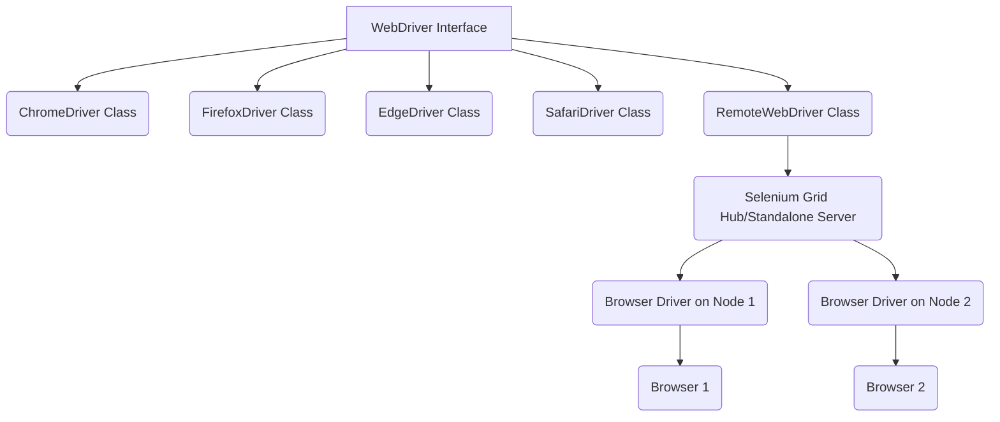

# WebDriver vs. RemoteWebDriver in Selenium

## Overview
In Selenium automation, `WebDriver` and `RemoteWebDriver` are fundamental concepts that represent the interface and its remote implementation, respectively. Understanding their differences and when to use each is crucial for building robust, scalable, and distributed test automation frameworks. This guide will clarify these concepts, their hierarchy, and practical use cases, especially in the context of Selenium Grid.

## Detailed Explanation

### WebDriver Interface
`WebDriver` is an interface in Selenium. It acts as a contract that all browser-specific driver classes (like `ChromeDriver`, `FirefoxDriver`, `EdgeDriver`, `SafariDriver`) must implement. This interface provides a common set of methods for interacting with web browsers, such as `get()`, `findElement()`, `click()`, `sendKeys()`, `quit()`, etc.

The core idea behind the `WebDriver` interface is to provide a consistent API for controlling different browsers. When you write `WebDriver driver = new ChromeDriver();`, you are programming to the interface, which is a key OOP principle (Polymorphism). This makes your test code portable across different browsers with minimal changes.

**Key characteristics of `WebDriver`:**
-   **Interface:** Defines the standard methods for browser automation.
-   **Local Execution:** Typically used for executing tests on the local machine where the browser and driver executable reside.
-   **Polymorphic:** Allows you to instantiate different browser drivers using a common interface type.

### RemoteWebDriver Class
`RemoteWebDriver` is a class that implements the `WebDriver` interface. Its primary purpose is to allow tests to be executed on a remote machine. This is particularly useful in environments like Selenium Grid, where tests run on a central hub, and the actual browser interaction happens on distributed nodes.

When you use `RemoteWebDriver`, you specify the URL of the remote Selenium Grid Hub (or a standalone Selenium Server) and the desired browser capabilities (e.g., Chrome, Firefox, version, platform). The `RemoteWebDriver` then communicates with the remote server using the W3C WebDriver protocol (or the now deprecated JSON Wire Protocol in older Selenium versions). The remote server, in turn, forwards the commands to the appropriate browser driver on a registered node.

**Key characteristics of `RemoteWebDriver`:**
-   **Class:** Implements the `WebDriver` interface.
-   **Remote Execution:** Designed for running tests on remote machines, often part of a Selenium Grid setup or cloud-based testing platforms (e.g., Sauce Labs, BrowserStack).
-   **Requires Configuration:** Needs a `URL` pointing to the remote Selenium server and `DesiredCapabilities` or `Options` to specify the target browser and environment.
-   **Scalability:** Enables parallel execution of tests across multiple browsers and operating systems on different machines.

### Hierarchy Diagram



In the diagram:
-   `WebDriver Interface` defines the common API.
-   `ChromeDriver`, `FirefoxDriver`, etc., are concrete implementations for local execution.
-   `RemoteWebDriver` is another concrete implementation that proxies commands to a remote Selenium server.
-   The remote server (Hub) then dispatches these commands to the actual browser drivers running on different nodes.

### When to Use Which

| Feature / Scenario       | `WebDriver` (Local Drivers)                            | `RemoteWebDriver`                                    |
|:-------------------------|:-------------------------------------------------------|:-----------------------------------------------------|
| **Execution Environment**| Local machine                                          | Remote machine (Selenium Grid, Cloud Platforms)      |
| **Setup Complexity**     | Simpler: just need driver executable and browser       | More complex: requires remote server setup (Grid)    |
| **Scalability**          | Limited to local machine resources                     | Highly scalable, distributed testing                 |
| **Parallel Execution**   | Can be achieved locally with careful configuration     | Inherently designed for parallel and distributed tests |
| **Cross-Browser/OS**     | Requires installing all browsers/drivers locally       | Easily switch browsers/OS via capabilities/options   |
| **Use Cases**            | Local development, debugging, small projects           | CI/CD pipelines, large test suites, cross-browser testing |
| **Configuration**        | Minimal (e.g., `new ChromeDriver()`)                   | `new RemoteWebDriver(URL, Options)`                  |

## Code Implementation

To demonstrate, we'll use a simple test that navigates to a website.

**Prerequisites:**
-   Maven project with Selenium WebDriver dependency.
-   A running Selenium Grid Hub (for `RemoteWebDriver` example). You can start a standalone server or a Grid. For a quick standalone server: `java -jar selenium-server-4.x.x.jar standalone`. The default URL will be `http://localhost:4444`.

```java
import org.openqa.selenium.WebDriver;
import org.openqa.selenium.chrome.ChromeDriver;
import org.openqa.selenium.chrome.ChromeOptions;
import org.openqa.selenium.remote.RemoteWebDriver;
import java.net.MalformedURLException;
import java.net.URL;

public class WebDriverComparison {

    public static void main(String[] args) {
        // --- Local WebDriver Example (ChromeDriver) ---
        System.out.println("--- Running Local WebDriver Example ---");
        WebDriver localDriver = null;
        try {
            // Path to your ChromeDriver executable
            // System.setProperty("webdriver.chrome.driver", "path/to/chromedriver.exe");
            // In modern Selenium (4.6+), WebDriverManager or Selenium Manager handles this automatically

            ChromeOptions localChromeOptions = new ChromeOptions();
            // Optional: run headless for local execution
            // localChromeOptions.addArguments("--headless");
            // localChromeOptions.addArguments("--disable-gpu");

            localDriver = new ChromeDriver(localChromeOptions);
            runTest(localDriver, "Local ChromeDriver");
        } catch (Exception e) {
            System.err.println("Error during local WebDriver execution: " + e.getMessage());
        } finally {
            if (localDriver != null) {
                localDriver.quit();
            }
        }

        System.out.println("\n--- Running RemoteWebDriver Example ---");
        WebDriver remoteDriver = null;
        try {
            // URL of your Selenium Grid Hub or standalone server
            // Ensure a Selenium Grid Hub is running, e.g., on http://localhost:4444
            String gridUrl = "http://localhost:4444"; 

            ChromeOptions remoteChromeOptions = new ChromeOptions();
            // This is crucial for RemoteWebDriver to specify the browser
            remoteChromeOptions.setBrowserVersion("stable"); // Request the latest stable Chrome version
            remoteChromeOptions.setPlatformName("ANY"); // Request any available platform

            remoteDriver = new RemoteWebDriver(new URL(gridUrl), remoteChromeOptions);
            runTest(remoteDriver, "RemoteWebDriver (Chrome on Grid)");
        } catch (MalformedURLException e) {
            System.err.println("Invalid Grid URL: " + e.getMessage());
        } catch (Exception e) {
            System.err.println("Error during remote WebDriver execution: " + e.getMessage());
            System.err.println("Ensure Selenium Grid Hub is running at specified URL: http://localhost:4444");
        } finally {
            if (remoteDriver != null) {
                remoteDriver.quit();
            }
        }
    }

    private static void runTest(WebDriver driver, String driverType) {
        System.out.println(driverType + ": Navigating to Google...");
        driver.get("https://www.google.com");
        System.out.println(driverType + ": Title is: " + driver.getTitle());
        // Add more test steps here, e.g., finding elements, interacting
        // For demonstration, we'll just navigate and get title
        System.out.println(driverType + ": Test completed.");
    }
}
```

**To run the `RemoteWebDriver` example:**
1.  Download `selenium-server-4.x.x.jar` from the Selenium downloads page.
2.  Open a terminal and navigate to the directory where you saved the `.jar` file.
3.  Run the Selenium Grid Hub: `java -jar selenium-server-4.x.x.jar hub`
4.  Open another terminal and run a Selenium Grid Node: `java -jar selenium-server-4.x.x.jar node` (this will automatically detect and register with the hub). Ensure the browser (e.g., Chrome) and its corresponding driver (if not using Selenium Manager) are available on the node machine.
5.  Run the Java code above.

## Best Practices
-   **Always program to the `WebDriver` interface:** This ensures your test code is flexible and easy to adapt if you switch between local and remote execution.
-   **Use `RemoteWebDriver` for CI/CD:** For continuous integration and large-scale testing, `RemoteWebDriver` with Selenium Grid or cloud services is essential for parallelization and platform diversity.
-   **Manage driver lifecycle:** Always call `driver.quit()` in a `finally` block or `@AfterMethod` (TestNG/JUnit) to ensure browser instances are properly closed, preventing resource leaks.
-   **Leverage `DesiredCapabilities` / `Options`:** When using `RemoteWebDriver`, precisely define the browser, version, platform, and other settings via `ChromeOptions`, `FirefoxOptions`, etc., to target the correct environment on the Grid.
-   **Centralized Driver Management:** For local tests, consider using a library like WebDriverManager or leveraging Selenium Manager (built-in from Selenium 4.6+) to automatically download and manage browser drivers.

## Common Pitfalls
-   **Forgetting `driver.quit()`:** This can lead to numerous zombie browser processes consuming system resources, especially in parallel execution.
-   **Mixing local and remote driver properties:** If you intend to use `RemoteWebDriver`, make sure you're not accidentally setting `System.setProperty("webdriver.chrome.driver", ...)` which is meant for local `ChromeDriver` instances.
-   **Incorrect Grid URL:** A common error with `RemoteWebDriver` is providing an unreachable or incorrect URL for the Selenium Grid Hub.
-   **Capabilities Mismatch:** Requesting a browser/version/platform combination that is not available or not correctly configured on your Selenium Grid nodes will result in session creation failures.
-   **Session timeouts:** If tests take too long to start or execute, the Grid might time out the session, leading to `WebDriverException`. Configure appropriate timeouts.

## Interview Questions & Answers

1.  **Q: Explain the primary difference between `WebDriver` and `RemoteWebDriver`.**
    A: `WebDriver` is an interface that defines the contract for browser automation, providing a common set of methods. `RemoteWebDriver` is a concrete class that implements the `WebDriver` interface, specifically designed to execute tests on a *remote* machine (e.g., a Selenium Grid node) by sending commands over the network to a Selenium server. Local drivers like `ChromeDriver` also implement `WebDriver` but run tests on the local machine.

2.  **Q: When would you choose `RemoteWebDriver` over a local `ChromeDriver`?**
    A: I would choose `RemoteWebDriver` for:
    -   **Parallel Execution:** To run many tests concurrently across multiple browsers/OS combinations.
    -   **Cross-Browser/Platform Testing:** To test an application on various browsers (Chrome, Firefox, Edge, Safari) and operating systems (Windows, Linux, macOS) without needing to install all of them locally.
    -   **CI/CD Integration:** To integrate tests into a Continuous Integration/Continuous Deployment pipeline, leveraging a centralized test infrastructure like Selenium Grid.
    -   **Cloud-Based Testing:** When using services like Sauce Labs, BrowserStack, or LambdaTest.

3.  **Q: How does `RemoteWebDriver` communicate with the browser?**
    A: `RemoteWebDriver` communicates with a remote Selenium Server (Hub in a Grid, or a standalone server). It serializes `WebDriver` commands into HTTP requests using the W3C WebDriver protocol (previously JSON Wire Protocol) and sends them to the remote server. The remote server then translates these commands into browser-specific actions via the local browser driver (e.g., `chromedriver.exe`) running on a node, and the browser performs the action. The server then sends the response back to the `RemoteWebDriver`.

4.  **Q: What is the role of `DesiredCapabilities` or `Options` when using `RemoteWebDriver`?**
    A: `DesiredCapabilities` (deprecated in favor of browser-specific `Options` classes like `ChromeOptions` in Selenium 4+) are used to specify the desired browser, its version, the operating system, and other browser-specific settings (e.g., headless mode, browser arguments). When `RemoteWebDriver` initiates a session with the Selenium Grid Hub, it sends these capabilities. The Hub then matches these requests with an available node that can provide the specified environment.

## Hands-on Exercise
1.  **Set up a local Selenium Grid:** Follow the instructions in the "Code Implementation" section to get a Hub and at least one Node (Chrome or Firefox) running on your local machine.
2.  **Modify the `WebDriverComparison.java`:**
    *   Change the `gridUrl` in the `RemoteWebDriver` example to point to your running Hub (`http://localhost:4444`).
    *   Add a new `RemoteWebDriver` instantiation for `FirefoxOptions` and ensure you have a Firefox node running on your Grid.
    *   Execute a simple test (`get("url")` and `getTitle()`) for both Chrome and Firefox using `RemoteWebDriver`.
3.  **Observe:** Verify that both local and remote tests execute successfully. Check the Grid console (`http://localhost:4444/ui`) to see the remote sessions being created and torn down.

## Additional Resources
-   **Selenium WebDriver Documentation:** [https://www.selenium.dev/documentation/webdriver/](https://www.selenium.dev/documentation/webdriver/)
-   **Selenium Grid Documentation:** [https://www.selenium.dev/documentation/grid/](https://www.selenium.dev/documentation/grid/)
-   **W3C WebDriver Specification:** [https://www.w3.org/TR/webdriver/](https://www.w3.org/TR/webdriver/)
-   **WebDriverManager (for local driver management):** [https://bonigarcia.dev/webdrivermanager/](https://bonigarcia.dev/webdrivermanager/)
